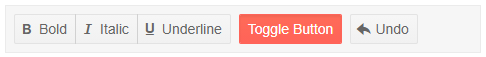

# ToolBar Overview

The <a href = "https://www.telerik.com/blazor-ui/toolbar" target="_blank">ToolBar component</a> is a container for buttons or other application-specifc tools. This article explains the available features.

#### In This Article

* [Basics](#basics)
* [Features](#features)

## Basics

To use the Telerik Toolbar component:

1. Add the `<TelerikToolBar>` tag to your page.
1. Populate it with [Built-In Tools]() or [Custom Tools]().
1. Handle their respective events so your application can respond to the user actions.

>caption Basic Telerik Toolbar



````CSHTML
@*Add a basic Telerik ToolBar to your page with a few built-in buttons.*@

<TelerikToolBar>
    <ToolBarButtonGroup>
        <ToolBarButton Icon="@IconName.Bold" OnClick="@OnBold">Bold</ToolBarButton>
        <ToolBarButton Icon="@IconName.Italic" OnClick="@OnItalic">Italic</ToolBarButton>
        <ToolBarButton Icon="@IconName.Underline" OnClick="@OnUnderline">Underline</ToolBarButton>
    </ToolBarButtonGroup>

    <ToolBarToggleButton @bind-Selected="@Selected">Toggle Button</ToolBarToggleButton>

    <ToolBarButton Icon="@IconName.Undo">Undo</ToolBarButton>
</TelerikToolBar>

<br />

@Result

@code {
    public bool Selected { get; set; } = true;

    public string Result { get; set; }

    public void OnBold()
    {
        Result = "The user clicked on the bold button";
    }

    public void OnItalic()
    {
        Result = "The user clicked on the italic button";
    }

    public void OnUnderline()
    {
        Result = "The user clicked on the underline button";
    }
}
````


>caption Components namespace and reference

````CSHTML
@*Component namespace and reference*@

<TelerikToolBar @ref="@ToolbarReference">
    <ToolBarToggleButton @bind-Selected="@Selected">Toggle Button</ToolBarToggleButton>

    <ToolBarButton Icon="@IconName.Undo">Undo</ToolBarButton>
</TelerikToolBar>

@code {
    public Telerik.Blazor.Components.TelerikToolBar ToolbarReference { get; set; }

    public bool Selected { get; set; } = true;
}
````

## Features

>caption The ToolBar provides the following features:

* `Class` - `string` - the CSS class that will be rendered on the main wrapping element of the ToolBar component. You could use that class to control the size of the component through CSS.

* `ToolBarButton` - renders a button in the ToolBar. You can find more information and examples in the [Built-In Tools](#toolbarbutton) article.

* `ToolBarToggleButton` - renders a toggle button in the ToolBar. You can find more information and examples in the [Built-In Tools](#toolbartogglebutton) article.

* `ToolBarButtonGroup` - creates a group of buttons in the component. You can find more information and examples in the [Built-In Tools](#toolbarbuttongroup) article.

* `ToolBarTemplateItem` - allows you to create a custom item for the ToolBar. You can read more about this in the [Templated Item]() article.

* `ToolBarSeparator` - adds a line that separates items in the ToolBar. You can find more information in the [Separators]() article.

* `ToolBarSpacer` - adds empty space that separates the items into different groups. You can find more information in the [Separators]() article.


## See Also

* [Live Demo: ToolBar Overview](https://demos.telerik.com/blazor-ui/toolbar/overview)
* [Live Demo: ToolBar Tools](https://demos.telerik.com/blazor-ui/toolbar/tools)
