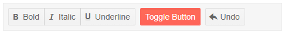

# ToolBar Overview

The ToolBar component is a container for button. This article explains the available features.

#### In This Article

* [Basics](#basics)
* [Features](#features)
* [ToolBarButton](#toolbarbutton)
* [ToolBarToggleButton](#toolbartogglebutton)
* [ToolbarButtonGroup](#toolbarbuttongroup)

## Basics

To use the Telerik Toolbar component:

1. Add the `<TelerikToolBar>` tag to your page.

>caption Basic Telerik Toolbar



````CSHTML
@*Add a basic Telerik ToolBar to your page with its most common features.*@

<TelerikToolBar>
    <ToolBarButtonGroup>
        <ToolBarButton Icon="@IconName.Bold">Bold</ToolBarButton>
        <ToolBarButton Icon="@IconName.Italic">Italic</ToolBarButton>
        <ToolBarButton Icon="@IconName.Underline">Underline</ToolBarButton>
    </ToolBarButtonGroup>

    <ToolBarToggleButton @bind-Selected="@Selected">Toggle Button</ToolBarToggleButton>

    <ToolBarButton Icon="@IconName.Undo">Undo</ToolBarButton>
</TelerikToolBar>


@code {
    public bool Selected { get; set; } = true;
}
````

## Features

>caption The ToolBar provides the following features:

* `Class` - `string` - the CSS class that will be rendered on the main wrapping element of the ToolBar component. You could use that class to control the size of the component.

* `ToolBarButton` - renders a button in the ToolBar. You can find more information and examples in the [ToolbarButton](#toolbarbutton) section of this article.

* `ToolBarToggleButton` - renders a toggle button in the ToolBar. You can find more information and examples in the [ToolbarToggleButton](#toolbartogglebutton) section of this article.

* `ToolBarButtonGroup` - creates a group of buttons in the component. You can find more information and examples in the [ToolbarButtonGroup](#toolbarbuttongroup) section of this article.

* `ToolBarTemplateItem` - allows you to create a custom item for the ToolBar. You can read more about this in the [Templated Item]() article.

* `ToolBarSeparator` - adds a line that separates the item in the ToolBar. You can find information in the [Separators]() article.

* `ToolBarSpacer` - adds empty space that separates the items into different groups. You can find information in the [Separators]() article.


## ToolBarButton

You can add multiple buttons to the Telerik Toolbar. To do that you should add the `<ToolBarButton>` to the `<TelerikToolBar>`. You can customize the buttons using the following features:

* `Enabled` - `bool`, defaults to `true` - specifies if the button is clickable.

* `Visible` - `bool`, defaults to `true` - specifies if the button will be visible in the toolbar.

* `Title` - `string` - maps to the `title` HTML attribute for the `<button>`.

* `Class` - `string` - the CSS class that will be rendered on the main wrapping element of the ToolbarButton. You could use that class to cascade styles.

* `OnClick` - `EventCallback` - allows you to execute an method upon the click of the button.

* `Icon` - `string` - adds a font icon to the button. You can find more information on adding a font icon to a Telerik Component in [Telerik Font Icons article](#icon-in-telerik-component).

* `ImageURL` - `string` - adds an image to the button. You can provide an image url to this parameter.

* `SpriteClass` - `string` - add a sprite class image to the button. Set this attribute to `k-icon MySpriteClass` where `MySpriteClass` defines the CSS rules for the sprite.

* `IconClass` - `string` - allows you to set a CSS class that provides the required font name, font size and content for the ::before pseudo-element.

## ToolBarToggleButton

You can add multiple toggle  buttons to the Telerik Toolbar. To do that you should add the `<ToolBarToggleButton>` to the `<TelerikToolBar>`. You can customize the buttons using the following features:

* `Selected` - `bool` - specifies whether the button is in selected state. You can use it with one and two-way data binding with the `SelectedChanged` event.

* `Enabled` - `bool`, defaults to `true` - specifies if the button is clickable.

* `Visible` - `bool`, defaults to `true` - specifies if the button will be visible in the toolbar.

* `Title` - `string` - maps to the `title` HTML attribute for the `<button>`.

* `Class` - `string` - the CSS class that will be rendered on the main wrapping element of the ToolbarButton. You could use that class to cascade styles.

* `OnClick` - `EventCallback` - allows you to execute an method upon the click of the button.

* `Icon` - `string` - adds a font icon to the button. You can find more information on adding a font icon to a Telerik Component in [Telerik Font Icons article](#icon-in-telerik-component).

* `ImageURL` - `string` - adds an image to the button. You can provide an image url to this parameter.

* `SpriteClass` - `string` - add a sprite class image to the button. Set this attribute to `k-icon MySpriteClass` where `MySpriteClass` defines the CSS rules for the sprite.

* `IconClass` - `string` - allows you to set a CSS class that provides the required font name, font size and content for the ::before pseudo-element.

## ToolBarButtonGroup

You can add one or more group of buttons to the Toolbar. To do that you should add the `<ToolBarButtonGroup>` to the `<TelerikToolBar>`. In the button group you can place either the ToolBarButton or the ToolBarToggleButton. You can customize the groups using the following features:

* `Visible` - `bool`, defaults to `true` - specifies if the group will be visible in the toolbar.

* `SelectionMode` - `enum` - specifies whether you can select one or multiple buttons from the group at the same time. It takes a member of the `ButtonGroupSelectionMode` enum:

    * Single - this is the default value
    * Multiple
    
* `Enabled` - `bool`, defaults to `true` - specifies if the group is clickable.

* `Class` - `string` - the CSS class that will be rendered on the main wrapping element of the ToolBarButtonGroup. You could use that class to cascade styles.

* `Width` - `string` - allows you to control the width of the group.


## See Also

* [Live Demo: ToolBar Overview](https://demos.telerik.com/blazor-ui/toolbar/overview)
* [Live Demo: ToolBar Tools](https://demos.telerik.com/blazor-ui/toolbar/tools)
