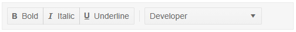

# Templated Item

The Telerik ToolBar for Blazor allows you to add a custom element. To use it add the `<ToolBarTemplateItem>` inside the `<TelerikToolBar>`.

>caption Add a Telerik DropDownList to the ToolBar



````CSHTML
@*use the templated item to add a Telerik DropDownList to the ToolBar*@

<TelerikToolBar>
    <ToolBarButtonGroup>
        <ToolBarButton Icon="@IconName.Bold">Bold</ToolBarButton>
        <ToolBarButton Icon="@IconName.Italic">Italic</ToolBarButton>
        <ToolBarButton Icon="@IconName.Underline">Underline</ToolBarButton>
    </ToolBarButtonGroup>
    <ToolBarSeparator />

    <ToolBarTemplateItem>
        <TelerikDropDownList Data="@Roles" @bind-Value="@SelectedRole"></TelerikDropDownList>
    </ToolBarTemplateItem>
</TelerikToolBar>


@code {
    public bool Selected { get; set; } = true;

    public string SelectedRole { get; set; }

    public List<string> Roles { get; set; } = new List<string>()
    {
         "Manager", "QA", "Developer", "Support"
    };

    protected override void OnInitialized()
    {
        SelectedRole = Roles.FirstOrDefault();
    }
}
````


## See Also

  * [Live Demo: ToolBar Overview](https://demos.telerik.com/blazor-ui/toolbar/overview)
