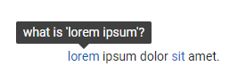

# Tooltip Overview

The Tooltip component replaces the default browser tooltip to show the `title` or `alt` attribute of its target in a beautiful, cross-browser popup. You can specify a CSS selector to attach it to multiple targets, the tooltip size, and [customize its content]() according to the current target through a template, which lets you also load content on demand. You can also choose a [position]() relative to the target and the [event on which it shows]().

To use a Telerik Tooltip for Blazor

1. Add the `TelerikTooltip` tag and set its `TargetSelector` parameter to a CSS selector that will match the element(s) you want to attach the tooltip to.
1. Add elements to act as targets and set their `title` attribute.

>caption Basic Tooltip attached to anchors inside paragraphs to show their titles

````CSHTML
<TelerikTooltip TargetSelector="p a[title]">
</TelerikTooltip>

<p>
    <a title="what is 'lorem ipsum'?" href="https://lipsum.com/">lorem</a>
    ipsum dolor
    <a title="is this a real word?" href="https://en.wikipedia.org/wiki/SIT">sit</a>
    amet.
</p>
````

>caption The result from the code snippet above after hovering the "lorem" link



>caption Component namespace and reference

````CSHTML
<TelerikTooltip @ref="@theTooltipRef">
</TelerikTooltip>

@code{
    Telerik.Blazor.Components.TelerikTooltip theTooltipRef { get; set; }
}
````

>caption The Tooltip provides the following features:

* `Class` - the CSS class rendered on the tooltip element. You can use it to customize its appearance (such as color, font, target elements in your template, and so on).
* `Height`- the height of the tooltip. @[template](/_contentTemplates/tooltip/notes.md#dimensions-behavior)
* `Id` - the `id` attribute of the tooltip. Can be useful so you can point an `aria-described-by` attribute of your target to the tooltip ID for the benefit of screen readers.
* `Position` - where the tooltip shows up in comparison to its target element. See more at the [Position]() article.
* `ShowOn` - what triggers the tooltip to show up. See more at the [Show Event]() article.
* `TargetSelector` - the CSS selector that controls which elements the Tooltip component will associate itself with. It can be a single element (e.g., an ID selector such as `#myTarget`), or a broader selector that targets a number of elements at the same time (such as `p.specialParagraph a` to target all anchors in a special paragraph).
* `Template` - a `RenderFragment` that lets you generate content for the tooltip based on metadata for the target. You can also fetch data on demand for the tooltip content through that. You can see examples in the [Tooltip Template]() article.
* `Width` - The width of the tooltip. @[template](/_contentTemplates/tooltip/notes.md#dimensions-behavior)

>tip To have the tooltip stretch accroding to your content, you should leave _both_ the `Width` and `Height` parameters empty. If one of them has a value, the HTML element will have some layout and you may get unexpected results in terms of size and position.
>
> If you will be [loading large content on demand](#separate-component-and-load-on-demand), you should set dimensions that will accommodate the expected content and layout.

## See Also

  * [Position]()
  * [Show Event]()
  * [Template]()
  * [Live Demo: Tooltip](https://demos.telerik.com/blazor-ui/tooltip/overview)
