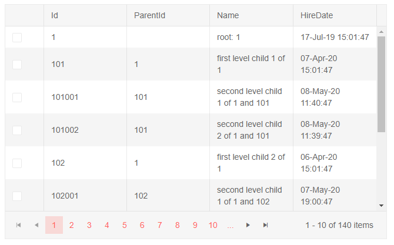

# Automatically Generated Columns

The treelist allows you to automatically generate a column for each public property of its model rather than defining each column manually.

To enable Automatic Column Generation, set the `AutoGenerateColumns` parameter of the treelist to `true`.

The content of this article will be separated into groups for clarity:

* [Basics](#basics)
	* [Declare Explicit Columns](#declare-explicit-columns)
* [Customization](#customization)
	* [Example](#example)


## Basics

To display all model fields in the treelist, just set its `AutoGenerateColumns` parameter to `true`.

If you don't need explicitly declared columns (such as a command column or frozen columns) the `TreeListColumns` tag is not required.

>note The auto-generated columns are not `Expandable` and the treelist will look like a grid. See the [Customization](#customization) section below to see how to set up at least one expandable column.

>caption Use the AutoGenerateColumns parameter to generate columns out of a model

````CSHTML
@* Data display requires only a single parameter. See the next examples for customizations and defining an expandable column to showcase hierarchy *@

<TelerikTreeList Data="@Data" AutoGenerateColumns="true"
                 Pageable="true" IdField="Id" ParentIdField="ParentId" Width="650px" Height="400px">
</TelerikTreeList>

@code {
    public List<Employee> Data { get; set; }

    protected override async Task OnInitializedAsync()
    {
        Data = await GetTreeListData();
    }

    // sample models and data generation

    public class Employee
    {
        public int Id { get; set; }
        public int? ParentId { get; set; }
        public string Name { get; set; }
        public DateTime HireDate { get; set; }
    }

    async Task<List<Employee>> GetTreeListData()
    {
        List<Employee> data = new List<Employee>();

        for (int i = 1; i < 15; i++)
        {
            data.Add(new Employee
            {
                Id = i,
                ParentId = null,
                Name = $"root: {i}",
                HireDate = DateTime.Now.AddYears(-i)
            }); ;

            for (int j = 1; j < 4; j++)
            {
                int currId = i * 100 + j;
                data.Add(new Employee
                {
                    Id = currId,
                    ParentId = i,
                    Name = $"first level child {j} of {i}",
                    HireDate = DateTime.Now.AddDays(-currId)
                });

                for (int k = 1; k < 3; k++)
                {
                    int nestedId = currId * 1000 + k;
                    data.Add(new Employee
                    {
                        Id = nestedId,
                        ParentId = currId,
                        Name = $"second level child {k} of {i} and {currId}",
                        HireDate = DateTime.Now.AddMinutes(-nestedId)
                    }); ;
                }
            }
        }

        return await Task.FromResult(data);
    }
}
````
>caption The result from the code snippet above.


### Declare Explicit Columns

The treelist can consist of both Automatically Generated and explicitly declared columns.

The following examples show how you can control their order and positions:

* [Default Column Order](#default-column-order)
* [Define Explicit Column Order](#define-explicit-column-order)

### Default Column Order

By default the Automatically Generated Columns are rendered after the manually declared ones.

>caption Observe the default positioning of the Automatically Generated Columns

````CSHTML
@* The autogenerated columns are after those you define manually. *@

<TelerikTreeList Data="@Data" AutoGenerateColumns="true"
                 Pageable="true" IdField="Id" ParentIdField="ParentId" Width="650px" Height="400px">
    <TreeListColumns>
        <TreeListCheckboxColumn />
    </TreeListColumns>
</TelerikTreeList>

@code {
    public List<Employee> Data { get; set; }

    protected override async Task OnInitializedAsync()
    {
        Data = await GetTreeListData();
    }

    // sample models and data generation

    public class Employee
    {
        public int Id { get; set; }
        public int? ParentId { get; set; }
        public string Name { get; set; }
        public DateTime HireDate { get; set; }
    }

    async Task<List<Employee>> GetTreeListData()
    {
        List<Employee> data = new List<Employee>();

        for (int i = 1; i < 15; i++)
        {
            data.Add(new Employee
            {
                Id = i,
                ParentId = null,
                Name = $"root: {i}",
                HireDate = DateTime.Now.AddYears(-i)
            }); ;

            for (int j = 1; j < 4; j++)
            {
                int currId = i * 100 + j;
                data.Add(new Employee
                {
                    Id = currId,
                    ParentId = i,
                    Name = $"first level child {j} of {i}",
                    HireDate = DateTime.Now.AddDays(-currId)
                });

                for (int k = 1; k < 3; k++)
                {
                    int nestedId = currId * 1000 + k;
                    data.Add(new Employee
                    {
                        Id = nestedId,
                        ParentId = currId,
                        Name = $"second level child {k} of {i} and {currId}",
                        HireDate = DateTime.Now.AddMinutes(-nestedId)
                    }); ;
                }
            }
        }

        return await Task.FromResult(data);
    }
}
````

>caption The result from the code snippet above



### Define Explicit Column Order

To set explicit position of the Automatically Generated Columns you can use the `TreeListAutoGeneratedColumns` tag inside the `TreeListColumns` tag and place it in the order you want it to have in relation to the columns you declare.

>note When the `TreeListAutoGeneratedColumns` tag is used the `AutoGenerateColumns` parameter of the treelist must also set to `true`.

>caption Observe explicitly set position of the Automatically Generated Columns between a Checkbox and Command columns

````CSHTML
@* For brevity, editing is not implemented in this example *@

<TelerikTreeList Data="@Data" AutoGenerateColumns="true"
                 Pageable="true" IdField="Id" ParentIdField="ParentId" Width="650px" Height="400px">
    <TreeListColumns>
        <TreeListCheckboxColumn />
        
        <TreeListAutoGeneratedColumns />
        
        <TreeListCommandColumn>
            <TreeListCommandButton Command="Edit">Edit</TreeListCommandButton>
        </TreeListCommandColumn>
    </TreeListColumns>
</TelerikTreeList>

@code {
    public List<Employee> Data { get; set; }

    protected override async Task OnInitializedAsync()
    {
        Data = await GetTreeListData();
    }

    // sample models and data generation

    public class Employee
    {
        public int Id { get; set; }
        public int? ParentId { get; set; }
        public string Name { get; set; }
        public DateTime HireDate { get; set; }
    }

    async Task<List<Employee>> GetTreeListData()
    {
        List<Employee> data = new List<Employee>();

        for (int i = 1; i < 15; i++)
        {
            data.Add(new Employee
            {
                Id = i,
                ParentId = null,
                Name = $"root: {i}",
                HireDate = DateTime.Now.AddYears(-i)
            }); ;

            for (int j = 1; j < 4; j++)
            {
                int currId = i * 100 + j;
                data.Add(new Employee
                {
                    Id = currId,
                    ParentId = i,
                    Name = $"first level child {j} of {i}",
                    HireDate = DateTime.Now.AddDays(-currId)
                });

                for (int k = 1; k < 3; k++)
                {
                    int nestedId = currId * 1000 + k;
                    data.Add(new Employee
                    {
                        Id = nestedId,
                        ParentId = currId,
                        Name = $"second level child {k} of {i} and {currId}",
                        HireDate = DateTime.Now.AddMinutes(-nestedId)
                    }); ;
                }
            }
        }

        return await Task.FromResult(data);
    }
}
````
>caption The result from the code snippet above


## Customization

You can use data annotation attributes to control the column generation, in addition to the options explained above:

* You can set the `Title` of the column through the `[Display(Name="The Desired Title")]` attribute on the fields of your model.

* You can set the `[Display(AutoGenerateField=false)]` attribute over a property of your model if you want to prevent auto-generation of a column from that field.

* You can prevent data mutation by setting the `[Editable]` attribute to `false` on fields of your model.
 * The properties that do not have a `setter` or the `setter` is not accessible (`private`) will not be editable either.

* You can set custom width to all auto-generated columns through the `ColumnWidth` parameter of `TreeListAutoGeneratedColumns`. By default they will be equally distributed to fill the width of the treelist.
    * To enable horizontal scrolling, the `ColumnWidth` parameter has to be set so that the sum of all columns is greater than the treelist width. You can find more information in the [Column Width]() article.

>tip To use the attributes listed above the `System.ComponentModel.DataAnnotations` using statement has to be present in the file with your model. With [Popup editing](https://demos.telerik.com/blazor-ui/treelist/editing-popup), you can use validation attributes in addition to the customization attributes.

### Example

This example shows how to:
* Define an expandable column to showcase hierarchy (define it explicitly, and skip it from column generation through the `[Display(AutoGenerateField = false)]` attribute).
* Use data annotation attributes to
    * set the column titles (e.g., `Email`)
    * make a field non-editable (e.g., `Id`)
    * hide a field from the treelist (e.g., `ParentId`)
    * validate the data (e.g., `Name`)
* Use the `[Display(AutoGenerateField = false)]` attribute to prevent a column from being generated, so you can declare it yourself and customize it (e.g., `Name`)
* Select the order of the columns and set explicit position of the autogenerated Columns
* Make CUD operations (only basic Editing is implemented here for brevity)

>caption Observe the behavior of auto-generated columns with some customizations.

````CSHTML
@using System.ComponentModel.DataAnnotations

<TelerikTreeList Data="@Data" AutoGenerateColumns="true"
                 Pageable="true" EditMode="@TreeListEditMode.Popup" OnUpdate="@UpdateHandler"
                 IdField="Id" ParentIdField="ParentId" Width="750px" Height="700px">
    <TreeListColumns>
        <TreeListColumn Field="Name" Expandable="true" Width="320px" />
        <TreeListAutoGeneratedColumns />
        <TreeListCommandColumn>
            <TreeListCommandButton Command="Edit">Edit</TreeListCommandButton>
        </TreeListCommandColumn>
    </TreeListColumns>
</TelerikTreeList>

@code {
    public List<Employee> Data { get; set; }

    protected override async Task OnInitializedAsync()
    {
        Data = await GetTreeListData();
    }

    // sample models with annotations

    public class Employee
    {
        [Editable(false)] // non-editable autogenerated column
        public int Id { get; set; }

        [Display(AutoGenerateField = false)] // column will not be generated
        public int? ParentId { get; set; }

        [Display(AutoGenerateField = false)]
        [Required(ErrorMessage = "Name is a mandatory field for an employee")] // validation
        public string Name { get; set; }

        [Required(ErrorMessage = "Email address is mandatory field")]
        [EmailAddress(ErrorMessage = "Invalid Email Address")]
        [Display(Name = "Email")] // custom title for autogenerated column
        public string EmailAddress { get; set; }

        [Display(Name = "Hire Date")]
        public DateTime HireDate { get; set; }

        // Used for the editing so replacing the object in the view-model data
        // will treat it as the same object and keep its state - otherwise it will
        // collapse after editing is done, which is not what the user would expect
        public override bool Equals(object obj)
        {
            if (obj is Employee)
            {
                return this.Id == (obj as Employee).Id;
            }
            return false;
        }
    }

    // basic Update operation, the rest is not implemented for brevity

    async Task UpdateHandler(TreeListCommandEventArgs e)
    {
        var item = e.Item as Employee;

        // perform actual data source operations here through your service
        Employee updatedItem = await ServiceMimicUpdate(item);

        // update the local view-model data with the service data
        var index = Data.FindIndex(x => x.Id == updatedItem.Id);
        if (index != -1)
        {
            // see the Equals override in the model - it ensures this is the same
            // object from the treelist point of view and its state
            Data[index] = updatedItem;
        }
    }

    // the following method mimics an actual data service that handles the actual data source
    // you can see about implement error and exception handling, determining suitable return types as per your needs

    async Task<Employee> ServiceMimicUpdate(Employee itemToUpdate)
    {
        // in this example, we just populate the fields, you project may use
        // something else or generate the updated item differently
        Employee updatedItem = new Employee()
        {
            Id = itemToUpdate.Id,
            ParentId = itemToUpdate.ParentId,
            Name = itemToUpdate.Name,
            EmailAddress = itemToUpdate.EmailAddress,
            HireDate = itemToUpdate.HireDate
        };
        return await Task.FromResult(updatedItem);
    }

    // data generation

    async Task<List<Employee>> GetTreeListData()
    {
        List<Employee> data = new List<Employee>();

        for (int i = 1; i < 15; i++)
        {
            data.Add(new Employee
            {
                Id = i,
                ParentId = null,
                Name = $"root: {i}",
                HireDate = DateTime.Now.AddYears(-i)
            }); ;

            for (int j = 1; j < 4; j++)
            {
                int currId = i * 100 + j;
                data.Add(new Employee
                {
                    Id = currId,
                    ParentId = i,
                    Name = $"first level child {j} of {i}",
                    HireDate = DateTime.Now.AddDays(-currId)
                });

                for (int k = 1; k < 3; k++)
                {
                    int nestedId = currId * 1000 + k;
                    data.Add(new Employee
                    {
                        Id = nestedId,
                        ParentId = currId,
                        Name = $"second level child {k} of {i} and {currId}",
                        HireDate = DateTime.Now.AddMinutes(-nestedId)
                    }); ;
                }
            }
        }

        return await Task.FromResult(data);
    }
}
````
>caption The result from the code snippet above


## See also
* [Column Width]()
* [Live Demo: Auto Generated Columns](https://demos.telerik.com/blazor-ui/treelist/column-auto-generation)
* [Selection]()
* [Paging]()
