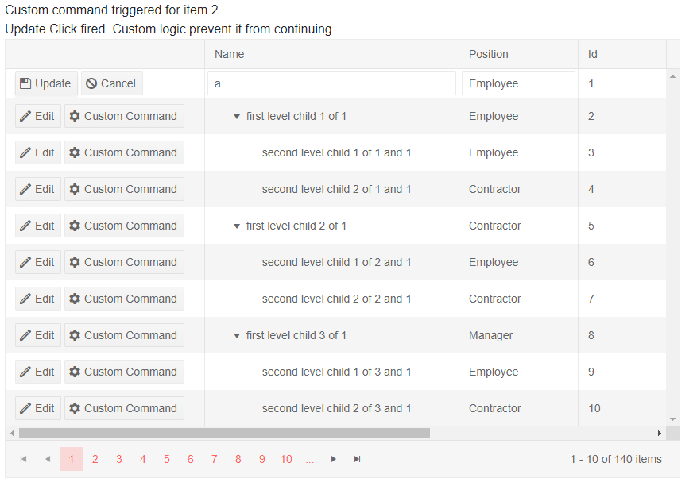

# TreeList Command Column

The command column of a treelist allows you to initiate [inline]() or [popup]() editing, or to execute your own commands.

To define it, add a `TreeListCommandColumn` in the `TreeListColumns` collection of a treelist. The command column takes a collection of `TreeListCommandButton` instances that invoke the commands. It also provides the data item `context` and a `Title` property to set its header text.

>tip The lists below showcase the available features and their use. After them you can find a code example that shows declarations and handling.

In this article:

* [TreeList Command Column Features](#features)
   * [TreeListCommandButton](#the-treelistcommandbutton-tag)
   * [Built-in Commands](#built-in-commands)
   * [Context](#context)
   * [OnClick Handler](#onclick-handler)
* [Code Example](#example)


## Features

This section describes the available features and their use.

### The TreeListCommandButton Tag

The `TreeListCommandButton` tag offers the following features:

* `Command` - the command that will be invoked. Can be one of the built-in commands (see below), or a custom command name.
* `OnClick` - the event handler that the button will fire. If used on a built-in command, this handler will fire before the [corresponding CRUD event](). Cancelling it will prevent the built-in CRUD event from firing.
* `ShowInEdit` - a boolean property indicating whether the button is only visible while the user is editing/inserting data.
* `ChildContent` - the text the button will render. You can also place it between the command button's opening and closing tags.
* Appearance properties like `Icon`, `Class`, `Enabled` that are come from the underlying [Button Component features]().

### Built-in Commands

There are four built-in commands:

* `Add` - initiates the creation of a new item. Can apply to rows as well, to create a child element for the current row.
* `Edit` - initiates the inline or popup editing (depending on the TreeListEditMode configuration of the treelist).
* `Delete` - initiates the deletion of an existing item. Before the item is deleted, you can trigger a **delete confirmation dialog**. You can enable it by setting the `ConfirmDelete` bool to `true`. The delete confirmation parameter is on the `TreeList`, **not** on the command column. The default text in the dialog is a localization message, and you can customize it.
* `Save` - performs the actual update operation after the data has been changed. Triggers the `OnUpdate` or `OnCreate` event so you can perform the data source operation. Which event is triggered depends on whether the item was created or edited.
* `Cancel` - aborts the current operation (edit or insert).

### Context

The command column provides access to the data item via `context`. This may be useful for conditional statements or passing parameters to custom business logic.

```razor
<TreeListCommandColumn>
    @{
        var product = context as ProductModel;
        if (product.Discontinued)
        {
            <TreeListCommandButton Command="Delete" Icon="delete">Delete</TreeListCommandButton>
        }
        else
        {
            <span>Cannot delete active products</span>
        }
    }
</TreeListCommandColumn>
```

### OnClick Handler

The `OnClick` handler of the commands receives an argument of type `TreeListCommandEventArgs` that exposes the following properties:

* `IsCancelled` - set this to true to prevent the operation if the business logic requires it.
* `Item` - the model item the treelist row is bound to. You can use it to access the model fields and methods in order to preform the actual data source operations. Applicable for buttons in a row, not in a toolbar.
* `ParentItem` - the parent item of the current item, if any, otherwise `null`.
* `IsNew` - a boolean field indicating whether the item was just added through the treelist interface.

>tip For handling CRUD operations we recommend that you use the treelist events (`OnEdit`, `OnUpdate`, `OnCancel`, `OnCreate`). The `OnClick` handler is available for the built-in commands to provide consistency of the API.

>tip The event handlers use `EventCallback` and can be synchronous or async. This example shows async versions, and the signature for the synchronous handlers is `void MyHandlerName(TreeListCommandEventArgs args)`.

## Example

>caption Example of handling custom commands in a treelist

````CSHTML
@* This sample showcases custom command handling for:
    - the built-in Save command that prevents it based on some condition  (Name contains "a")
    - a custom command for a row
*@

@CustomCommandResult

<TelerikTreeList Data="@Data"
                 EditMode="@TreeListEditMode.Inline"
                 OnUpdate="@UpdateItem"
                 Pageable="true" ItemsField="@(nameof(Employee.DirectReports))"
                 Width="850px">
    <TreeListColumns>

        <TreeListCommandColumn Width="250px">
            <TreeListCommandButton Command="Edit" Icon="edit">Edit</TreeListCommandButton>
            <TreeListCommandButton Command="Save" Icon="save" ShowInEdit="true" OnClick="@CustomSaveClick">Update</TreeListCommandButton>
            <TreeListCommandButton Command="Cancel" Icon="cancel" ShowInEdit="true">Cancel</TreeListCommandButton>
            <TreeListCommandButton Command="MyCustomCommand" Icon="gear" OnClick="@MyCustomCommandHandler">Custom Command</TreeListCommandButton>
        </TreeListCommandColumn>

        <TreeListColumn Field="Name" Expandable="true" Width="320px" />
        <TreeListColumn Field="Role" Width="150px" Title="Position" />
        <TreeListColumn Field="Id" Editable="false" Width="120px" />
        <TreeListColumn Field="EmailAddress" Width="220px" />
        <TreeListColumn Field="HireDate" Width="220px" />
    </TreeListColumns>
</TelerikTreeList>

@code {
    public List<Employee> Data { get; set; }

    // Sample CUD operations for the local data
    async Task UpdateItem(TreeListCommandEventArgs args)
    {
        var item = args.Item as Employee; // you can also use the entire model

        // perform actual data source operations here through your service
        await MyService.Update(item);

        // update the local view-model data with the service data
        await GetTreeListData();
    }

    // sample custom command handling

    async Task CustomSaveClick(TreeListCommandEventArgs e)
    {
        Employee theUpdatedItem = e.Item as Employee;
        // any custom logic
        if (theUpdatedItem.Name.Contains("a"))
        {
            // prevent the operation based on a condition. Will prevent the OnUpdate event from firing
            CustomCommandResult = new MarkupString("Update Click fired. Custom logic prevent it from continuing.");
            e.IsCancelled = true;
        }
    }

    MarkupString CustomCommandResult;
    async Task MyCustomCommandHandler(TreeListCommandEventArgs args)
    {
        CustomCommandResult = new MarkupString(string.Format("Custom command triggered for item {0}", (args.Item as Employee).Id));

        Console.WriteLine("The Custom command fired. Please wait for the long operation to finish");

        await Task.Delay(2000); //simulate actual long running async operation
    }

    // sample model

    public class Employee
    {
        public int Id { get; set; }
        public string Name { get; set; }
        public string Role { get; set; }
        public string EmailAddress { get; set; }
        public DateTime HireDate { get; set; }

        public List<Employee> DirectReports { get; set; }
        public bool HasChildren { get; set; }

        // Used for the editing so replacing the object in the view-model data
        // will treat it as the same object and keep its state - otherwise it will
        // collapse after editing is done, which is not what the user would expect
        public override bool Equals(object obj)
        {
            if (obj is Employee)
            {
                return this.Id == (obj as Employee).Id;
            }
            return false;
        }
    }

    // data generation

    async Task GetTreeListData()
    {
        Data = await MyService.Read();
    }

    protected override async Task OnInitializedAsync()
    {
        await GetTreeListData();
    }

    // the following static class mimics an actual data service that handles the actual data source
    // replace it with your actual service through the DI, this only mimics how the API can look like and works for this standalone page
    public static class MyService
    {
        private static List<Employee> _data { get; set; } = new List<Employee>();
        // used in this example for data generation and retrieval for CUD operations on the current view-model data
        private static int LastId { get; set; } = 1;
        private static List<string> Roles = new List<string> { "Manager", "Employee", "Contractor" };

        public static async Task<List<Employee>> Read()
        {
            if (_data.Count < 1)
            {
                for (int i = 1; i < 15; i++)
                {
                    Employee root = new Employee
                    {
                        Id = LastId,
                        Name = $"root: {i}",
                        Role = Roles[i % Roles.Count],
                        EmailAddress = $"{i}@example.com",
                        HireDate = DateTime.Now.AddYears(-i),
                        DirectReports = new List<Employee>(),
                        HasChildren = true
                    };
                    _data.Add(root);
                    LastId++;

                    for (int j = 1; j < 4; j++)
                    {
                        int currId = LastId;
                        Employee firstLevelChild = new Employee
                        {
                            Id = currId,
                            Name = $"first level child {j} of {i}",
                            Role = Roles[j % Roles.Count],
                            EmailAddress = $"{currId}@example.com",
                            HireDate = DateTime.Now.AddDays(-currId),
                            DirectReports = new List<Employee>(),
                            HasChildren = true
                        };
                        root.DirectReports.Add(firstLevelChild);
                        LastId++;

                        for (int k = 1; k < 3; k++)
                        {
                            int nestedId = LastId;
                            firstLevelChild.DirectReports.Add(new Employee
                            {
                                Id = LastId,
                                Name = $"second level child {k} of {j} and {i}",
                                Role = Roles[k % Roles.Count],
                                EmailAddress = $"{nestedId}@example.com",
                                HireDate = DateTime.Now.AddMinutes(-nestedId)
                            }); ;
                            LastId++;
                        }
                    }
                }
            }

            return await Task.FromResult(_data);
        }

        public static async Task Update(Employee itemToUpdate)
        {
            UpdateItemRecursive(_data, itemToUpdate);
        }

        // sample helper methods for handling the view-model data hierarchy
        private static void UpdateItemRecursive(List<Employee> items, Employee itemToUpdate)
        {
            for (int i = 0; i < items.Count; i++)
            {
                if (items[i].Id.Equals(itemToUpdate.Id))
                {
                    items[i] = itemToUpdate;
                    return;
                }

                if (items[i].DirectReports?.Count > 0)
                {
                    UpdateItemRecursive(items[i].DirectReports, itemToUpdate);
                }
            }
        }
    }
}
````

>caption The result from the code snippet above, after the custom command was clicked for the second row, and after the user tried to edit the first row to put the letter "a" in the Name column.



## See Also

  * [Live Demo: TreeList Command Column](https://demos.telerik.com/blazor-ui/treelist/inlineediting)
