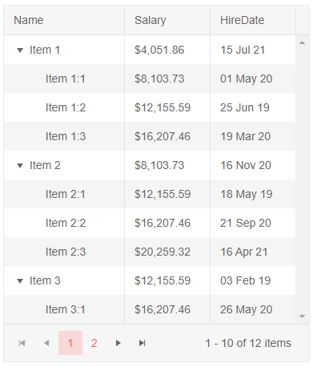

# Column Display Format

You can set a C# format string to the column so that it renders the values with the corresponding styling according to the current culture of the thread.

To set the desired format string, use the `DisplayFormat` parameter of the column.

If the model field has the `DataFormatString` set through the `DisplayFormat` DataAnnotation attribute, the grid will honor that without an explicit setting in the markup of the column.

You can use the standard C# formatting options, because the grid uses a `string.Format` call: <a href="https://docs.microsoft.com/en-us/dotnet/standard/base-types/formatting-types" target="_blank">MSDN: Format types in .NET</a>.

>caption Use C# format strings in the treelist through the component markup and a data annotation attribute in the model

````CSHTML
@using System.ComponentModel.DataAnnotations
@* This Using is for the model class attributes only *@

<TelerikTreeList Data="@Data" ItemsField="Items" Pageable="true">
    <TreeListColumns>
        <TreeListColumn Field="Name" Expandable="true" Width="150px"></TreeListColumn>

        <TreeListColumn Field="Salary"></TreeListColumn>
        <TreeListColumn DisplayFormat="{0:dd MMM yy}" Field="HireDate"></TreeListColumn>

    </TreeListColumns>
</TelerikTreeList>

@code {
    public class TreeListHierarchicalItem
    {
        public int? Id { get; set; }
        public string Name { get; set; }

        [DisplayFormat(DataFormatString = "{0:C2}")]
        public decimal? Salary { get; set; }
        public DateTime HireDate { get; set; }

        public List<TreeListHierarchicalItem> Items { get; set; } = new List<TreeListHierarchicalItem>();
    }

    // sample data generation
    public List<TreeListHierarchicalItem> Data { get; set; }

    protected override async Task OnInitializedAsync()
    {
        Data = new List<TreeListHierarchicalItem>();
        var rand = new Random();

        for (int i = 1; i < 4; i++)
        {
            var item = new TreeListHierarchicalItem()
            {
                Id = i,
                Name = "Item " + i.ToString(),
                Salary = i * 50000 / 12.34m,
                HireDate = DateTime.Now.Date.AddMonths(rand.Next(-20, 20)).AddDays(rand.Next(-10, 10)),
            };
            Data.Add(item);

            for (int j = 1; j < 4; j++)
            {
                item.Items.Add(new TreeListHierarchicalItem()
                {
                    Id = j,
                    Name = $"Item {i}:{j}",
                    Salary = (i + j) * 50000 / 12.34m,
                    HireDate = DateTime.Now.Date.AddMonths(rand.Next(-20, 20)).AddDays(rand.Next(-10, 10)),
                });
            }
        }

        await base.OnInitializedAsync();
    }
}
````

>caption The result from the code snippet above



>caption Notes

* Numeric, DateTime and Enum types can use such formats. String and Boolean types are displayed without such a format, however.

* The `CurrentInfo.CurrentCulture` is used when rendering the formats, so if you need specific formats for specific users, you must set the culture of the app accordingly.


## See Also

  * [Live Demo: Column Format](https://demos.telerik.com/blazor-ui/treelist/column-format)
