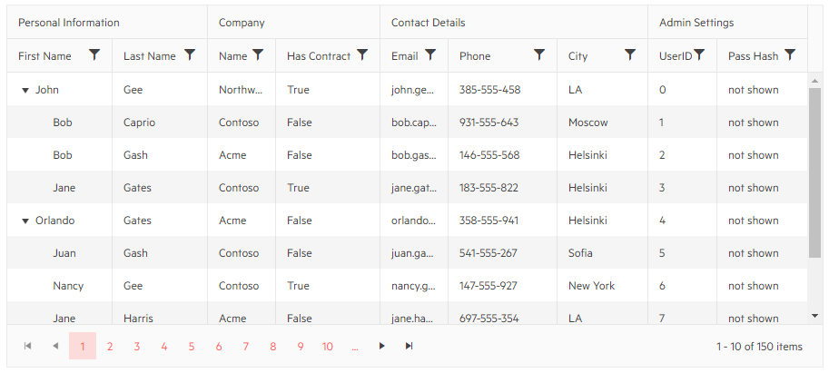

# Multi-Column Headers

The treelist allows you to stack several columns under one header to visually group relevant fields for your end users.

To use multiple column headers:

1. Define a `TreeListColumn` instance for each multi-column header you want. Set its `Title`.
1. Under its `<Columns>` nested tag, add the columns you want it to contain.

You will find the following sections in this article:

* [Basic Example](#basic-example)
* [Behavior With Other Features](#behavior-with-other-features)

## Basic Example

The following code snippet shows how you can group columns in the treelist in multi-column headers. You can also use "regular" columns at the root level, not all of them have to be column groups.

>caption Multiple Column Headers in the Treelist



````CSHTML
@* See the root-level TreeListColumn tags that have their own Columns collections *@

<TelerikTreeList Data=@TreeListData
                 Pageable="true" Sortable="true" Resizable="true" Reorderable="true"
                 FilterMode="@TreeListFilterMode.FilterMenu"
                 Width="900px" Height="400px"
                 IdField="Id" ParentIdField="ParentId">
    <TreeListColumns>
        <TreeListColumn Title="Personal Information" Reorderable="false" Width="1500px">
            <Columns>
                <TreeListColumn Expandable="true" Field=@nameof(Customer.FirstName) Title="First Name" Width="100px" />
                <TreeListColumn Field=@nameof(Customer.LastName) Title="Last Name" Width="100px" />
            </Columns>
        </TreeListColumn>
        <TreeListColumn Title="Company">
            <Columns>
                <TreeListColumn Field=@nameof(Customer.CompanyName) Title="Name" />
                <TreeListColumn Field=@nameof(Customer.HasCompanyContract) Title="Has Contract" Width="120px" />
            </Columns>
        </TreeListColumn>
        <TreeListColumn Title="Contact Details">
            <Columns>
                <TreeListColumn Field="@nameof(Customer.Email)" Title="Email"></TreeListColumn>
                <TreeListColumn Field="@nameof(Customer.Phone)" Title="Phone" Width="120px"></TreeListColumn>
                <TreeListColumn Field="@nameof(Customer.City)" Title="City" Width="100px"></TreeListColumn>
            </Columns>
        </TreeListColumn>
        <TreeListColumn Title="Admin Settings">
            <Columns>
                <TreeListColumn Field=@nameof(Customer.Id) Title="UserID" />
                <TreeListColumn Field=@nameof(Customer.PasswordHash) Title="Pass Hash" Width="100px" />
            </Columns>
        </TreeListColumn>
    </TreeListColumns>
</TelerikTreeList>

@code {
    public List<Customer> TreeListData { get; set; }

    public class Customer
    {
        public int Id { get; set; }
        public int? ParentId { get; set; }
        public string PasswordHash { get; set; }
        public string FirstName { get; set; }
        public string LastName { get; set; }
        public string CompanyName { get; set; }
        public bool HasCompanyContract { get; set; }
        public string Email { get; set; }
        public string Phone { get; set; }
        public string City { get; set; }
    }

    // generation of dummy data
    protected override void OnInitialized()
    {
        TreeListData = GenerateData();
    }

    List<Customer> GenerateData()
    {
        var data = new List<Customer>();

        string[] fNames = new string[] { "Nancy", "John", "Orlando", "Jane", "Bob", "Juan" };
        string[] lNames = new string[] { "Harris", "Gates", "Smith", "Caprio", "Gash", "Gee" };
        string[] cNames = new string[] { "Acme", "Northwind", "Contoso" };
        string[] cities = new string[] { "Denver", "New York", "LA", "London", "Paris", "Helsinki", "Moscow", "Sofia" };
        Random rnd = new Random();

        for (int i = 0; i < 150; i++)
        {
            string fName = fNames[rnd.Next(0, fNames.Length)];
            string lName = lNames[rnd.Next(0, lNames.Length)];
            string cName = cNames[rnd.Next(0, cNames.Length)];
            data.Add(new Customer
            {
                Id = i,
                ParentId = GetParentId(i),
                PasswordHash = "not shown",
                FirstName = fName,
                LastName = lName,
                CompanyName = cName,
                HasCompanyContract = i % 3 == 0,
                Email = $"{fName}.{lName}@{cName}.com".ToLowerInvariant(),
                Phone = $"{rnd.Next(100, 999)}-555-{rnd.Next(100, 999)}",
                City = cities[rnd.Next(0, cities.Length)]
            });
        }

        return data;
    }

    int? GetParentId(int index)
    {
        if (index % 4 == 0) return null;
        return Math.Abs(index - (index % 4));
    }
}
````


## Behavior With Other Features

@[template](/_contentTemplates/grid/common-link.md#multi-column-headers-feature-integration)


## See Also

  * [Live Demo: Multi-Column Headers](https://demos.telerik.com/blazor-ui/grid/multicolumn-headers)
