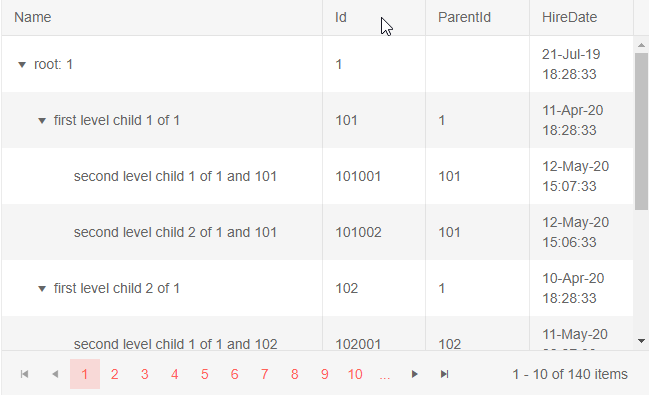

# Reorder Columns

The treelist lets the user reorder its columns by dragging their headers.

To enable the column reordering, set the `Reorderable` parameter of the treelist to `true`.

To prevent the user from moving a certain column, set its own parameter `Reordarable="false"`. Note that the user can still re-arrange other columns around it.

>caption Enable column reordering in Telerik treelist

````CSHTML
@* Drag a column header between other columns to change the columns positions. You cannot drag the Name column itself. *@

<TelerikTreeList Data="@Data" Reorderable="true"
                 Pageable="true" IdField="Id" ParentIdField="ParentId" Width="650px" Height="400px">
    <TreeListColumns>
        <TreeListColumn Field="Name" Reorderable="false" Expandable="true" Width="320px" />
        <TreeListColumn Field="Id" />
        <TreeListColumn Field="ParentId" />
        <TreeListColumn Field="HireDate" />
    </TreeListColumns>
</TelerikTreeList>

@code {
    public List<Employee> Data { get; set; }

    protected override async Task OnInitializedAsync()
    {
        Data = await GetTreeListData();
    }

    // sample models and data generation

    public class Employee
    {
        public int Id { get; set; }
        public int? ParentId { get; set; }
        public string Name { get; set; }
        public DateTime HireDate { get; set; }
    }

    async Task<List<Employee>> GetTreeListData()
    {
        List<Employee> data = new List<Employee>();

        for (int i = 1; i < 15; i++)
        {
            data.Add(new Employee
            {
                Id = i,
                ParentId = null,
                Name = $"root: {i}",
                HireDate = DateTime.Now.AddYears(-i)
            }); ;

            for (int j = 1; j < 4; j++)
            {
                int currId = i * 100 + j;
                data.Add(new Employee
                {
                    Id = currId,
                    ParentId = i,
                    Name = $"first level child {j} of {i}",
                    HireDate = DateTime.Now.AddDays(-currId)
                });

                for (int k = 1; k < 3; k++)
                {
                    int nestedId = currId * 1000 + k;
                    data.Add(new Employee
                    {
                        Id = nestedId,
                        ParentId = currId,
                        Name = $"second level child {k} of {i} and {currId}",
                        HireDate = DateTime.Now.AddMinutes(-nestedId)
                    }); ;
                }
            }
        }

        return await Task.FromResult(data);
    }
}
````

>caption Reordering columns in the Telerik TreeList




## See Also

  * [Live Demo: Column Reordering](https://demos.telerik.com/blazor-ui/treelist/column-reordering)
