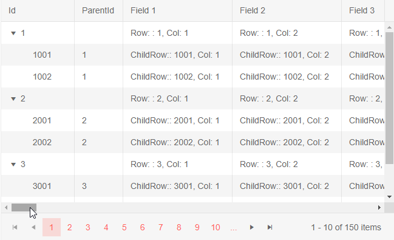
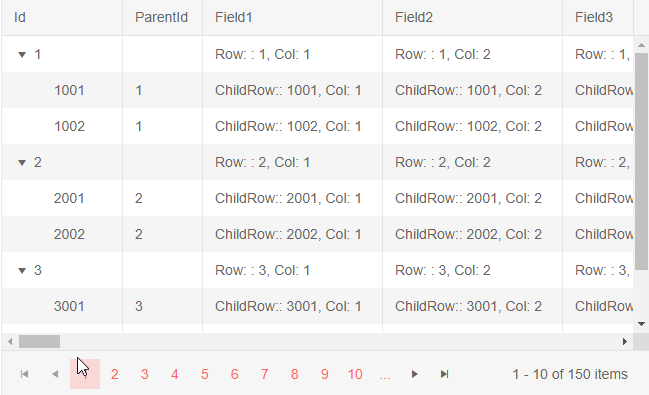

# Virtualized Columns

The Telerik Blazor TreeList provides Virtual Scrolling for its Columns. This means that columns and the corresponding data will be rendered only for the currently visible viewport. When changing the [Page](), [filtering]() or [Sorting]() the treelist, fewer elements are rendered which improves the responsiveness and the overall user experience.

This article provides the following sections:
* [Basics](#basics)
* [Notes](#notes)
* [Limitations](#limitations)
* [More Examples](#more-examples)
    * [Virtualized Autogenerated Columns](#virtualized-autogenerated-columns)


## Basics

The targeted scenario is for a treelist with big number of columns, since the performance improvement will be most significant there.

To enable Virtualized Columns:

1. Set the `ColumnVirtualization` parameter of the treelist to `true`.

1. Set the `Width` parameter of all columns in `px` so that the total sum is greater than the `Width` of the treelist.
    * This will enable horizontal scrollbar which is required. You can read more about the scrolling behavior of the treelist in the [TreeList Column Width Behavior]() article.

<!-- 1. Set the `RowHeight` so that the content of all cells fits in the row. For more information see the [Notes](#notes) section. -->

1. Set the `Height` of the treelist in `px`. For more information see the [Notes](#notes) section.

1. Set the `Width` parameter of the treelist in `px`.


>caption Basic setup of the Virtualized Columns

````CSHTML
@* Observe the behavior of the treelist with enabled ColumnVirtualization *@

@using System.Reflection
@* used for the data generation to shorten the code *@

<TelerikTreeList Data="@Data"
                 Height="400px" Width="650px" ColumnVirtualization="true"
                 Pageable="true" IdField="Id" ParentIdField="ParentId" Sortable="true">
    <TreeListColumns>
        <TreeListColumn Expandable="true" Field="Id" Width="120px" />
        <TreeListColumn Field="ParentId" Width="80px" />
        @for (int i = 1; i <= ColumnsCount; i++)
        {
            var field = $"Field{i}";
            var title = $"Field {i}";

            <TreeListColumn Field="@field" Title="@title" Width="180px" />
        }
    </TreeListColumns>
</TelerikTreeList>

@code {
    public List<VirtualColumnData> Data { get; set; }

    public const int RowsCount = 50;
    public const int ColumnsCount = 50;

    protected override async Task OnInitializedAsync()
    {
        Data = await GenerateData(RowsCount, ColumnsCount);

        await base.OnInitializedAsync();
    }

    // data generation and model

    async Task<List<VirtualColumnData>> GenerateData(int rowsCount, int columnsCount)
    {
        var data = new List<VirtualColumnData>();

        for (int rowIndex = 1; rowIndex <= rowsCount; rowIndex++)
        {
            VirtualColumnData mainRow = GenerateRow(rowIndex, null, columnsCount);
            data.Add(mainRow);

            for (int i = 1; i < 3; i++)
            {
                VirtualColumnData childRow = GenerateRow(rowIndex * 1000 + i, rowIndex, columnsCount);
                data.Add(childRow);
            }
        }

        return await Task.FromResult(data);
    }

    VirtualColumnData GenerateRow(int rowIndex, int? parentId, int columnsCount)
    {
        var obj = new VirtualColumnData();
        obj.Id = rowIndex;
        obj.ParentId = parentId;

        for (int columnIndex = 1; columnIndex <= columnsCount; columnIndex++)
        {
            var propName = $"Field{columnIndex}";

            PropertyInfo prop = obj.GetType().GetProperty(propName, BindingFlags.Public | BindingFlags.Instance);

            if (prop != null && prop.CanWrite)
            {
                string parentOrChildRow = parentId == null ? "Row: " : "ChildRow:";
                prop.SetValue(obj, $"{parentOrChildRow}: {rowIndex}, Col: {columnIndex}");
            }
        }

        return obj;
    }

    public class VirtualColumnData
    {
        public int Id { get; set; }
        public int? ParentId { get; set; }

        public string Field1 { get; set; }
        public string Field2 { get; set; }
        public string Field3 { get; set; }
        public string Field4 { get; set; }
        public string Field5 { get; set; }
        public string Field6 { get; set; }
        public string Field7 { get; set; }
        public string Field8 { get; set; }
        public string Field9 { get; set; }
        public string Field10 { get; set; }
        public string Field11 { get; set; }
        public string Field12 { get; set; }
        public string Field13 { get; set; }
        public string Field14 { get; set; }
        public string Field15 { get; set; }
        public string Field16 { get; set; }
        public string Field17 { get; set; }
        public string Field18 { get; set; }
        public string Field19 { get; set; }
        public string Field20 { get; set; }
        public string Field21 { get; set; }
        public string Field22 { get; set; }
        public string Field23 { get; set; }
        public string Field24 { get; set; }
        public string Field25 { get; set; }
        public string Field26 { get; set; }
        public string Field27 { get; set; }
        public string Field28 { get; set; }
        public string Field29 { get; set; }
        public string Field30 { get; set; }
        public string Field31 { get; set; }
        public string Field32 { get; set; }
        public string Field33 { get; set; }
        public string Field34 { get; set; }
        public string Field35 { get; set; }
        public string Field36 { get; set; }
        public string Field37 { get; set; }
        public string Field38 { get; set; }
        public string Field39 { get; set; }
        public string Field40 { get; set; }
        public string Field41 { get; set; }
        public string Field42 { get; set; }
        public string Field43 { get; set; }
        public string Field44 { get; set; }
        public string Field45 { get; set; }
        public string Field46 { get; set; }
        public string Field47 { get; set; }
        public string Field48 { get; set; }
        public string Field49 { get; set; }
        public string Field50 { get; set; }
    }
}
````

>caption The result from the code snippet above - scrolling through the treelist is the same as without virtual scrolling, but the rendering performance and responsiveness of all other actions will be improved.




## Notes

<!--
* The `RowHeight` row must accommodate the height of all the possible cells and their content in order to ensure good appearance. If certain cells that are not rendered have content that is taller than the rendered ones, you may experience glitches and unstable scrolling.
    * If the row/cell height the browser would render is larger than the `RowHeight` value due to the cell contents, the browser will ignore the `RowHeight`. The actual cell height can depend on the chosen Theme or other CSS rules, or on cell data that falls on more than one line. Inspect the rendered HTML to make sure the treelist setting matches the rendering. 
    -->

* The row must accommodate the height of all the possible cells and their content in order to ensure good appearance. If certain cells that are not rendered have content that is taller than the rendered ones, you may experience glitches and unstable scrolling.
    
    * The actual cell height can depend on the chosen Theme or other CSS rules, or on cell data that falls on more than one line. Inspect the rendered HTML to make sure you have CSS setting for the rows that matches the rendering, if necessary.

* The `Height` of the treelist must be explicitly set in `px`. By default the Height is set by the browser depending on the contents. When a new column is rendered during horizontal scrolling, it might increase or decrease the vertical size of the row and cause issues with the rendering and abnormal visual behavior for the users.

* Rendering the Virtual Columns in Client-side Blazor Applications is slower due to the Framework rendering limitations. In the Server-side Applications this issue is not present.


## Limitations

The Virtualized Columns are a feature for improving the responsiveness and performance of the treelist in cases when the data model has a lot of properties and the volume of columns is large.

List of known limitations of the Virtualized columns:

* [Frozen]() columns are not supported.

## More Examples

### Virtualized Autogenerated Columns

Column virtualization is commonly used when you have many columns. You may not have to declare them yourself, the treelist can do this for you through its [Automatically Generated Columns]() feature.

>note In order to add Virtualized Autogenerated Columns, the `ColumnWidth` parameter must be set in pixels.

````CSHTML
@* TreeList with Virtual Autogenerated Columns - the end result for the user is the same as the first snippet, bit you do not have to declare the columns *@

@using System.Reflection
@* used for the data generation to shorten the code *@
@using System.ComponentModel.DataAnnotations
@* used for the automatic column generation settings *@

<TelerikTreeList Data="@Data" AutoGenerateColumns="true"
                 Height="400px" Width="650px" ColumnVirtualization="true"
                 Pageable="true" IdField="Id" ParentIdField="ParentId" Sortable="true">
    <TreeListColumns>
        <TreeListColumn Expandable="true" Field="Id" Width="120px" />
        <TreeListColumn Field="ParentId" Width="80px" />
        <TreeListAutoGeneratedColumns ColumnWidth="180px" />
    </TreeListColumns>
</TelerikTreeList>

@code {
    public List<VirtualColumnData> Data { get; set; }

    public const int RowsCount = 50;
    public const int ColumnsCount = 50;

    protected override async Task OnInitializedAsync()
    {
        Data = await GenerateData(RowsCount, ColumnsCount);

        await base.OnInitializedAsync();
    }

    // data generation and model

    async Task<List<VirtualColumnData>> GenerateData(int rowsCount, int columnsCount)
    {
        var data = new List<VirtualColumnData>();

        for (int rowIndex = 1; rowIndex <= rowsCount; rowIndex++)
        {
            VirtualColumnData mainRow = GenerateRow(rowIndex, null, columnsCount);
            data.Add(mainRow);

            for (int i = 1; i < 3; i++)
            {
                VirtualColumnData childRow = GenerateRow(rowIndex * 1000 + i, rowIndex, columnsCount);
                data.Add(childRow);
            }
        }

        return await Task.FromResult(data);
    }

    VirtualColumnData GenerateRow(int rowIndex, int? parentId, int columnsCount)
    {
        var obj = new VirtualColumnData();
        obj.Id = rowIndex;
        obj.ParentId = parentId;

        for (int columnIndex = 1; columnIndex <= columnsCount; columnIndex++)
        {
            var propName = $"Field{columnIndex}";

            PropertyInfo prop = obj.GetType().GetProperty(propName, BindingFlags.Public | BindingFlags.Instance);

            if (prop != null && prop.CanWrite)
            {
                string parentOrChildRow = parentId == null ? "Row: " : "ChildRow:";
                prop.SetValue(obj, $"{parentOrChildRow}: {rowIndex}, Col: {columnIndex}");
            }
        }

        return obj;
    }

    public class VirtualColumnData
    {
        [Display(AutoGenerateField = false)]
        public int Id { get; set; }
        [Display(AutoGenerateField = false)]
        public int? ParentId { get; set; }

        public string Field1 { get; set; }
        public string Field2 { get; set; }
        public string Field3 { get; set; }
        public string Field4 { get; set; }
        public string Field5 { get; set; }
        public string Field6 { get; set; }
        public string Field7 { get; set; }
        public string Field8 { get; set; }
        public string Field9 { get; set; }
        public string Field10 { get; set; }
        public string Field11 { get; set; }
        public string Field12 { get; set; }
        public string Field13 { get; set; }
        public string Field14 { get; set; }
        public string Field15 { get; set; }
        public string Field16 { get; set; }
        public string Field17 { get; set; }
        public string Field18 { get; set; }
        public string Field19 { get; set; }
        public string Field20 { get; set; }
        public string Field21 { get; set; }
        public string Field22 { get; set; }
        public string Field23 { get; set; }
        public string Field24 { get; set; }
        public string Field25 { get; set; }
        public string Field26 { get; set; }
        public string Field27 { get; set; }
        public string Field28 { get; set; }
        public string Field29 { get; set; }
        public string Field30 { get; set; }
        public string Field31 { get; set; }
        public string Field32 { get; set; }
        public string Field33 { get; set; }
        public string Field34 { get; set; }
        public string Field35 { get; set; }
        public string Field36 { get; set; }
        public string Field37 { get; set; }
        public string Field38 { get; set; }
        public string Field39 { get; set; }
        public string Field40 { get; set; }
        public string Field41 { get; set; }
        public string Field42 { get; set; }
        public string Field43 { get; set; }
        public string Field44 { get; set; }
        public string Field45 { get; set; }
        public string Field46 { get; set; }
        public string Field47 { get; set; }
        public string Field48 { get; set; }
        public string Field49 { get; set; }
        public string Field50 { get; set; }
    }
}
````

>caption The result from the code snippet above




## See also
 * [Live demo: Virtual Columns](https://demos.telerik.com/blazor-ui/treelist/column-virtualization)
 * [TreeList Column Width Behavior]()
 * [Automatically Generated Columns]()
