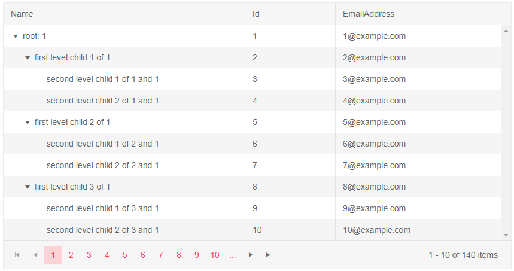
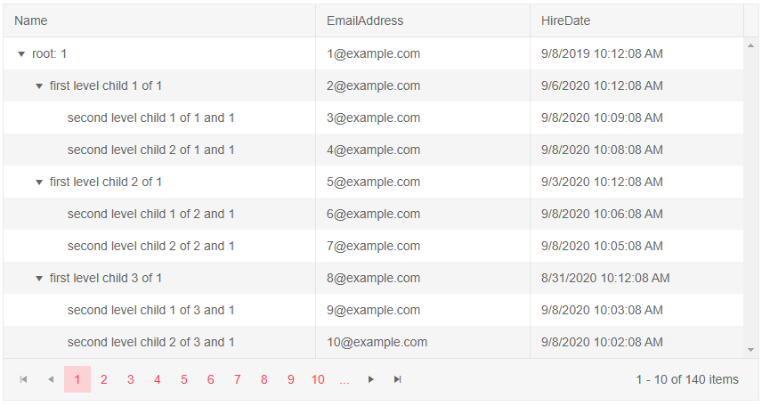

# Visible Columns

The TreeList allows you to programatically hide some of its columns. 

In this article:
* [Basics](#basics)
* [Notes](#notes)
* [Examples](#examples)
    * [Toggle The Visibility Of A Column On Button Click](#toggle-the-visibility-of-a-column-on-button-click)
    * [Hidden TreeList Column With Template](#hidden-treelist-column-with-template)
    * [Hide A TreeList Column Based On A Condition](#hide-a-treelist-column-based-on-a-condition)

## Basics

To hide a TreeList column set its `Visible` parameter to `false`. To hide a column based on a certain condition you can pass, for example, a ternary operator or a method that returns `bool` - the app can provide an expression according to its logic (like screen size).

>caption Hide a column from the TreeList. Basic example.

````CSHTML
@* Hide the Id TreeList column by setting the Visible parameter to false *@

<TelerikTreeList Data="@Data"
                 ItemsField="@(nameof(Employee.DirectReports))"
                 Pageable="true" Width="850px">
    <TreeListColumns>
        <TreeListColumn Field="Name" Expandable="true" Width="320px" />
        <TreeListColumn Field="Id" Editable="false" Width="120px" Visible="false"/>
        <TreeListColumn Field="EmailAddress" Width="220px" />
        <TreeListColumn Field="HireDate" Width="220px" />
    </TreeListColumns>
</TelerikTreeList>

@code {
    public List<Employee> Data { get; set; }

    public class Employee
    {
        public List<Employee> DirectReports { get; set; }

        public int Id { get; set; }
        public string Name { get; set; }
        public string EmailAddress { get; set; }
        public DateTime HireDate { get; set; }
    }

    public int LastId { get; set; } = 1;

    protected override async Task OnInitializedAsync()
    {
        Data = await GetTreeListData();
    }

    async Task<List<Employee>> GetTreeListData()
    {
        List<Employee> data = new List<Employee>();

        for (int i = 1; i < 15; i++)
        {
            Employee root = new Employee
            {
                Id = LastId,
                Name = $"root: {i}",
                EmailAddress = $"{i}@example.com",
                HireDate = DateTime.Now.AddYears(-i),
                DirectReports = new List<Employee>()
            };
            data.Add(root);
            LastId++;

            for (int j = 1; j < 4; j++)
            {
                int currId = LastId;
                Employee firstLevelChild = new Employee
                {
                    Id = currId,
                    Name = $"first level child {j} of {i}",
                    EmailAddress = $"{currId}@example.com",
                    HireDate = DateTime.Now.AddDays(-currId),
                    DirectReports = new List<Employee>(),
                };
                root.DirectReports.Add(firstLevelChild);
                LastId++;

                for (int k = 1; k < 3; k++)
                {
                    int nestedId = LastId;
                    // populate the parent's collection
                    firstLevelChild.DirectReports.Add(new Employee
                    {
                        Id = LastId,
                        Name = $"second level child {k} of {j} and {i}",
                        EmailAddress = $"{nestedId}@example.com",
                        HireDate = DateTime.Now.AddMinutes(-nestedId)
                    }); ;
                    LastId++;
                }
            }
        }

        return await Task.FromResult(data);
    }
}
````

>caption The result from the code snippet above


## Notes

Non-visible columns (`Visible="false"`) will have the following behavior:

* Will not be [editable]().
* [Templates]() will not be rendered.
    * When using [Row Template]() the visiblity of the column should be implemented by the application in the row template itself - the treelist can only toggle the visibility of the header.


## Examples

In this section you will find the following examples:

* [Toggle The Visibility Of A Column On Button Click](#toggle-the-visibility-of-a-column-on-button-click)
* [Hidden TreeList Column With Template](#hidden-treelist-column-with-template)
* [Hide A TreeList Column Based On A Condition](#hide-a-treelist-column-based-on-a-condition)

### Toggle The Visibility Of A Column On Button Click

The application can later the value of the `Visible` parameter and that will toggle the column.

````CSHTML
@* Toggling the visibily of a column keeps its original order in the TreeList. *@

<div>
    <TelerikButton OnClick="@(() => isVisible = !isVisible)">Toggle the visibility of the Id column</TelerikButton>
</div>

<TelerikTreeList Data="@Data"
                 ItemsField="@(nameof(Employee.DirectReports))"
                 Pageable="true" Width="850px">
    <TreeListColumns>
        <TreeListColumn Field="Name" Expandable="true" Width="320px" />
        <TreeListColumn Field="Id" Editable="false" Width="120px" Visible="@isVisible" />
        <TreeListColumn Field="EmailAddress" Width="220px" />
        <TreeListColumn Field="HireDate" Width="220px" />
    </TreeListColumns>
</TelerikTreeList>

@code {
    public bool isVisible { get; set; } = true;
    public List<Employee> Data { get; set; }

    public class Employee
    {
        public List<Employee> DirectReports { get; set; }

        public int Id { get; set; }
        public string Name { get; set; }
        public string EmailAddress { get; set; }
        public DateTime HireDate { get; set; }
    }

    public int LastId { get; set; } = 1;

    protected override async Task OnInitializedAsync()
    {
        Data = await GetTreeListData();
    }

    async Task<List<Employee>> GetTreeListData()
    {
        List<Employee> data = new List<Employee>();

        for (int i = 1; i < 15; i++)
        {
            Employee root = new Employee
            {
                Id = LastId,
                Name = $"root: {i}",
                EmailAddress = $"{i}@example.com",
                HireDate = DateTime.Now.AddYears(-i),
                DirectReports = new List<Employee>()
            };
            data.Add(root);
            LastId++;

            for (int j = 1; j < 4; j++)
            {
                int currId = LastId;
                Employee firstLevelChild = new Employee
                {
                    Id = currId,
                    Name = $"first level child {j} of {i}",
                    EmailAddress = $"{currId}@example.com",
                    HireDate = DateTime.Now.AddDays(-currId),
                    DirectReports = new List<Employee>(),
                };
                root.DirectReports.Add(firstLevelChild);
                LastId++;

                for (int k = 1; k < 3; k++)
                {
                    int nestedId = LastId;
                    // populate the parent's collection
                    firstLevelChild.DirectReports.Add(new Employee
                    {
                        Id = LastId,
                        Name = $"second level child {k} of {j} and {i}",
                        EmailAddress = $"{nestedId}@example.com",
                        HireDate = DateTime.Now.AddMinutes(-nestedId)
                    }); ;
                    LastId++;
                }
            }
        }

        return await Task.FromResult(data);
    }
}
````

>caption The result from the code snippet above


### Hidden TreeList Column With Template

When cell-specific templates are used, they are not rendered at all. If you are using the RowTemplate, however, make sure to handle the column visiblity there as well.

````CSHTML
@* The Template for the Name column will not be rendered *@

<TelerikTreeList Data="@Data"
                 ItemsField="@(nameof(Employee.DirectReports))"
                 Pageable="true" Width="850px">
    <TreeListColumns>
        <TreeListColumn Field="Name" Expandable="true" Width="320px" />
        <TreeListColumn Field="Id" Editable="false" Width="120px" />
        <TreeListColumn Field="EmailAddress" Width="220px" />
        <TreeListColumn Field="HireDate" Width="220px" Visible="false">
            <Template>
                @{
                    Employee employee = context as Employee;

                    @employee.HireDate.ToShortDateString();
                }
            </Template>
        </TreeListColumn>
    </TreeListColumns>
</TelerikTreeList>

@code {
    public List<Employee> Data { get; set; }

    public class Employee
    {
        public List<Employee> DirectReports { get; set; }

        public int Id { get; set; }
        public string Name { get; set; }
        public string EmailAddress { get; set; }
        public DateTime HireDate { get; set; }
    }

    public int LastId { get; set; } = 1;

    protected override async Task OnInitializedAsync()
    {
        Data = await GetTreeListData();
    }

    async Task<List<Employee>> GetTreeListData()
    {
        List<Employee> data = new List<Employee>();

        for (int i = 1; i < 15; i++)
        {
            Employee root = new Employee
            {
                Id = LastId,
                Name = $"root: {i}",
                EmailAddress = $"{i}@example.com",
                HireDate = DateTime.Now.AddYears(-i),
                DirectReports = new List<Employee>()
            };
            data.Add(root);
            LastId++;

            for (int j = 1; j < 4; j++)
            {
                int currId = LastId;
                Employee firstLevelChild = new Employee
                {
                    Id = currId,
                    Name = $"first level child {j} of {i}",
                    EmailAddress = $"{currId}@example.com",
                    HireDate = DateTime.Now.AddDays(-currId),
                    DirectReports = new List<Employee>(),
                };
                root.DirectReports.Add(firstLevelChild);
                LastId++;

                for (int k = 1; k < 3; k++)
                {
                    int nestedId = LastId;
                    // populate the parent's collection
                    firstLevelChild.DirectReports.Add(new Employee
                    {
                        Id = LastId,
                        Name = $"second level child {k} of {j} and {i}",
                        EmailAddress = $"{nestedId}@example.com",
                        HireDate = DateTime.Now.AddMinutes(-nestedId)
                    }); ;
                    LastId++;
                }
            }
        }

        return await Task.FromResult(data);
    }
}
````

>caption The result from the code snippet above



### Hide A TreeList Column Based On A Condition

This example shows hiding a column based on a simple condition in its data. You can change it to use other view-model data - such as screen dimensions, user preferences you have stored, or any other logic.

````CSHTML
@* The Id column is hidden, because the data for the TreeList contains 1 *@

<TelerikTreeList Data="@Data"
                 ItemsField="@(nameof(Employee.DirectReports))"
                 Pageable="true" Width="850px">
    <TreeListColumns>
        <TreeListColumn Field="Name" Expandable="true" Width="320px" />
        <TreeListColumn Field="Id" Editable="false" Width="120px" Visible="@((Data.Any(x => x.Id == 1)) ? false : true)" />
        <TreeListColumn Field="EmailAddress" Width="220px" />
        <TreeListColumn Field="HireDate" Width="220px" />
    </TreeListColumns>
</TelerikTreeList>

@code {
    public List<Employee> Data { get; set; }

    public class Employee
    {
        public List<Employee> DirectReports { get; set; }

        public int Id { get; set; }
        public string Name { get; set; }
        public string EmailAddress { get; set; }
        public DateTime HireDate { get; set; }
    }

    public int LastId { get; set; } = 1;

    protected override async Task OnInitializedAsync()
    {
        Data = await GetTreeListData();
    }

    async Task<List<Employee>> GetTreeListData()
    {
        List<Employee> data = new List<Employee>();

        for (int i = 1; i < 15; i++)
        {
            Employee root = new Employee
            {
                Id = LastId,
                Name = $"root: {i}",
                EmailAddress = $"{i}@example.com",
                HireDate = DateTime.Now.AddYears(-i),
                DirectReports = new List<Employee>()
            };
            data.Add(root);
            LastId++;

            for (int j = 1; j < 4; j++)
            {
                int currId = LastId;
                Employee firstLevelChild = new Employee
                {
                    Id = currId,
                    Name = $"first level child {j} of {i}",
                    EmailAddress = $"{currId}@example.com",
                    HireDate = DateTime.Now.AddDays(-currId),
                    DirectReports = new List<Employee>(),
                };
                root.DirectReports.Add(firstLevelChild);
                LastId++;

                for (int k = 1; k < 3; k++)
                {
                    int nestedId = LastId;
                    // populate the parent's collection
                    firstLevelChild.DirectReports.Add(new Employee
                    {
                        Id = LastId,
                        Name = $"second level child {k} of {j} and {i}",
                        EmailAddress = $"{nestedId}@example.com",
                        HireDate = DateTime.Now.AddMinutes(-nestedId)
                    }); ;
                    LastId++;
                }
            }
        }

        return await Task.FromResult(data);
    }
}
````

>caption The result from the code snippet above



## See Also

  * [Live Demo: TreeList Columns](https://demos.telerik.com/blazor-ui/treelist/columns)
