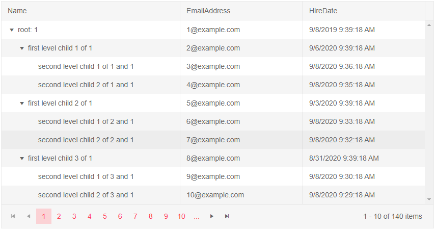
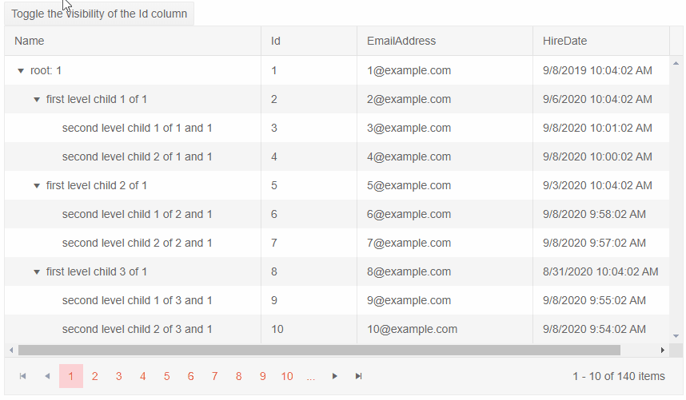

# Visible Columns

The TreeList allows you to programatically hide some of its columns. 

In this article:
* [Basics](#basics)
* [Notes](#notes)
* [Examples](#examples)
    * [Toggle The Visibility Of A Column On Button Click](#toggle-the-visibility-of-a-column-on-button-click)
    * [Hidden Grid Column With Template](#hidden-grid-column-with-template)
    * [Hide A Grid Column Based On A Condition](#hide-a-grid-column-based-on-a-condition)

## Basics

To hide a TreeList column set the `Visible` parameter to `false`. To hide a column based on a certain condition you can pass, for example, a ternary operator or a method that returns `bool` - the app can provide an expression according to its logic (like screen size).

>caption Hide a column from the TreeList. Basic example.

````CSHTML
@* Hide the EmployeeId TreeList column by setting the Visible parameter to false *@

<TelerikTreeList Data="@Data"
                 ItemsField="DirectReports"
                 HasChildrenField="HasReports"
                 Pageable="true"
                 Sortable="true"
                 FilterMode="@TreeListFilterMode.FilterMenu"
                 Width="750px" Height="400px"
                 Resizable="true" Reorderable="true">
    <TreeListColumns>
        <TreeListColumn Expandable="true" Field="Position" Width="400px"></TreeListColumn>
        <TreeListColumn Field="FirstName" Width="200px"></TreeListColumn>
        <TreeListColumn Field="LastName" Width="200px"></TreeListColumn>
        <TreeListColumn Field="EmployeeId" Width="100px" Visible="false"></TreeListColumn>
    </TreeListColumns>
</TelerikTreeList>

@code {
    // a model to bind the treelist. Should usually be in its own separate location
    public class EmployeeHierarchical
    {
        public int EmployeeId { get; set; }
        public string FirstName { get; set; }
        public string LastName { get; set; }
        public string Position { get; set; }
        public List<EmployeeHierarchical> DirectReports { get; set; }
        public bool HasReports { get; set; }
    }

    // treelist data
    public List<EmployeeHierarchical> Data { get; set; }

    // fetch the treelist data
    protected override async Task OnInitializedAsync()
    {
        Data = await GetEmployees();
    }

    // The next 200 lines are hardcoded data so you can explore the TreeList freely

    async Task<List<EmployeeHierarchical>> GetEmployees()
    {
        List<EmployeeHierarchical> sampleData = new List<EmployeeHierarchical>();

        EmployeeHierarchical theCEO = new EmployeeHierarchical
        {
            EmployeeId = 1,
            FirstName = "Daryl",
            LastName = "Sweeney",
            Position = "CEO",
            HasReports = true
        };

        theCEO.DirectReports = new List<EmployeeHierarchical>
{
            new EmployeeHierarchical
            {
                EmployeeId = 2,
                FirstName = "Guy",
                LastName = "Wooten",
                Position = "Chief Technical Officer",
                HasReports = true
            },
            new EmployeeHierarchical
            {
                EmployeeId = 3,
                FirstName = "Nevada",
                LastName = "Hart",
                Position = "Chief Financial Officer",
                HasReports = true,
                DirectReports = new List<EmployeeHierarchical>
        {
                    new EmployeeHierarchical
                    {
                        EmployeeId = 24,
                        FirstName = "Zena",
                        LastName = "Stanford",
                        Position = "VP, Finance"
                    }
                }
            }
        };

        theCEO.DirectReports[0].DirectReports = new List<EmployeeHierarchical>
{
            new EmployeeHierarchical
            {
                EmployeeId = 4,
                FirstName = "Buffy",
                LastName = "Weber",
                Position = "VP, Engineering",
                HasReports = true,
                DirectReports = new List<EmployeeHierarchical>
        {
                    new EmployeeHierarchical
                    {
                        EmployeeId = 6,
                        FirstName = "Hyacinth",
                        LastName = "Hood",
                        Position = "Team Lead",
                        HasReports = true,
                        DirectReports = new List<EmployeeHierarchical>
                {
                            new EmployeeHierarchical
                            {
                                EmployeeId = 7,
                                FirstName = "Akeem",
                                LastName = "Carr",
                                Position = "Software Developer, Junior"
                            },
                            new EmployeeHierarchical
                            {
                                EmployeeId = 8,
                                FirstName = "Rinah",
                                LastName = "Simon",
                                Position = "Software Developer"
                            }
                        }
                    },
                    new EmployeeHierarchical
                    {
                        EmployeeId = 9,
                        FirstName = "Gage",
                        LastName = "Daniels",
                        Position = "Software Architect"
                    },
                    new EmployeeHierarchical
                    {
                        EmployeeId = 10,
                        FirstName = "Constance",
                        LastName = "Vazquez",
                        Position = "Director, Engineering",
                        HasReports = true,
                        DirectReports = new List<EmployeeHierarchical>
                {
                            new EmployeeHierarchical
                            {
                                EmployeeId = 11,
                                FirstName = "Darrel",
                                LastName = "Solis",
                                Position = "Team Lead",
                                HasReports = true,
                                DirectReports = new List<EmployeeHierarchical>
                        {
                                    new EmployeeHierarchical
                                    {
                                        EmployeeId = 12,
                                        FirstName = "Brian",
                                        LastName = "Yang",
                                        Position = "Software Developer, Senior"
                                    },
                                    new EmployeeHierarchical
                                    {
                                        EmployeeId = 13,
                                        FirstName = "Lillian",
                                        LastName = "Bradshaw",
                                        Position = "Software Developer"
                                    },
                                    new EmployeeHierarchical
                                    {
                                        EmployeeId = 14,
                                        FirstName = "Keiko",
                                        LastName = "Espinoza",
                                        Position = "QA Engineer, Junior"
                                    }
                                }
                            }
                        }
                    }
                }
            },
            new EmployeeHierarchical
            {
                EmployeeId = 5,
                FirstName = "Skyler",
                LastName = "Cleveland",
                Position = "VP, Engineering",
                HasReports = true,
                DirectReports = new List<EmployeeHierarchical>
        {
                    new EmployeeHierarchical
                    {
                        EmployeeId = 16,
                        FirstName = "Karleigh",
                        LastName = "Garza",
                        Position = "Team Lead",
                        HasReports = true,
                        DirectReports = new List<EmployeeHierarchical>
                {
                            new EmployeeHierarchical
                            {
                                EmployeeId = 17,
                                FirstName = "Elmo",
                                LastName = "Tyson",
                                Position = "Software Developer"
                            },
                            new EmployeeHierarchical
                            {
                                EmployeeId = 18,
                                FirstName = "Stacey",
                                LastName = "Lynn",
                                Position = "QA Engineer",
                                HasReports = true,
                                DirectReports = new List<EmployeeHierarchical>
                        {
                                    new EmployeeHierarchical
                                    {
                                        EmployeeId = 19,
                                        FirstName = "Meredith",
                                        LastName = "Parish",
                                        Position = "QA Engineer, Junior"
                                    }
                                }
                            },
                            new EmployeeHierarchical
                            {
                                EmployeeId = 20,
                                FirstName = "Martha",
                                LastName = "Sargent",
                                Position = "Software Developer, Senior"
                            },
                            new EmployeeHierarchical
                            {
                                EmployeeId = 21,
                                FirstName = "Cassady",
                                LastName = "Whitley",
                                Position = "Software Developer"
                            },
                            new EmployeeHierarchical
                            {
                                EmployeeId = 22,
                                FirstName = "Haviva",
                                LastName = "Campbell",
                                Position = "Support Officer"
                            },
                            new EmployeeHierarchical
                            {
                                EmployeeId = 23,
                                FirstName = "Cameron",
                                LastName = "Ayers",
                                Position = "Support Officer"
                            }
                        }
                    }
                }
            }
        };

        sampleData.Add(theCEO);

        return await Task.FromResult(sampleData);
    }
}
````

>caption The result from the code snippet above



## Notes

Non-visible columns (`Visible="false"`) will have the following behavior:

* Will not be [editable]().
* Will not be visible when the data is [grouped]().
* [Templates]() will not be rendered.
    * When using [Row Template]() the visiblity of the column should be implemented by the application in the row template itself - the treelist can only toggle the visibility of the header.


## Examples

In this section you will find the following examples:

* [Toggle The Visibility Of A Column On Button Click](#toggle-the-visibility-of-a-column-on-button-click)
* [Hidden Grid Column With Template](#hidden-grid-column-with-template)
* [Hide A Grid Column Based On A Condition](#hide-a-grid-column-based-on-a-condition)

### Toggle The Visibility Of A Column On Button

The application can later the value of the `Visible` parameter and that will toggle the column.

````CSHTML
@* Toggling the visibily of a column keeps its original order in the TreeList. *@

<div>
    <TelerikButton OnClick="@(() => isVisible = !isVisible)">Toggle the visibility of the FirstName column</TelerikButton>
</div>

<TelerikTreeList Data="@Data"
                 ItemsField="DirectReports"
                 HasChildrenField="HasReports"
                 Pageable="true"
                 Sortable="true"
                 FilterMode="@TreeListFilterMode.FilterMenu"
                 Width="850px" Height="400px"
                 Resizable="true" Reorderable="true">
    <TreeListColumns>
        <TreeListColumn Expandable="true" Field="Position" Width="400px"></TreeListColumn>
        <TreeListColumn Field="FirstName" Width="200px" Visible="@isVisible"></TreeListColumn>
        <TreeListColumn Field="LastName" Width="200px"></TreeListColumn>
        <TreeListColumn Field="EmployeeId" Width="200px"></TreeListColumn>
    </TreeListColumns>
</TelerikTreeList>

@code {

    public bool isVisible { get; set; } = true;
    // a model to bind the treelist. Should usually be in its own separate location
    public class EmployeeHierarchical
    {
        public int EmployeeId { get; set; }
        public string FirstName { get; set; }
        public string LastName { get; set; }
        public string Position { get; set; }
        public List<EmployeeHierarchical> DirectReports { get; set; }
        public bool HasReports { get; set; }
    }

    // treelist data
    public List<EmployeeHierarchical> Data { get; set; }

    // fetch the treelist data
    protected override async Task OnInitializedAsync()
    {
        Data = await GetEmployees();
    }

    // The next 200 lines are hardcoded data so you can explore the TreeList freely

    async Task<List<EmployeeHierarchical>> GetEmployees()
    {
        List<EmployeeHierarchical> sampleData = new List<EmployeeHierarchical>();

        EmployeeHierarchical theCEO = new EmployeeHierarchical
        {
            EmployeeId = 1,
            FirstName = "Daryl",
            LastName = "Sweeney",
            Position = "CEO",
            HasReports = true
        };

        theCEO.DirectReports = new List<EmployeeHierarchical>
{
            new EmployeeHierarchical
            {
                EmployeeId = 2,
                FirstName = "Guy",
                LastName = "Wooten",
                Position = "Chief Technical Officer",
                HasReports = true
            },
            new EmployeeHierarchical
            {
                EmployeeId = 3,
                FirstName = "Nevada",
                LastName = "Hart",
                Position = "Chief Financial Officer",
                HasReports = true,
                DirectReports = new List<EmployeeHierarchical>
        {
                    new EmployeeHierarchical
                    {
                        EmployeeId = 24,
                        FirstName = "Zena",
                        LastName = "Stanford",
                        Position = "VP, Finance"
                    }
                }
            }
        };

        theCEO.DirectReports[0].DirectReports = new List<EmployeeHierarchical>
{
            new EmployeeHierarchical
            {
                EmployeeId = 4,
                FirstName = "Buffy",
                LastName = "Weber",
                Position = "VP, Engineering",
                HasReports = true,
                DirectReports = new List<EmployeeHierarchical>
        {
                    new EmployeeHierarchical
                    {
                        EmployeeId = 6,
                        FirstName = "Hyacinth",
                        LastName = "Hood",
                        Position = "Team Lead",
                        HasReports = true,
                        DirectReports = new List<EmployeeHierarchical>
                {
                            new EmployeeHierarchical
                            {
                                EmployeeId = 7,
                                FirstName = "Akeem",
                                LastName = "Carr",
                                Position = "Software Developer, Junior"
                            },
                            new EmployeeHierarchical
                            {
                                EmployeeId = 8,
                                FirstName = "Rinah",
                                LastName = "Simon",
                                Position = "Software Developer"
                            }
                        }
                    },
                    new EmployeeHierarchical
                    {
                        EmployeeId = 9,
                        FirstName = "Gage",
                        LastName = "Daniels",
                        Position = "Software Architect"
                    },
                    new EmployeeHierarchical
                    {
                        EmployeeId = 10,
                        FirstName = "Constance",
                        LastName = "Vazquez",
                        Position = "Director, Engineering",
                        HasReports = true,
                        DirectReports = new List<EmployeeHierarchical>
                {
                            new EmployeeHierarchical
                            {
                                EmployeeId = 11,
                                FirstName = "Darrel",
                                LastName = "Solis",
                                Position = "Team Lead",
                                HasReports = true,
                                DirectReports = new List<EmployeeHierarchical>
                        {
                                    new EmployeeHierarchical
                                    {
                                        EmployeeId = 12,
                                        FirstName = "Brian",
                                        LastName = "Yang",
                                        Position = "Software Developer, Senior"
                                    },
                                    new EmployeeHierarchical
                                    {
                                        EmployeeId = 13,
                                        FirstName = "Lillian",
                                        LastName = "Bradshaw",
                                        Position = "Software Developer"
                                    },
                                    new EmployeeHierarchical
                                    {
                                        EmployeeId = 14,
                                        FirstName = "Keiko",
                                        LastName = "Espinoza",
                                        Position = "QA Engineer, Junior"
                                    }
                                }
                            }
                        }
                    }
                }
            },
            new EmployeeHierarchical
            {
                EmployeeId = 5,
                FirstName = "Skyler",
                LastName = "Cleveland",
                Position = "VP, Engineering",
                HasReports = true,
                DirectReports = new List<EmployeeHierarchical>
        {
                    new EmployeeHierarchical
                    {
                        EmployeeId = 16,
                        FirstName = "Karleigh",
                        LastName = "Garza",
                        Position = "Team Lead",
                        HasReports = true,
                        DirectReports = new List<EmployeeHierarchical>
                {
                            new EmployeeHierarchical
                            {
                                EmployeeId = 17,
                                FirstName = "Elmo",
                                LastName = "Tyson",
                                Position = "Software Developer"
                            },
                            new EmployeeHierarchical
                            {
                                EmployeeId = 18,
                                FirstName = "Stacey",
                                LastName = "Lynn",
                                Position = "QA Engineer",
                                HasReports = true,
                                DirectReports = new List<EmployeeHierarchical>
                        {
                                    new EmployeeHierarchical
                                    {
                                        EmployeeId = 19,
                                        FirstName = "Meredith",
                                        LastName = "Parish",
                                        Position = "QA Engineer, Junior"
                                    }
                                }
                            },
                            new EmployeeHierarchical
                            {
                                EmployeeId = 20,
                                FirstName = "Martha",
                                LastName = "Sargent",
                                Position = "Software Developer, Senior"
                            },
                            new EmployeeHierarchical
                            {
                                EmployeeId = 21,
                                FirstName = "Cassady",
                                LastName = "Whitley",
                                Position = "Software Developer"
                            },
                            new EmployeeHierarchical
                            {
                                EmployeeId = 22,
                                FirstName = "Haviva",
                                LastName = "Campbell",
                                Position = "Support Officer"
                            },
                            new EmployeeHierarchical
                            {
                                EmployeeId = 23,
                                FirstName = "Cameron",
                                LastName = "Ayers",
                                Position = "Support Officer"
                            }
                        }
                    }
                }
            }
        };

        sampleData.Add(theCEO);

        return await Task.FromResult(sampleData);
    }
}
````

>caption The result from the code snippet above



### Hidden Grid Column With Template

When cell-specific templates are used, they are not rendered at all. If you are using the RowTemplate, however, make sure to handle the column visiblity there as well.

````CSHTML
@* The Template for the Salary column will not be rendered *@

<TelerikGrid Data=@MyData
             Pageable="true"
             PageSize="5"
             Width="700px">
    <GridColumns>
        <GridColumn Field=@nameof(SampleData.ID) Title="ID" />
        <GridColumn Field=@nameof(SampleData.Name) Title="Name" />
        <GridColumn Field=@nameof(SampleData.HireDate) Title="Hire date" />
        <GridColumn Field=@nameof(SampleData.Salary) Title="Salary" Visible="false">
            <Template>
                @{ 
                    var item = context as SampleData;
                    @item.Salary.ToString("C2");
                }
            </Template>
        </GridColumn>
    </GridColumns>
</TelerikGrid>

@code {
    // in a real case, keep the models in dedicated locations, this is just an easy to copy and see example
    public class SampleData
    {
        public int ID { get; set; }
        public string Name { get; set; }
        public DateTime HireDate { get; set; }
        public int Salary { get; set; }
    }

    public List<SampleData> MyData { get; set; }

    protected override void OnInitialized()
    {
        MyData = new List<SampleData>();

        for (int i = 0; i < 50; i++)
        {
            MyData.Add(new SampleData()
            {
                ID = i,
                Name = "Name " + i.ToString(),
                Salary = (i + 1) * 100,
                HireDate = DateTime.Today.AddDays(-i)
            });
        }
    }
}
````

>caption The result from the code snippet above


### Hide A Grid Column Based On A Condition

This example shows hiding a column based on a simple condition in its data. You can change it to use other view-model data - such as screen dimensions, user preferences you have stored, or any other logic.

````CSHTML
@* The Name column is hidden, because the data for the grid contains "Name 2" *@

<TelerikGrid Data=@MyData
             Pageable="true"
             PageSize="5"
             Width="700px">
    <GridColumns>
        <GridColumn Field=@nameof(SampleData.ID) Title="ID" />
        <GridColumn Field=@nameof(SampleData.Name) Title="Name" Visible="@((MyData.Any(x => x.Name.Contains("Name 2"))) ? false : true)" />
        <GridColumn Field=@nameof(SampleData.HireDate) Title="Hire date" />
        <GridColumn Field=@nameof(SampleData.Salary) Title="Salary" />
    </GridColumns>
</TelerikGrid>

@code {
    // in a real case, keep the models in dedicated locations, this is just an easy to copy and see example
    public class SampleData
    {
        public int ID { get; set; }
        public string Name { get; set; }
        public DateTime HireDate { get; set; }
        public int Salary { get; set; }
    }

    public List<SampleData> MyData { get; set; }

    protected override void OnInitialized()
    {
        MyData = new List<SampleData>();

        for (int i = 0; i < 50; i++)
        {
            MyData.Add(new SampleData()
            {
                ID = i,
                Name = "Name " + i.ToString(),
                Salary = (i + 1) * 100,
                HireDate = DateTime.Today.AddDays(-i)
            });
        }
    }
}
````

>caption The result from the code snippet above


## See Also

  * [Live Demo: Visible Columns](https://demos.telerik.com/blazor-ui/grid/columns)
