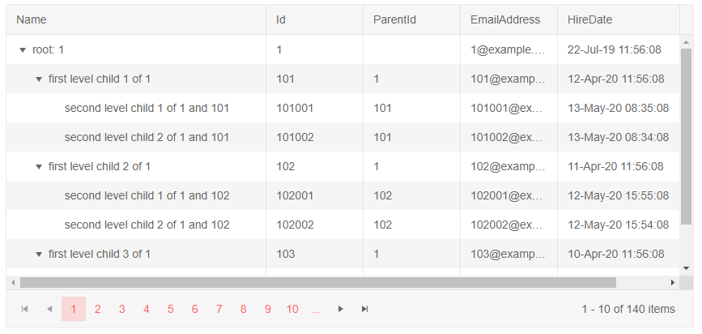

# TreeList Data Binding to Flat Data

This article explains how to bind the treelist for Blazor to flat data. 
@[template](/_contentTemplates/treelist/databinding.md#link-to-basics)


Flat data means that the entire collection of treelist items is available at one level, for example `List<MyTreeListItemModel>`.

The parent-child relationships are created through internal data in the model - the `ParentId` field which points to the `Id` of the item that will contain the current item. The root level has `null` for `ParentId`. There must be at least one node with a `null` value so that the treelist renders anything.

You must also provide the correct value for the `HasChildren` field - for items that have children, you must set it to `true` so that the expand arrow is rendered.

>caption Example of flat data in a treelist - you need to point the TreeList to the Id and ParentId fields in your model

````CSHTML
@* Using self-referencing flat data. In this model, the field names match the defaults, but they are set to showcase the concept. *@

<TelerikTreeList Data="@Data" 

                 IdField="Id" ParentIdField="ParentId"

                 Pageable="true" Width="850px" Height="400px">
    <TreeListColumns>
        <TreeListColumn Field="Name" Expandable="true" Width="320px" />
        <TreeListColumn Field="Id" Width="120px" />
        <TreeListColumn Field="ParentId" Width="120px" />
        <TreeListColumn Field="EmailAddress" Width="120px" />
        <TreeListColumn Field="HireDate" Width="220px" />
    </TreeListColumns>
</TelerikTreeList>

@code {
    public List<Employee> Data { get; set; }

    protected override async Task OnInitializedAsync()
    {
        Data = await GetTreeListData();
    }

    // sample model

    public class Employee
    {
        // denote the parent-child relationship between items
        public int Id { get; set; }
        public int? ParentId { get; set; }
        
        // custom data fields for display
        public string Name { get; set; }
        public string EmailAddress { get; set; }
        public DateTime HireDate { get; set; }
    }

    // data generation

    async Task<List<Employee>> GetTreeListData()
    {
        List<Employee> data = new List<Employee>();

        for (int i = 1; i < 15; i++)
        {
            data.Add(new Employee
            {
                Id = i,
                ParentId = null, // indicates a root-level item
                Name = $"root: {i}",
                EmailAddress = $"{i}@example.com",
                HireDate = DateTime.Now.AddYears(-i)
            }); ;

            for (int j = 1; j < 4; j++)
            {
                int currId = i * 100 + j;
                data.Add(new Employee
                {
                    Id = currId,
                    ParentId = i,
                    Name = $"first level child {j} of {i}",
                    EmailAddress = $"{currId}@example.com",
                    HireDate = DateTime.Now.AddDays(-currId)
                });

                for (int k = 1; k < 3; k++)
                {
                    int nestedId = currId * 1000 + k;
                    data.Add(new Employee
                    {
                        Id = nestedId,
                        ParentId = currId,
                        Name = $"second level child {k} of {i} and {currId}",
                        EmailAddress = $"{nestedId}@example.com",
                        HireDate = DateTime.Now.AddMinutes(-nestedId)
                    }); ;
                }
            }
        }

        return await Task.FromResult(data);
    }
}
````

>caption The result from the code snippet above




## See Also

  * [TreeList Data Binding Basics]()
  * [Live Demo: TreeList Flat Data](https://demos.telerik.com/blazor-ui/treelist/flat-data)
  * [Binding to Hierarchical Data]()
  * [Load on Demand]()

