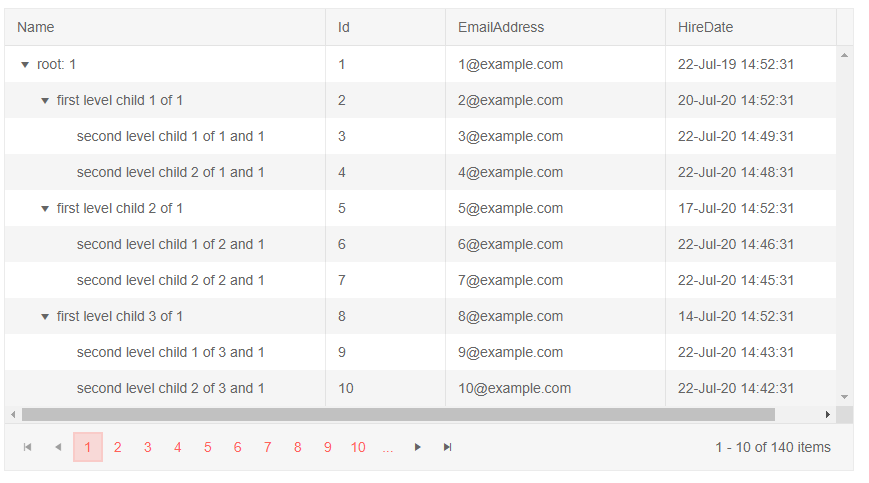

# TreeList Data Binding to Hierarchical Data

This article explains how to bind the treelist for Blazor to hierarchical data. 
@[template](/_contentTemplates/treelist/databinding.md#link-to-basics)


Hierarchical data means that the collection of child items is provided in a field of its parent's model. By default, this is the `Items` field, and hierarchical data binding is the default mode of the treelist. This approach of providing items lets you gather separate collections of data that may even come from different sources.

If there are items for a certain node, it will have an expand icon. The `HasChildren` field can override this, however, but it is not required for hierarchical data binding.

>caption Example of hierarchical data binding

````CSHTML
@* Hierarchical data items hold collections of the child items *@

<TelerikTreeList Data="@Data"

                 ItemsField="@(nameof(Employee.DirectReports))"

                 Pageable="true" Width="850px">
    <TreeListColumns>
        <TreeListColumn Field="Name" Expandable="true" Width="320px" />
        <TreeListColumn Field="Id" Editable="false" Width="120px" />
        <TreeListColumn Field="EmailAddress" Width="220px" />
        <TreeListColumn Field="HireDate" Width="220px" />
    </TreeListColumns>
</TelerikTreeList>

@code {
    public List<Employee> Data { get; set; }

    // sample model

    public class Employee
    {
        // hierarchical data collections
        public List<Employee> DirectReports { get; set; }

        // data fields for display
        public int Id { get; set; }
        public string Name { get; set; }
        public string EmailAddress { get; set; }
        public DateTime HireDate { get; set; }
    }

    // data generation

    // used in this example for data generation and retrieval for CUD operations on the current view-model data
    public int LastId { get; set; } = 1;

    protected override async Task OnInitializedAsync()
    {
        Data = await GetTreeListData();
    }

    async Task<List<Employee>> GetTreeListData()
    {
        List<Employee> data = new List<Employee>();

        for (int i = 1; i < 15; i++)
        {
            Employee root = new Employee
            {
                Id = LastId,
                Name = $"root: {i}",
                EmailAddress = $"{i}@example.com",
                HireDate = DateTime.Now.AddYears(-i),
                DirectReports = new List<Employee>(), // prepare a collection for the child items, will be populated later in the code
            };
            data.Add(root);
            LastId++;

            for (int j = 1; j < 4; j++)
            {
                int currId = LastId;
                Employee firstLevelChild = new Employee
                {
                    Id = currId,
                    Name = $"first level child {j} of {i}",
                    EmailAddress = $"{currId}@example.com",
                    HireDate = DateTime.Now.AddDays(-currId),
                    DirectReports = new List<Employee>(), // collection for child nodes
                };
                root.DirectReports.Add(firstLevelChild); // populate the parent's collection
                LastId++;

                for (int k = 1; k < 3; k++)
                {
                    int nestedId = LastId;
                    // populate the parent's collection
                    firstLevelChild.DirectReports.Add(new Employee
                    {
                        Id = LastId,
                        Name = $"second level child {k} of {j} and {i}",
                        EmailAddress = $"{nestedId}@example.com",
                        HireDate = DateTime.Now.AddMinutes(-nestedId)
                    }); ;
                    LastId++;
                }
            }
        }

        return await Task.FromResult(data);
    }
}
````

>caption The result from the code snippet above




## See Also

  * [TreeList Data Binding Basics]()
  * [Live Demo: TreeList Hierarchical Data](https://demos.telerik.com/blazor-ui/treelist/hierarchical-data)
  * [Binding to Flat Data]()
  * [Load on Demand]()

