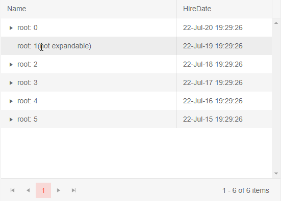
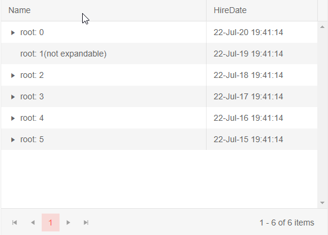

# TreeList Load on Demand

This article explains how to load nodes on demand the treelist for Blazor so you can improve the performance. 
@[template](/_contentTemplates/treelist/databinding.md#link-to-basics)


You don't have to provide all the data the treelist will render at once - the root nodes are sufficient for an initial display. You can then use the `OnExpand` event of the treelist to provide [hierarchical data]() to the node that was just expanded or amend [flat data]() source with new nodes.

In the `OnExpand` event, you will receive the current node that was just expanded so you can check whether you need to load items for it. You can then load those items from your data service and update the corresponding data collection. You can also use the `HasChildren` field as a flag to know whether you need data for the given node. It is up to the application to populate it - you may choose not to do so, but keep in mind that setting it to `false` will override the presence of child items and will prevent the expand icon from rendering.

Loading nodes on demand can improve the performance of your application by requesting less data at any given time.

Below you will find two examples - for [hierarchical](#load-hierarchical-data-on-demand) and for [flat](#load-flat-data-on-demand) data.

## Load Hierarchical Data On Demand

>caption Load on Demand in a TreeList with hierarchical data binding. Code comments offer details.

````CSHTML
@* this sample shows how to load hierarchical data on demand and one way of handling no data being returned. Depending on your models and data logic you may have to tweak some checks, review the code comments for details.
*@

<TelerikTreeList Data="@Data"
                 ItemsField="@(nameof(Employee.DirectReports))"
                 HasChildrenField="@(nameof(Employee.HasChildren))"
                 OnExpand="@((TreeListExpandEventArgs<Employee> args) => OnExpand(args))"
                 Pageable="true" Width="550px" Height="400px">
    <TreeListColumns>
        <TreeListColumn Field="Name" Expandable="true" Width="220px" />
        <TreeListColumn Field="HireDate" Width="120px" />
    </TreeListColumns>
</TelerikTreeList>

@code {
    public List<Employee> Data { get; set; }

    // load on demand through the event
    async Task OnExpand(TreeListExpandEventArgs<Employee> args)
    {
        if (args.Expanded && // the item got expanded
            args.Item.HasChildren && // it is marked as having children
            (args.Item.DirectReports == null || args.Item.DirectReports.Count == 0) // there are no child items
            )
        {
            // request data
            var children = await GetChildren(args.Item);

            if (children.Count > 0)
            {
                // child items exist - add them to the current item
                args.Item.DirectReports = children;
            }
            else
            {
                // no nested data - hide the expand arrow
                args.Item.HasChildren = false;
            }
        }
    }

    async Task<List<Employee>> GetChildren(Employee itm)
    {
        List<Employee> data = new List<Employee>();

        // to showcase an example of when no actual child items are returned
        // we will check for too long nesting chain with this simpe logic
        if(itm.Name.LastIndexOf("Child of") < 15)
        {
            data.Add(new Employee
            {
                Name = "Child of " + itm.Name,
                HasChildren = true
            });
        }

        return await Task.FromResult(data);
    }

    // sample model

    public class Employee
    {
        // hierarchical data collections
        public List<Employee> DirectReports { get; set; }
        public bool HasChildren { get; set; }

        // data fields for display
        public string Name { get; set; }
        public DateTime HireDate { get; set; }
    }

    // initial data generation

    protected override async Task OnInitializedAsync()
    {
        List<Employee> data = new List<Employee>();
        for (int i = 0; i < 6; i++)
        {
            data.Add(new Employee
            {
                Name = $"root: {i}",
                HireDate = DateTime.Now.AddYears(-i),
                HasChildren = true
            });
        }

        // mark an item as non-expandable (not having children)
        data[1].HasChildren = false;
        data[1].Name += "(not expandable) ";

        Data = data;
    }
}
````

>caption The result from the example above when expanding all children of root 2




## Load Flat Data On Demand

>caption Load on Demand in a TreeList with flat data binding. Code comments offer details.

````CSHTML
@* this sample shows how to load flat data on demand and one way of handling no data being returned. Depending on your models and data logic you may have to tweak some checks, review the code comments for details.
*@

<TelerikTreeList Data="@Data"
                 IdField="@(nameof(Employee.Id))"
                 ParentIdField="@(nameof(Employee.ReportsTo))"
                 HasChildrenField="@(nameof(Employee.HasChildren))"
                 OnExpand="@((TreeListExpandEventArgs<Employee> args) => OnExpand(args))"
                 Pageable="true" Width="550px" Height="400px">
    <TreeListColumns>
        <TreeListColumn Field="Name" Expandable="true" Width="220px" />
        <TreeListColumn Field="HireDate" Width="120px" />
    </TreeListColumns>
</TelerikTreeList>

@code {
    public List<Employee> Data { get; set; }

    // load on demand through the event
    async Task OnExpand(TreeListExpandEventArgs<Employee> args)
    {
        if (args.Expanded && // the item got expanded
            args.Item.HasChildren && // it is marked as having children
            !Data.Any(x => x.ReportsTo == args.Item.Id) // there are no child items
            )
        {
            // request data
            var children = await GetChildren(args.Item);

            if (children.Count > 0)
            {
                // child items exist - add them to the main data collection
                Data.AddRange(children);
            }
            else
            {
                // no nested data - hide the expand arrow
                args.Item.HasChildren = false;
            }
        }
    }

    async Task<List<Employee>> GetChildren(Employee itm)
    {
        List<Employee> data = new List<Employee>();

        // to showcase an example of when no actual child items are returned
        // we will check for too long nesting chain with this simpe logic
        if(itm.Name.LastIndexOf("Child of") < 15)
        {
            data.Add(new Employee
            {
                Id = LastId++,
                ReportsTo = itm.Id,
                Name = "Child of " + itm.Name,
                HasChildren = true
            });
        }

        return await Task.FromResult(data);
    }

    // sample model

    public class Employee
    {
        // hierarchical data collections
        public int Id { get; set; }
        public int? ReportsTo { get; set; }
        public bool HasChildren { get; set; }

        // data fields for display
        public string Name { get; set; }
        public DateTime HireDate { get; set; }
    }

    // initial data generation

    int LastId { get; set; } = 0;

    protected override async Task OnInitializedAsync()
    {
        List<Employee> data = new List<Employee>();
        for (int i = 0; i < 6; i++)
        {
            data.Add(new Employee
            {
                Id = LastId++,
                ReportsTo = null,
                Name = $"root: {i}",
                HireDate = DateTime.Now.AddYears(-i),
                HasChildren = true
            });
        }

        // mark an item as non-expandable (not having children)
        data[1].HasChildren = false;
        data[1].Name += "(not expandable) ";

        Data = data;
    }
}
````

>caption The result from the example above when expanding all children of root 2




## See Also

  * [TreeList Data Binding Basics]()
  * [Live Demo: TreeList Load on Demand](https://demos.telerik.com/blazor-ui/treelist/lazy-loading)
  * [Binding to Flat Data]()
  * [Binding to Hierarchical Data]()

