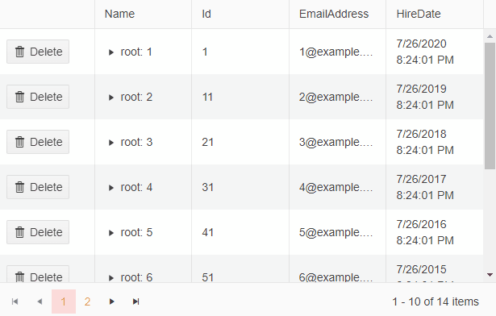

# Delete Confirmation Dialog
The delete confirmation dialog triggers before item deletion. You can enable it by setting the `ConfirmDelete` parameter to `true`. 

>important `ConfirmDelete` is **not** a command column parameter.

>caption Delete Confirmation dialog



>caption Enabling of the Delete Confirmation Dialog

````CSHTML
@* TreeList with enabled Delete Confirmation Dialog *@

@using System.ComponentModel.DataAnnotations

<TelerikTreeList Data="@Data"
                 OnDelete="@DeleteItem"
                 Pageable="true" Height="400px" 
                 ConfirmDelete="true">
    <TreeListColumns>
        <TreeListCommandColumn>
            <TreeListCommandButton Command="Delete" Icon="delete">Delete</TreeListCommandButton>
        </TreeListCommandColumn>
        <TreeListColumn Field="Name" Expandable="true" />
        <TreeListColumn Field="Id" />
        <TreeListColumn Field="EmailAddress" />
        <TreeListColumn Field="HireDate" />
    </TreeListColumns>
</TelerikTreeList>

@code {
    public List<Employee> Data { get; set; }

    async Task DeleteItem(TreeListCommandEventArgs args)
    {
        var item = args.Item as Employee;

        await MyService.Delete(item);

        await GetTreeListData();
    }

    public class Employee
    {
        public int Id { get; set; }

        [Required]
        public string Name { get; set; }
        public string EmailAddress { get; set; }
        public DateTime HireDate { get; set; }

        public List<Employee> DirectReports { get; set; }
        public bool HasChildren { get; set; }

        public override bool Equals(object obj)
        {
            if (obj is Employee)
            {
                return this.Id == (obj as Employee).Id;
            }
            return false;
        }
    }

    async Task GetTreeListData()
    {
        Data = await MyService.Read();
    }

    protected override async Task OnInitializedAsync()
    {
        await GetTreeListData();
    }

    public static class MyService
    {
        private static List<Employee> _data { get; set; } = new List<Employee>();
        private static int LastId { get; set; } = 1;

        public static async Task<List<Employee>> Read()
        {
            if (_data.Count < 1)
            {
                for (int i = 1; i < 15; i++)
                {
                    Employee root = new Employee
                    {
                        Id = LastId,
                        Name = $"root: {i}",
                        EmailAddress = $"{i}@example.com",
                        HireDate = DateTime.Now.AddYears(-i),
                        DirectReports = new List<Employee>(),
                        HasChildren = true
                    };
                    _data.Add(root);
                    LastId++;

                    for (int j = 1; j < 4; j++)
                    {
                        int currId = LastId;
                        Employee firstLevelChild = new Employee
                        {
                            Id = currId,
                            Name = $"first level child {j} of {i}",
                            EmailAddress = $"{currId}@example.com",
                            HireDate = DateTime.Now.AddDays(-currId),
                            DirectReports = new List<Employee>(),
                            HasChildren = true
                        };
                        root.DirectReports.Add(firstLevelChild);
                        LastId++;

                        for (int k = 1; k < 3; k++)
                        {
                            int nestedId = LastId;
                            firstLevelChild.DirectReports.Add(new Employee
                            {
                                Id = LastId,
                                Name = $"second level child {k} of {j} and {i}",
                                EmailAddress = $"{nestedId}@example.com",
                                HireDate = DateTime.Now.AddMinutes(-nestedId)
                            }); ;
                            LastId++;
                        }
                    }
                }
            }

            return await Task.FromResult(_data);
        }

        public static async Task Delete(Employee itemToDelete)
        {
            RemoveChildRecursive(_data, itemToDelete);
        }

        static void RemoveChildRecursive(List<Employee> items, Employee item)
        {
            for (int i = 0; i < items.Count(); i++)
            {
                if (item.Equals(items[i]))
                {
                    items.Remove(item);

                    return;
                }
                else if (items[i].DirectReports?.Count > 0)
                {
                    RemoveChildRecursive(items[i].DirectReports, item);

                    if (items[i].DirectReports.Count == 0)
                    {
                        items[i].HasChildren = false;
                    }
                }
            }
        }
    }
}
````


## See Also

* [Live Demo: TreeList Inline Editing](https://demos.telerik.com/blazor-ui/treelist/editing-inline)
* [Live Demo: TreeList PopUp Editing](https://demos.telerik.com/blazor-ui/treelist/editing-popup)
* [Live Demo: TreeList InCell Editing](https://demos.telerik.com/blazor-ui/treelist/editing-incell)
* [Live Demo: TreeList Custom Editor Template](https://demos.telerik.com/blazor-ui/treelist/custom-editor)
* [Live Demo: TreeList Custom Edit Form](https://demos.telerik.com/blazor-ui/treelist/editing-custom-form)

