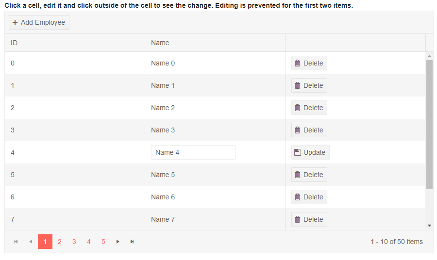

# TreeList InCell Editing

In Cell editing allows the user to click the cell and type the new value. When they remove focus from the treelist or current row, the `OnUpdate` event fires, where the data-access logic can move it to the actual data source.

You can also use the `Tab`, `Shift+Tab` and `Enter` keys to move between edited cells quickly to perform fast data updates. This lets the user edit efficiently, with few actions, like in Excel, while avoiding delays and re-renders from data updates that will break up that flow. Command columns and non-editable columns are not part of this keyboard navigation.

#### Sections in this article:

* [Basics](#basics)
* [Notes](#notes)

## Basics

To enable InCell editing mode, set the `EditMode` property of the treelist to `Telerik.Blazor.TreeListEditMode.Incell`. You can handle the `OnUpdate`, `OnCreate` and `OnDelete` events to perform the CUD operations, as shown in the example below.

To add a new item, you must also add a [toolbar]() with an `Add` command. `OnCreate` will fire immediately when you click the `Add` button, see the [Notes](#notes) below.

The `OnUpdate` event always fires for the last edited cell on the row - when you remove focus from the treelist, or when you press `Enter` to go to the next row.

>caption Reduced need for command buttons and user actions. The treelist events let you handle data operations in InCell edit mode (see the code comments for details)

````CSHTML
Click a cell, edit it and click outside of the treelist to see the change. You can also use Tab, Shift+Tab and Enter to navigate between the cells.
<br />
Editing is cancelled for the first record.
<br />

<TelerikTreeList Data="@Data"
                 EditMode="@TreeListEditMode.Incell"
                 OnUpdate="@UpdateItem"
                 OnDelete="@DeleteItem"
                 OnCreate="@CreateItem"
                 OnEdit="@OnEditHandler"
                 OnCancel="@OnCancelHandler"
                 Pageable="true" ItemsField="@(nameof(Employee.DirectReports))"
                 Width="850px">
    <TreeListToolBar>
        <TreeListCommandButton Command="Add" Icon="add">Add</TreeListCommandButton>
    </TreeListToolBar>
    <TreeListColumns>
        <TreeListCommandColumn Width="200px">
            <TreeListCommandButton Command="Add" Icon="plus">Add Child</TreeListCommandButton>
            <TreeListCommandButton Command="Delete" Icon="delete">Delete</TreeListCommandButton>
            <TreeListCommandButton Command="Save" Icon="save" ShowInEdit="true">Update</TreeListCommandButton>
            <TreeListCommandButton Command="Cancel" Icon="cancel" ShowInEdit="true">Cancel</TreeListCommandButton>
        </TreeListCommandColumn>

        <TreeListColumn Field="Name" Expandable="true" Width="320px" />
        <TreeListColumn Field="Id" Editable="false" Width="120px" />
        <TreeListColumn Field="EmailAddress" Width="220px" />
        <TreeListColumn Field="HireDate" Width="220px" />
    </TreeListColumns>
</TelerikTreeList>

@code {
    public List<Employee> Data { get; set; }

    // Sample CUD operations for the local data
    async Task UpdateItem(TreeListCommandEventArgs args)
    {
        var item = args.Item as Employee;

        // perform actual data source operations here through your service
        await MyService.Update(item);

        // update the local view-model data with the service data
        await GetTreeListData();
    }

    async Task CreateItem(TreeListCommandEventArgs args)
    {
        var item = args.Item as Employee;
        var parentItem = args.ParentItem as Employee;

        // perform actual data source operations here through your service
        await MyService.Create(item, parentItem);

        // update the local view-model data with the service data
        await GetTreeListData();
    }

    async Task DeleteItem(TreeListCommandEventArgs args)
    {
        var item = args.Item as Employee;

        // perform actual data source operations here through your service
        await MyService.Delete(item);

        // update the local view-model data with the service data
        await GetTreeListData();
    }

    // OnEdit handler

    async Task OnEditHandler(TreeListCommandEventArgs args)
    {
        Employee empl = args.Item as Employee;
        if (empl.Id == 1)
        {
            // prevent opening for edit based on condition
            args.IsCancelled = true;
            Console.WriteLine("You cannot edit this item");
        }
    }

    // OnCancel handler

    async Task OnCancelHandler(TreeListCommandEventArgs args)
    {
        Employee empl = args.Item as Employee;
        // if necessary, perform actual data source operation here through your service
    }


    // sample model

    public class Employee
    {
        public int Id { get; set; }
        public string Name { get; set; }
        public string EmailAddress { get; set; }
        public DateTime HireDate { get; set; }

        public List<Employee> DirectReports { get; set; }
        public bool HasChildren { get; set; }

        // Used for the editing so replacing the object in the view-model data
        // will treat it as the same object and keep its state - otherwise it will
        // collapse after editing is done, which is not what the user would expect
        public override bool Equals(object obj)
        {
            if (obj is Employee)
            {
                return this.Id == (obj as Employee).Id;
            }
            return false;
        }
    }

    // data generation

    async Task GetTreeListData()
    {
        Data = await MyService.Read();
    }

    protected override async Task OnInitializedAsync()
    {
        await GetTreeListData();
    }

    // the following static class mimics an actual data service that handles the actual data source
    // replace it with your actual service through the DI, this only mimics how the API can look like and works for this standalone page
    public static class MyService
    {
        private static List<Employee> _data { get; set; } = new List<Employee>();
        // used in this example for data generation and retrieval for CUD operations on the current view-model data
        private static int LastId { get; set; } = 1;

        public static async Task Create(Employee itemToInsert, Employee parentItem)
        {
            InsertItemRecursive(_data, itemToInsert, parentItem);
        }

        public static async Task<List<Employee>> Read()
        {
            if (_data.Count < 1)
            {
                for (int i = 1; i < 15; i++)
                {
                    Employee root = new Employee
                    {
                        Id = LastId,
                        Name = $"root: {i}",
                        EmailAddress = $"{i}@example.com",
                        HireDate = DateTime.Now.AddYears(-i),
                        DirectReports = new List<Employee>(),
                        HasChildren = true
                    };
                    _data.Add(root);
                    LastId++;

                    for (int j = 1; j < 4; j++)
                    {
                        int currId = LastId;
                        Employee firstLevelChild = new Employee
                        {
                            Id = currId,
                            Name = $"first level child {j} of {i}",
                            EmailAddress = $"{currId}@example.com",
                            HireDate = DateTime.Now.AddDays(-currId),
                            DirectReports = new List<Employee>(),
                            HasChildren = true
                        };
                        root.DirectReports.Add(firstLevelChild);
                        LastId++;

                        for (int k = 1; k < 3; k++)
                        {
                            int nestedId = LastId;
                            firstLevelChild.DirectReports.Add(new Employee
                            {
                                Id = LastId,
                                Name = $"second level child {k} of {j} and {i}",
                                EmailAddress = $"{nestedId}@example.com",
                                HireDate = DateTime.Now.AddMinutes(-nestedId)
                            }); ;
                            LastId++;
                        }
                    }
                }

                _data[0].Name += " (non-editable, see OnEdit)";
            }

            return await Task.FromResult(_data);
        }

        public static async Task Update(Employee itemToUpdate)
        {
            UpdateItemRecursive(_data, itemToUpdate);
        }

        public static async Task Delete(Employee itemToDelete)
        {
            RemoveChildRecursive(_data, itemToDelete);
        }

        // sample helper methods for handling the view-model data hierarchy
        static void UpdateItemRecursive(List<Employee> items, Employee itemToUpdate)
        {
            for (int i = 0; i < items.Count; i++)
            {
                if (items[i].Id.Equals(itemToUpdate.Id))
                {
                    items[i] = itemToUpdate;
                    return;
                }

                if (items[i].DirectReports?.Count > 0)
                {
                    UpdateItemRecursive(items[i].DirectReports, itemToUpdate);
                }
            }
        }

        static void RemoveChildRecursive(List<Employee> items, Employee item)
        {
            for (int i = 0; i < items.Count(); i++)
            {
                if (item.Equals(items[i]))
                {
                    items.Remove(item);

                    return;
                }
                else if (items[i].DirectReports?.Count > 0)
                {
                    RemoveChildRecursive(items[i].DirectReports, item);

                    if (items[i].DirectReports.Count == 0)
                    {
                        items[i].HasChildren = false;
                    }
                }
            }
        }

        static void InsertItemRecursive(List<Employee> Data, Employee insertedItem, Employee parentItem)
        {
            insertedItem.Id = LastId++;
            if (parentItem != null)
            {
                parentItem.HasChildren = true;
                if (parentItem.DirectReports == null)
                {
                    parentItem.DirectReports = new List<Employee>();
                }

                parentItem.DirectReports.Insert(0, insertedItem);
            }
            else
            {
                Data.Insert(0, insertedItem);
            }
        }
    }
}
````

>caption The result from the code snippet above, after the user clicks in the Name column of the row with ID 4




## Notes

* The `OnCreate` event will fire as soon as you click the `Add` button so you can add the new row to the treelist `Data` - this will let it show up in the treelist, and then enter edit mode for the first editable column (to fire `OnEdit` and let the user alter the column). This means you should have [default values]() that satisfy any initial validation and requirements your models may have.

    * This means that there is no actual inserted item, an item in InCell editing is always in Edit mode, never in Insert mode. Thus, you cannot use the `InsertedItem` field of the treelist [State](). If you want to insert items programmatically in the treelist, alter the `Data` collection, and use the `OriginalEditItem` feature of the state (see the [Initiate Editing or Inserting of an Item](#initiate-editing-or-inserting-of-an-item) example - it can put the InLine and PopUp edit modes in Insert mode, but this cannot work for InCell editing).

* When the InCell Edit Mode is enabled and you want to enable item selection a `<TreeListCheckboxColumn />` must be added to the `<Columns>` collection. More information on that can be read in the [Selection](#notes) article.

   <!-- * To see how to select the row that is being edited in InCell edit mode without using a `<TreeListCheckboxColumn />` check out the [Row Selection in Edit with InCell EditMode]() Knowledge Base article. -->

* It is up to the data access logic to save the data once it is changed in the data collection. The example above showcases when that happens and adds some code to provide a visual indication of the change. In a real application, the code for handling data updates may be entirely different.

* The `OnCancel` event and the `Cancel` command button are not supported in InCell editing mode. When using keyboard navigation, the `OnUpdate` fires for the last edited cell on the row. However, clicking outside the currently edited cell will also trigger the `OnUpdate` event. Thus, clicking on the `Cancel` command button will not fire the `OnCancel` event.

    * If there is a cell that is being edited at the moment, clicking on another cell will first close the current cell and fire `OnUpdate`. To start editing the new cell in such a case you will need a second click.
    
    * If you use the keyboard to navigate between open cells, `OnUpdate` will fire only when the entire row loses focus, not for each cell, so you will not need additional actions to open a new cell.

* When using an [editor template](), the treelist cannot always know what the custom editor needs to do, and when it needs to close the cell and update the data, because this is up to the editor. Thus, you can use the treelist [state]() to close the cell and invoke the desired operations on the data according to your business logic. For example, a suitable event the Telerik input components provide is `OnChange`.
    * When keyboard navigation is enabled in the treelist (`Navigable=true`), the treelist will capture `Enter` keypresses when the cell is focused, and will close the cell with the corresponding update. You can either use that (e.g., a simple input will let the keypress event propagate to the treelist cell), or you can prevent the event propagation and use only your business logic.


## See Also

  * [Live Demo: TreeList InCell Editing](https://demos.telerik.com/blazor-ui/treelist/editing-incell)
  * [TreeList Selection Documentation]()
