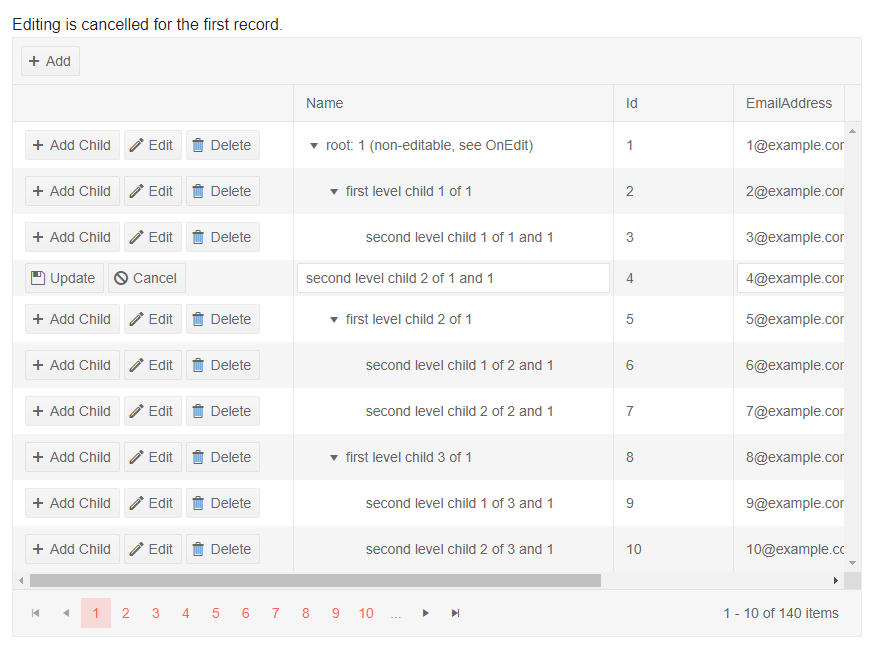

# TreeList Inline Editing

Inline editing lets the user click an [Edit command button]() on the row, and all its editable columns open up for changes. They can then click a `Save` command button to submit the changes to the data access layer. This fires the `OnUpdate` event of the treelist where your code receives the updated model so you can work with the data (for example, to call the appropriate method of your service).

In a similar fashion, the `Cancel` and `Delete` command buttons fire events on the treelist to let you handle the data source operations.

You can also cancel the events by setting the `IsCancelled` property of the event arguments to `true`. This lets you prevent the user from editing certain records, inserting or deleting items, based on your application logic.

To enable Inline editing in the treelist, set its `EditMode` property to `Telerik.Blazor.TreeListEditMode.Inline`, then handle the CRUD events as shown in the example below.


>caption The Command buttons and the treelist events let you handle data operations in Inline edit mode

````CSHTML
Editing is cancelled for the first record.
<br />

<TelerikTreeList Data="@Data"
                 EditMode="@TreeListEditMode.Inline"
                 OnUpdate="@UpdateItem"
                 OnDelete="@DeleteItem"
                 OnCreate="@CreateItem"
                 OnEdit="@OnEditHandler"
                 OnCancel="@OnCancelHandler"
                 Pageable="true" ItemsField="@(nameof(Employee.DirectReports))"
                 Width="850px">
    <TreeListToolBar>
        <TreeListCommandButton Command="Add" Icon="add">Add</TreeListCommandButton>
    </TreeListToolBar>
    <TreeListColumns>
        <TreeListCommandColumn Width="280px">
            <TreeListCommandButton Command="Add" Icon="@IconName.Plus">Add Child</TreeListCommandButton>
            <TreeListCommandButton Command="Edit" Icon="@IconName.Edit">Edit</TreeListCommandButton>
            <TreeListCommandButton Command="Delete" Icon="@IconName.Delete">Delete</TreeListCommandButton>
            <TreeListCommandButton Command="Save" Icon="@IconName.Save" ShowInEdit="true">Update</TreeListCommandButton>
            <TreeListCommandButton Command="Cancel" Icon="@IconName.Cancel" ShowInEdit="true">Cancel</TreeListCommandButton>
        </TreeListCommandColumn>

        <TreeListColumn Field="Name" Expandable="true" Width="320px" />
        <TreeListColumn Field="Id" Editable="false" Width="120px" />
        <TreeListColumn Field="EmailAddress" Width="220px" />
        <TreeListColumn Field="HireDate" Width="220px" />
    </TreeListColumns>
</TelerikTreeList>

@code {
    public List<Employee> Data { get; set; }

    // Sample CUD operations for the local data
    async Task UpdateItem(TreeListCommandEventArgs args)
    {
        var item = args.Item as Employee;

        // perform actual data source operations here through your service
        Employee updatedItem = await ServiceMimicUpdate(item);

        // update the local view-model data with the service data
        UpdateItemRecursive(Data, updatedItem);
    }

    async Task CreateItem(TreeListCommandEventArgs args)
    {
        var argsItem = args.Item as Employee;

        // perform actual data source operation here through your service
        Employee insertedItem = await ServiceMimicInsert(argsItem);

        // update the local view-model data with the service data
        InsertItemRecursive(Data, insertedItem, args);
    }

    async Task DeleteItem(TreeListCommandEventArgs args)
    {
        var item = args.Item as Employee;

        // perform actual data source operations here through your service
        bool isDeleted = await ServiceMimicDelete(item);

        if (isDeleted)
        {
            // update the local view-model data
            RemoveChildRecursive(Data, item);
        }
    }

    // sample helper methods for handling the view-model data hierarchy
    void InsertItemRecursive(List<Employee> Data, Employee insertedItem, TreeListCommandEventArgs args)
    {
        if (args.ParentItem != null)
        {
            var parent = (Employee)args.ParentItem;

            parent.HasChildren = true;
            if (parent.DirectReports == null)
            {
                parent.DirectReports = new List<Employee>();
            }

            parent.DirectReports.Insert(0, insertedItem);
        }
        else
        {
            Data.Insert(0, insertedItem);
        }
    }

    void UpdateItemRecursive(List<Employee> items, Employee itemToUpdate)
    {
        for (int i = 0; i < items.Count; i++)
        {
            if (items[i].Id.Equals(itemToUpdate.Id))
            {
                items[i] = itemToUpdate;
                return;
            }

            if (items[i].DirectReports?.Count > 0)
            {
                UpdateItemRecursive(items[i].DirectReports, itemToUpdate);
            }
        }
    }

    void RemoveChildRecursive(List<Employee> items, Employee item)
    {
        for (int i = 0; i < items.Count(); i++)
        {
            if (item.Equals(items[i]))
            {
                items.Remove(item);

                return;
            }
            else if (items[i].DirectReports?.Count > 0)
            {
                RemoveChildRecursive(items[i].DirectReports, item);

                if (items[i].DirectReports.Count == 0)
                {
                    items[i].HasChildren = false;
                }
            }
        }
    }

    // OnEdit handler

    async Task OnEditHandler(TreeListCommandEventArgs args)
    {
        Employee empl = args.Item as Employee;
        if (empl.Id == 1)
        {
            // prevent opening for edit based on condition
            args.IsCancelled = true;
            Console.WriteLine("You cannot edit this item");
        }
    }

    // OnCancel handler

    async Task OnCancelHandler(TreeListCommandEventArgs args)
    {
        Employee empl = args.Item as Employee;
        // if necessary, perform actual data source operation here through your service
    }

    // the following three methods mimic an actual data service that handles the actual data source
    // you can see about implement error and exception handling, determining suitable return types as per your needs

    async Task<Employee> ServiceMimicInsert(Employee itemToInsert)
    {
        // in this example, we just populate the fields, you project may use
        // something else or generate the updated item differently, we use "new" here
        Employee insertedItem = new Employee()
        {
            // the service assigns an ID, in this sample we use only the view-model data for simplicity,
            // you should use the actual data and set the properties as necessary (e.g., generate nested fields data and so on)
            Id = LastId++,
            Name = itemToInsert.Name,
            EmailAddress = itemToInsert.EmailAddress,
            HireDate = itemToInsert.HireDate,
            HasChildren = itemToInsert.HasChildren,
            DirectReports = itemToInsert.DirectReports
        };
        return await Task.FromResult(insertedItem);
    }

    async Task<Employee> ServiceMimicUpdate(Employee itemToUpdate)
    {
        // in this example, we just populate the fields, you project may use
        // something else or generate the updated item differently
        Employee updatedItem = new Employee()
        {
            Id = itemToUpdate.Id,
            Name = itemToUpdate.Name,
            EmailAddress = itemToUpdate.EmailAddress,
            HireDate = itemToUpdate.HireDate,
            HasChildren = itemToUpdate.HasChildren,
            DirectReports = itemToUpdate.DirectReports
        };
        return await Task.FromResult(updatedItem);
    }

    async Task<bool> ServiceMimicDelete(Employee itemToDelete)
    {
        return await Task.FromResult(true);//always successful
    }


    // sample model

    public class Employee
    {
        public int Id { get; set; }
        public string Name { get; set; }
        public string EmailAddress { get; set; }
        public DateTime HireDate { get; set; }

        public List<Employee> DirectReports { get; set; }
        public bool HasChildren { get; set; }

        // Used for the editing so replacing the object in the view-model data
        // will treat it as the same object and keep its state - otherwise it will
        // collapse after editing is done, which is not what the user would expect
        public override bool Equals(object obj)
        {
            if (obj is Employee)
            {
                return this.Id == (obj as Employee).Id;
            }
            return false;
        }
    }

    // data generation
    // used in this example for data generation and assigning an ID to newly inserted items
    public int LastId { get; set; } = 1;

    protected override async Task OnInitializedAsync()
    {
        Data = await GetTreeListData();
    }

    async Task<List<Employee>> GetTreeListData()
    {
        List<Employee> data = new List<Employee>();

        for (int i = 1; i < 15; i++)
        {
            Employee root = new Employee
            {
                Id = LastId,
                Name = $"root: {i}",
                EmailAddress = $"{i}@example.com",
                HireDate = DateTime.Now.AddYears(-i),
                DirectReports = new List<Employee>(),
                HasChildren = true
            };
            data.Add(root);
            LastId++;

            for (int j = 1; j < 4; j++)
            {
                int currId = LastId;
                Employee firstLevelChild = new Employee
                {
                    Id = currId,
                    Name = $"first level child {j} of {i}",
                    EmailAddress = $"{currId}@example.com",
                    HireDate = DateTime.Now.AddDays(-currId),
                    DirectReports = new List<Employee>(),
                    HasChildren = true
                };
                root.DirectReports.Add(firstLevelChild);
                LastId++;

                for (int k = 1; k < 3; k++)
                {
                    int nestedId = LastId;
                    firstLevelChild.DirectReports.Add(new Employee
                    {
                        Id = LastId,
                        Name = $"second level child {k} of {j} and {i}",
                        EmailAddress = $"{nestedId}@example.com",
                        HireDate = DateTime.Now.AddMinutes(-nestedId)
                    }); ;
                    LastId++;
                }
            }
        }

        data[0].Name += " (non-editable, see OnEdit)";

        return await Task.FromResult(data);
    }
}
````

>caption The result from the code snippet above, after the Edit button was clicked on the record with ID 4



>note It is up to the data access logic to save the data once it is changed in the data collection, or to revert changes. The example above showcases the events that allow you to do that. In a real application, the code for handling data operations may be entirely different.

## See Also

  * [Live Demo: TreeList Inline Editing](https://demos.telerik.com/blazor-ui/treelist/editing-inline)
   
