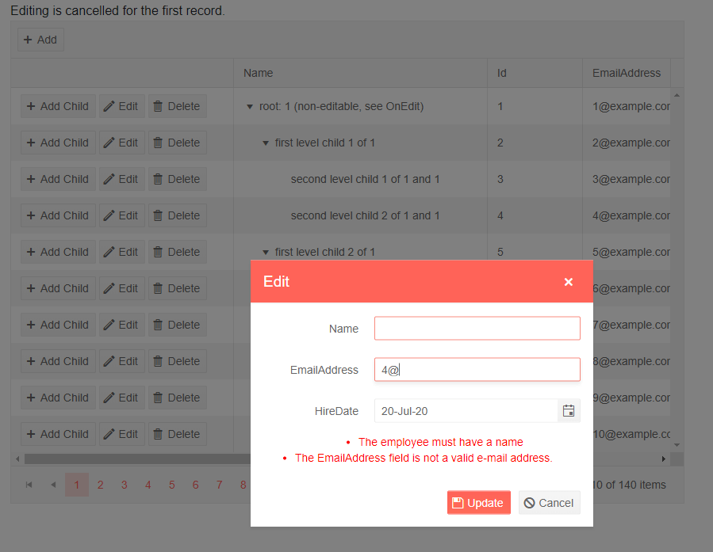

# TreeList PopUp Editing

Popup editing lets the user click an [Edit command button]() on the row, and a popup shows up with all its editable columns open up for changes. They can then click the `Save` button in the dialog to submit the changes to the model. This fires the `OnUpdate` event of the treelist where your code receives the updated model so you can work with the data (for example, to call the appropriate method of your service).

In a similar fashion, the `Cancel`, `Delete` command buttons and the `Add` toolbar button fire events on the treelist to let you handle the data source operations.

You can also cancel the events by setting the `IsCancelled` property of the event arguments to `true`. This lets you prevent the user from editing certain records, inserting or deleting items, based on your application logic.

To enable PopUp editing in the treelist, set its `EditMode` property to `Telerik.Blazor.TreeListEditMode.Popup`, then handle the CRUD events as shown in the example below.

The PopUp editing mode supports [validation](). To use it, all you need to do is decorate your model with the desired annotations. Validation errors will be shown in the popup and will prevent the Update operation.


>caption The Command buttons and the treelist events let you handle data operations in PopUp edit mode

````CSHTML
@using System.ComponentModel.DataAnnotations
@* Used for the model annotations only *@

Editing is cancelled for the first record.<br />

<TelerikTreeList Data="@Data"
                 EditMode="@TreeListEditMode.Popup"
                 OnUpdate="@UpdateItem"
                 OnDelete="@DeleteItem"
                 OnCreate="@CreateItem"
                 OnEdit="@OnEditHandler"
                 OnCancel="@OnCancelHandler"
                 Pageable="true" ItemsField="@(nameof(Employee.DirectReports))"
                 Width="850px">
    <TreeListToolBar>
        <TreeListCommandButton Command="Add" Icon="add">Add</TreeListCommandButton>
    </TreeListToolBar>
    <TreeListColumns>
        <TreeListCommandColumn Width="280px">
            <TreeListCommandButton Command="Add" Icon="@IconName.Plus">Add Child</TreeListCommandButton>
            <TreeListCommandButton Command="Edit" Icon="@IconName.Edit">Edit</TreeListCommandButton>
            <TreeListCommandButton Command="Delete" Icon="@IconName.Delete">Delete</TreeListCommandButton>
            <TreeListCommandButton Command="Save" Icon="@IconName.Save" ShowInEdit="true">Update</TreeListCommandButton>
            <TreeListCommandButton Command="Cancel" Icon="@IconName.Cancel" ShowInEdit="true">Cancel</TreeListCommandButton>
        </TreeListCommandColumn>

        <TreeListColumn Field="Name" Expandable="true" Width="320px" />
        <TreeListColumn Field="Id" Editable="false" Width="120px" />
        <TreeListColumn Field="EmailAddress" Width="220px" />
        <TreeListColumn Field="HireDate" Width="220px" />
    </TreeListColumns>
</TelerikTreeList>

@code {
    public List<Employee> Data { get; set; }

    // used in this example for data generation and retrieval for CUD operations on the current view-model data
    public int LastId { get; set; } = 1;

    // Sample CUD operations for the local data
    async Task UpdateItem(TreeListCommandEventArgs args)
    {
        var item = args.Item as Employee;

        // perform actual data source operations here through your service

        // if the treelist Data is not tied to the service, you may need to update the local view data too
        var foundItem = FindItemRecursive(Data, item.Id);
        if (foundItem != null)
        {
            foundItem.Name = item.Name;
            foundItem.HireDate = item.HireDate;
            foundItem.EmailAddress = item.EmailAddress;
        }
    }

    async Task CreateItem(TreeListCommandEventArgs args)
    {
        var argsItem = args.Item as Employee;

        // perform actual data source operations here through your service

        // if the treelist Data is not tied to the service, you may need to update the local view data too
        argsItem.Id = LastId++;

        if (args.ParentItem != null)
        {
            var parent = (Employee)args.ParentItem;

            parent.HasChildren = true;
            if (parent.DirectReports == null)
            {
                parent.DirectReports = new List<Employee>();
            }

            parent.DirectReports.Insert(0, argsItem);
        }
        else
        {
            Data.Insert(0, argsItem);
        }
    }

    async Task DeleteItem(TreeListCommandEventArgs args)
    {
        var item = args.Item as Employee;

        // perform actual data source operations here through your service

        // if the treelist Data is not tied to the service, you may need to update the local view data too
        RemoveChildRecursive(Data, item);
    }

    // sample helper methods for handling the view-model data hierarchy

    private Employee FindItemRecursive(List<Employee> items, int id)
    {
        foreach (var item in items)
        {
            if (item.Id.Equals(id))
            {
                return item;
            }

            if (item.DirectReports?.Count > 0)
            {
                var childItem = FindItemRecursive(item.DirectReports, id);

                if (childItem != null)
                {
                    return childItem;
                }
            }
        }

        return null;
    }

    private void RemoveChildRecursive(List<Employee> items, Employee item)
    {
        for (int i = 0; i < items.Count(); i++)
        {
            if (item.Equals(items[i]))
            {
                items.Remove(item);

                return;
            }
            else if (items[i].DirectReports?.Count > 0)
            {
                RemoveChildRecursive(items[i].DirectReports, item);

                if (items[i].DirectReports.Count == 0)
                {
                    items[i].HasChildren = false;
                }
            }
        }
    }

    // OnEdit handler

    async Task OnEditHandler(TreeListCommandEventArgs args)
    {
        Employee empl = args.Item as Employee;
        if (empl.Id == 1)
        {
            // prevent opening for edit based on condition
            args.IsCancelled = true;
            Console.WriteLine("You cannot edit this item");
        }
    }

    // OnCancel handler

    async Task OnCancelHandler(TreeListCommandEventArgs args)
    {
        Employee empl = args.Item as Employee;
        // if necessary, perform actual data source operation here through your service
    }

    // sample model

    public class Employee
    {
        public int Id { get; set; }

        [Required(ErrorMessage = "The employee must have a name")]
        public string Name { get; set; }
        [EmailAddress]
        public string EmailAddress { get; set; }
        public DateTime HireDate { get; set; }

        public List<Employee> DirectReports { get; set; }
        public bool HasChildren { get; set; }
    }

    // data generation

    protected override async Task OnInitializedAsync()
    {
        Data = await GetTreeListData();
    }

    async Task<List<Employee>> GetTreeListData()
    {
        List<Employee> data = new List<Employee>();

        for (int i = 1; i < 15; i++)
        {
            Employee root = new Employee
            {
                Id = LastId,
                Name = $"root: {i}",
                EmailAddress = $"{i}@example.com",
                HireDate = DateTime.Now.AddYears(-i),
                DirectReports = new List<Employee>(),
                HasChildren = true
            };
            data.Add(root);
            LastId++;

            for (int j = 1; j < 4; j++)
            {
                int currId = LastId;
                Employee firstLevelChild = new Employee
                {
                    Id = currId,
                    Name = $"first level child {j} of {i}",
                    EmailAddress = $"{currId}@example.com",
                    HireDate = DateTime.Now.AddDays(-currId),
                    DirectReports = new List<Employee>(),
                    HasChildren = true
                };
                root.DirectReports.Add(firstLevelChild);
                LastId++;

                for (int k = 1; k < 3; k++)
                {
                    int nestedId = LastId;
                    firstLevelChild.DirectReports.Add(new Employee
                    {
                        Id = LastId,
                        Name = $"second level child {k} of {j} and {i}",
                        EmailAddress = $"{nestedId}@example.com",
                        HireDate = DateTime.Now.AddMinutes(-nestedId)
                    }); ;
                    LastId++;
                }
            }
        }

        data[0].Name += " (non-editable, see OnEdit)";

        return await Task.FromResult(data);
    }
}
````

>caption The result from the code snippet above, after the Edit button was clicked on the row with ID 4, and validation errors are made



>note It is up to the data access logic to save the data once it is changed in the data collection, or to revert changes. The example above showcases the events that allow you to do that. In a real application, the code for handling data operations may be entirely different.

## See Also

  * [Live Demo: TreeList PopUp Editing](https://demos.telerik.com/blazor-ui/treelist/editing-popup)
  * [Custom Editor Template Per Field]()

