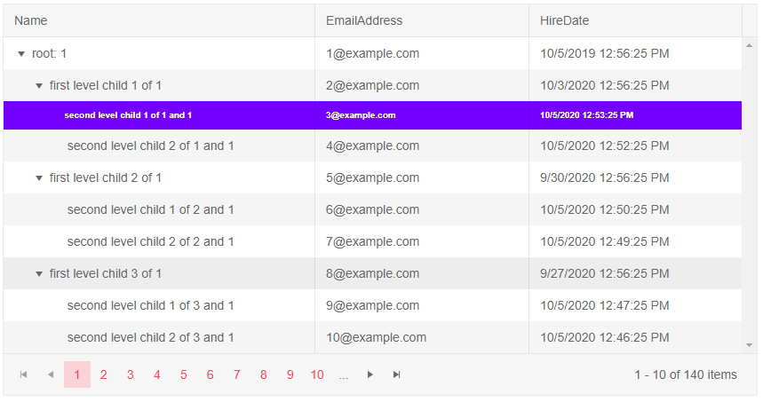

# TreeList Events

This article explains the events available in the Telerik TreeList for Blazor. They are grouped logically.

* [CUD Events](#cud-events) - events related to Creating, Updating and Deleting items
* [Other Events](#other-events) - other events the treelist provides
    * [OnExpand and OnCollapse](#onexpand-and-oncollapse)
	* [Command Button Click](#command-button-click)
	* [SelectedItemsChanged](#selecteditemschanged)
	* [OnModelInit](#onmodelinit)
	* [OnRowRender](#onrowrender)
	* [OnRowDrop](#onrowdrop)
	* [PageChanged](#pagechanged)

## CUD Events

The `OnCreate`, `OnUpdate` and `OnDelete` events let you get the data item that the user changed so you can transfer the user action to the actual data source.

The `OnEdit` and `OnCancel` events let you respond to user actions - when they want to edit an item and when they want to cancel changes on an item they have been editing. You can use them to, for example, prevent editing of certain items based on some condition.

You can read more about the CUD events in the [Editing Overview]() article.

## Other Events

### OnExpand and OnCollapse

The `OnExpand` event fires when the user clicks the expand arrow on a row that has children but they are collapsed. It receives arguments of type `TreeListExpandEventArgs<T>` where `T` is the model you bind the treelist to, and the `Item` field in the event arguments is the current model.


You can use `OnExpand` to know the user action and/or to [load data on demand]().

The `OnCollapse` event fires when the user collapses an expanded row through the collapse arrow. It receives arguments of type `TreeListCollapseEventArgs<T>` where `T` is the model you bind the treelist to, and the `Item` field in the event arguments is the current model.

@[template](/_contentTemplates/common/general-info.md#rerender-after-event)

>caption Handle OnExpand and OnCollapse

````CSHTML
@lastAction

<TelerikTreeList Data="@Data"
                 ItemsField="@(nameof(Employee.DirectReports))"

                 OnExpand="@((TreeListExpandEventArgs<Employee> args) => OnExpand(args))"
                 OnCollapse="@((TreeListCollapseEventArgs<Employee> args) => OnCollapse(args))"

                 Pageable="true" Width="850px">
    <TreeListColumns>
        <TreeListColumn Field="Name" Expandable="true" Width="320px" />
        <TreeListColumn Field="Id" Editable="false" Width="120px" />
        <TreeListColumn Field="EmailAddress" Width="220px" />
        <TreeListColumn Field="HireDate" Width="220px" />
    </TreeListColumns>
</TelerikTreeList>

@code {
    public List<Employee> Data { get; set; }

    string lastAction { get; set; }

    // get when the user expands an item
    async Task OnExpand(TreeListExpandEventArgs<Employee> args)
    {
        Employee currRow = args.Item;
        lastAction = $"The user expanded {currRow.Name} with ID {currRow.Id}";
    }

    // get when the user collapses an item
    async Task OnCollapse(TreeListCollapseEventArgs<Employee> args)
    {
        Employee currRow = args.Item;
        lastAction = $"The user collapsed {currRow.Name} with ID {currRow.Id}";
    }

    // sample model

    public class Employee
    {
        // hierarchical data collections
        public List<Employee> DirectReports { get; set; }

        // data fields for display
        public int Id { get; set; }
        public string Name { get; set; }
        public string EmailAddress { get; set; }
        public DateTime HireDate { get; set; }
    }

    // data generation

    // used in this example for data generation and retrieval for CUD operations on the current view-model data
    public int LastId { get; set; } = 1;

    protected override async Task OnInitializedAsync()
    {
        Data = await GetTreeListData();
    }

    async Task<List<Employee>> GetTreeListData()
    {
        List<Employee> data = new List<Employee>();

        for (int i = 1; i < 15; i++)
        {
            Employee root = new Employee
            {
                Id = LastId,
                Name = $"root: {i}",
                EmailAddress = $"{i}@example.com",
                HireDate = DateTime.Now.AddYears(-i),
                DirectReports = new List<Employee>(), // prepare a collection for the child items, will be populated later in the code
            };
            data.Add(root);
            LastId++;

            for (int j = 1; j < 4; j++)
            {
                int currId = LastId;
                Employee firstLevelChild = new Employee
                {
                    Id = currId,
                    Name = $"first level child {j} of {i}",
                    EmailAddress = $"{currId}@example.com",
                    HireDate = DateTime.Now.AddDays(-currId),
                    DirectReports = new List<Employee>(), // collection for child nodes
                };
                root.DirectReports.Add(firstLevelChild); // populate the parent's collection
                LastId++;

                for (int k = 1; k < 3; k++)
                {
                    int nestedId = LastId;
                    // populate the parent's collection
                    firstLevelChild.DirectReports.Add(new Employee
                    {
                        Id = LastId,
                        Name = $"second level child {k} of {j} and {i}",
                        EmailAddress = $"{nestedId}@example.com",
                        HireDate = DateTime.Now.AddMinutes(-nestedId)
                    }); ;
                    LastId++;
                }
            }
        }

        return await Task.FromResult(data);
    }
}
````


### Command Button Click

The command buttons of a treelist provide an `OnClick` event before firing their built-in command (such as opening a row for editing, or adding a new row). You can do this to implement some additional logic and to also handle custom commands - both from a [Command Column](), and from a [Toolbar Button]().

### SelectedItemsChanged

Fires when the item selection is enabled and the user changes the selected [item](#selecteditemschanged-event) or [items](#selecteditemschanged-event).

### OnModelInit

@[template](/_contentTemplates/common/onmodelinit.md#onmodelinit-info)

>caption The different use-cases of the OnModelInit event

````NoParameterlessConstructor
@* Bind the TreeList to a class without a parameterless constructor *@

@using System.ComponentModel.DataAnnotations

<TelerikTreeList Data="@Data"
                 EditMode="@TreeListEditMode.Popup"
                 OnModelInit="@OnModelInitHandler"
                 OnUpdate="@UpdateItem"
                 OnDelete="@DeleteItem"
                 OnCreate="@CreateItem"
                 OnCancel="@OnCancelHandler"
                 Pageable="true" ItemsField="@(nameof(Employee.DirectReports))"
                 Width="850px">
    <TreeListToolBar>
        <TreeListCommandButton Command="Add" Icon="add">Add</TreeListCommandButton>
    </TreeListToolBar>
    <TreeListColumns>
        <TreeListCommandColumn Width="280px">
            <TreeListCommandButton Command="Add" Icon="plus">Add Child</TreeListCommandButton>
            <TreeListCommandButton Command="Edit" Icon="edit">Edit</TreeListCommandButton>
            <TreeListCommandButton Command="Delete" Icon="delete">Delete</TreeListCommandButton>
            <TreeListCommandButton Command="Save" Icon="save" ShowInEdit="true">Update</TreeListCommandButton>
            <TreeListCommandButton Command="Cancel" Icon="cancel" ShowInEdit="true">Cancel</TreeListCommandButton>
        </TreeListCommandColumn>

        <TreeListColumn Field="Name" Expandable="true" Width="320px" />
        <TreeListColumn Field="Id" Editable="false" Width="120px" />
        <TreeListColumn Field="EmailAddress" Width="220px" />
        <TreeListColumn Field="HireDate" Width="220px" />
    </TreeListColumns>
</TelerikTreeList>


@code {
    public List<Employee> Data { get; set; }

    private Employee OnModelInitHandler()
    {
        return new Employee(1, "Test", "email@email.com", DateTime.Today, null, false);
    }

    // Sample CUD operations for the local data
    async Task UpdateItem(TreeListCommandEventArgs args)
    {
        var item = args.Item as Employee;

        // perform actual data source operations here through your service
        await MyService.Update(item);

        // update the local view-model data with the service data
        await GetTreeListData();
    }

    async Task CreateItem(TreeListCommandEventArgs args)
    {
        var item = args.Item as Employee;
        var parentItem = args.ParentItem as Employee;

        // perform actual data source operations here through your service
        await MyService.Create(item, parentItem);

        // update the local view-model data with the service data
        await GetTreeListData();
    }

    async Task DeleteItem(TreeListCommandEventArgs args)
    {
        var item = args.Item as Employee;

        // perform actual data source operations here through your service
        await MyService.Delete(item);

        // update the local view-model data with the service data
        await GetTreeListData();
    }

    // OnCancel handler

    async Task OnCancelHandler(TreeListCommandEventArgs args)
    {
        Employee empl = args.Item as Employee;
        // if necessary, perform actual data source operation here through your service
    }


    // sample model

    public class Employee
    {
        public int Id { get; set; }

        [Required(ErrorMessage = "The employee must have a name")]
        public string Name { get; set; }
        [EmailAddress]
        public string EmailAddress { get; set; }
        public DateTime HireDate { get; set; }

        public List<Employee> DirectReports { get; set; }
        public bool HasChildren { get; set; }

        public Employee(int id, string name, string email, DateTime date, List<Employee> reports, bool hasChildren)
        {
            Id = id;
            Name = name;
            EmailAddress = email;
            HireDate = date;
            DirectReports = reports;
            HasChildren = hasChildren;
        }

        // Used for the editing so replacing the object in the view-model data
        // will treat it as the same object and keep its state - otherwise it will
        // collapse after editing is done, which is not what the user would expect
        public override bool Equals(object obj)
        {
            if (obj is Employee)
            {
                return this.Id == (obj as Employee).Id;
            }
            return false;
        }
    }

    // data generation

    async Task GetTreeListData()
    {
        Data = await MyService.Read();
    }

    protected override async Task OnInitializedAsync()
    {
        await GetTreeListData();
    }

    // the following static class mimics an actual data service that handles the actual data source
    // replace it with your actual service through the DI, this only mimics how the API can look like and works for this standalone page
    public static class MyService
    {
        private static List<Employee> _data { get; set; } = new List<Employee>();
        // used in this example for data generation and retrieval for CUD operations on the current view-model data
        private static int LastId { get; set; } = 1;

        public static async Task Create(Employee itemToInsert, Employee parentItem)
        {
            InsertItemRecursive(_data, itemToInsert, parentItem);
        }

        public static async Task<List<Employee>> Read()
        {
            if (_data.Count < 1)
            {
                for (int i = 1; i < 15; i++)
                {
                    Employee root = new Employee(LastId, $"root: {i}", $"{i}@example.com", DateTime.Now.AddYears(-i), new List<Employee>(), true);

                    _data.Add(root);

                    LastId++;

                    for (int j = 1; j < 4; j++)
                    {
                        int currId = LastId;

                        Employee firstLevelChild = new Employee(currId, $"first level child {j} of {i}", $"{currId}@example.com", DateTime.Now.AddDays(-currId), new List<Employee>(), true);

                        root.DirectReports.Add(firstLevelChild);
                        LastId++;

                        for (int k = 1; k < 3; k++)
                        {
                            int nestedId = LastId;

                            firstLevelChild.DirectReports.Add(new Employee(LastId, $"second level child {k} of {j} and {i}", $"{nestedId}@example.com", DateTime.Now.AddMinutes(-nestedId), null, false));
                        }
                    }
                }
            }

            return await Task.FromResult(_data);
        }

        public static async Task Update(Employee itemToUpdate)
        {
            UpdateItemRecursive(_data, itemToUpdate);
        }

        public static async Task Delete(Employee itemToDelete)
        {
            RemoveChildRecursive(_data, itemToDelete);
        }

        // sample helper methods for handling the view-model data hierarchy
        static void UpdateItemRecursive(List<Employee> items, Employee itemToUpdate)
        {
            for (int i = 0; i < items.Count; i++)
            {
                if (items[i].Id.Equals(itemToUpdate.Id))
                {
                    items[i] = itemToUpdate;
                    return;
                }

                if (items[i].DirectReports?.Count > 0)
                {
                    UpdateItemRecursive(items[i].DirectReports, itemToUpdate);
                }
            }
        }

        static void RemoveChildRecursive(List<Employee> items, Employee item)
        {
            for (int i = 0; i < items.Count(); i++)
            {
                if (item.Equals(items[i]))
                {
                    items.Remove(item);

                    return;
                }
                else if (items[i].DirectReports?.Count > 0)
                {
                    RemoveChildRecursive(items[i].DirectReports, item);

                    if (items[i].DirectReports.Count == 0)
                    {
                        items[i].HasChildren = false;
                    }
                }
            }
        }

        static void InsertItemRecursive(List<Employee> Data, Employee insertedItem, Employee parentItem)
        {
            insertedItem.Id = LastId++;
            if (parentItem != null)
            {
                parentItem.HasChildren = true;
                if (parentItem.DirectReports == null)
                {
                    parentItem.DirectReports = new List<Employee>();
                }

                parentItem.DirectReports.Insert(0, insertedItem);
            }
            else
            {
                Data.Insert(0, insertedItem);
            }
        }
    }
}
````
````Interface
@* Bind the TreeList to an interface *@

@using System.ComponentModel.DataAnnotations

<TelerikTreeList Data="@Data"
                 EditMode="@TreeListEditMode.Popup"
                 OnModelInit="@OnModelInitHandler"
                 OnUpdate="@UpdateItem"
                 OnDelete="@DeleteItem"
                 OnCreate="@CreateItem"
                 OnCancel="@OnCancelHandler"
                 Pageable="true" ItemsField="@(nameof(Employee.DirectReports))"
                 Width="850px">
    <TreeListToolBar>
        <TreeListCommandButton Command="Add" Icon="add">Add</TreeListCommandButton>
    </TreeListToolBar>
    <TreeListColumns>
        <TreeListCommandColumn Width="280px">
            <TreeListCommandButton Command="Add" Icon="plus">Add Child</TreeListCommandButton>
            <TreeListCommandButton Command="Edit" Icon="edit">Edit</TreeListCommandButton>
            <TreeListCommandButton Command="Delete" Icon="delete">Delete</TreeListCommandButton>
            <TreeListCommandButton Command="Save" Icon="save" ShowInEdit="true">Update</TreeListCommandButton>
            <TreeListCommandButton Command="Cancel" Icon="cancel" ShowInEdit="true">Cancel</TreeListCommandButton>
        </TreeListCommandColumn>

        <TreeListColumn Field="Name" Expandable="true" Width="320px" />
        <TreeListColumn Field="Id" Editable="false" Width="120px" />
        <TreeListColumn Field="EmailAddress" Width="220px" />
        <TreeListColumn Field="HireDate" Width="220px" />
    </TreeListColumns>
</TelerikTreeList>


@code {
    public List<IEmployee> Data { get; set; }

    private Employee OnModelInitHandler()
    {
        return new Employee(1, "Test", "email@email.com", DateTime.Today, null, false);
    }

    // Sample CUD operations for the local data
    async Task UpdateItem(TreeListCommandEventArgs args)
    {
        var item = args.Item as Employee;

        // perform actual data source operations here through your service
        await MyService.Update(item);

        // update the local view-model data with the service data
        await GetTreeListData();
    }

    async Task CreateItem(TreeListCommandEventArgs args)
    {
        var item = args.Item as Employee;
        var parentItem = args.ParentItem as Employee;

        // perform actual data source operations here through your service
        await MyService.Create(item, parentItem);

        // update the local view-model data with the service data
        await GetTreeListData();
    }

    async Task DeleteItem(TreeListCommandEventArgs args)
    {
        var item = args.Item as Employee;

        // perform actual data source operations here through your service
        await MyService.Delete(item);

        // update the local view-model data with the service data
        await GetTreeListData();
    }

    // OnCancel handler

    async Task OnCancelHandler(TreeListCommandEventArgs args)
    {
        Employee empl = args.Item as Employee;
        // if necessary, perform actual data source operation here through your service
    }


    // sample model
    public interface IEmployee
    {
        public int Id { get; set; }
        public string Name { get; set; }
        public string EmailAddress { get; set; }
        public DateTime HireDate { get; set; }

        public List<IEmployee> DirectReports { get; set; }
        public bool HasChildren { get; set; }
    }

    public class Employee : IEmployee
    {
        public int Id { get; set; }

        [Required(ErrorMessage = "The employee must have a name")]
        public string Name { get; set; }
        [EmailAddress]
        public string EmailAddress { get; set; }
        public DateTime HireDate { get; set; }

        public List<IEmployee> DirectReports { get; set; }
        public bool HasChildren { get; set; }

        public Employee(int id, string name, string email, DateTime date, List<IEmployee> reports, bool hasChildren)
        {
            Id = id;
            Name = name;
            EmailAddress = email;
            HireDate = date;
            DirectReports = reports;
            HasChildren = hasChildren;
        }

        // Used for the editing so replacing the object in the view-model data
        // will treat it as the same object and keep its state - otherwise it will
        // collapse after editing is done, which is not what the user would expect
        public override bool Equals(object obj)
        {
            if (obj is Employee)
            {
                return this.Id == (obj as Employee).Id;
            }
            return false;
        }
    }

    // data generation

    async Task GetTreeListData()
    {
        Data = await MyService.Read();
    }

    protected override async Task OnInitializedAsync()
    {
        await GetTreeListData();
    }

    // the following static class mimics an actual data service that handles the actual data source
    // replace it with your actual service through the DI, this only mimics how the API can look like and works for this standalone page
    public static class MyService
    {
        private static List<IEmployee> _data { get; set; } = new List<IEmployee>();
        // used in this example for data generation and retrieval for CUD operations on the current view-model data
        private static int LastId { get; set; } = 1;

        public static async Task Create(Employee itemToInsert, Employee parentItem)
        {
            InsertItemRecursive(_data, itemToInsert, parentItem);
        }

        public static async Task<List<IEmployee>> Read()
        {
            if (_data.Count < 1)
            {
                for (int i = 1; i < 15; i++)
                {
                    Employee root = new Employee(LastId, $"root: {i}", $"{i}@example.com", DateTime.Now.AddYears(-i), new List<IEmployee>(), true);

                    _data.Add(root);

                    LastId++;

                    for (int j = 1; j < 4; j++)
                    {
                        int currId = LastId;

                        Employee firstLevelChild = new Employee(currId, $"first level child {j} of {i}", $"{currId}@example.com", DateTime.Now.AddDays(-currId), new List<IEmployee>(), true);

                        root.DirectReports.Add(firstLevelChild);
                        LastId++;

                        for (int k = 1; k < 3; k++)
                        {
                            int nestedId = LastId;

                            firstLevelChild.DirectReports.Add(new Employee(LastId, $"second level child {k} of {j} and {i}", $"{nestedId}@example.com", DateTime.Now.AddMinutes(-nestedId), null, false));
                        }
                    }
                }
            }

            return await Task.FromResult(_data);
        }

        public static async Task Update(Employee itemToUpdate)
        {
            UpdateItemRecursive(_data, itemToUpdate);
        }

        public static async Task Delete(Employee itemToDelete)
        {
            RemoveChildRecursive(_data, itemToDelete);
        }

        // sample helper methods for handling the view-model data hierarchy
        static void UpdateItemRecursive(List<IEmployee> items, Employee itemToUpdate)
        {
            for (int i = 0; i < items.Count; i++)
            {
                if (items[i].Id.Equals(itemToUpdate.Id))
                {
                    items[i] = itemToUpdate;
                    return;
                }

                if (items[i].DirectReports?.Count > 0)
                {
                    UpdateItemRecursive(items[i].DirectReports, itemToUpdate);
                }
            }
        }

        static void RemoveChildRecursive(List<IEmployee> items, Employee item)
        {
            for (int i = 0; i < items.Count(); i++)
            {
                if (item.Equals(items[i]))
                {
                    items.Remove(item);

                    return;
                }
                else if (items[i].DirectReports?.Count > 0)
                {
                    RemoveChildRecursive(items[i].DirectReports, item);

                    if (items[i].DirectReports.Count == 0)
                    {
                        items[i].HasChildren = false;
                    }
                }
            }
        }

        static void InsertItemRecursive(List<IEmployee> Data, Employee insertedItem, Employee parentItem)
        {
            insertedItem.Id = LastId++;
            if (parentItem != null)
            {
                parentItem.HasChildren = true;
                if (parentItem.DirectReports == null)
                {
                    parentItem.DirectReports = new List<IEmployee>();
                }

                parentItem.DirectReports.Insert(0, insertedItem);
            }
            else
            {
                Data.Insert(0, insertedItem);
            }
        }
    }
}
````
````AbstractClass
@* Bind the TreeList to an abstract class *@

@using System.ComponentModel.DataAnnotations

<TelerikTreeList Data="@Data"
                 EditMode="@TreeListEditMode.Popup"
                 OnModelInit="@OnModelInitHandler"
                 OnUpdate="@UpdateItem"
                 OnDelete="@DeleteItem"
                 OnCreate="@CreateItem"
                 OnCancel="@OnCancelHandler"
                 Pageable="true" ItemsField="@(nameof(Employee.DirectReports))"
                 Width="850px">
    <TreeListToolBar>
        <TreeListCommandButton Command="Add" Icon="add">Add</TreeListCommandButton>
    </TreeListToolBar>
    <TreeListColumns>
        <TreeListCommandColumn Width="280px">
            <TreeListCommandButton Command="Add" Icon="plus">Add Child</TreeListCommandButton>
            <TreeListCommandButton Command="Edit" Icon="edit">Edit</TreeListCommandButton>
            <TreeListCommandButton Command="Delete" Icon="delete">Delete</TreeListCommandButton>
            <TreeListCommandButton Command="Save" Icon="save" ShowInEdit="true">Update</TreeListCommandButton>
            <TreeListCommandButton Command="Cancel" Icon="cancel" ShowInEdit="true">Cancel</TreeListCommandButton>
        </TreeListCommandColumn>

        <TreeListColumn Field="Name" Expandable="true" Width="320px" />
        <TreeListColumn Field="Id" Editable="false" Width="120px" />
        <TreeListColumn Field="EmailAddress" Width="220px" />
        <TreeListColumn Field="HireDate" Width="220px" />
    </TreeListColumns>
</TelerikTreeList>


@code {
    public List<EmployeeBase> Data { get; set; }

    private Employee OnModelInitHandler()
    {
        return new Employee(1, "Test", "email@email.com", DateTime.Today, null, false);
    }

    // Sample CUD operations for the local data
    async Task UpdateItem(TreeListCommandEventArgs args)
    {
        var item = args.Item as Employee;

        // perform actual data source operations here through your service
        await MyService.Update(item);

        // update the local view-model data with the service data
        await GetTreeListData();
    }

    async Task CreateItem(TreeListCommandEventArgs args)
    {
        var item = args.Item as Employee;
        var parentItem = args.ParentItem as Employee;

        // perform actual data source operations here through your service
        await MyService.Create(item, parentItem);

        // update the local view-model data with the service data
        await GetTreeListData();
    }

    async Task DeleteItem(TreeListCommandEventArgs args)
    {
        var item = args.Item as Employee;

        // perform actual data source operations here through your service
        await MyService.Delete(item);

        // update the local view-model data with the service data
        await GetTreeListData();
    }

    // OnCancel handler

    async Task OnCancelHandler(TreeListCommandEventArgs args)
    {
        Employee empl = args.Item as Employee;
        // if necessary, perform actual data source operation here through your service
    }


    // sample model
    public abstract class EmployeeBase
    {
        public int Id { get; set; }
        public string Name { get; set; }
        public string EmailAddress { get; set; }
        public DateTime HireDate { get; set; }

        public List<EmployeeBase> DirectReports { get; set; }
        public bool HasChildren { get; set; }
    }

    public class Employee : EmployeeBase
    {
        public Employee(int id, string name, string email, DateTime date, List<EmployeeBase> reports, bool hasChildren)
        {
            Id = id;
            Name = name;
            EmailAddress = email;
            HireDate = date;
            DirectReports = reports;
            HasChildren = hasChildren;
        }

        // Used for the editing so replacing the object in the view-model data
        // will treat it as the same object and keep its state - otherwise it will
        // collapse after editing is done, which is not what the user would expect
        public override bool Equals(object obj)
        {
            if (obj is Employee)
            {
                return this.Id == (obj as Employee).Id;
            }
            return false;
        }
    }

    // data generation

    async Task GetTreeListData()
    {
        Data = await MyService.Read();
    }

    protected override async Task OnInitializedAsync()
    {
        await GetTreeListData();
    }

    // the following static class mimics an actual data service that handles the actual data source
    // replace it with your actual service through the DI, this only mimics how the API can look like and works for this standalone page
    public static class MyService
    {
        private static List<EmployeeBase> _data { get; set; } = new List<EmployeeBase>();
        // used in this example for data generation and retrieval for CUD operations on the current view-model data
        private static int LastId { get; set; } = 1;

        public static async Task Create(Employee itemToInsert, Employee parentItem)
        {
            InsertItemRecursive(_data, itemToInsert, parentItem);
        }

        public static async Task<List<EmployeeBase>> Read()
        {
            if (_data.Count < 1)
            {
                for (int i = 1; i < 15; i++)
                {
                    Employee root = new Employee(LastId, $"root: {i}", $"{i}@example.com", DateTime.Now.AddYears(-i), new List<EmployeeBase>(), true);

                    _data.Add(root);

                    LastId++;

                    for (int j = 1; j < 4; j++)
                    {
                        int currId = LastId;

                        Employee firstLevelChild = new Employee(currId, $"first level child {j} of {i}", $"{currId}@example.com", DateTime.Now.AddDays(-currId), new List<EmployeeBase>(), true);

                        root.DirectReports.Add(firstLevelChild);
                        LastId++;

                        for (int k = 1; k < 3; k++)
                        {
                            int nestedId = LastId;

                            firstLevelChild.DirectReports.Add(new Employee(LastId, $"second level child {k} of {j} and {i}", $"{nestedId}@example.com", DateTime.Now.AddMinutes(-nestedId), null, false));
                        }
                    }
                }
            }

            return await Task.FromResult(_data);
        }

        public static async Task Update(Employee itemToUpdate)
        {
            UpdateItemRecursive(_data, itemToUpdate);
        }

        public static async Task Delete(Employee itemToDelete)
        {
            RemoveChildRecursive(_data, itemToDelete);
        }

        // sample helper methods for handling the view-model data hierarchy
        static void UpdateItemRecursive(List<EmployeeBase> items, Employee itemToUpdate)
        {
            for (int i = 0; i < items.Count; i++)
            {
                if (items[i].Id.Equals(itemToUpdate.Id))
                {
                    items[i] = itemToUpdate;
                    return;
                }

                if (items[i].DirectReports?.Count > 0)
                {
                    UpdateItemRecursive(items[i].DirectReports, itemToUpdate);
                }
            }
        }

        static void RemoveChildRecursive(List<EmployeeBase> items, Employee item)
        {
            for (int i = 0; i < items.Count(); i++)
            {
                if (item.Equals(items[i]))
                {
                    items.Remove(item);

                    return;
                }
                else if (items[i].DirectReports?.Count > 0)
                {
                    RemoveChildRecursive(items[i].DirectReports, item);

                    if (items[i].DirectReports.Count == 0)
                    {
                        items[i].HasChildren = false;
                    }
                }
            }
        }

        static void InsertItemRecursive(List<EmployeeBase> Data, Employee insertedItem, Employee parentItem)
        {
            insertedItem.Id = LastId++;
            if (parentItem != null)
            {
                parentItem.HasChildren = true;
                if (parentItem.DirectReports == null)
                {
                    parentItem.DirectReports = new List<EmployeeBase>();
                }

                parentItem.DirectReports.Insert(0, insertedItem);
            }
            else
            {
                Data.Insert(0, insertedItem);
            }
        }
    }
}
````

### OnRowRender

This event fires upon the rendering of the TreeList rows. It receives an argument of type `TreeListRowRenderEventArgs` which exposes the following fields:

* `Item` - an object you can cast to your model class to obtain the current data item.
* `Class` - the CSS class that will be applied to the rows of the TreeList. The CSS rules that are set for that class will be visibly rendered on the TreeList rows.

>caption Use the OnRowRender event to apply custom format to TreeList rows based on certain condition

````CSHTML
@* Conditional styling/formatting for a row *@

<style>
    .k-treelist tr.myCustomTreeListRowFormatting,
    .k-treelist tr.myCustomTreeListRowFormatting:hover {
        background-color: blue;
        color: white;
        font-size: 10px;
        font-weight: bolder;
    }
</style>

<TelerikTreeList Data="@Data"
                 ItemsField="@(nameof(Employee.DirectReports))"
                 Pageable="true" Width="850px" OnRowRender="@OnRowRenderHandler">
    <TreeListColumns>
        <TreeListColumn Field="Name" Expandable="true" Width="320px" />
        <TreeListColumn Field="Id" Width="120px" Visible="false" />
        <TreeListColumn Field="EmailAddress" Width="220px" />
        <TreeListColumn Field="HireDate" Width="220px" />
    </TreeListColumns>
</TelerikTreeList>

@code {
    void OnRowRenderHandler(TreeListRowRenderEventArgs args)
    {
        var item = args.Item as Employee;

        if (item.Id.Equals(3))
        {
            args.Class = "myCustomTreeListRowFormatting";
        }
    }

    public List<Employee> Data { get; set; }

    public class Employee
    {
        public List<Employee> DirectReports { get; set; }

        public int Id { get; set; }
        public string Name { get; set; }
        public string EmailAddress { get; set; }
        public DateTime HireDate { get; set; }
    }

    public int LastId { get; set; } = 1;

    protected override async Task OnInitializedAsync()
    {
        Data = await GetTreeListData();
    }

    async Task<List<Employee>> GetTreeListData()
    {
        List<Employee> data = new List<Employee>();

        for (int i = 1; i < 15; i++)
        {
            Employee root = new Employee
            {
                Id = LastId,
                Name = $"root: {i}",
                EmailAddress = $"{i}@example.com",
                HireDate = DateTime.Now.AddYears(-i),
                DirectReports = new List<Employee>()
            };
            data.Add(root);
            LastId++;

            for (int j = 1; j < 4; j++)
            {
                int currId = LastId;
                Employee firstLevelChild = new Employee
                {
                    Id = currId,
                    Name = $"first level child {j} of {i}",
                    EmailAddress = $"{currId}@example.com",
                    HireDate = DateTime.Now.AddDays(-currId),
                    DirectReports = new List<Employee>(),
                };
                root.DirectReports.Add(firstLevelChild);
                LastId++;

                for (int k = 1; k < 3; k++)
                {
                    int nestedId = LastId;
                    // populate the parent's collection
                    firstLevelChild.DirectReports.Add(new Employee
                    {
                        Id = LastId,
                        Name = $"second level child {k} of {j} and {i}",
                        EmailAddress = $"{nestedId}@example.com",
                        HireDate = DateTime.Now.AddMinutes(-nestedId)
                    }); ;
                    LastId++;
                }
            }
        }

        return await Task.FromResult(data);
    }
}
````

>caption The result from the code snippet above



### OnRowDrop

The `OnRowDrop` event fires when the user drags and drops rows in the TreeList or between TreeLists. You can read more on setting it up and using the TreeList row dragging feature in the [Row Drag and Drop]() article.

### PageChanged

The event fires when the user pages the treelist.

````CSHTML
@result

<TelerikTreeList Data="@Data"
                 Pageable="true" PageChanged="@PageChangedHandler"
                 IdField="Id" ParentIdField="ParentId"
                 Width="650px">
    <TreeListColumns>
        <TreeListColumn Field="Name" Expandable="true" Width="300px"></TreeListColumn>
        <TreeListColumn Field="Id"></TreeListColumn>
    </TreeListColumns>
</TelerikTreeList>

@code {
    public List<Employee> Data { get; set; }

    string result { get; set; }
    async Task PageChangedHandler(int currPage)
    {
        result = $"the user is now on page {currPage}. Note - the indexes are 1-based, not 0-based";
    }

    protected override async Task OnInitializedAsync()
    {
        Data = await GetTreeListData();
    }

    // sample models and data generation

    public class Employee
    {
        public int Id { get; set; }
        public int? ParentId { get; set; }
        public string Name { get; set; }
    }

    async Task<List<Employee>> GetTreeListData()
    {
        List<Employee> data = new List<Employee>();

        for (int i = 1; i < 15; i++)
        {
            data.Add(new Employee
            {
                Id = i,
                ParentId = null,
                Name = $"root: {i}"
            });

            for (int j = 2; j < 5; j++)
            {
                int currId = i * 100 + j;
                data.Add(new Employee
                {
                    Id = currId,
                    ParentId = i,
                    Name = $"first level child of {i}"
                });

                for (int k = 3; k < 5; k++)
                {
                    data.Add(new Employee
                    {
                        Id = currId * 1000 + k,
                        ParentId = currId,
                        Name = $"second level child of {i} and {currId}"
                    }); ;
                }
            }
        }

        return await Task.FromResult(data);
    }
}
````

## See Also

  * [TreeList Overview]()
  * [TreeList Column Events]()
  * [TreeList Editing Overview]()
  
