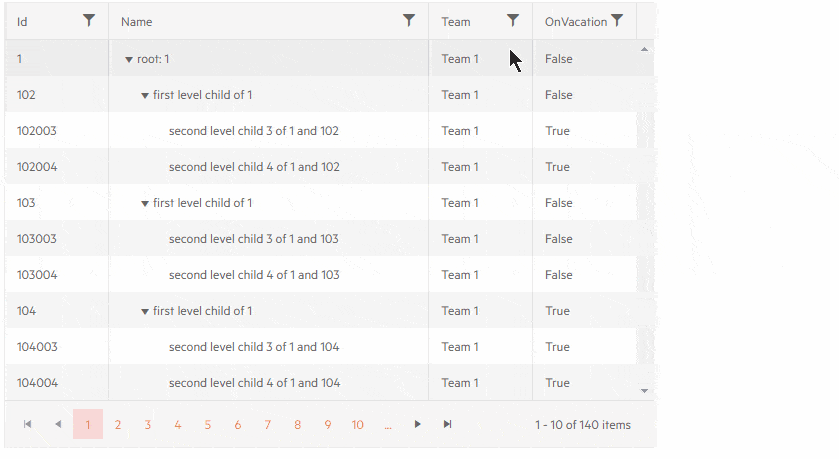

# TreeList CheckBoxList Filtering

You can change the [filter menu]() to show a list of checkboxes with the distinct values from the data source. This lets your users filter records by a commonly found value quickly, and select multiple values with ease. The behavior is similar to Excel filtering.

To enable the checkbox list filtering in the treelist:

1. Set the `FilterMode` parameter of the grid to `Telerik.Blazor.TreeListFilterMode.FilterMenu`
1. Set the `FilterMenuType` parameter of the grid to `Telerik.Blazor.FilterMenuType.CheckBoxList`. It defaults to `Menu` for the default behavior.

You can also change the filter menu behavior for a particular column - its own `FilterMenuType` parameter can be either `Menu` or `CheckBoxList` regardless of the main treelist parameter. This lets you mix both modes as necessary for your application - you can either have all columns use the same mode with a single setting, or override it for a few columns that need the less common mode.

>caption CheckList filter in the treelist

````CSHTML
@* Checkbox List Filter for the Name, Team and Vacation columns, the ID column overrides it to Menu *@

<TelerikTreeList Data="@Data" FilterMode="@TreeListFilterMode.FilterMenu" FilterMenuType="@FilterMenuType.CheckBoxList"
                 Pageable="true" IdField="Id" ParentIdField="ParentId" Width="650px">
    <TreeListColumns>
        <TreeListColumn Field="Id" FilterMenuType="@FilterMenuType.Menu" />
        <TreeListColumn Field="Name" Expandable="true" Width="320px" />
        <TreeListColumn Field="@nameof(Employee.Team)" />
        <TreeListColumn Field="@nameof(Employee.IsOnLeave)" Title="OnVacation" />
    </TreeListColumns>
</TelerikTreeList>

@code {
    public List<Employee> Data { get; set; }

    protected override async Task OnInitializedAsync()
    {
        Data = await GetTreeListData();
    }

    // sample models and data generation

    public class Employee
    {
        public int Id { get; set; }
        public int? ParentId { get; set; }
        public string Name { get; set; }
        public string Team { get; set; }
        public bool IsOnLeave { get; set; }
    }

    async Task<List<Employee>> GetTreeListData()
    {
        List<Employee> data = new List<Employee>();

        for (int i = 1; i < 15; i++)
        {
            data.Add(new Employee
            {
                Id = i,
                ParentId = null,
                Name = $"root: {i}",
                Team = $"Team {i}",
                IsOnLeave = i % 3 == 0
            });

            for (int j = 2; j < 5; j++)
            {
                int currId = i * 100 + j;
                data.Add(new Employee
                {
                    Id = currId,
                    ParentId = i,
                    Name = $"first level child of {i}",
                    Team = $"Team {i}",
                    IsOnLeave = currId % 4 == 0
                });

                for (int k = 3; k < 5; k++)
                {
                    data.Add(new Employee
                    {
                        Id = currId * 1000 + k,
                        ParentId = currId,
                        Name = $"second level child {k} of {i} and {currId}",
                        Team = $"Team {i}",
                        IsOnLeave = currId % 2 == 0
                    }); ;
                }
            }
        }

        return await Task.FromResult(data);
    }
}
````

>caption The result from the snippet above




## Custom Data

By default, the treelist takes the `Distinct` values from its `Data` to populate the chekcbox list filter for each field.

To customize the checkbox list behavior, you should use the [filter menu template](#filter-menu-template). To help you with that, we have exposed the `TelerikCheckBoxListFilter` component that you can place inside the `FilterMenuTemplate` to get the default treelist UI. It provides the following settings:

* `FilterDescriptor` - the filter descriptor where filters will be populated when checkboxes are selected. The component creates the necessary descriptors for you and reads existing ones. This makes it easy to plug into the treelist without any additional code through two-way binding (`@bind-FilterDescriptor="@context.FilterDescriptor"`).

* `Data` - the data that will be rendered in the checkbox list. This is where you can supply the desired options to change what the treelist displays.

* `Field` - the field from the data that will be used to take the `Distinct` options. It must match the name and type of the column field for which this filter is defined. This lets you use the same models that the treelist uses, or to define smaller models to reduce the data you fetch for the filter lists.

>caption Reduce filering options for a specific column (Team)

````CSHTML
@* The Team column has a custom set of filtering options (only the root-level "CEO Team" option) *@

In this sample the Team column lets you filter only by the CEO Team settings, or to show all data due to the filter menu template customization it has.

<TelerikTreeList Data="@Data" FilterMode="@TreeListFilterMode.FilterMenu" FilterMenuType="@FilterMenuType.CheckBoxList"
                 Pageable="true" IdField="Id" ParentIdField="ParentId" Width="650px">
    <TreeListColumns>
        <TreeListColumn Field="Id" FilterMenuType="@FilterMenuType.Menu" />
        <TreeListColumn Field="Name" Expandable="true" Width="320px" />
        <TreeListColumn Field="@nameof(Employee.Team)">
            <FilterMenuTemplate Context="context">
                <TelerikCheckBoxListFilter Data="@TeamsList"
                                           Field="@(nameof(TeamNameFilterOption.Team))"
                                           @bind-FilterDescriptor="@context.FilterDescriptor">
                </TelerikCheckBoxListFilter>
            </FilterMenuTemplate>
        </TreeListColumn>
        <TreeListColumn Field="@nameof(Employee.IsOnLeave)" Title="OnVacation" />
    </TreeListColumns>
</TelerikTreeList>

@code {
    public List<Employee> Data { get; set; }


    #region custom-filter-options-data
    List<TeamNameFilterOption> TeamsList { get; set; }

    public class TeamNameFilterOption
    {
        public string Team { get; set; }
    }

    async Task GetTeamNameOptions()
    {
        if (TeamsList == null) // sample of caching since we always want all distinct options,
                               //but we don't want to make unnecessary requests
        {
            TeamsList = await GetTeamNameOptionsFromService();
        }
    }

    async Task<List<TeamNameFilterOption>> GetTeamNameOptionsFromService()
    {
        await Task.Delay(500);// simulate a real service delay

        // sample application logic - remove most teams from the filter options so its very clear what this sample does
        var data = new List<TeamNameFilterOption>() { new TeamNameFilterOption { Team = "CEO Team" } };

        return await Task.FromResult(data);
    }


    protected override async Task OnInitializedAsync()
    {
        Data = await GetTreeListData();

        // get custom filters data. In a future version you will be able to call these methods
        // from the template initialization instead of here so that they fetch data
        // only when the user actually needs filter values, instead of always - that could improve server performance
        await GetTeamNameOptions();
    }

    #endregion

    // sample models and data generation

    public class Employee
    {
        public int Id { get; set; }
        public int? ParentId { get; set; }
        public string Name { get; set; }
        public string Team { get; set; }
        public bool IsOnLeave { get; set; }
    }

    async Task<List<Employee>> GetTreeListData()
    {
        List<Employee> data = new List<Employee>();

        for (int i = 1; i < 15; i++)
        {
            data.Add(new Employee
            {
                Id = i,
                ParentId = null,
                Name = $"root: {i}",
                Team = "CEO Team",
                IsOnLeave = i % 3 == 0
            });

            for (int j = 2; j < 5; j++)
            {
                int currId = i * 100 + j;
                data.Add(new Employee
                {
                    Id = currId,
                    ParentId = i,
                    Name = $"first level child of {i}",
                    Team = "CEO Team",
                    IsOnLeave = currId % 4 == 0
                });

                for (int k = 3; k < 5; k++)
                {
                    data.Add(new Employee
                    {
                        Id = currId * 1000 + k,
                        ParentId = currId,
                        Name = $"second level child {k} of {i} and {currId}",
                        Team = $"Team {i}",
                        IsOnLeave = currId % 2 == 0
                    }); ;
                }
            }
        }

        return await Task.FromResult(data);
    }
}
````


## See Also

  * [Treelist Filtering Overview]()
  * [Live Demo: Treelist CheckBox List Filter](https://demos.telerik.com/blazor-ui/treelist/filter-checkboxlist)
  