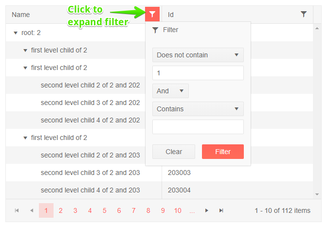

# TreeList Filter Menu

One of the [filter modes of the treelist]() is a popup menu with filter options that you can open from the column headers.

To enable the filter menu, set the `FilterMode` property of the grid to `Telerik.Blazor.TreeListFilterMode.FilterMenu`.

The treelist will render a button in the column header that you click to get a popup with filtering options. The popup lets you choose filter operator, filter criteria, to apply and clear the filter.

A key difference in the behavior from the [filter row]() is that the filter is now applied only upon a button click, not upon input change. This may improve performance with large data sets.

>caption Filter Menu in Telerik TreeList

````CSHTML
@* Filter menu in the column header *@

<TelerikTreeList Data="@Data" FilterMode="@TreeListFilterMode.FilterMenu"
                 Pageable="true" IdField="Id" ParentIdField="ParentId" Width="650px">
    <TreeListColumns>
        <TreeListColumn Field="Name" Expandable="true" Width="320px"></TreeListColumn>
        <TreeListColumn Field="Id"></TreeListColumn>
    </TreeListColumns>
</TelerikTreeList>

@code {
    public List<Employee> Data { get; set; }

    protected override async Task OnInitializedAsync()
    {
        Data = await GetTreeListData();
    }

    // sample models and data generation

    public class Employee
    {
        public int Id { get; set; }
        public int? ParentId { get; set; }
        public string Name { get; set; }
    }

    async Task<List<Employee>> GetTreeListData()
    {
        List<Employee> data = new List<Employee>();

        for (int i = 1; i < 15; i++)
        {
            data.Add(new Employee
            {
                Id = i,
                ParentId = null,
                Name = $"root: {i}"
            });

            for (int j = 2; j < 5; j++)
            {
                int currId = i * 100 + j;
                data.Add(new Employee
                {
                    Id = currId,
                    ParentId = i,
                    Name = $"first level child of {i}"
                });

                for (int k = 3; k < 5; k++)
                {
                    data.Add(new Employee
                    {
                        Id = currId * 1000 + k,
                        ParentId = currId,
                        Name = $"second level child {k} of {i} and {currId}"
                    }); ;
                }
            }
        }

        return await Task.FromResult(data);
    }
}
````

>caption The result from the code snippet above, after the "Name" column has been filtered with "does not contain" "1" operator.




## Filter From Code

You can set the TreeList filters from your code through the component [state]().

@[template](/_contentTemplates/treelist/state.md#initial-state)

>caption Set filtering programmatically

````CSHTML
@[template](/_contentTemplates/treelist/state.md#filter-menu-from-code)
````


## See Also

  * [Treelist Filtering Overview]()
  * [Live Demo: TreeList Filter Menu](https://demos.telerik.com/blazor-ui/treelist/filter-menu)
