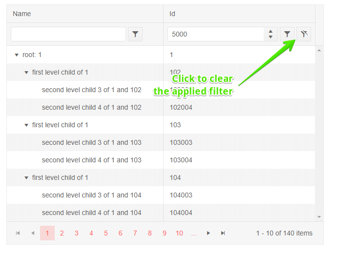

# TreeList Filter Row

One of the [filter modes of the treelist](slug://treelist-filtering) is a row of filter elements below the column headers.

In this article:

* [Basics](#basics)
* [Filter From Code](#filter-from-code)
* [Customization](#customization)

## Basics

To enable the filter row set the `FilterMode` property of the treelist to `Telerik.Blazor.TreeListFilterMode.FilterRow`.

The treelist will render a row below the column headers with UI that you can use to fill in the filter criteria. You can type in the input to execute the default operator as you type, or click a button to choose a different filter operator (like "contains", "greater than" and so on). Filters are applied as the user types in the inputs. Once you enter a filter criteria, the clear button will be enabled to allow you to reset the filter state.

>caption Filter Row in Telerik TreeList

````RAZOR
@* Filter row mode *@

<TelerikTreeList Data="@Data" FilterMode="@TreeListFilterMode.FilterRow"
                 Pageable="true" IdField="Id" ParentIdField="ParentId" Width="650px">
    <TreeListColumns>
        <TreeListColumn Field="Name" Expandable="true" Width="320px"></TreeListColumn>
        <TreeListColumn Field="Id"></TreeListColumn>
    </TreeListColumns>
</TelerikTreeList>

@code {
    public List<Employee> Data { get; set; }

    protected override async Task OnInitializedAsync()
    {
        Data = await GetTreeListData();
    }

    // sample models and data generation

    public class Employee
    {
        public int Id { get; set; }
        public int? ParentId { get; set; }
        public string Name { get; set; }
    }

    async Task<List<Employee>> GetTreeListData()
    {
        List<Employee> data = new List<Employee>();

        for (int i = 1; i < 15; i++)
        {
            data.Add(new Employee
            {
                Id = i,
                ParentId = null,
                Name = $"root: {i}"
            });

            for (int j = 2; j < 5; j++)
            {
                int currId = i * 100 + j;
                data.Add(new Employee
                {
                    Id = currId,
                    ParentId = i,
                    Name = $"first level child of {i}"
                });

                for (int k = 3; k < 5; k++)
                {
                    data.Add(new Employee
                    {
                        Id = currId * 1000 + k,
                        ParentId = currId,
                        Name = $"second level child {k} of {i} and {currId}"
                    }); ;
                }
            }
        }

        return await Task.FromResult(data);
    }
}
````

>caption The result from the code snippet above, after filtering ID with ">= 5000"





## Filter From Code

You can set the TreeList filters from your code through the component [state](slug://treelist-state).

@[template](/_contentTemplates/treelist/state.md#initial-state)

>caption Set filtering programmatically

````RAZOR
@[template](/_contentTemplates/treelist/state.md#filter-row-from-code)
````

## Customization

The TreeList allows you to customize the default behavior of the Filter Row in a couple ways:

### Debouncing the Filtering

@[template](/_contentTemplates/common/filtering.md#filter-debounce-delay-customization)

### Configuring the Filter Row

You can override the default Filter Row behavior for each column through the following properties the `TreeListColumn` exposes:

@[template](/_contentTemplates/common/filtering.md#filter-row-customization-properties)

>caption Configure the Filter Row

````RAZOR
@*Customize the Filter Row*@

@using Telerik.DataSource

<TelerikTreeList Data="@Data"
                 IdField="Id"
                 ParentIdField="ParentId"
                 FilterMode="@TreeListFilterMode.FilterRow"
                 FilterRowDebounceDelay="200"
                 Pageable="true"
                 Width="850px"
                 Height="400px">
    <TreeListColumns>
        <TreeListColumn DefaultFilterOperator="FilterOperator.StartsWith"
                        ShowFilterCellButtons="false"
                        Field="Name" Expandable="true" Width="320px" />
        <TreeListColumn DefaultFilterOperator="FilterOperator.IsEqualTo"
                        ShowFilterCellButtons="false"
                        Field="Id" Width="120px" />
        <TreeListColumn DefaultFilterOperator="FilterOperator.IsEqualTo"
                        ShowFilterCellButtons="false"
                        Field="ParentId" Width="120px" />
        <TreeListColumn DefaultFilterOperator="FilterOperator.Contains"
                        ShowFilterCellButtons="false"
                        Field="EmailAddress" Width="120px" />
        <TreeListColumn DefaultFilterOperator="FilterOperator.IsGreaterThanOrEqualTo"
                        ShowFilterCellButtons="false"
                        Field="HireDate" Width="220px" />
    </TreeListColumns>
</TelerikTreeList>

@code {
    public List<Employee> Data { get; set; }

    protected override async Task OnInitializedAsync()
    {
        Data = await GetTreeListData();
    }

    // sample model

    public class Employee
    {
        // denote the parent-child relationship between items
        public int Id { get; set; }
        public int? ParentId { get; set; }

        // custom data fields for display
        public string Name { get; set; }
        public string EmailAddress { get; set; }
        public DateTime HireDate { get; set; }
    }

    // data generation

    async Task<List<Employee>> GetTreeListData()
    {
        List<Employee> data = new List<Employee>();

        for (int i = 1; i < 15; i++)
        {
            data.Add(new Employee
                {
                    Id = i,
                    ParentId = null, // indicates a root-level item
                    Name = $"root: {i}",
                    EmailAddress = $"{i}@example.com",
                    HireDate = DateTime.Now.AddYears(-i)
                }); ;

            for (int j = 1; j < 4; j++)
            {
                int currId = i * 100 + j;
                data.Add(new Employee
                    {
                        Id = currId,
                        ParentId = i,
                        Name = $"first level child {j} of {i}",
                        EmailAddress = $"{currId}@example.com",
                        HireDate = DateTime.Now.AddDays(-currId)
                    });
            }
        }

        return await Task.FromResult(data);
    }
}
````

### Filter Row Template

The template will let you have full control over the Filter Row rendering and behavior. See how you can implement it and explore the example [Filter Row Template](slug://treelist-templates-filter#filter-row-template) article.


## See Also

  * [Treelist Filtering Overview](slug://treelist-filtering)
  * [Live Demo: TreeList Filter Row](https://demos.telerik.com/blazor-ui/treelist/filter-row)
