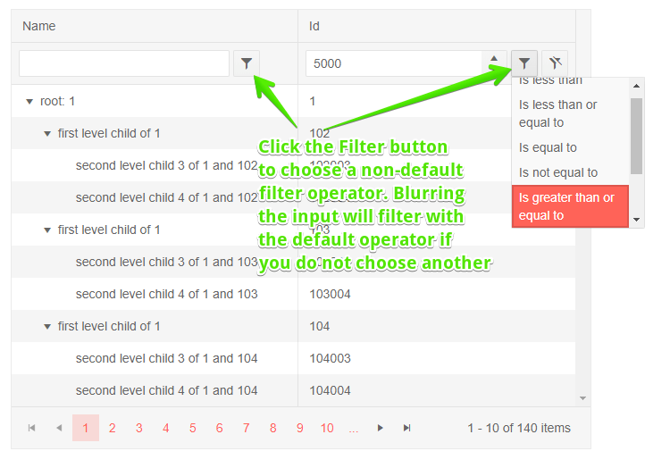

# TreeList Filter Row

One of the [filter modes of the treelist]() is a row of filter elements below the column headers.

To enable the filter row set the `FilterMode` property of the treelist to `Telerik.Blazor.TreeListFilterMode.FilterRow`.

The treelist will render a row below the column headers with UI that you can use to fill in the filter criteria. You can type in the input to execute the default operator as you type, or click a button to choose a different filter operator (like "contains", "greater than" and so on). Filters are applied as the user types in the inputs.

Once a filter is a applied to a column, a button will appear that lets you clear that filter.

>caption Filter Row in Telerik TreeList

````CSHTML
@* Filter row mode *@

<TelerikTreeList Data="@Data" FilterMode="@TreeListFilterMode.FilterRow"
                 Pageable="true" IdField="Id" ParentIdField="ParentId" Width="650px">
    <TreeListColumns>
        <TreeListColumn Field="Name" Expandable="true" Width="320px"></TreeListColumn>
        <TreeListColumn Field="Id"></TreeListColumn>
    </TreeListColumns>
</TelerikTreeList>

@code {
    public List<Employee> Data { get; set; }

    protected override async Task OnInitializedAsync()
    {
        Data = await GetTreeListData();
    }

    // sample models and data generation

    public class Employee
    {
        public int Id { get; set; }
        public int? ParentId { get; set; }
        public string Name { get; set; }
    }

    async Task<List<Employee>> GetTreeListData()
    {
        List<Employee> data = new List<Employee>();

        for (int i = 1; i < 15; i++)
        {
            data.Add(new Employee
            {
                Id = i,
                ParentId = null,
                Name = $"root: {i}"
            });

            for (int j = 2; j < 5; j++)
            {
                int currId = i * 100 + j;
                data.Add(new Employee
                {
                    Id = currId,
                    ParentId = i,
                    Name = $"first level child of {i}"
                });

                for (int k = 3; k < 5; k++)
                {
                    data.Add(new Employee
                    {
                        Id = currId * 1000 + k,
                        ParentId = currId,
                        Name = $"second level child {k} of {i} and {currId}"
                    }); ;
                }
            }
        }

        return await Task.FromResult(data);
    }
}
````

>caption The result from the code snippet above, after filtering ID with ">= 5000"




## Filter From Code

You can set the TreeList filters from your code through the component [state]().

@[template](/_contentTemplates/treelist/state.md#initial-state)

>caption Set filtering programmatically

````CSHTML
@[template](/_contentTemplates/treelist/state.md#filter-row-from-code)
````


## See Also

  * [Treelist Filtering Overview]()
  * [Live Demo: TreeList Filter Row](https://demos.telerik.com/blazor-ui/treelist/filter-row)
