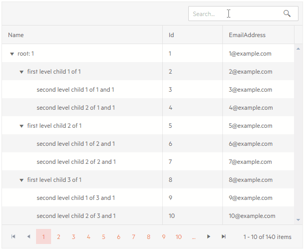
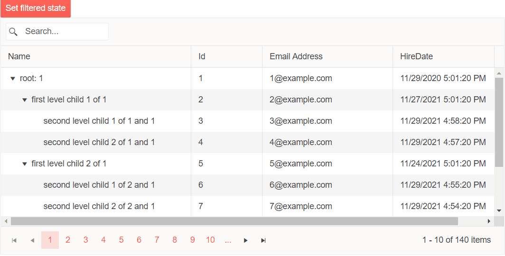

# TreeList Toolbar Searchbox

In addition to the [main filtering options](), you can add a search box in the treelist toolbar that lets the user type their query and the treelist will look up all visible string columns with a case-insensitive `Contains` operator, and filter them accordingly. You can change the filter delay, and the fields the grid will use - see the [Customize the SearchBox](#customize-the-searchbox) section below.

The search box is independent from the standard filters. If you have filters applied, the searchbox will amend and respect them. Thus, you can also apply filtering to results returned from the search box.

To enable the search box, add the `<TreeListSearchBox>` tag in the `<TreeListToolBar>`.

>caption Search box in the Telerik treelist

````CSHTML
@* A search panel in the treelist toolbar *@

<TelerikTreeList Data="@Data"
                 ItemsField="@(nameof(Employee.DirectReports))"
                 Pageable="true">
    <TreeListToolBar>
        <span class="k-toolbar-spacer"></span> @* add this spacer to keep the searchbox on the right *@
        <TreeListSearchBox />
    </TreeListToolBar>
    <TreeListColumns>
        <TreeListColumn Field="Name" Expandable="true" Width="320px" />
        <TreeListColumn Field="Id" Editable="false" Width="120px" />
        <TreeListColumn Field="EmailAddress" Width="220px" />
    </TreeListColumns>
</TelerikTreeList>

@code {
    public List<Employee> Data { get; set; }

    // sample model

    public class Employee
    {
        // hierarchical data collections
        public List<Employee> DirectReports { get; set; }

        // data fields for display
        public int Id { get; set; }
        public string Name { get; set; }
        public string EmailAddress { get; set; }
    }

    // data generation

    // used in this example for data generation and retrieval for CUD operations on the current view-model data
    public int LastId { get; set; } = 1;

    protected override async Task OnInitializedAsync()
    {
        Data = await GetTreeListData();
    }

    async Task<List<Employee>> GetTreeListData()
    {
        List<Employee> data = new List<Employee>();

        for (int i = 1; i < 15; i++)
        {
            Employee root = new Employee
            {
                Id = LastId,
                Name = $"root: {i}",
                EmailAddress = $"{i}@example.com",
                DirectReports = new List<Employee>(),
            };
            data.Add(root);
            LastId++;

            for (int j = 1; j < 4; j++)
            {
                int currId = LastId;
                Employee firstLevelChild = new Employee
                {
                    Id = currId,
                    Name = $"first level child {j} of {i}",
                    EmailAddress = $"{currId}@example.com",
                    DirectReports = new List<Employee>(),
                };
                root.DirectReports.Add(firstLevelChild);
                LastId++;

                for (int k = 1; k < 3; k++)
                {
                    int nestedId = LastId;
                    firstLevelChild.DirectReports.Add(new Employee
                    {
                        Id = LastId,
                        Name = $"second level child {k} of {j} and {i}",
                        EmailAddress = $"{nestedId}@example.com",
                    }); ;
                    LastId++;
                }
            }
        }

        return await Task.FromResult(data);
    }
}
````

>caption The result from the code snippet above



## Filter From Code

You can set the TreeList filters programmatically through the component [state]().

@[template](/_contentTemplates/treelist/state.md#initial-state)

>caption The result from the code snippet below.



>caption Set programmatically Searchbox Filter.

````Razor
@* This snippet shows how to set filtering state to the TreeList from your code
    Applies to the Searchbox filter *@

@using Telerik.DataSource;

<TelerikButton OnClick="@SetTreeListFilter" Primary="true">Set filtered state</TelerikButton>

<TelerikTreeList Data="@Data"
                 ItemsField="@(nameof(Employee.DirectReports))"
                 Height="400px"
                 Pageable="true"
                 Width="850px"
                 @ref="TreeListRef">
    <TreeListToolBar>
        <TreeListSearchBox />
    </TreeListToolBar>
    <TreeListColumns>
        <TreeListColumn Field="Name" Expandable="true" Width="320px" />
        <TreeListColumn Field="Id" Width="120px" />
        <TreeListColumn Field="Address" Title="Email Address" Width="220px" />
        <TreeListColumn Field="HireDate" Width="220px" />
    </TreeListColumns>
</TelerikTreeList>

@code {
    public TelerikTreeList<Employee> TreeListRef { get; set; } = new TelerikTreeList<Employee>();

    async Task SetTreeListFilter()
    {
        var filteredState = new TreeListState<Employee>()
        {
            SearchFilter = CreateSearchFilter()
        };

        await TreeListRef.SetState(filteredState);
    }

    private IFilterDescriptor CreateSearchFilter()
    {
        var descriptor = new CompositeFilterDescriptor();
        var fields = new List<string>() { "Name", "Address" };
        var searchValue = "root: 1";
        descriptor.LogicalOperator = FilterCompositionLogicalOperator.Or;

        foreach (var field in fields)
        {
            var filter = new FilterDescriptor(field, FilterOperator.Contains, searchValue);

            filter.MemberType = typeof(string);

            descriptor.FilterDescriptors.Add(filter);
        }

        return descriptor;
    }

    public List<Employee> Data { get; set; }


    public class Employee
    {
        public List<Employee> DirectReports { get; set; }

        public int Id { get; set; }
        public string Name { get; set; }
        public string Address { get; set; }
        public DateTime HireDate { get; set; }
    }

    public int LastId { get; set; } = 1;

    protected override async Task OnInitializedAsync()
    {
        Data = await GetTreeListData();
    }

    async Task<List<Employee>> GetTreeListData()
    {
        List<Employee> data = new List<Employee>();

        for (int i = 1; i < 15; i++)
        {
            Employee root = new Employee
            {
                Id = LastId,
                Name = $"root: {i}",
                Address = $"{i}@example.com",
                HireDate = DateTime.Now.AddYears(-i),
                DirectReports = new List<Employee>(),
            };
            data.Add(root);
            LastId++;

            for (int j = 1; j < 4; j++)
            {
                int currId = LastId;
                Employee firstLevelChild = new Employee
                {
                    Id = currId,
                    Name = $"first level child {j} of {i}",
                    Address = $"{currId}@example.com",
                    HireDate = DateTime.Now.AddDays(-currId),
                    DirectReports = new List<Employee>(),
                };
                root.DirectReports.Add(firstLevelChild);
                LastId++;

                for (int k = 1; k < 3; k++)
                {
                    int nestedId = LastId;
                    firstLevelChild.DirectReports.Add(new Employee
                    {
                        Id = LastId,
                        Name = $"second level child {k} of {j} and {i}",
                        Address = $"{nestedId}@example.com",
                        HireDate = DateTime.Now.AddMinutes(-nestedId)
                    }); ;
                    LastId++;
                }
            }
        }

        return await Task.FromResult(data);
    }
}
````

## Customize the SearchBox

The `TreeListSearchBox` component offers the following settings to customize its behavior:

* `DebounceDelay` - the time in `ms` with which the typing is debounced. Filtering does not happen on every keystroke and that can reduce the flicker for the end user. The default value is `300`.

* `Fields` - a list of `string` that denotes the fields names that the gris should search in. By default, the treelist looks in all string fields in its currently visible columns, and you can define a subset of that.

* `Class` - a CSS class rendered on the wrapper of the searchbox so you can customize its appearance.

>caption Customize the search box to have a long filter delay and to only use certain fields

````CSHTML
@* See the TreeListSearchBox parameters *@

<TelerikTreeList Data="@Data"
                 ItemsField="@(nameof(Employee.DirectReports))"
                 Pageable="true">
    <TreeListToolBar>
        <TreeListSearchBox DebounceDelay="1000" Fields="@SearchableFields"/>
    </TreeListToolBar>
    <TreeListColumns>
        <TreeListColumn Field="Name" Expandable="true" Width="320px" />
        <TreeListColumn Field="Id" Editable="false" Width="120px" />
        <TreeListColumn Field="EmailAddress" />
    </TreeListColumns>
</TelerikTreeList>

@code {
    List<string> SearchableFields = new List<string> { "Name" };

    List<Employee> Data { get; set; }

    // sample model

    public class Employee
    {
        // hierarchical data collections
        public List<Employee> DirectReports { get; set; }

        // data fields for display
        public int Id { get; set; }
        public string Name { get; set; }
        public string EmailAddress { get; set; }
    }

    // data generation

    // used in this example for data generation and retrieval for CUD operations on the current view-model data
    public int LastId { get; set; } = 1;

    protected override async Task OnInitializedAsync()
    {
        Data = await GetTreeListData();
    }

    async Task<List<Employee>> GetTreeListData()
    {
        List<Employee> data = new List<Employee>();

        for (int i = 1; i < 15; i++)
        {
            Employee root = new Employee
            {
                Id = LastId,
                Name = $"root: {i}",
                EmailAddress = $"{i}@example.com",
                DirectReports = new List<Employee>(),
            };
            data.Add(root);
            LastId++;

            for (int j = 1; j < 4; j++)
            {
                int currId = LastId;
                Employee firstLevelChild = new Employee
                {
                    Id = currId,
                    Name = $"first level child {j} of {i}",
                    EmailAddress = $"{currId}@example.com",
                    DirectReports = new List<Employee>(),
                };
                root.DirectReports.Add(firstLevelChild);
                LastId++;

                for (int k = 1; k < 3; k++)
                {
                    int nestedId = LastId;
                    firstLevelChild.DirectReports.Add(new Employee
                    {
                        Id = LastId,
                        Name = $"second level child {k} of {j} and {i}",
                        EmailAddress = $"{nestedId}@example.com",
                    }); ;
                    LastId++;
                }
            }
        }

        return await Task.FromResult(data);
    }
}
````

## See Also

  * [Treelist Filtering Overview]()
  * [Live Demo: TreeList SearchBox](https://demos.telerik.com/blazor-ui/treelist/searchbox)

