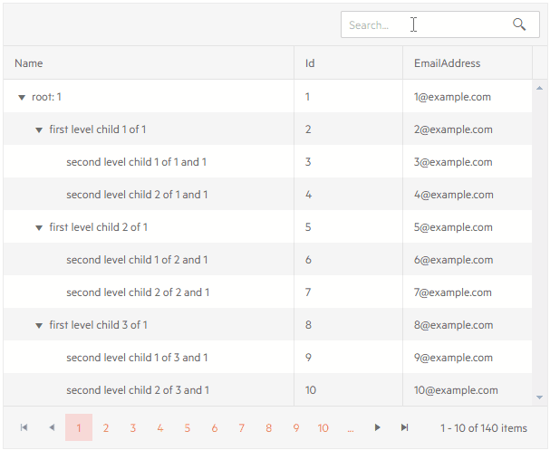

# TreeList Filtering

The TreeList component offers built-in support for filtering.

In this article:

* [Basics](#basics)
* [Filter Row](#filter-row)
* [Filter Menu](#filter-menu)
* [Toolbar Search Box](#toolbar-search-box)


## Basics

To enable filtering, set the `FilterMode` parameter of the treelist to one of the following values:

* [`Telerik.Blazor.TreeListFilterMode.FilterRow`](#filter-row) - a row of filter options is rendered below the column headers
* [`Telerik.Blazor.TreeListFilterMode.FilterMenu`](#filter-menu) - the column headers render a button that shows a popup with filtering options

The behavior of the filter input and the available filter operators will depend on the column data type. For example, a `boolean` field will only have the options "is true" and "is false" and will not have operators like "contains" or "greater than".

You can filter more than one column at a time, and all filter rules will be applied together with an `AND` logic.

You can prevent the user from filtering a certain field by setting `Filterable="false"` on its column.

Filtering keeps an item's parent(s) in the list, so you may see item that do not match the criteria. This is required so you can actually navigate to and see the items that match.

Filtering keeps the expanded/collapsed state of items. For example, if filtering leaves a child whose parent is collapsed, you will only see the collapsed parent.

## Filter Row

To enable the filter row set the `FilterMode` property of the treelist to `Telerik.Blazor.TreeListFilterMode.FilterRow`.

The treelist will render a row below the column headers with UI that you can use to fill in the filter criteria. You can type in the input to execute the default operator as you type, or click a button to choose a different filter operator (like "contains", "greater than" and so on).

Once a filter is a applied to a column, a button will appear that lets you clear that filter.

>caption Filter Row in Telerik TreeList

````CSHTML
@* Filter row mode *@

<TelerikTreeList Data="@Data" FilterMode="@TreeListFilterMode.FilterRow"
                 Pageable="true" IdField="Id" ParentIdField="ParentId" Width="650px">
    <TreeListColumns>
        <TreeListColumn Field="Name" Expandable="true" Width="320px"></TreeListColumn>
        <TreeListColumn Field="Id"></TreeListColumn>
    </TreeListColumns>
</TelerikTreeList>

@code {
    public List<Employee> Data { get; set; }

    protected override async Task OnInitializedAsync()
    {
        Data = await GetTreeListData();
    }

    // sample models and data generation

    public class Employee
    {
        public int Id { get; set; }
        public int? ParentId { get; set; }
        public string Name { get; set; }
    }

    async Task<List<Employee>> GetTreeListData()
    {
        List<Employee> data = new List<Employee>();

        for (int i = 1; i < 15; i++)
        {
            data.Add(new Employee
            {
                Id = i,
                ParentId = null,
                Name = $"root: {i}"
            });

            for (int j = 2; j < 5; j++)
            {
                int currId = i * 100 + j;
                data.Add(new Employee
                {
                    Id = currId,
                    ParentId = i,
                    Name = $"first level child of {i}"
                });

                for (int k = 3; k < 5; k++)
                {
                    data.Add(new Employee
                    {
                        Id = currId * 1000 + k,
                        ParentId = currId,
                        Name = $"second level child {k} of {i} and {currId}"
                    }); ;
                }
            }
        }

        return await Task.FromResult(data);
    }
}
````

>caption The result from the code snippet above, after filtering ID with ">= 5000"


## Filter Menu

To use a filter menu, set the `FilterMode` property of the treelist to `Telerik.Blazor.TreeListFilterMode.FilterMenu`.

The treelist will render a button in the column header that you click to get a popup with filtering options. The popup lets you choose filter operator, filter criteria, to apply and clear the filter.

A key difference in the behavior from the [filter row](#filter-row) is that the filter is now applied only upon a button click, not upon input change. This may improve performance with large data sets.

>caption Filter Menu in Telerik TreeList

````CSHTML
@* Filter menu in the column header *@

<TelerikTreeList Data="@Data" FilterMode="@TreeListFilterMode.FilterMenu"
                 Pageable="true" IdField="Id" ParentIdField="ParentId" Width="650px">
    <TreeListColumns>
        <TreeListColumn Field="Name" Expandable="true" Width="320px"></TreeListColumn>
        <TreeListColumn Field="Id"></TreeListColumn>
    </TreeListColumns>
</TelerikTreeList>

@code {
    public List<Employee> Data { get; set; }

    protected override async Task OnInitializedAsync()
    {
        Data = await GetTreeListData();
    }

    // sample models and data generation

    public class Employee
    {
        public int Id { get; set; }
        public int? ParentId { get; set; }
        public string Name { get; set; }
    }

    async Task<List<Employee>> GetTreeListData()
    {
        List<Employee> data = new List<Employee>();

        for (int i = 1; i < 15; i++)
        {
            data.Add(new Employee
            {
                Id = i,
                ParentId = null,
                Name = $"root: {i}"
            });

            for (int j = 2; j < 5; j++)
            {
                int currId = i * 100 + j;
                data.Add(new Employee
                {
                    Id = currId,
                    ParentId = i,
                    Name = $"first level child of {i}"
                });

                for (int k = 3; k < 5; k++)
                {
                    data.Add(new Employee
                    {
                        Id = currId * 1000 + k,
                        ParentId = currId,
                        Name = $"second level child {k} of {i} and {currId}"
                    }); ;
                }
            }
        }

        return await Task.FromResult(data);
    }
}
````

>caption The result from the code snippet above, after the "Name" column has been filtered with "does not contain" "1" operator.


## Toolbar Search Box

You can add a search box in the treelist toolbar that lets the user type their query and the treelist will look up all visible string columns with a case-insensitive `Contains` operator, and filter them accordingly. You can change the filter delay, and the fields the treelist will use - see the [Customize the SearchBox](#customize-the-searchbox) section below.

The Search Box is, effectively, a filter on the treelist. This means that it applies filter operators to the columns and if you combine it with other filtering modes, the text from the search box will appear on those filter inputs. When you type in the searchbox, all previous filters will be cleared.

To enable the search box, add the `<TreeListSearchBox>` tag in the `<TreeListToolBar>`.

>caption Search box in the Telerik treelist

````CSHTML
@* A search panel in the treelist toolbar *@

<TelerikTreeList Data="@Data"
                 ItemsField="@(nameof(Employee.DirectReports))"
                 Pageable="true">
    <TreeListToolBar>
        <TreeListSearchBox />
    </TreeListToolBar>
    <TreeListColumns>
        <TreeListColumn Field="Name" Expandable="true" Width="320px" />
        <TreeListColumn Field="Id" Editable="false" Width="120px" />
        <TreeListColumn Field="EmailAddress" Width="220px" />
    </TreeListColumns>
</TelerikTreeList>

@code {
    public List<Employee> Data { get; set; }

    // sample model

    public class Employee
    {
        // hierarchical data collections
        public List<Employee> DirectReports { get; set; }

        // data fields for display
        public int Id { get; set; }
        public string Name { get; set; }
        public string EmailAddress { get; set; }
    }

    // data generation

    // used in this example for data generation and retrieval for CUD operations on the current view-model data
    public int LastId { get; set; } = 1;

    protected override async Task OnInitializedAsync()
    {
        Data = await GetTreeListData();
    }

    async Task<List<Employee>> GetTreeListData()
    {
        List<Employee> data = new List<Employee>();

        for (int i = 1; i < 15; i++)
        {
            Employee root = new Employee
            {
                Id = LastId,
                Name = $"root: {i}",
                EmailAddress = $"{i}@example.com",
                DirectReports = new List<Employee>(),
            };
            data.Add(root);
            LastId++;

            for (int j = 1; j < 4; j++)
            {
                int currId = LastId;
                Employee firstLevelChild = new Employee
                {
                    Id = currId,
                    Name = $"first level child {j} of {i}",
                    EmailAddress = $"{currId}@example.com",
                    DirectReports = new List<Employee>(),
                };
                root.DirectReports.Add(firstLevelChild);
                LastId++;

                for (int k = 1; k < 3; k++)
                {
                    int nestedId = LastId;
                    firstLevelChild.DirectReports.Add(new Employee
                    {
                        Id = LastId,
                        Name = $"second level child {k} of {j} and {i}",
                        EmailAddress = $"{nestedId}@example.com",
                    }); ;
                    LastId++;
                }
            }
        }

        return await Task.FromResult(data);
    }
}
````

>caption The result from the code snippet above



### Customize the SearchBox

The `TreeListSearchBox` component offers the following settings to customize its behavior:

* `DebounceDelay` - the time in `ms` with which the typing is debounced. Filtering does not happen on every keystroke and that can reduce the flicker for the end user. The default value is `300`.

* `Fields` - a list of `string` that denotes the fields names that the gris should search in. By default, the treelist looks in all string fields in its currently visible columns, and you can define a subset of that.

* `Class` - a CSS class rendered on the wrapper of the searchbox so you can customize its appearance.

>caption Customize the search box to have a long filter delay and to only use certain fields

````CSHTML
<TelerikTreeList Data="@Data"
                 ItemsField="@(nameof(Employee.DirectReports))"
                 Pageable="true">
    <TreeListToolBar>
        <TreeListSearchBox DebounceDelay="1000" Fields="@SearchableFields"/>
    </TreeListToolBar>
    <TreeListColumns>
        <TreeListColumn Field="Name" Expandable="true" Width="320px" />
        <TreeListColumn Field="Id" Editable="false" Width="120px" />
        <TreeListColumn Field="EmailAddress" />
    </TreeListColumns>
</TelerikTreeList>

@code {
    List<string> SearchableFields = new List<string> { "Name" };

    List<Employee> Data { get; set; }

    // sample model

    public class Employee
    {
        // hierarchical data collections
        public List<Employee> DirectReports { get; set; }

        // data fields for display
        public int Id { get; set; }
        public string Name { get; set; }
        public string EmailAddress { get; set; }
    }

    // data generation

    // used in this example for data generation and retrieval for CUD operations on the current view-model data
    public int LastId { get; set; } = 1;

    protected override async Task OnInitializedAsync()
    {
        Data = await GetTreeListData();
    }

    async Task<List<Employee>> GetTreeListData()
    {
        List<Employee> data = new List<Employee>();

        for (int i = 1; i < 15; i++)
        {
            Employee root = new Employee
            {
                Id = LastId,
                Name = $"root: {i}",
                EmailAddress = $"{i}@example.com",
                DirectReports = new List<Employee>(),
            };
            data.Add(root);
            LastId++;

            for (int j = 1; j < 4; j++)
            {
                int currId = LastId;
                Employee firstLevelChild = new Employee
                {
                    Id = currId,
                    Name = $"first level child {j} of {i}",
                    EmailAddress = $"{currId}@example.com",
                    DirectReports = new List<Employee>(),
                };
                root.DirectReports.Add(firstLevelChild);
                LastId++;

                for (int k = 1; k < 3; k++)
                {
                    int nestedId = LastId;
                    firstLevelChild.DirectReports.Add(new Employee
                    {
                        Id = LastId,
                        Name = $"second level child {k} of {j} and {i}",
                        EmailAddress = $"{nestedId}@example.com",
                    }); ;
                    LastId++;
                }
            }
        }

        return await Task.FromResult(data);
    }
}
````


## See Also

  * [Live Demo: TreeList Filter Row](https://demos.telerik.com/blazor-ui/treelist/filter-row)
  * [Live Demo: TreeList Filter Menu](https://demos.telerik.com/blazor-ui/treelist/filter-menu)
