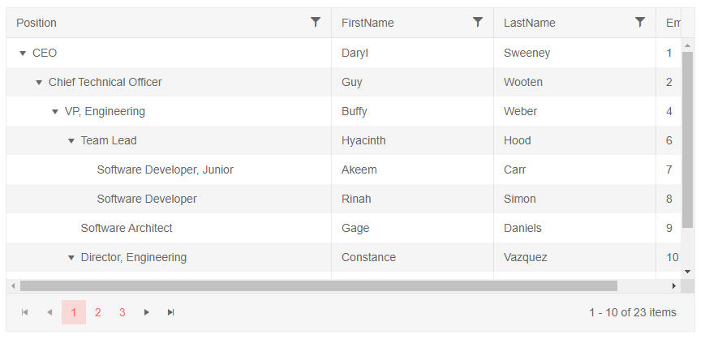
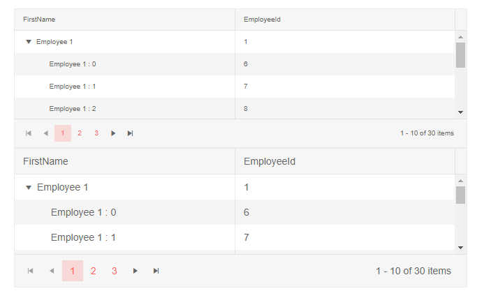

# Blazor TreeList Component Overview

The TreeList displays hierarchical data in a tabular format and allows [sorting](), [filtering](), [data editing](); provides [aggregates](), item [selection](), [templates]() and [load on demand]().


>caption To create a basic Telerik TreeList:

1. use the `TelerikTreeList` tag
1. set its `Data` attribute to the variable that will hold your collection of data.
    * Read more on how to tie the model fields to the treelist in the [Data Binding Overview]() article. In this example, we point the treelist to the location of the nested items and the field that indicates whether an Expand arrow will be generated (that there are child items).
1. under its `TreeListColumns` tag, set the desired [`TreeListColumn`]() instances whose `Field` property points to the name of the model field that you want to show

>caption Get started with the treelist by providing it with a data collection and enabling its key features

````CSHTML
@* General treelist with its most common features and hierarchical data binding. 80% of this snippet is hardcoded data *@

<TelerikTreeList Data="@Data"
                 ItemsField="DirectReports"
                 HasChildrenField="HasReports"
                 Pageable="true"
                 Sortable="true"
                 FilterMode="@TreeListFilterMode.FilterMenu"
                 Width="850px" Height="400px"
                 Resizable="true" Reorderable="true">
    <TreeListColumns>
        <TreeListColumn Expandable="true" Field="Position" Width="400px"></TreeListColumn>
        <TreeListColumn Field="FirstName" Width="200px"></TreeListColumn>
        <TreeListColumn Field="LastName" Width="200px"></TreeListColumn>
        <TreeListColumn Field="EmployeeId" Width="100px"></TreeListColumn>
    </TreeListColumns>
</TelerikTreeList>

@code {
    // a model to bind the treelist. Should usually be in its own separate location
    public class EmployeeHierarchical
    {
        public int EmployeeId { get; set; }
        public string FirstName { get; set; }
        public string LastName { get; set; }
        public string Position { get; set; }
        public List<EmployeeHierarchical> DirectReports { get; set; }
        public bool HasReports { get; set; }
    }

    // treelist data
    public List<EmployeeHierarchical> Data { get; set; }

    // fetch the treelist data
    protected override async Task OnInitializedAsync()
    {
        Data = await GetEmployees();
    }

    // The next 200 lines are hardcoded data so you can explore the TreeList freely

    async Task<List<EmployeeHierarchical>> GetEmployees()
    {
        List<EmployeeHierarchical> sampleData = new List<EmployeeHierarchical>();

        EmployeeHierarchical theCEO = new EmployeeHierarchical
        {
            EmployeeId = 1,
            FirstName = "Daryl",
            LastName = "Sweeney",
            Position = "CEO",
            HasReports = true
        };

        theCEO.DirectReports = new List<EmployeeHierarchical>
        {
            new EmployeeHierarchical
            {
                EmployeeId = 2,
                FirstName = "Guy",
                LastName = "Wooten",
                Position = "Chief Technical Officer",
                HasReports = true
            },
            new EmployeeHierarchical
            {
                EmployeeId = 3,
                FirstName = "Nevada",
                LastName = "Hart",
                Position = "Chief Financial Officer",
                HasReports = true,
                DirectReports = new List<EmployeeHierarchical>
                {
                    new EmployeeHierarchical
                    {
                        EmployeeId = 24,
                        FirstName = "Zena",
                        LastName = "Stanford",
                        Position = "VP, Finance"
                    }
                }
            }
        };

        theCEO.DirectReports[0].DirectReports = new List<EmployeeHierarchical>
        {
            new EmployeeHierarchical
            {
                EmployeeId = 4,
                FirstName = "Buffy",
                LastName = "Weber",
                Position = "VP, Engineering",
                HasReports = true,
                DirectReports = new List<EmployeeHierarchical>
                {
                    new EmployeeHierarchical
                    {
                        EmployeeId = 6,
                        FirstName = "Hyacinth",
                        LastName = "Hood",
                        Position = "Team Lead",
                        HasReports = true,
                        DirectReports = new List<EmployeeHierarchical>
                        {
                            new EmployeeHierarchical
                            {
                                EmployeeId = 7,
                                FirstName = "Akeem",
                                LastName = "Carr",
                                Position = "Software Developer, Junior"
                            },
                            new EmployeeHierarchical
                            {
                                EmployeeId = 8,
                                FirstName = "Rinah",
                                LastName = "Simon",
                                Position = "Software Developer"
                            }
                        }
                    },
                    new EmployeeHierarchical
                    {
                        EmployeeId = 9,
                        FirstName = "Gage",
                        LastName = "Daniels",
                        Position = "Software Architect"
                    },
                    new EmployeeHierarchical
                    {
                        EmployeeId = 10,
                        FirstName = "Constance",
                        LastName = "Vazquez",
                        Position = "Director, Engineering",
                        HasReports = true,
                        DirectReports = new List<EmployeeHierarchical>
                        {
                            new EmployeeHierarchical
                            {
                                EmployeeId = 11,
                                FirstName = "Darrel",
                                LastName = "Solis",
                                Position = "Team Lead",
                                HasReports = true,
                                DirectReports = new List<EmployeeHierarchical>
                                {
                                    new EmployeeHierarchical
                                    {
                                        EmployeeId = 12,
                                        FirstName = "Brian",
                                        LastName = "Yang",
                                        Position = "Software Developer, Senior"
                                    },
                                    new EmployeeHierarchical
                                    {
                                        EmployeeId = 13,
                                        FirstName = "Lillian",
                                        LastName = "Bradshaw",
                                        Position = "Software Developer"
                                    },
                                    new EmployeeHierarchical
                                    {
                                        EmployeeId = 14,
                                        FirstName = "Keiko",
                                        LastName = "Espinoza",
                                        Position = "QA Engineer, Junior"
                                    }
                                }
                            }
                        }
                    }
                }
            },
            new EmployeeHierarchical
            {
                EmployeeId = 5,
                FirstName = "Skyler",
                LastName = "Cleveland",
                Position = "VP, Engineering",
                HasReports = true,
                DirectReports = new List<EmployeeHierarchical>
                {
                    new EmployeeHierarchical
                    {
                        EmployeeId = 16,
                        FirstName = "Karleigh",
                        LastName = "Garza",
                        Position = "Team Lead",
                        HasReports = true,
                        DirectReports = new List<EmployeeHierarchical>
                        {
                            new EmployeeHierarchical
                            {
                                EmployeeId = 17,
                                FirstName = "Elmo",
                                LastName = "Tyson",
                                Position = "Software Developer"
                            },
                            new EmployeeHierarchical
                            {
                                EmployeeId = 18,
                                FirstName = "Stacey",
                                LastName = "Lynn",
                                Position = "QA Engineer",
                                HasReports = true,
                                DirectReports = new List<EmployeeHierarchical>
                                {
                                    new EmployeeHierarchical
                                    {
                                        EmployeeId = 19,
                                        FirstName = "Meredith",
                                        LastName = "Parish",
                                        Position = "QA Engineer, Junior"
                                    }
                                }
                            },
                            new EmployeeHierarchical
                            {
                                EmployeeId = 20,
                                FirstName = "Martha",
                                LastName = "Sargent",
                                Position = "Software Developer, Senior"
                            },
                            new EmployeeHierarchical
                            {
                                EmployeeId = 21,
                                FirstName = "Cassady",
                                LastName = "Whitley",
                                Position = "Software Developer"
                            },
                            new EmployeeHierarchical
                            {
                                EmployeeId = 22,
                                FirstName = "Haviva",
                                LastName = "Campbell",
                                Position = "Support Officer"
                            },
                            new EmployeeHierarchical
                            {
                                EmployeeId = 23,
                                FirstName = "Cameron",
                                LastName = "Ayers",
                                Position = "Support Officer"
                            }
                        }
                    }
                }
            }
        };

        sampleData.Add(theCEO);

        return await Task.FromResult(sampleData);
    }
}
````

>caption The result from the code snippet above




## Data Binding

To show data in a treelist, you need to define [TreeListColumn]() instances - they take a model `Field` and expose settings for [templates](), [resizing]() [reordering](). To [edit](#editing) data or invoke custom logic, you define a [CommandColumn]().

>tip The Telerik Blazor TreeList is data source agnostic - you can use any database and service according to your project, you only need to get the collection of data models to the treelist in the view-model of the component hosting it.

The following list of resources provides examples for data binding a treelist in various scenarios:

* General information on how data binding works - [TreeList Data Binding Overview]().

* Binding to a self-referencing flat data source - [Bind TreeList to Flat Self-Referencing Data]().

* Using hierarchical data source with item collections nested in each item - [Bind TreeList to Hierarchical Data]().

* Loading child nodes data on demand - [Load On Demand in TreeList]()


<!-- * **OData** data source - an extension method we provide lets you make OData v4 queries as shown in the following example: [Grid and OData](https://github.com/telerik/blazor-ui/tree/master/grid/odata). -->


## Blazor TreeList Reference

The treelist is a generic component, and to store a reference, you must use the model type that you pass to its `Data` when declaring the variable.

>caption Store a reference to a Telerik TreeList

````CSHTML
@* The reference type depends on the Data model type *@

<TelerikTreeList Data="@Data"
                 @ref="@TreeListRef"
                 IdField="EmployeeId"
                 ParentIdField="ReportsTo"
                 Pageable="true">
    <TreeListColumns>
        <TreeListColumn Field="FirstName" Expandable="true"></TreeListColumn>
        <TreeListColumn Field="EmployeeId"></TreeListColumn>
    </TreeListColumns>
</TelerikTreeList>

@code {
    TelerikTreeList<Employee> TreeListRef { get; set; }
    public List<Employee> Data { get; set; }

    public class Employee
    {
        public int EmployeeId { get; set; }
        public string FirstName { get; set; }
        public int? ReportsTo { get; set; }
    }

    protected override void OnInitialized()
    {
        Data = new List<Employee>();
        var rand = new Random();
        int currentId = 1;

        for (int i = 1; i < 6; i++)
        {
            Data.Add(new Employee()
            {
                EmployeeId = currentId,
                ReportsTo = null,
                FirstName = "Employee  " + i.ToString()
            });

            currentId++;
        }
        for (int i = 1; i < 6; i++)
        {
            for (int j = 0; j < 5; j++)
            {
                Data.Add(new Employee()
                {
                    EmployeeId = currentId,
                    ReportsTo = i,
                    FirstName = "    Employee " + i + " : " + j.ToString()
                });

                currentId++;
            }
        }
    }
}
````


## Autogenerated Columns

You can autogenerate columns in a TreeList for each public property in its model. For more information about this feature you can read the [Autogenerated Columns]() article.

## Editing

The treelist can perform CRUD operations on its current data collection and exposes events that let you control the operations and transfer changes to the actual data source. The [CRUD Operations Overview]() article offers more details on this.

The treelist offers several editing modes with different user experience through the `EditMode` property that is a member of the `TreeListEditMode` enum:

* `Incell` - editing is done [in the current cell]() with a double click
* `Inline` - editing is done for the [entire row]() with an [Edit Command Button]()
* `Popup` - editing is done in a [popup]() for the entire row with an [Edit Command Button]()


## Paging

The TreeList supports paging of the data out of the box. You can read more about it in the [Paging]() article.

## Sorting

The treelist can sort data automatically. You can read more about this feature in the [Sorting]() article.

## Filtering

The TreeList can filter data automatically. You can read more about this feature in the [Filtering]() article.


## Selection

The tree list offers single or multiple selection modes. You can read more about this feature in the [Selection]() article.

## Toolbar

You can define user actions in a [dedicated toolbar](). For the moment, they are mostly custom actions, but in future versions you will be able to add features like exporting there.

## Scrolling

When the total column width exceeds the width of the treelist, you will get a horizontal scrollbar.

When the height of the rows exceeds the Height of the tree list, you will get a vertical scrollbar.

The treelist also offers Virtual horizontal scrolling. You can read more about this feature in the [Column Virtualization]() article.

## Frozen Columns

The TreeList lets you freeze one or more columns. You can read more about this feature in the [Frozen columns]() article.


## Styling

You can define your own content for column cells or even the entire row through [Templates]().

You can also set the [`Height` of the treelist](), and you can use the `Class` to provide more complex CSS rules (like ones that will be inherited in a template).

For example, you can benefit from the elastic design the components expose to change their font size so they change dimensions.

>caption Change font size and dimensions of a treelist

````CSHTML
@* The treelist offers elastic design capabilities *@

<style>
    div.smallerFont,
    div.smallerFont .k-filtercell * {
        font-size: 10px;
    }

        div.smallerFont .k-dropdown.k-header.k-dropdown-operator {
            width: calc(8px + 2em) !important;
        }
</style>

<TelerikTreeList Data="@Data"
                 Class="smallerFont"
                 IdField="EmployeeId"
                 ParentIdField="ReportsTo"
                 Pageable="true" Height="200px">
    <TreeListColumns>
        <TreeListColumn Field="FirstName" Expandable="true"></TreeListColumn>
        <TreeListColumn Field="EmployeeId"></TreeListColumn>
    </TreeListColumns>
</TelerikTreeList>

<TelerikTreeList Data="@Data"
                 IdField="EmployeeId"
                 ParentIdField="ReportsTo"
                 Pageable="true" Height="200px">
    <TreeListColumns>
        <TreeListColumn Field="FirstName" Expandable="true"></TreeListColumn>
        <TreeListColumn Field="EmployeeId"></TreeListColumn>
    </TreeListColumns>
</TelerikTreeList>

@code {
    public List<Employee> Data { get; set; }

    public class Employee
    {
        public int EmployeeId { get; set; }
        public string FirstName { get; set; }
        public int? ReportsTo { get; set; }

    }

    protected override void OnInitialized()
    {
        Data = new List<Employee>();
        var rand = new Random();
        int currentId = 1;

        for (int i = 1; i < 6; i++)
        {
            Data.Add(new Employee()
            {
                EmployeeId = currentId,
                ReportsTo = null,
                FirstName = "Employee  " + i.ToString()
            });

            currentId++;
        }
        for (int i = 1; i < 6; i++)
        {
            for (int j = 0; j < 5; j++)
            {
                Data.Add(new Employee()
                {
                    EmployeeId = currentId,
                    ReportsTo = i,
                    FirstName = "    Employee " + i + " : " + j.ToString()
                });

                currentId++;
            }
        }
    }
}
````

>caption The result from the reduced font size is a reduction in the overall size of the treelist elements



## See Also

  * [Live Demos: TreeList](https://demos.telerik.com/blazor-ui/treelist/index)
  * [API Reference](https://docs.telerik.com/blazor-ui/api/Telerik.Blazor.Components.TelerikTreeList-1)
