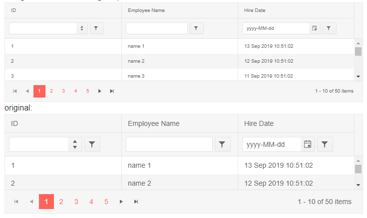

# Blazor TreeList Component Overview

The TreeList displays hierarchical data in a tabular format and allows [sorting](), [filtering](), [data editing](); provides [aggregates](), item [selection](), [templates]() and [load on demand]().


>caption To create a basic Telerik TreeList:

1. use the `TelerikTreeList` tag
1. set its `Data` attribute to the variable that will hold your collection of data.
    * Read more on how to tie the model fields to the treelist in the [Data Binding Overview]() article. In this example, we point the treelist to the location of the nested items and the field that indicates whether an Expand arrow will be generated (that there are child items).
1. under its `TreeListColumns` tag, set the desired [`TreeListColumn`]() instances whose `Field` property points to the name of the model field that you want to show

>caption Get started with the treelist by providing it with a data collection and enabling its key features

````CSHTML
@* General treelist with its most common features and hierarchical data binding. 80% of this snippet is hardcoded data *@

<TelerikTreeList Data="@Data"
                 ItemsField="DirectReports"
                 HasChildrenField="HasReports"
                 Pageable="true"
                 Sortable="true"
                 FilterMode="@TreeListFilterMode.FilterMenu"
                 Width="850px" Height="400px"
                 Resizable="true" Reorderable="true">
    <TreeListColumns>
        <TreeListColumn Expandable="true" Field="Position" Width="400px"></TreeListColumn>
        <TreeListColumn Field="FirstName" Width="200px"></TreeListColumn>
        <TreeListColumn Field="LastName" Width="200px"></TreeListColumn>
        <TreeListColumn Field="EmployeeId" Width="100px"></TreeListColumn>
    </TreeListColumns>
</TelerikTreeList>

@code {
    // a model to bind the treelist. Should usually be in its own separate location
    public class EmployeeHierarchical
    {
        public int EmployeeId { get; set; }
        public string FirstName { get; set; }
        public string LastName { get; set; }
        public string Position { get; set; }
        public List<EmployeeHierarchical> DirectReports { get; set; }
        public bool HasReports { get; set; }
    }

    // treelist data
    public List<EmployeeHierarchical> Data { get; set; }

    // fetch the treelist data
    protected override async Task OnInitializedAsync()
    {
        Data = await GetEmployees();
    }

    // The next 200 lines are hardcoded data so you can explore the TreeList freely

    async Task<List<EmployeeHierarchical>> GetEmployees()
    {
        List<EmployeeHierarchical> sampleData = new List<EmployeeHierarchical>();

        EmployeeHierarchical theCEO = new EmployeeHierarchical
        {
            EmployeeId = 1,
            FirstName = "Daryl",
            LastName = "Sweeney",
            Position = "CEO",
            HasReports = true
        };

        theCEO.DirectReports = new List<EmployeeHierarchical>
        {
            new EmployeeHierarchical
            {
                EmployeeId = 2,
                FirstName = "Guy",
                LastName = "Wooten",
                Position = "Chief Technical Officer",
                HasReports = true
            },
            new EmployeeHierarchical
            {
                EmployeeId = 3,
                FirstName = "Nevada",
                LastName = "Hart",
                Position = "Chief Financial Officer",
                HasReports = true,
                DirectReports = new List<EmployeeHierarchical>
                {
                    new EmployeeHierarchical
                    {
                        EmployeeId = 24,
                        FirstName = "Zena",
                        LastName = "Stanford",
                        Position = "VP, Finance"
                    }
                }
            }
        };

        theCEO.DirectReports[0].DirectReports = new List<EmployeeHierarchical>
        {
            new EmployeeHierarchical
            {
                EmployeeId = 4,
                FirstName = "Buffy",
                LastName = "Weber",
                Position = "VP, Engineering",
                HasReports = true,
                DirectReports = new List<EmployeeHierarchical>
                {
                    new EmployeeHierarchical
                    {
                        EmployeeId = 6,
                        FirstName = "Hyacinth",
                        LastName = "Hood",
                        Position = "Team Lead",
                        HasReports = true,
                        DirectReports = new List<EmployeeHierarchical>
                        {
                            new EmployeeHierarchical
                            {
                                EmployeeId = 7,
                                FirstName = "Akeem",
                                LastName = "Carr",
                                Position = "Software Developer, Junior"
                            },
                            new EmployeeHierarchical
                            {
                                EmployeeId = 8,
                                FirstName = "Rinah",
                                LastName = "Simon",
                                Position = "Software Developer"
                            }
                        }
                    },
                    new EmployeeHierarchical
                    {
                        EmployeeId = 9,
                        FirstName = "Gage",
                        LastName = "Daniels",
                        Position = "Software Architect"
                    },
                    new EmployeeHierarchical
                    {
                        EmployeeId = 10,
                        FirstName = "Constance",
                        LastName = "Vazquez",
                        Position = "Director, Engineering",
                        HasReports = true,
                        DirectReports = new List<EmployeeHierarchical>
                        {
                            new EmployeeHierarchical
                            {
                                EmployeeId = 11,
                                FirstName = "Darrel",
                                LastName = "Solis",
                                Position = "Team Lead",
                                HasReports = true,
                                DirectReports = new List<EmployeeHierarchical>
                                {
                                    new EmployeeHierarchical
                                    {
                                        EmployeeId = 12,
                                        FirstName = "Brian",
                                        LastName = "Yang",
                                        Position = "Software Developer, Senior"
                                    },
                                    new EmployeeHierarchical
                                    {
                                        EmployeeId = 13,
                                        FirstName = "Lillian",
                                        LastName = "Bradshaw",
                                        Position = "Software Developer"
                                    },
                                    new EmployeeHierarchical
                                    {
                                        EmployeeId = 14,
                                        FirstName = "Keiko",
                                        LastName = "Espinoza",
                                        Position = "QA Engineer, Junior"
                                    }
                                }
                            }
                        }
                    }
                }
            },
            new EmployeeHierarchical
            {
                EmployeeId = 5,
                FirstName = "Skyler",
                LastName = "Cleveland",
                Position = "VP, Engineering",
                HasReports = true,
                DirectReports = new List<EmployeeHierarchical>
                {
                    new EmployeeHierarchical
                    {
                        EmployeeId = 16,
                        FirstName = "Karleigh",
                        LastName = "Garza",
                        Position = "Team Lead",
                        HasReports = true,
                        DirectReports = new List<EmployeeHierarchical>
                        {
                            new EmployeeHierarchical
                            {
                                EmployeeId = 17,
                                FirstName = "Elmo",
                                LastName = "Tyson",
                                Position = "Software Developer"
                            },
                            new EmployeeHierarchical
                            {
                                EmployeeId = 18,
                                FirstName = "Stacey",
                                LastName = "Lynn",
                                Position = "QA Engineer",
                                HasReports = true,
                                DirectReports = new List<EmployeeHierarchical>
                                {
                                    new EmployeeHierarchical
                                    {
                                        EmployeeId = 19,
                                        FirstName = "Meredith",
                                        LastName = "Parish",
                                        Position = "QA Engineer, Junior"
                                    }
                                }
                            },
                            new EmployeeHierarchical
                            {
                                EmployeeId = 20,
                                FirstName = "Martha",
                                LastName = "Sargent",
                                Position = "Software Developer, Senior"
                            },
                            new EmployeeHierarchical
                            {
                                EmployeeId = 21,
                                FirstName = "Cassady",
                                LastName = "Whitley",
                                Position = "Software Developer"
                            },
                            new EmployeeHierarchical
                            {
                                EmployeeId = 22,
                                FirstName = "Haviva",
                                LastName = "Campbell",
                                Position = "Support Officer"
                            },
                            new EmployeeHierarchical
                            {
                                EmployeeId = 23,
                                FirstName = "Cameron",
                                LastName = "Ayers",
                                Position = "Support Officer"
                            }
                        }
                    }
                }
            }
        };

        sampleData.Add(theCEO);

        return await Task.FromResult(sampleData);
    }
}
````

>caption The result from the code snippet above


## Data Binding

To show data in a grid, you need to define [GridColumn]() instances - they take a model `Field` and expose settings for [templates](), [grouping](#grouping) and [reordering](). To [edit](#editing) data or invoke custom logic, you define a [CommandColumn]().

>tip The Telerik Blazor Grid is data source agnostic - you can use any database and service according to your project, you only need to get the collection of data models to the grid in the view-model of the component hosting it.

The following list of resources provides examples for data binding a grid in various scenarios:

* Basic **example**, tutorial **video** and **notes** - [Grid Data Binding Overview](). Also lists the features (parameters) of a bound column.

* **Optimizing the data source queries** - see the [Notes](#notes) section in the article above. In a server-side app, an `IQueriable` that ties to an appropriate context (such as EntityFramework) that can optimize the LINQ queries the grid generates is a quick option. For full control, use the [OnRead event]().

* **SQL** (or any other) **database** - you can find examples in our [online demos](https://demos.telerik.com/blazor-ui/grid/overview). You can see an offline version of the demos project in the `demos` folder of your installation ([automated]() or [archive]()). They showcase an EntityFramework context using an SQL database that provides data to a grid through a service, which is a common architecture for decouping the front-end from the actual data source that you can apply to any database.

    * The **CRUD sample project** our extensions for [Visual Studio]() and [Visual Studio Code]() can generate for you showcases a similar architecture that you can use as a starting point.

* **WebAPI** data source - you can see how to send an appropriate request for data and return an optimized query in the following sample projects: [Grid DataSourceRequest on the server](https://github.com/telerik/blazor-ui/tree/master/grid/datasourcerequest-on-server). This is a flexible approach that you can use for any type of service you have - serializing and deserializing the data according to the application logic and needs, and optimizing the database queries on the backend.

* **OData** data source - an extension method we provide lets you make OData v4 queries as shown in the following example: [Grid and OData](https://github.com/telerik/blazor-ui/tree/master/grid/odata).

* **DataTable**, **ExpandoObject** collection - If you don't have actual strongly typed models (yet) and you use `ExpandoObject`, or your backend comes from an older technology and still returns `DataTable`s, the grid can accommodate such dynamic data types. You can get started from our examples on how to bind the grid to a [ExpandoObject collection](https://github.com/telerik/blazor-ui/tree/master/grid/binding-to-expando-object) and to a [DataTable](https://demos.telerik.com/blazor-ui/grid/data-table) which also support [editing](#editing).

* **gRPC** - the gRPC tooling supports .NET Core, and as of mid-June 2020, there is a package that brings it to WebAssembly. You can find a basic example and more resources to get you started with gRPC in Blazor in the [Grid Data from gRPC Sample Project](https://github.com/telerik/blazor-ui/tree/master/common/grpc-example).


## Blazor Grid Reference

The grid is a generic component, and to store a reference, you must use the model type that you pass to its `Data` when declaring the variable.

>caption Store a reference to a Telerik Grid

````CSHTML
@using Telerik.Blazor.Components

<TelerikGrid Data="@MyData" @ref="theGridReference">
	<GridColumns>
		<GridColumn Field="@(nameof(SampleData.ID))">
		</GridColumn>
		<GridColumn Field="@(nameof(SampleData.Name))" Title="Employee Name">
		</GridColumn>
	</GridColumns>
</TelerikGrid>

@code {
	Telerik.Blazor.Components.TelerikGrid<SampleData> theGridReference;

	public IEnumerable<SampleData> MyData = Enumerable.Range(1, 50).Select(x => new SampleData
	{
		ID = x,
		Name = "name " + x
	});

	//in a real case, keep the models in dedicated locations, this is just an easy to copy and see example
	public class SampleData
	{
		public int ID { get; set; }
		public string Name { get; set; }
	}
}
````


## Autogenerated Columns

You can autogenerate columns in a Grid for each public property in its model. For more information about this feature you can read the [Autogenerated Columns]() article.

## Editing

The grid can perform CRUD operations on its current data collection and exposes events that let you control the operations and transfer changes to the actual data source. The [CRUD Operations Overview]() article offers more details on this.

The grid offers several editing modes with different user experience through the `EditMode` property that is a member of the `GridEditMode` enum:

* `Incell` - editing is done [in the current cell]() with a double click
* `Inline` - editing is done for the [entire row]() with an [Edit Command Button]()
* `Popup` - editing is done in a [popup]() for the entire row with an [Edit Command Button]()


## Paging

The grid supports paging of the data out of the box. You can read more about it in the [Paging]() article. An alternative to standard paging is [Virtual Scrolling]() that provides a different user experience.

## Sorting

The grid can sort data automatically. You can read more about this feature in the [Sorting]() article.

## Filtering

The grid can filter data automatically. You can read more about this feature in the [Filtering]() article.


## Grouping

The grid can group data automatically. You can read more about this feature in the [Grouping]() article.

## Selection

The grid offers single or multiple selection modes. You can read more about this feature in the [Selection]() article.

## Toolbar

You can define user actions in a [dedicated toolbar](). For the moment, they are mostly custom actions, but in future versions you will be able to add features like exporting there.

## Scrolling

The grid offers two modes of scrolling through its `ScrollMode` parameter that takes a member of the `Telerik.Blazor.GridScrollMode` enum:

* `Scrollable` - the default setting - the scrollbars are controlled by the grid's `Width` and `Height` parameters and the data shown in it. If the rendered rows are taller than the height, there will be a vertical scrollbar. If the sum of the column widths is larger than the width, there will be a horizontal scrollbar (read more in the [Column Width]() article).
* `Virtual` - this enables [Virtual Scrolling]().

The Grid offers Virtual horizontal scrolling. You can read more about this feature in the [Column Virtualization]() article.

## Frozen Columns

The grid lets you freeze one or more columns. You can read more about this feature in the [Frozen columns]() article.

## State

The grid provides its current state (such as filtering, sorting, grouping, selection and so on) through methods and events so you can store the grid layout for your end users - this lets them continue where they left off. You can read more about this in the [Grid State]() article.


## Styling

You can define your own content for column cells or even the entire row through [Templates]().

You can also set the [`Height` of the grid](), and you can use the `Class` to provide more complex CSS rules (like ones that will be inherited in a template).

For example, you can benefit from the elastic design the components expose to change their font size so they change dimensions.

>caption Change font size and dimensions of a grid

````CSHTML
The grid offers elastic design capabilities

<style>
    div.smallerFont,
    div.smallerFont .k-filtercell * {
        font-size: 10px;
    }

    div.smallerFont .k-dropdown.k-header.k-dropdown-operator {
        width: calc(8px + 2em) !important;
    }
</style>

<TelerikGrid Data="@MyData" Class="smallerFont"
			  Pageable="true" FilterMode="Telerik.Blazor.GridFilterMode.FilterRow"
			  Sortable="true" Height="200px">
	<GridColumns>
		<GridColumn Field="@(nameof(SampleData.ID))">
		</GridColumn>
		<GridColumn Field="@(nameof(SampleData.Name))" Title="Employee Name">
		</GridColumn>
		<GridColumn Field="@(nameof(SampleData.HireDate))" Title="Hire Date">
		</GridColumn>
	</GridColumns>
</TelerikGrid>

original:

<TelerikGrid Data="@MyData"
			  Pageable="true" FilterMode="Telerik.Blazor.GridFilterMode.FilterRow"
			  Sortable="true" Height="200px">
	<GridColumns>
		<GridColumn Field="@(nameof(SampleData.ID))">
		</GridColumn>
		<GridColumn Field="@(nameof(SampleData.Name))" Title="Employee Name">
		</GridColumn>
		<GridColumn Field="@(nameof(SampleData.HireDate))" Title="Hire Date">
		</GridColumn>
	</GridColumns>
</TelerikGrid>

@code {
	//in a real case, keep the models in dedicated locations, this is just an easy to copy and see example
	public class SampleData
	{
		public int ID { get; set; }
		public string Name { get; set; }
		public DateTime HireDate { get; set; }
	}

	public IEnumerable<SampleData> MyData = Enumerable.Range(1, 50).Select(x => new SampleData
	{
		ID = x,
		Name = "name " + x,
		HireDate = DateTime.Now.AddDays(-x)
	});
}
````

>caption The result from the reduced font size is a reduction in the overall size of the grid elements



## See Also

  * [Live Demos: Grid](https://demos.telerik.com/blazor-ui/grid/index)
  * [API Reference](https://docs.telerik.com/blazor-ui/api/Telerik.Blazor.Components.TelerikGrid-1)
