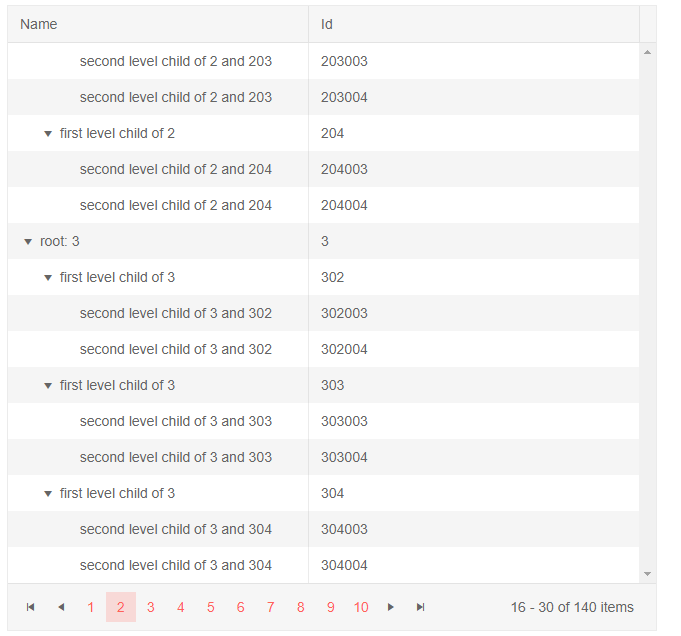

# TreeList Paging

The TreeList component offers support for paging.

To enable paging, set its `Pageable` property to `true`.

You can control the number of records per page through the `PageSize` property.

You can set the current page of the treelist through its integer `Page` property.

Paging is calculated for the currently expanded and visible items. Children in collapsed nodes are not included in the total count. Thus, expanding or collapsing a node (row) can change the items you see on the current page.

>caption Enable paging in Telerik TreeList

````CSHTML
Enable paging and start on the second page.

<TelerikTreeList Data="@Data"
                 Pageable="true" PageSize="15" Page="2"
                 IdField="Id" ParentIdField="ParentId"
                 Width="650px">
    <TreeListColumns>
        <TreeListColumn Field="Name" Expandable="true" Width="300px"></TreeListColumn>
        <TreeListColumn Field="Id"></TreeListColumn>
    </TreeListColumns>
</TelerikTreeList>

@code {
    public List<Employee> Data { get; set; }

    protected override async Task OnInitializedAsync()
    {
        Data = await GetTreeListData();
    }

    // sample models and data generation

    public class Employee
    {
        public int Id { get; set; }
        public int? ParentId { get; set; }
        public string Name { get; set; }
    }

    async Task<List<Employee>> GetTreeListData()
    {
        List <Employee> data = new List<Employee>();

        for (int i = 1; i < 15; i++)
        {
            data.Add(new Employee
            {
                Id = i,
                ParentId = null,
                Name = $"root: {i}"
            });

            for (int j = 2; j < 5; j++)
            {
                int currId = i * 100 + j;
                data.Add(new Employee
                {
                    Id = currId,
                    ParentId = i,
                    Name = $"first level child of {i}"
                });

                for (int k = 3; k < 5; k++)
                {
                    data.Add(new Employee
                    {
                        Id = currId * 1000 + k,
                        ParentId = currId,
                        Name = $"second level child of {i} and {currId}"
                    }); ;
                }
            }
        }

        return await Task.FromResult(data);
    }
}
````

>caption The result from the code snippet above



>tip You can bind the values of those properties to variables in the `@code {}` section. If you want to bind the page index to a variable, you must use the `@bind-Page="@MyPageIndexVariable"` syntax.

Here is one way to implement a page size choice that puts all records on one page.

>caption Bind Page Size to a variable

````CSHTML
Dynamic page size change

<select @onchange=@ChangePageSize>
	@for (int i = 1; i < 4; i++)
	{
		<option value=@(i*10)>@(i * 10)</option>
	}
	<option value="all" selected>all</option>
</select>

<TelerikGrid Data="@MyData" Pageable="true" PageSize="@PageSize">
	<GridColumns>
		<GridColumn Field="ID"></GridColumn>
		<GridColumn Field="TheName" Title="Employee Name"></GridColumn>
	</GridColumns>
</TelerikGrid>

@code {
	public IEnumerable<object> MyData = Enumerable.Range(1, 50).Select(x => new { ID = x, TheName = "name " + x });

	protected int PageSize { get; set; }

	protected void ChangePageSize(ChangeEventArgs e)
	{
		if (e.Value.ToString().ToLowerInvariant() == "all")
		{
			PageSize = MyData.Count();
		}
		else
		{
			PageSize = int.Parse(e.Value.ToString());
		}
	}
}
````

## See Also

  * [Live Demo: Grid Paging](https://demos.telerik.com/blazor-ui/grid/paging)
