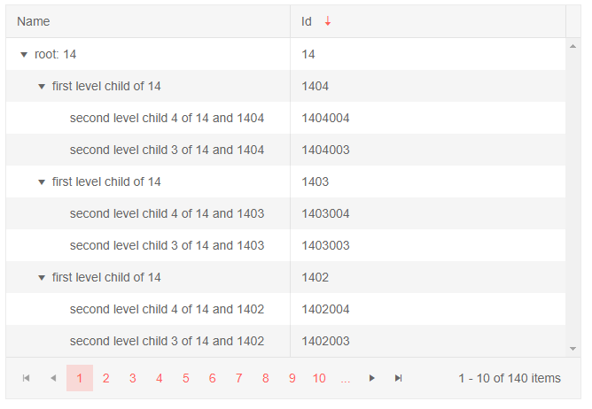

# TreeList Sorting

The TreeList component offers support for sorting.

To enable sorting, set the `Sortable` parameter to `true`.

When the user clicks the column header, the treelist will sort the data according to the column's data type, and an arrow indicator of the sorting direction will be shown next to the column title. Note that the hierarchical structure is kept, so an item's parent(s) will appear before the item.

You can prevent the user from sorting a certain field by setting `Sortable="false"` on its column.

You can sort the treelist on the different columns and sorting is done according to the rules for the concrete column type (for example, rules for a `string` are different from rules for an `int`).

>caption Enable Sorting in Telerik TreeList

````CSHTML
Click a column header to sort by its data

<TelerikTreeList Data="@Data" Sortable="true"
                 Pageable="true" IdField="Id" ParentIdField="ParentId" Width="650px">
    <TreeListColumns>
        <TreeListColumn Field="Name" Expandable="true" Width="320px"></TreeListColumn>
        <TreeListColumn Field="Id"></TreeListColumn>
    </TreeListColumns>
</TelerikTreeList>

@code {
    public List<Employee> Data { get; set; }

    protected override async Task OnInitializedAsync()
    {
        Data = await GetTreeListData();
    }

    // sample models and data generation

    public class Employee
    {
        public int Id { get; set; }
        public int? ParentId { get; set; }
        public string Name { get; set; }
    }

    async Task<List<Employee>> GetTreeListData()
    {
        List<Employee> data = new List<Employee>();

        for (int i = 1; i < 15; i++)
        {
            data.Add(new Employee
            {
                Id = i,
                ParentId = null,
                Name = $"root: {i}"
            });

            for (int j = 2; j < 5; j++)
            {
                int currId = i * 100 + j;
                data.Add(new Employee
                {
                    Id = currId,
                    ParentId = i,
                    Name = $"first level child of {i}"
                });

                for (int k = 3; k < 5; k++)
                {
                    data.Add(new Employee
                    {
                        Id = currId * 1000 + k,
                        ParentId = currId,
                        Name = $"second level child {k} of {i} and {currId}"
                    }); ;
                }
            }
        }

        return await Task.FromResult(data);
    }
}
````

>caption The result from the code snippet above, after the user clicked twice on the "ID" header to sort it in descending order



## See Also

  * [Live Demo: TreeList Sorting](https://demos.telerik.com/blazor-ui/treelist/sorting)
   
