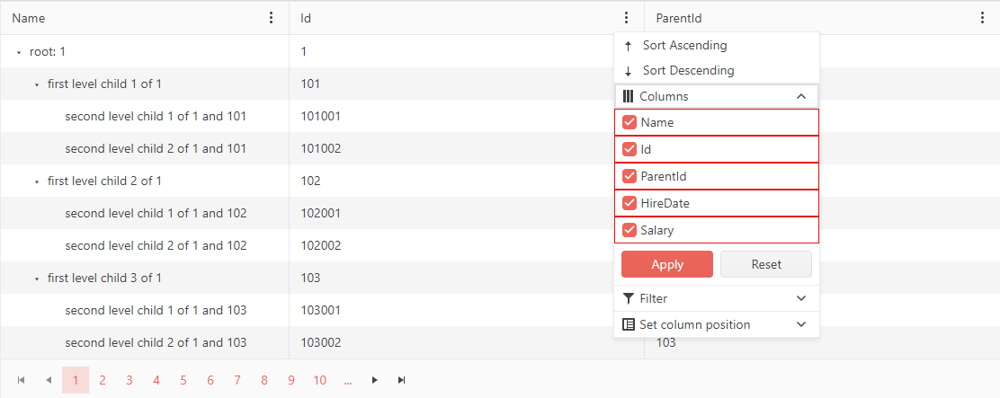

# Column Chooser Template

The Column Chooser Template lets you control the rendering of the [ColumnChooser](slug:treelist-column-menu#column-chooser). It exposes a [`context`](slug:Telerik.Blazor.Components.ColumnMenuChooserTemplateContext) object that contains a list of all columns in the TreeList. 

When you set up the Column Chooser Template, the list of columns that are rendered by default will not be present.

>caption Using the Template to provide custom rendering

````RAZOR
@* Use the Template to render the list of columns and add some custom styles. *@ 

<TelerikTreeList Data="@TreeListData"
                 IdField="@nameof(Employee.Id)"
                 ParentIdField="@nameof(Employee.ParentId)"
                 Pageable="true"
                 Reorderable="true"
                 Sortable="true"
                 Resizable="true"
                 FilterMode="@TreeListFilterMode.FilterMenu"
                 ShowColumnMenu="true">
                 <TreeListSettings>
                     <TreeListColumnMenuSettings>
                         <TreeListColumnMenuChooser>
                             <Template>
                                @{
                                    var columns = context.Columns;
                                    foreach(var column in columns)
                                    {
                                        <div style="border: solid 1px red">
                                        <TreeListColumnMenuChooserItem Title="@column.DisplayTitle" ColumnId="@column.Id"></TreeListColumnMenuChooserItem>
                                        </div>
                                    }
                                }
                             </Template>
                         </TreeListColumnMenuChooser>
                     </TreeListColumnMenuSettings>
                 </TreeListSettings>
    <TreeListColumns>
        <TreeListColumn Field="@nameof(Employee.Name)" Expandable="true" Width="320px" Id="name-column-id" />
        <TreeListColumn Field="@nameof(Employee.Id)" Lockable="true" Id="id-column-id" />
        <TreeListColumn Field="@nameof(Employee.ParentId)" Id="parentid-column-id" />
        <TreeListColumn Field="@nameof(Employee.HireDate)" Id="hiredate-column-id" />
        <TreeListColumn Field="@nameof(Employee.Salary)" Id="salary-column-id" />
    </TreeListColumns>
</TelerikTreeList>

@code {
    private List<Employee> TreeListData { get; set; }

    private async Task<List<Employee>> GetTreeListData()
    {
        List<Employee> data = new List<Employee>();

        for (int i = 1; i < 15; i++)
        {
            data.Add(new Employee
                {
                    Id = i,
                    ParentId = null,
                    Name = $"root: {i}",
                    HireDate = DateTime.Now.AddYears(-i),
                    Salary = 3000 + i * 100
                }); ;

            for (int j = 1; j < 4; j++)
            {
                int currId = i * 100 + j;
                data.Add(new Employee
                    {
                        Id = currId,
                        ParentId = i,
                        Name = $"first level child {j} of {i}",
                        HireDate = DateTime.Now.AddDays(-currId),
                        Salary = 2000 + i * 200
                    });

                for (int k = 1; k < 3; k++)
                {
                    int nestedId = currId * 1000 + k;
                    data.Add(new Employee
                        {
                            Id = nestedId,
                            ParentId = currId,
                            Name = $"second level child {k} of {i} and {currId}",
                            HireDate = DateTime.Now.AddMinutes(-nestedId),
                            Salary = 1000 + i * 200
                        }); ;
                }
            }
        }

        return await Task.FromResult(data);
    }

    protected override async Task OnInitializedAsync()
    {
        TreeListData = await GetTreeListData();
    }

    public class Employee
    {
        public int Id { get; set; }
        public int? ParentId { get; set; }
        public string Name { get; set; }
        public DateTime HireDate { get; set; }
        public int Salary { get; set; }
    }
}
````

>caption The result from the code snippet above



## See Also

 * [Live Demo: TreeList Templates](https://demos.telerik.com/blazor-ui/treelist/templates)
 * [Live Demo: TreeList Column Menu](https://demos.telerik.com/blazor-ui/treelist/column-menu)
 * [Live Demo: TreeList Custom Column Menu](https://demos.telerik.com/blazor-ui/treelist/custom-column-menu)
 * [Columns Menu](slug:treelist-column-menu)
