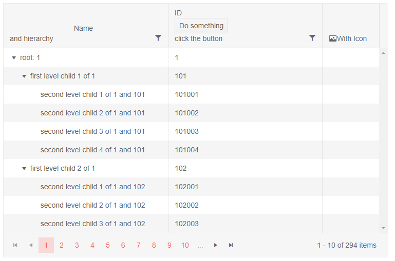

# Column Header Template

Bound columns render the name of the field or their `Title` in their header. Through the `HeaderTemplate`, you can define custom content there instead of the title text.

>caption Sample Header Template

````CSHTML
@* Header templates override the built-in title but leave sorting indicators and filter menu icons *@

<TelerikTreeList Data="@Data" Pageable="true" IdField="Id" ParentIdField="ParentId"
                 Width="750px" FilterMode="@TreeListFilterMode.FilterMenu" Sortable="true">
    <TreeListColumns>
        <TreeListColumn Field="Name" Expandable="true" Width="320px">
            <HeaderTemplate>
                <div style="text-align:center">Name</div>
                @* this is a block element and it will push the sorting indicator, see the notes below *@
                and hierarchy
            </HeaderTemplate>
        </TreeListColumn>
        <TreeListColumn Field="Id" Width="300px">
            <HeaderTemplate>
                ID<br />
                <TelerikButton OnClick="@DoSomething">Do something</TelerikButton>
                <br />
                @{
                    if (!string.IsNullOrEmpty(result))
                    {
                        <span style="color:red;">@result</span>
                    }
                    else
                    {
                        <div>click the button</div>
                    }
                }
            </HeaderTemplate>
        </TreeListColumn>
        <TreeListColumn>
            <HeaderTemplate>
                <span class="k-display-flex k-align-items-center">
                    <TelerikIcon Icon="@IconName.Image" />
                    With Icon
                </span>
            </HeaderTemplate>
        </TreeListColumn>
    </TreeListColumns>
</TelerikTreeList>

@code {
    public List<Employee> Data { get; set; }

    protected override async Task OnInitializedAsync()
    {
        Data = await GetTreeListData();
    }

    string result { get; set; }
    void DoSomething()
    {
        result = $"button clicked on {DateTime.Now}";
    }

    // sample models and data generation

    public class Employee
    {
        public int Id { get; set; }
        public int? ParentId { get; set; }
        public string Name { get; set; }
    }

    async Task<List<Employee>> GetTreeListData()
    {
        List<Employee> data = new List<Employee>();

        for (int i = 1; i < 15; i++)
        {
            data.Add(new Employee
            {
                Id = i,
                ParentId = null,
                Name = $"root: {i}"
            });

            for (int j = 1; j < 5; j++)
            {
                int currId = i * 100 + j;
                data.Add(new Employee
                {
                    Id = currId,
                    ParentId = i,
                    Name = $"first level child {j} of {i}"
                });

                for (int k = 1; k < 5; k++)
                {
                    data.Add(new Employee
                    {
                        Id = currId * 1000 + k,
                        ParentId = currId,
                        Name = $"second level child {k} of {i} and {currId}"
                    }); ;
                }
            }
        }

        return await Task.FromResult(data);
    }
}

````

>caption The result from the code snippet above



>note Header Templates are not available for the `TreeListCheckboxColumn` and the `TreeListCommandColumn`.

>note If you need to use block elements in the header templates, keep in mind that they will push the sort indicator out of its expected position. If you cannot avoid block elements (such as in the Name column above), add a CSS rule like the ones below to adjust the sort indicator.

>caption Sort indicator adjustments when block elements are in the header template

````CSS
.k-treelist th.k-header .k-icon.k-i-sort-asc-sm,
.k-treelist th.k-header .k-icon.k-i-sort-desc-sm {
    position: absolute;
    right: 0;
    top: 8px;
}

/* OR */

.k-treelist-header .k-header > .k-link {
    padding-right: 1.5em;
}

    .k-treelist-header .k-header > .k-link > .k-icon {
        position: absolute;
        top: 50%;
        right: 0.5em;
        transform: translateY(-50%);
        margin-left: 0;
    }

.k-treelist-header .k-sort-order {
    position: absolute;
    right: 0.25em;
}
````

## See Also

 * [Live Demo: TreeList Templates](https://demos.telerik.com/blazor-ui/treelist/templates)

