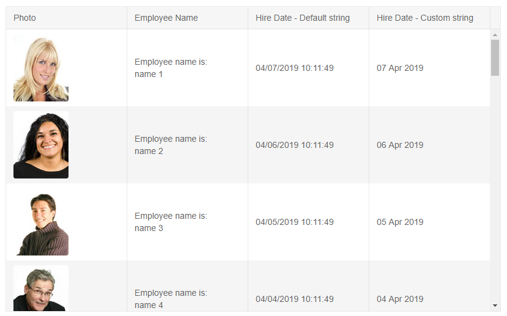

# Column Template

By default, the grid renders the value of the field in the column, as it is provided from the data source. You can change this behavior by using the `Template` of the column and add your own content and/or logic to make a string out of the object.

The example below shows how to:

* set the `Template` (make sure to use the capital `T`, at the time of writing the Visual Studio autocomplete tends to use the lowercase `t` which breaks the template logic and does not allow you to access the context)
* access the `context` of the model item so you can employ your own logic
* set HTML in the column
* use inline or multi-line template
* take the field name from the model

>caption Using cell (column) template

````CSHTML
Cell template that renders an image based on model data

<TelerikGrid Data="@MyData" Height="500px">
	<GridColumns>
		<GridColumn Field="@(nameof(SampleData.ID))" Title="Photo">
			<Template>
				@{
					var employee = context as SampleData;
					
				}
			</Template>
		</GridColumn>
		<GridColumn Field="@(nameof(SampleData.Name))" Title="Employee Name">
			<Template>
				Employee name is:
				<br />
				@((context as SampleData).Name)
			</Template>
		</GridColumn>
		<GridColumn Field="HireDate" Title="Hire Date - Default string">
		</GridColumn>
		<GridColumn Field="HireDate" Title="Hire Date - Custom string">
			<Template>
				@((context as SampleData).HireDate.ToString("dd MMM yyyy"))
			</Template>
		</GridColumn>
	</GridColumns>
</TelerikGrid>

@code {
	public class SampleData
	{
		public int ID { get; set; }
		public string Name { get; set; }
		public DateTime HireDate { get; set; }
	}

	public IEnumerable<SampleData> MyData = Enumerable.Range(1, 50).Select(x => new SampleData
	{
		ID = x,
		Name = "name " + x,
		HireDate = DateTime.Now.AddDays(-x)
	});
}
````

>caption The result from the code snippet above



## See Also

 * [Live Demo: Grid Templates](https://demos.telerik.com/blazor-ui/grid/templates)
 * [Live Demo: Grid Custom Editor Template](https://demos.telerik.com/blazor-ui/grid/customeditor)

