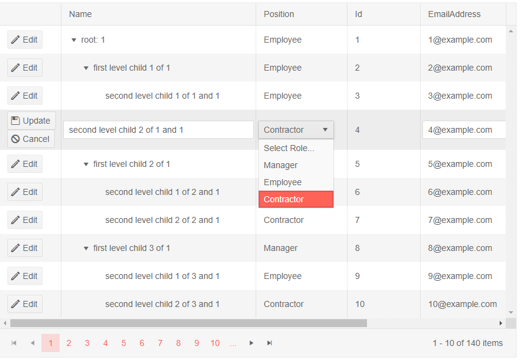

# Edit Template

The column's `EditTemplate` defines the inline template or component that will be rendered when the user is [editing](#editing) the field. It is also used when inserting a new item.

You can data bind components in it to the current context, which is an instance of the model the treelist is bound to. You will need a global variable that is also an instance of the model to store those changes. The model the template receives is a copy of the original model, so that changes can be cancelled (the `Cancel` command).

If you need to perform logic more complex than simple data binding, use the change event of the custom editor component to perform it. You can also consider using a custom edit form outside of the treelist.

>note As of version 2.23.0 of Telerik UI for Blazor the TreeList row creates `EditContext` and passes it to the `EditorTemplate`. You can read more about it in the notes section of [editing/overview](../editing/overview#notes) article).

>caption Sample edit template

````CSHTML
@* This example shows how to use a dropdownlist to edit strings. You can implement any desired logic instead.
    If you have an enum, the treelist can edit and filter it out-of-the-box without the need for an edit template *@
@* For brevity, only Editing is implemented in this sample *@

<TelerikTreeList Data="@Data"
                 EditMode="@TreeListEditMode.Inline"
                 OnUpdate="@UpdateItem"
                 Pageable="true" ItemsField="@(nameof(Employee.DirectReports))"
                 Width="850px">
    <TreeListColumns>
        <TreeListCommandColumn Width="100px">
            <TreeListCommandButton Command="Edit" Icon="edit">Edit</TreeListCommandButton>
            <TreeListCommandButton Command="Save" Icon="save" ShowInEdit="true">Update</TreeListCommandButton>
            <TreeListCommandButton Command="Cancel" Icon="cancel" ShowInEdit="true">Cancel</TreeListCommandButton>
        </TreeListCommandColumn>

        <TreeListColumn Field="Name" Expandable="true" Width="320px" />
        <TreeListColumn Field="Role" Width="150px" Title="Position">
            <EditorTemplate>
                @{
                    CurrentlyEditedEmployee = context as Employee;
                    <TelerikDropDownList Data="@Roles" @bind-Value="@CurrentlyEditedEmployee.Role"
                                         Width="100%" PopupHeight="auto" DefaultText="Select Role...">
                    </TelerikDropDownList>
                }
            </EditorTemplate>
        </TreeListColumn>
        <TreeListColumn Field="Id" Editable="false" Width="120px" />
        <TreeListColumn Field="EmailAddress" Width="220px" />
        <TreeListColumn Field="HireDate" Width="220px" />
    </TreeListColumns>
</TelerikTreeList>

@code {
    List<Employee> Data { get; set; }
    static List<string> Roles { get; set; }
    Employee CurrentlyEditedEmployee { get; set; }

    // Sample CUD operations for the local data
    async Task UpdateItem(TreeListCommandEventArgs args)
    {
        var item = args.Item as Employee;

        // perform actual data source operations here through your service
        await MyService.Update(item);

        // update the local view-model data with the service data
        await GetTreeListData();
    }


    // sample model

    public class Employee
    {
        public int Id { get; set; }
        public string Name { get; set; }
        public string Role { get; set; }
        public string EmailAddress { get; set; }
        public DateTime HireDate { get; set; }

        public List<Employee> DirectReports { get; set; }
        public bool HasChildren { get; set; }

        // Used for the editing so replacing the object in the view-model data
        // will treat it as the same object and keep its state - otherwise it will
        // collapse after editing is done, which is not what the user would expect
        public override bool Equals(object obj)
        {
            if (obj is Employee)
            {
                return this.Id == (obj as Employee).Id;
            }
            return false;
        }
    }

    // data generation

    async Task GetTreeListData()
    {
        Data = await MyService.Read();
        Roles = await MyService.GetRoles();
    }

    protected override async Task OnInitializedAsync()
    {
        await GetTreeListData();
    }

    // the following static class mimics an actual data service that handles the actual data source
    // replace it with your actual service through the DI, this only mimics how the API can look like and works for this standalone page
    public static class MyService
    {
        private static List<Employee> _data { get; set; } = new List<Employee>();
        private static List<string> Roles = new List<string> { "Manager", "Employee", "Contractor" };
        // used in this example for data generation and retrieval for CUD operations on the current view-model data
        private static int LastId { get; set; } = 1;

        public static async Task<List<string>> GetRoles()
        {
            return await Task.FromResult(Roles);
        }

        public static async Task<List<Employee>> Read()
        {
            if (_data.Count < 1)
            {
                for (int i = 1; i < 15; i++)
                {
                    Employee root = new Employee
                    {
                        Id = LastId,
                        Name = $"root: {i}",
                        Role = Roles[i % Roles.Count],
                        EmailAddress = $"{i}@example.com",
                        HireDate = DateTime.Now.AddYears(-i),
                        DirectReports = new List<Employee>(),
                        HasChildren = true
                    };
                    _data.Add(root);
                    LastId++;

                    for (int j = 1; j < 4; j++)
                    {
                        int currId = LastId;
                        Employee firstLevelChild = new Employee
                        {
                            Id = currId,
                            Name = $"first level child {j} of {i}",
                            Role = Roles[j % Roles.Count],
                            EmailAddress = $"{currId}@example.com",
                            HireDate = DateTime.Now.AddDays(-currId),
                            DirectReports = new List<Employee>(),
                            HasChildren = true
                        };
                        root.DirectReports.Add(firstLevelChild);
                        LastId++;

                        for (int k = 1; k < 3; k++)
                        {
                            int nestedId = LastId;
                            firstLevelChild.DirectReports.Add(new Employee
                            {
                                Id = LastId,
                                Name = $"second level child {k} of {j} and {i}",
                                Role = Roles[k % Roles.Count],
                                EmailAddress = $"{nestedId}@example.com",
                                HireDate = DateTime.Now.AddMinutes(-nestedId)
                            }); ;
                            LastId++;
                        }
                    }
                }
            }

            return await Task.FromResult(_data);
        }

        public static async Task Update(Employee itemToUpdate)
        {
            UpdateItemRecursive(_data, itemToUpdate);
        }

        // sample helper methods for handling the view-model data hierarchy
        static void UpdateItemRecursive(List<Employee> items, Employee itemToUpdate)
        {
            for (int i = 0; i < items.Count; i++)
            {
                if (items[i].Id.Equals(itemToUpdate.Id))
                {
                    items[i] = itemToUpdate;
                    return;
                }

                if (items[i].DirectReports?.Count > 0)
                {
                    UpdateItemRecursive(items[i].DirectReports, itemToUpdate);
                }
            }
        }
    }
}
````

>caption The result from the code snippet above, after Edit was clicked on the row with ID 4, and the user expanded the dropdown from the template



## See Also

 * [TreeList Editing]()
 * [Live Demo: TreeList Templates](https://demos.telerik.com/blazor-ui/treelist/templates)
 * [Live Demo: TreeList Custom Editor Template](https://demos.telerik.com/blazor-ui/treelist/customeditor)

