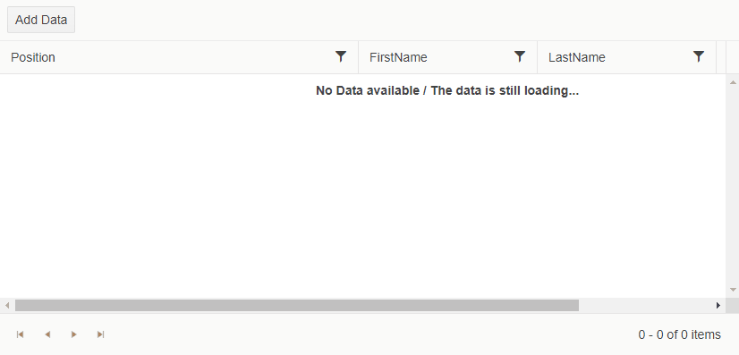

# No Data Template

The `NoDataTemplate` allows you to define custom content when the TreeList has no data to show. It overrides the currently available **"No records available."**.

>caption The result from the code snippet below



>caption Use the NoDataTemplate to override the message shown while the data is still loading or when you try to filter a non-existing item

````CSHTML
@* The example showcases a TreeList with a delay upon initializing its data and filtering on non-existing data *@

<TelerikTreeList Data="@Data"
                 ItemsField="DirectReports"
                 HasChildrenField="HasReports"
                 Pageable="true"
                 Sortable="true"
                 FilterMode="@TreeListFilterMode.FilterMenu"
                 Width="830px" Height="400px">
    <TreeListColumns>
        <TreeListColumn Expandable="true" Field="Position" Width="400px" />
        <TreeListColumn Field="FirstName" Width="200px" />
        <TreeListColumn Field="LastName" Width="200px" />
        <TreeListColumn Field="EmployeeId" Width="100px" />
    </TreeListColumns>
    <NoDataTemplate>
        <strong>No Data available / The data is still loading...</strong>
    </NoDataTemplate>
</TelerikTreeList>
@code {
    public class EmployeeHierarchical
    {
        public int EmployeeId { get; set; }
        public string FirstName { get; set; }
        public string LastName { get; set; }
        public string Position { get; set; }
        public List<EmployeeHierarchical> DirectReports { get; set; }
        public bool HasReports { get; set; }
    }

    public List<EmployeeHierarchical> Data { get; set; }

    protected override async Task OnInitializedAsync()
    {
        Data = await GetEmployees();
    }

    async Task<List<EmployeeHierarchical>> GetEmployees()
    {
        await Task.Delay(3000);

        List<EmployeeHierarchical> sampleData = new List<EmployeeHierarchical>();

        EmployeeHierarchical theCEO = new EmployeeHierarchical
        {
            EmployeeId = 1,
            FirstName = "Daryl",
            LastName = "Sweeney",
            Position = "CEO",
            HasReports = true
        };

        theCEO.DirectReports = new List<EmployeeHierarchical>
        {
            new EmployeeHierarchical
            {
                EmployeeId = 2,
                FirstName = "Guy",
                LastName = "Wooten",
                Position = "Chief Technical Officer",
                HasReports = true
            },
            new EmployeeHierarchical
            {
                EmployeeId = 3,
                FirstName = "Nevada",
                LastName = "Hart",
                Position = "Chief Financial Officer",
                HasReports = true,
                DirectReports = new List<EmployeeHierarchical>
                {
                    new EmployeeHierarchical
                    {
                        EmployeeId = 24,
                        FirstName = "Zena",
                        LastName = "Stanford",
                        Position = "VP, Finance"
                    }
                }
            }
        };

        theCEO.DirectReports[0].DirectReports = new List<EmployeeHierarchical>
        {
            new EmployeeHierarchical
            {
                EmployeeId = 4,
                FirstName = "Buffy",
                LastName = "Weber",
                Position = "VP, Engineering",
                HasReports = true,
                DirectReports = new List<EmployeeHierarchical>
                {
                    new EmployeeHierarchical
                    {
                        EmployeeId = 6,
                        FirstName = "Hyacinth",
                        LastName = "Hood",
                        Position = "Team Lead",
                        HasReports = true,
                        DirectReports = new List<EmployeeHierarchical>
                        {
                            new EmployeeHierarchical
                            {
                                EmployeeId = 7,
                                FirstName = "Akeem",
                                LastName = "Carr",
                                Position = "Software Developer, Junior"
                            },
                            new EmployeeHierarchical
                            {
                                EmployeeId = 8,
                                FirstName = "Rinah",
                                LastName = "Simon",
                                Position = "Software Developer"
                            }
                        }
                    },
                    new EmployeeHierarchical
                    {
                        EmployeeId = 9,
                        FirstName = "Gage",
                        LastName = "Daniels",
                        Position = "Software Architect"
                    },
                    new EmployeeHierarchical
                    {
                        EmployeeId = 10,
                        FirstName = "Constance",
                        LastName = "Vazquez",
                        Position = "Director, Engineering",
                        HasReports = true,
                        DirectReports = new List<EmployeeHierarchical>
                        {
                            new EmployeeHierarchical
                            {
                                EmployeeId = 11,
                                FirstName = "Darrel",
                                LastName = "Solis",
                                Position = "Team Lead",
                                HasReports = true,
                                DirectReports = new List<EmployeeHierarchical>
                                {
                                    new EmployeeHierarchical
                                    {
                                        EmployeeId = 12,
                                        FirstName = "Brian",
                                        LastName = "Yang",
                                        Position = "Software Developer, Senior"
                                    },
                                    new EmployeeHierarchical
                                    {
                                        EmployeeId = 13,
                                        FirstName = "Lillian",
                                        LastName = "Bradshaw",
                                        Position = "Software Developer"
                                    },
                                    new EmployeeHierarchical
                                    {
                                        EmployeeId = 14,
                                        FirstName = "Keiko",
                                        LastName = "Espinoza",
                                        Position = "QA Engineer, Junior"
                                    }
                                }
                            }
                        }
                    }
                }
            },
            new EmployeeHierarchical
            {
                EmployeeId = 5,
                FirstName = "Skyler",
                LastName = "Cleveland",
                Position = "VP, Engineering",
                HasReports = true,
                DirectReports = new List<EmployeeHierarchical>
                {
                    new EmployeeHierarchical
                    {
                        EmployeeId = 16,
                        FirstName = "Karleigh",
                        LastName = "Garza",
                        Position = "Team Lead",
                        HasReports = true,
                        DirectReports = new List<EmployeeHierarchical>
                        {
                            new EmployeeHierarchical
                            {
                                EmployeeId = 17,
                                FirstName = "Elmo",
                                LastName = "Tyson",
                                Position = "Software Developer"
                            },
                            new EmployeeHierarchical
                            {
                                EmployeeId = 18,
                                FirstName = "Stacey",
                                LastName = "Lynn",
                                Position = "QA Engineer",
                                HasReports = true,
                                DirectReports = new List<EmployeeHierarchical>
                                {
                                    new EmployeeHierarchical
                                    {
                                        EmployeeId = 19,
                                        FirstName = "Meredith",
                                        LastName = "Parish",
                                        Position = "QA Engineer, Junior"
                                    }
                                }
                            },
                            new EmployeeHierarchical
                            {
                                EmployeeId = 20,
                                FirstName = "Martha",
                                LastName = "Sargent",
                                Position = "Software Developer, Senior"
                            },
                            new EmployeeHierarchical
                            {
                                EmployeeId = 21,
                                FirstName = "Cassady",
                                LastName = "Whitley",
                                Position = "Software Developer"
                            },
                            new EmployeeHierarchical
                            {
                                EmployeeId = 22,
                                FirstName = "Haviva",
                                LastName = "Campbell",
                                Position = "Support Officer"
                            },
                            new EmployeeHierarchical
                            {
                                EmployeeId = 23,
                                FirstName = "Cameron",
                                LastName = "Ayers",
                                Position = "Support Officer"
                            }
                        }
                    }
                }
            }
        };

        sampleData.Add(theCEO);

        return await Task.FromResult(sampleData);
    }
}
````

## See Also

 * [Live Demo: TreeList Templates](https://demos.telerik.com/blazor-ui/treelist/templates)
 * [Live Demo: TreeList - No Data Template](https://demos.telerik.com/blazor-ui/treelist/no-data-template)

