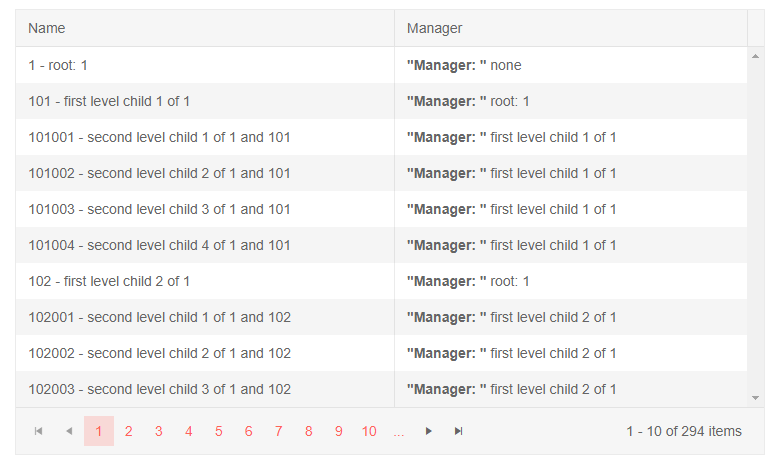

# Row Template

The row template allows you to define in your own code the entire contents of the `<tr>` element the treelist will render for each record. To set it, provide contents to the `<RowTemplate>` inner tag of the treelist.

It can be convenient if you want to use templates for most or all of the columns, as it requires less markup than setting individual templates for many columns.

The contents of the row template must be `<td>` elements and their number (or total `colspan`) must match the number of columns defined in the treelist.

You can use the `Context` attribute of the `<RowTemplate>` tag of the treelist to set the name of the context variable. Its type is the model type to which the treelist is bound.

>important Using the row template takes functionality away from the treelist because it no longer controls its own rendering. For example, editing could not render editors, expand-collapse arrows will not be available, column resizing and reordering cannot change the data cells anymore, only the headers, and row selection must be implemented by the app.

>caption Using a row template

````CSHTML
Render the entire row with your own code and logic

<TelerikTreeList Data="@Data" Pageable="true" IdField="Id" ParentIdField="ParentId" Width="750px">
    <TreeListColumns>
        <TreeListColumn Field="Name" Expandable="true" Width="320px">
        </TreeListColumn>
        <TreeListColumn Title="Manager" Width="300px">
        </TreeListColumn>
    </TreeListColumns>
    <RowTemplate Context="employee">
        <td>
            @employee.Id - @employee.Name
        </td>
        <td>
            @{ var manager = Data.FirstOrDefault(d => d.Id.Equals(employee.ParentId));
                <strong>"Manager: "</strong> @(manager == null ? "none" : manager.Name) }
        </td>
    </RowTemplate>
</TelerikTreeList>

@code {
    public List<Employee> Data { get; set; }

    protected override async Task OnInitializedAsync()
    {
        Data = await GetTreeListData();
    }

    // sample models and data generation

    public class Employee
    {
        public int Id { get; set; }
        public int? ParentId { get; set; }
        public string Name { get; set; }
    }

    async Task<List<Employee>> GetTreeListData()
    {
        List<Employee> data = new List<Employee>();

        for (int i = 1; i < 15; i++)
        {
            data.Add(new Employee
            {
                Id = i,
                ParentId = null,
                Name = $"root: {i}"
            });

            for (int j = 1; j < 5; j++)
            {
                int currId = i * 100 + j;
                data.Add(new Employee
                {
                    Id = currId,
                    ParentId = i,
                    Name = $"first level child {j} of {i}"
                });

                for (int k = 1; k < 5; k++)
                {
                    data.Add(new Employee
                    {
                        Id = currId * 1000 + k,
                        ParentId = currId,
                        Name = $"second level child {k} of {i} and {currId}"
                    }); ;
                }
            }
        }

        return await Task.FromResult(data);
    }
}
````

>caption The result from the code snippet above - the treelist looks like a grid and does not showcase the records hierarchy




## See Also

 * [Live Demo: TreeList Templates](https://demos.telerik.com/blazor-ui/treelist/templates)

