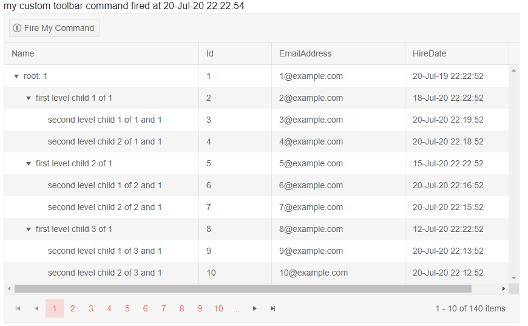
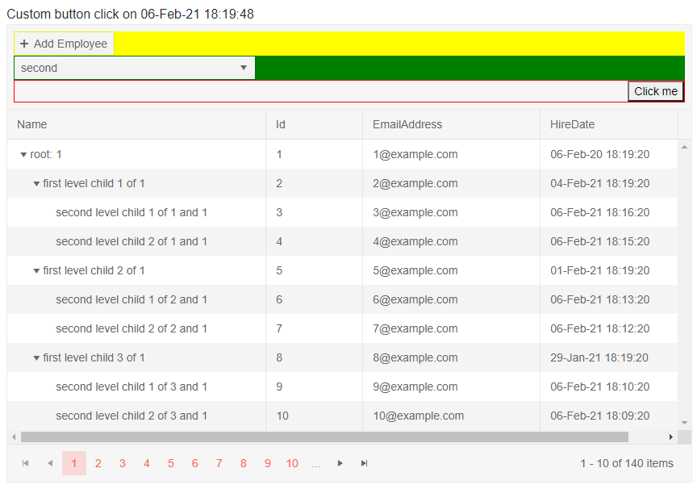

# TreeList Toolbar

The treelist provides a toolbar where you can add a variety of actions that are not tied to a concrete row.

To use a toolbar, define the `TreeListToolBar` tag of the treelist. In it, you can use arbitrary HTML and components to get the desired layout, and also `TreeListCommandButton` instances in (you can read more about the features available in those buttons in the [Command Column]() article).

>note The toolbar is not associated with an item from the data source. The `Item` and `ParentItem` fields on the click event handler argument of a `TreeListCommandButton` will always be `null`, and the `Edit`, `Update`, `Cancel` commands do not work with it.

In this article, you will learn how to use:

* [Built-in Commands](#built-in-commands)
* [Custom Commands](#custom-commands)
* [Custom Layout](#custom-layout)


## Built-in Commands

The treelist offers built-in commands that you can invoke through its toolbar. To use them, set the `Command` property of the button to the command name. The built-in command names are:

* `Add` - starts inserting a new item in the treelist.

For an example of using the toolbar to insert a new item, see the [TreeList Editing Overview]() article.

## Custom Commands

You can use the toolbar to add buttons that invoke actions specific to your application.

>caption How to define a custom command in the treelist toolbar

````CSHTML
@result

<TelerikTreeList Data="@Data" Pageable="true" ItemsField="@(nameof(Employee.DirectReports))" Width="850px">

    <TreeListToolBar>
        <TreeListCommandButton Command="MyToolbarCommand" OnClick="@MyCommandFromToolbar" Icon="info">Fire My Command</TreeListCommandButton>
    </TreeListToolBar>

    <TreeListColumns>
        <TreeListColumn Field="Name" Expandable="true" Width="320px" />
        <TreeListColumn Field="Id" Editable="false" Width="120px" />
        <TreeListColumn Field="EmailAddress" Width="220px" />
        <TreeListColumn Field="HireDate" Width="220px" />
    </TreeListColumns>
</TelerikTreeList>

@code {
    public List<Employee> Data { get; set; }

    // sample custom command handling
    string result;
    async Task MyCommandFromToolbar(TreeListCommandEventArgs args)
    {
        //note - the args.Item object is null because the command item is not associated with an item

        result = "my custom toolbar command fired at " + DateTime.Now.ToString();
    }

    // sample model

    public class Employee
    {
        public int Id { get; set; }
        public string Name { get; set; }
        public string EmailAddress { get; set; }
        public DateTime HireDate { get; set; }

        public List<Employee> DirectReports { get; set; }
        public bool HasChildren { get; set; }
    }

    // data generation
    public int LastId { get; set; } = 1;
    protected override async Task OnInitializedAsync()
    {
        Data = await GetTreeListData();
    }

    async Task<List<Employee>> GetTreeListData()
    {
        List<Employee> data = new List<Employee>();

        for (int i = 1; i < 15; i++)
        {
            Employee root = new Employee
            {
                Id = LastId,
                Name = $"root: {i}",
                EmailAddress = $"{i}@example.com",
                HireDate = DateTime.Now.AddYears(-i),
                DirectReports = new List<Employee>(),
                HasChildren = true
            };
            data.Add(root);
            LastId++;

            for (int j = 1; j < 4; j++)
            {
                int currId = LastId;
                Employee firstLevelChild = new Employee
                {
                    Id = currId,
                    Name = $"first level child {j} of {i}",
                    EmailAddress = $"{currId}@example.com",
                    HireDate = DateTime.Now.AddDays(-currId),
                    DirectReports = new List<Employee>(),
                    HasChildren = true
                };
                root.DirectReports.Add(firstLevelChild);
                LastId++;

                for (int k = 1; k < 3; k++)
                {
                    int nestedId = LastId;
                    firstLevelChild.DirectReports.Add(new Employee
                    {
                        Id = LastId,
                        Name = $"second level child {k} of {j} and {i}",
                        EmailAddress = $"{nestedId}@example.com",
                        HireDate = DateTime.Now.AddMinutes(-nestedId)
                    }); ;
                    LastId++;
                }
            }
        }

        return await Task.FromResult(data);
    }
}

````

>caption The result from the code snippet above, after the custom command button in the toolbar was clicked



## Custom Layout

You can add your own HTML and components to create a more complex layout in the treelist header to match your business needs. You can still use the treelist command buttons, as well as other components and logic.

>caption Custom TreeList Toolbar Layout

````CSHTML
@* for brevity the insert operation is not implemented in this sample *@

@result

<TelerikTreeList Data="@Data" Pageable="true" ItemsField="@(nameof(Employee.DirectReports))" Width="850px">

    <TreeListToolBar>
        <div style="display: block; flex-grow: 1;">
            @* the first level children in the toolbar get display: inline-flex and flex-shrink: 0 inherited from the grid,
                we change it here to show we can, or you can work with the layout the grid defines if it suits your needs *@

            <div style="background:yellow">
                <TreeListCommandButton Command="Add" Icon="add">Add Employee</TreeListCommandButton>
            </div>
            <div style="background: green;">
                <TelerikDropDownList Data="@( new List<string>() { "first", "second", "third" } )" TValue="string" TItem="string" ValueChanged="@( (string itm) => result = itm )"></TelerikDropDownList>
            </div>

            @* one example of aligning content to the right with flex *@
            <div style="border: 1px solid red; justify-content: end;">
                <button style="display: flex; margin-left: auto;"
                        @onclick="@( () => result = $"Custom button click on {DateTime.Now}"  )">
                    Click me
                </button>
            </div>
        </div>
    </TreeListToolBar>

    <TreeListColumns>
        <TreeListColumn Field="Name" Expandable="true" Width="320px" />
        <TreeListColumn Field="Id" Editable="false" Width="120px" />
        <TreeListColumn Field="EmailAddress" Width="220px" />
        <TreeListColumn Field="HireDate" Width="220px" />
    </TreeListColumns>
</TelerikTreeList>

@code {
    public List<Employee> Data { get; set; }

    // sample custom command handling
    string result;
    async Task MyCommandFromToolbar(TreeListCommandEventArgs args)
    {
        //note - the args.Item object is null because the command item is not associated with an item

        result = "my custom toolbar command fired at " + DateTime.Now.ToString();
    }

    // sample model

    public class Employee
    {
        public int Id { get; set; }
        public string Name { get; set; }
        public string EmailAddress { get; set; }
        public DateTime HireDate { get; set; }

        public List<Employee> DirectReports { get; set; }
        public bool HasChildren { get; set; }
    }

    // data generation
    public int LastId { get; set; } = 1;
    protected override async Task OnInitializedAsync()
    {
        Data = await GetTreeListData();
    }

    async Task<List<Employee>> GetTreeListData()
    {
        List<Employee> data = new List<Employee>();

        for (int i = 1; i < 15; i++)
        {
            Employee root = new Employee
            {
                Id = LastId,
                Name = $"root: {i}",
                EmailAddress = $"{i}@example.com",
                HireDate = DateTime.Now.AddYears(-i),
                DirectReports = new List<Employee>(),
                HasChildren = true
            };
            data.Add(root);
            LastId++;

            for (int j = 1; j < 4; j++)
            {
                int currId = LastId;
                Employee firstLevelChild = new Employee
                {
                    Id = currId,
                    Name = $"first level child {j} of {i}",
                    EmailAddress = $"{currId}@example.com",
                    HireDate = DateTime.Now.AddDays(-currId),
                    DirectReports = new List<Employee>(),
                    HasChildren = true
                };
                root.DirectReports.Add(firstLevelChild);
                LastId++;

                for (int k = 1; k < 3; k++)
                {
                    int nestedId = LastId;
                    firstLevelChild.DirectReports.Add(new Employee
                    {
                        Id = LastId,
                        Name = $"second level child {k} of {j} and {i}",
                        EmailAddress = $"{nestedId}@example.com",
                        HireDate = DateTime.Now.AddMinutes(-nestedId)
                    }); ;
                    LastId++;
                }
            }
        }

        return await Task.FromResult(data);
    }
}
````

>caption The result from the code snippet above, after changing the dropdown and clicking the custom button.



## See Also

  * [Live Demo: TreeList Toolbar](https://demos.telerik.com/blazor-ui/treelist/editing-inline)
