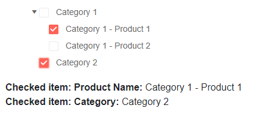

# Check Multiple Nodes in TreeView

The TreeView lets the user select multiple nodes with checkboxes based on the value of its `CheckBoxMode` parameter.

In this article:

* [Basics](#basics)
* [Examples](#examples)
	* [Multiple selection using one-way data binding](#multiple-selection-using-one-way-data-binding)
	* [Multiple selection using two-way data binding](#multiple-selection-using-two-way-data-binding)
	* [Handle multiple selection from different data models](#handle-multiple-selection-from-different-data-models)


## Basics

To let the user use **multiple** node selection, set the `CheckBoxMode` parameter to `Telerik.Blazor.TreeViewCheckBoxMode.Multiple`.


## Examples

This section contains the following examples:

* [One-way binding](#multiple-selection-using-one-way-data-binding)
* [Two-way binding](#multiple-selection-using-two-way-data-binding)
* [Different data models](#handle-multiple-selection-from-different-data-models)

### Multiple selection using one-way data binding

You can use one-way binding to provide an initial node selection, and respond to the [`CheckedItemsChanged`](slug:treeview-events#checkeditemschanged) event to update the view-model when user selection occurs. If you don't update the model, selection is effectively canceled.


````RAZOR
@* Handle multiple node selection through checkboxes with one-way data binding *@

<TelerikTreeView Data="@FlatData"
                 @bind-ExpandedItems="@ExpandedItems"
                 CheckBoxMode="@TreeViewCheckBoxMode.Multiple"
                 CheckedItems="@checkedItems"
                 CheckedItemsChanged="@( (IEnumerable<object> items) => CheckedItemsChangedHandler(items) )">
    <TreeViewBindings>
        <TreeViewBinding IdField="Id" ParentIdField="ParentIdValue" TextField="Text" HasChildrenField="HasChildren" IconField="Icon" />
    </TreeViewBindings>
</TelerikTreeView>

<div>
    Checked items:
    <ul>
        @if (checkedItems.Any())
        {
            foreach (var item in checkedItems)
            {
                var checkedItem = item as TreeItem;
                <li>
                    <span>
                        <TelerikSvgIcon Icon="@checkedItem.Icon"></TelerikSvgIcon>
                    </span>
                    <span>
                        @(checkedItem.Text)
                    </span>
                </li>
            }
        }
    </ul>
</div>


@code {
    public IEnumerable<object> checkedItems { get; set; } = new List<object>();

    private void CheckedItemsChangedHandler(IEnumerable<object> items)
    {
        checkedItems = items;
    }

    public class TreeItem
    {
        public int Id { get; set; }
        public string Text { get; set; }
        public int? ParentIdValue { get; set; }
        public bool HasChildren { get; set; }
        public ISvgIcon Icon { get; set; }
    }

    public IEnumerable<TreeItem> FlatData { get; set; }
    public IEnumerable<object> ExpandedItems { get; set; } = new List<TreeItem>();

    protected override void OnInitialized()
    {
        LoadFlatData();
        ExpandedItems = FlatData.Where(x => x.HasChildren == true).ToList();
    }

    private void LoadFlatData()
    {
        List<TreeItem> items = new List<TreeItem>();

        items.Add(new TreeItem()
        {
            Id = 1,
            Text = "Project",
            ParentIdValue = null,
            HasChildren = true,
            Icon = SvgIcon.Folder
        });

        items.Add(new TreeItem()
        {
            Id = 2,
            Text = "Design",
            ParentIdValue = 1,
            HasChildren = true,
            Icon = SvgIcon.Brush
        });
        items.Add(new TreeItem()
        {
            Id = 3,
            Text = "Implementation",
            ParentIdValue = 1,
            HasChildren = true,
            Icon = SvgIcon.Folder
        });

        items.Add(new TreeItem()
        {
            Id = 4,
            Text = "site.psd",
            ParentIdValue = 2,
            HasChildren = false,
            Icon = SvgIcon.FilePsd
        });
        items.Add(new TreeItem()
        {
            Id = 5,
            Text = "index.js",
            ParentIdValue = 3,
            HasChildren = false,
            Icon = SvgIcon.Js
        });
        items.Add(new TreeItem()
        {
            Id = 6,
            Text = "index.html",
            ParentIdValue = 3,
            HasChildren = false,
            Icon = SvgIcon.Html5
        });
        items.Add(new TreeItem()
        {
            Id = 7,
            Text = "styles.css",
            ParentIdValue = 3,
            HasChildren = false,
            Icon = SvgIcon.Css
        });

        FlatData = items;
    }
}
````

>caption The result of the code snippet above


### Multiple selection using two-way data binding

You can use two-way binding to get the node the user has selected. This can be useful if the node model already contains all the information you need to show based on the selection. It also reduces the amount of code you need to write.

````RAZOR
@* Handle multiple node selection with two-way data binding *@

<TelerikTreeView Data="@FlatData"
                 @bind-ExpandedItems="@ExpandedItems"
                 CheckBoxMode="@TreeViewCheckBoxMode.Multiple"
                 @bind-CheckedItems="@checkedItems">
    <TreeViewBindings>
        <TreeViewBinding IdField="Id" ParentIdField="ParentIdValue" TextField="Text" HasChildrenField="HasChildren" IconField="Icon" />
    </TreeViewBindings>
</TelerikTreeView>

<div>
    Checked items:
    <ul>
        @if (checkedItems.Any())
        {
            foreach (var item in checkedItems)
            {
                var checkedItem = item as TreeItem;
                <li>
                    <span>
                        <TelerikSvgIcon Icon="@checkedItem.Icon"></TelerikSvgIcon>
                    </span>
                    <span>
                        @(checkedItem.Text)
                    </span>
                </li>
            }
        }
    </ul>
</div>


@code {
    public IEnumerable<object> checkedItems { get; set; } = new List<object>();

    public class TreeItem
    {
        public int Id { get; set; }
        public string Text { get; set; }
        public int? ParentIdValue { get; set; }
        public bool HasChildren { get; set; }
        public ISvgIcon Icon { get; set; }
    }

    public IEnumerable<TreeItem> FlatData { get; set; }
    public IEnumerable<object> ExpandedItems { get; set; } = new List<TreeItem>();

    protected override void OnInitialized()
    {
        LoadFlatData();

        ExpandedItems = FlatData.Where(x => x.HasChildren == true).ToList();

        var precheckedItem = FlatData.Where(x => x.Id == 3); // provide initial checked item when the page is loaded

        checkedItems = new List<object>(precheckedItem);
    }

    private void LoadFlatData()
    {
        List<TreeItem> items = new List<TreeItem>();

        items.Add(new TreeItem()
        {
            Id = 1,
            Text = "Project",
            ParentIdValue = null,
            HasChildren = true,
            Icon = SvgIcon.Folder
        });

        items.Add(new TreeItem()
        {
            Id = 2,
            Text = "Design",
            ParentIdValue = 1,
            HasChildren = true,
            Icon = SvgIcon.Brush
        });
        items.Add(new TreeItem()
        {
            Id = 3,
            Text = "Implementation",
            ParentIdValue = 1,
            HasChildren = true,
            Icon = SvgIcon.Folder
        });

        items.Add(new TreeItem()
        {
            Id = 4,
            Text = "site.psd",
            ParentIdValue = 2,
            HasChildren = false,
            Icon = SvgIcon.FilePsd
        });
        items.Add(new TreeItem()
        {
            Id = 5,
            Text = "index.js",
            ParentIdValue = 3,
            HasChildren = false,
            Icon = SvgIcon.Js
        });
        items.Add(new TreeItem()
        {
            Id = 6,
            Text = "index.html",
            ParentIdValue = 3,
            HasChildren = false,
            Icon = SvgIcon.Html5
        });
        items.Add(new TreeItem()
        {
            Id = 7,
            Text = "styles.css",
            ParentIdValue = 3,
            HasChildren = false,
            Icon = SvgIcon.Css
        });

        FlatData = items;
    }
}
````


### Handle multiple selection from different data models

You can bind the treeview to different models at each level, and the selection accommodates that. You need to make sure that you cast the node to the correct type.

````RAZOR
@* Handle multiple selection of items from different data models *@

<TelerikTreeView Data="@HierarchicalData"
                 @bind-ExpandedItems="@ExpandedItems"
                 CheckBoxMode="@TreeViewCheckBoxMode.Multiple"
                 CheckedItems="@CheckedItems"
                 CheckedItemsChanged="@((IEnumerable<object> items) => CheckedItemsHandler(items))">
    <TreeViewBindings>
        <TreeViewBinding TextField="Category" ItemsField="Products" />
        <TreeViewBinding Level="1" TextField="ProductName" />
    </TreeViewBindings>
</TelerikTreeView>

@if (CheckedItems.Any())
{
    foreach (var item in CheckedItems)
    {
        if (item is ProductCategoryItem)
        {
            <div>
                <strong>Checked item:</strong>
                <span><strong>Category:</strong> @((item as ProductCategoryItem).Category)</span>
            </div>
        }
        else
        {
            <div>
                <strong>Checked item:</strong>
                <span><strong>Product Name:</strong> @((item as ProductItem).ProductName)</span>
            </div>
        }
    }
}

@code {
    public IEnumerable<ProductCategoryItem> HierarchicalData { get; set; }
    public IEnumerable<object> CheckedItems { get; set; } = new List<object>();
    public IEnumerable<object> ExpandedItems { get; set; } = new List<object>();

    void CheckedItemsHandler(IEnumerable<object> items)
    {
        CheckedItems = items;
    }

    public class ProductCategoryItem
    {
        public string Category { get; set; }
        public List<ProductItem> Products { get; set; }
    }

    public class ProductItem
    {
        public string ProductName { get; set; }
    }


    protected override void OnInitialized()
    {
        LoadHierarchical();
        ExpandedItems = HierarchicalData.Where(x => x.Products != null && x.Products.Any()).ToList();
    }

    private void LoadHierarchical()
    {
        List<ProductCategoryItem> roots = new List<ProductCategoryItem>();

        List<ProductItem> firstCategoryProducts = new List<ProductItem>()
        {   
            new ProductItem { ProductName= "Category 1 - Product 1" },
            new ProductItem { ProductName= "Category 1 - Product 2" }
        };

        roots.Add(new ProductCategoryItem
        {
            Category = "Category 1",
            Products = firstCategoryProducts // this is how child items are provided

        });

        roots.Add(new ProductCategoryItem
        {
            Category = "Category 2" // we will set no other properties and it will not have children, nor will it be expanded
        });

        HierarchicalData = roots;
    }
}
````

>caption The result of the code snippet above




## See Also

  * [Checkboxes Overview](slug:treeview-checkboxes-overview)
  * [Single Node](slug:treeview-checkboxes-single)
