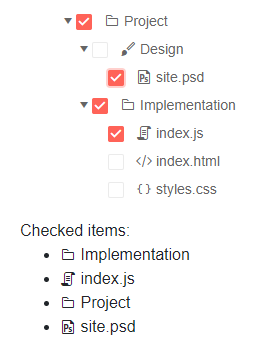
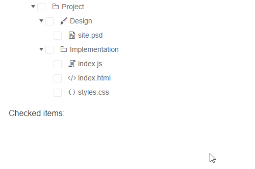
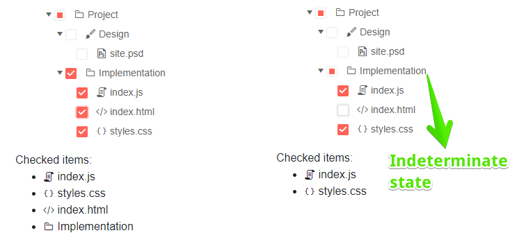
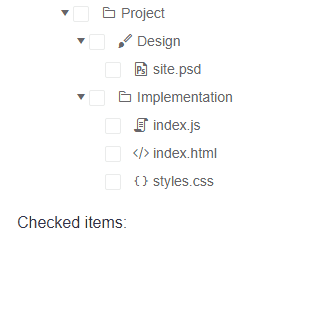

# TreeView Checkbox Selection

The Checkbox Selection of nodes is an alternative to the [standard selection](). It provides a different UX by not adding the background highlight color on the selected node. Instead, a checkbox is rendered to the left of each item in the TreeView and the user utilizes them to select the desired nodes. 

The TreeView lets the user select one or more nodes by using checkboxes. You can also pre-select them with your own code.

This article is separated into the following segments:

* [Basics](#basics)
* [CheckedItems](#checkeditems)
* [CheckChildren](#checkchildren)
* [CheckParents](#checkparents)
* [CheckOnClick](#checkonclick)
* [Checking and Selecting a single node](#checking-and-selecting-a-single-node)

## Basics

To enable the selection of nodes with checkboxes set the `CheckBoxMode` parameter to a member of the `TreeViewCheckBoxMode`:

* `None` - disable the node selection. This is the default setting.

* [`Single`]() - only one node can be checked at a time.

* [`Multiple`]() - many nodes can be checked simultaneously.

## CheckedItems

You get or set the checked nodes through the `CheckedItems` parameter of the treeview. It takes an `IEnumerable<object>` collection that you need to cast to the actual model type. This is required because you can [bind the treeview]() to different model types at each level. The selection allows two-way binding (`@bind-CheckedItems`) and one-way binding + [`CheckedItemsChanged`](#checkeditemschanged) event.

>caption Enable node selection with checkboxes

````CSHTML
@* Allow the user to use checkboxes to select nodes in the TreeView. Use the two-way data binding of the CheckedItems collection to obtain what the user checked. This example shows how to pre-select a node. *@

<TelerikTreeView Data="@FlatData"
                 CheckBoxMode="@TreeViewCheckBoxMode.Multiple"
                 @bind-CheckedItems="@checkedItems">
    <TreeViewBindings>
        <TreeViewBinding IdField="Id" ParentIdField="ParentIdValue" ExpandedField="Expanded" TextField="Text" HasChildrenField="HasChildren" IconField="Icon" />
    </TreeViewBindings>
</TelerikTreeView>

<div>
    Checked items:
    <ul>
        @if (checkedItems.Any())
        {
            foreach (var item in checkedItems)
            {
                var checkedItem = item as TreeItem;
                <li>
                    <span>
                        <TelerikIcon Icon="@checkedItem.Icon"></TelerikIcon>
                    </span>
                    <span>
                        @(checkedItem.Text)
                    </span>
                </li>
            }
        }
    </ul>
</div>


@code {
    public IEnumerable<object> checkedItems { get; set; } = new List<object>();

    public class TreeItem
    {
        public int Id { get; set; }
        public string Text { get; set; }
        public int? ParentIdValue { get; set; }
        public bool HasChildren { get; set; }
        public string Icon { get; set; }
        public bool Expanded { get; set; }
    }

    public IEnumerable<TreeItem> FlatData { get; set; }

    protected override void OnInitialized()
    {
        LoadFlatData();

        var precheckedItem = FlatData.Where(x => x.Id == 3); // provide initial checked item when the page is loaded

        checkedItems = new List<object>(precheckedItem);
    }

    private void LoadFlatData()
    {
        List<TreeItem> items = new List<TreeItem>();

        items.Add(new TreeItem()
        {
            Id = 1,
            Text = "Project",
            ParentIdValue = null,
            HasChildren = true,
            Icon = "folder",
            Expanded = true
        });

        items.Add(new TreeItem()
        {
            Id = 2,
            Text = "Design",
            ParentIdValue = 1,
            HasChildren = true,
            Icon = "brush",
            Expanded = true
        });
        items.Add(new TreeItem()
        {
            Id = 3,
            Text = "Implementation",
            ParentIdValue = 1,
            HasChildren = true,
            Icon = "folder",
            Expanded = true
        });

        items.Add(new TreeItem()
        {
            Id = 4,
            Text = "site.psd",
            ParentIdValue = 2,
            HasChildren = false,
            Icon = "psd",
            Expanded = true
        });
        items.Add(new TreeItem()
        {
            Id = 5,
            Text = "index.js",
            ParentIdValue = 3,
            HasChildren = false,
            Icon = "js"
        });
        items.Add(new TreeItem()
        {
            Id = 6,
            Text = "index.html",
            ParentIdValue = 3,
            HasChildren = false,
            Icon = "html"
        });
        items.Add(new TreeItem()
        {
            Id = 7,
            Text = "styles.css",
            ParentIdValue = 3,
            HasChildren = false,
            Icon = "css"
        });

        FlatData = items;
    }
}
````

>caption The result of the code snippet above



## CheckChildren 

Setting the `CheckChildren` boolean parameter to `true` will allow the user to select a parent item using the checkbox and automatically check all of its children.


````CSHTML
@* Click on a parent item to observe the behavior of the CheckChildren bool parameter *@

<TelerikTreeView Data="@FlatData"
                 CheckChildren="true"
                 CheckBoxMode="@TreeViewCheckBoxMode.Multiple"
                 @bind-CheckedItems="@checkedItems">
    <TreeViewBindings>
        <TreeViewBinding IdField="Id" ParentIdField="ParentIdValue" ExpandedField="Expanded" TextField="Text" HasChildrenField="HasChildren" IconField="Icon" />
    </TreeViewBindings>
</TelerikTreeView>

<div>
    Checked items:
    <ul>
        @if (checkedItems.Any())
        {
            foreach (var item in checkedItems)
            {
                var checkedItem = item as TreeItem;
                <li>
                    <span>
                        <TelerikIcon Icon="@checkedItem.Icon"></TelerikIcon>
                    </span>
                    <span>
                        @(checkedItem.Text)
                    </span>
                </li>
            }
        }
    </ul>
</div>


@code {
    public IEnumerable<object> checkedItems { get; set; } = new List<object>();

    public class TreeItem
    {
        public int Id { get; set; }
        public string Text { get; set; }
        public int? ParentIdValue { get; set; }
        public bool HasChildren { get; set; }
        public string Icon { get; set; }
        public bool Expanded { get; set; }
    }

    public IEnumerable<TreeItem> FlatData { get; set; }

    protected override void OnInitialized()
    {
        LoadFlatData();
    }

    private void LoadFlatData()
    {
        List<TreeItem> items = new List<TreeItem>();

        items.Add(new TreeItem()
        {
            Id = 1,
            Text = "Project",
            ParentIdValue = null,
            HasChildren = true,
            Icon = "folder",
            Expanded = true
        });

        items.Add(new TreeItem()
        {
            Id = 2,
            Text = "Design",
            ParentIdValue = 1,
            HasChildren = true,
            Icon = "brush",
            Expanded = true
        });
        items.Add(new TreeItem()
        {
            Id = 3,
            Text = "Implementation",
            ParentIdValue = 1,
            HasChildren = true,
            Icon = "folder",
            Expanded = true
        });

        items.Add(new TreeItem()
        {
            Id = 4,
            Text = "site.psd",
            ParentIdValue = 2,
            HasChildren = false,
            Icon = "psd",
            Expanded = true
        });
        items.Add(new TreeItem()
        {
            Id = 5,
            Text = "index.js",
            ParentIdValue = 3,
            HasChildren = false,
            Icon = "js"
        });
        items.Add(new TreeItem()
        {
            Id = 6,
            Text = "index.html",
            ParentIdValue = 3,
            HasChildren = false,
            Icon = "html"
        });
        items.Add(new TreeItem()
        {
            Id = 7,
            Text = "styles.css",
            ParentIdValue = 3,
            HasChildren = false,
            Icon = "css"
        });

        FlatData = items;
    }
}
````

>caption The result from the code snippet above



## CheckParents

Setting the `CheckParents` boolean parameter to `true` will have the following behavior depending on the user selection:

* If one or more children are not selected the parent item will be in an indeterminate state.

* If all children are selected the parent item will be selected too.

>caption Enable the CheckParents parameter. The result from the code snippet below




````CSHTML
@* Enable the CheckParents parameter and observe the behavior of this setting. *@

<TelerikTreeView Data="@FlatData"
                 CheckParents="true"
                 CheckBoxMode="@TreeViewCheckBoxMode.Multiple"
                 @bind-CheckedItems="@checkedItems">
    <TreeViewBindings>
        <TreeViewBinding IdField="Id" ParentIdField="ParentIdValue" ExpandedField="Expanded" TextField="Text" HasChildrenField="HasChildren" IconField="Icon" />
    </TreeViewBindings>
</TelerikTreeView>

<div>
    Checked items:
    <ul>
        @if (checkedItems.Any())
        {
            foreach (var item in checkedItems)
            {
                var checkedItem = item as TreeItem;
                <li>
                    <span>
                        <TelerikIcon Icon="@checkedItem.Icon"></TelerikIcon>
                    </span>
                    <span>
                        @(checkedItem.Text)
                    </span>
                </li>
            }
        }
    </ul>
</div>


@code {
    public IEnumerable<object> checkedItems { get; set; } = new List<object>();

    public class TreeItem
    {
        public int Id { get; set; }
        public string Text { get; set; }
        public int? ParentIdValue { get; set; }
        public bool HasChildren { get; set; }
        public string Icon { get; set; }
        public bool Expanded { get; set; }
    }

    public IEnumerable<TreeItem> FlatData { get; set; }

    protected override void OnInitialized()
    {
        LoadFlatData();
    }

    private void LoadFlatData()
    {
        List<TreeItem> items = new List<TreeItem>();

        items.Add(new TreeItem()
        {
            Id = 1,
            Text = "Project",
            ParentIdValue = null,
            HasChildren = true,
            Icon = "folder",
            Expanded = true
        });

        items.Add(new TreeItem()
        {
            Id = 2,
            Text = "Design",
            ParentIdValue = 1,
            HasChildren = true,
            Icon = "brush",
            Expanded = true
        });
        items.Add(new TreeItem()
        {
            Id = 3,
            Text = "Implementation",
            ParentIdValue = 1,
            HasChildren = true,
            Icon = "folder",
            Expanded = true
        });

        items.Add(new TreeItem()
        {
            Id = 4,
            Text = "site.psd",
            ParentIdValue = 2,
            HasChildren = false,
            Icon = "psd",
            Expanded = true
        });
        items.Add(new TreeItem()
        {
            Id = 5,
            Text = "index.js",
            ParentIdValue = 3,
            HasChildren = false,
            Icon = "js"
        });
        items.Add(new TreeItem()
        {
            Id = 6,
            Text = "index.html",
            ParentIdValue = 3,
            HasChildren = false,
            Icon = "html"
        });
        items.Add(new TreeItem()
        {
            Id = 7,
            Text = "styles.css",
            ParentIdValue = 3,
            HasChildren = false,
            Icon = "css"
        });

        FlatData = items;
    }
}
````

## CheckOnClick

You can allow the user to click on the node itself and the TreeView will automatically add it to the `CheckedItems` collections by setting the `CheckOnClick` boolean parameter to `true`.

>caption Enable the CheckOnClick parameter. The result from the code snippet below



````CSHTML
@* Set the CheckOnClick parameter to true and click on a node to add it in the CheckedItems collection. *@

<TelerikTreeView Data="@FlatData"
                 CheckOnClick="true"
                 CheckBoxMode="@TreeViewCheckBoxMode.Multiple"
                 @bind-CheckedItems="@checkedItems">
    <TreeViewBindings>
        <TreeViewBinding IdField="Id" ParentIdField="ParentIdValue" ExpandedField="Expanded" TextField="Text" HasChildrenField="HasChildren" IconField="Icon" />
    </TreeViewBindings>
</TelerikTreeView>

<div>
    Checked items:
    <ul>
        @if (checkedItems.Any())
        {
            foreach (var item in checkedItems)
            {
                var checkedItem = item as TreeItem;
                <li>
                    <span>
                        <TelerikIcon Icon="@checkedItem.Icon"></TelerikIcon>
                    </span>
                    <span>
                        @(checkedItem.Text)
                    </span>
                </li>
            }
        }
    </ul>
</div>


@code {
    public IEnumerable<object> checkedItems { get; set; } = new List<object>();

    public class TreeItem
    {
        public int Id { get; set; }
        public string Text { get; set; }
        public int? ParentIdValue { get; set; }
        public bool HasChildren { get; set; }
        public string Icon { get; set; }
        public bool Expanded { get; set; }
    }

    public IEnumerable<TreeItem> FlatData { get; set; }

    protected override void OnInitialized()
    {
        LoadFlatData();
    }

    private void LoadFlatData()
    {
        List<TreeItem> items = new List<TreeItem>();

        items.Add(new TreeItem()
        {
            Id = 1,
            Text = "Project",
            ParentIdValue = null,
            HasChildren = true,
            Icon = "folder",
            Expanded = true
        });

        items.Add(new TreeItem()
        {
            Id = 2,
            Text = "Design",
            ParentIdValue = 1,
            HasChildren = true,
            Icon = "brush",
            Expanded = true
        });
        items.Add(new TreeItem()
        {
            Id = 3,
            Text = "Implementation",
            ParentIdValue = 1,
            HasChildren = true,
            Icon = "folder",
            Expanded = true
        });

        items.Add(new TreeItem()
        {
            Id = 4,
            Text = "site.psd",
            ParentIdValue = 2,
            HasChildren = false,
            Icon = "psd",
            Expanded = true
        });
        items.Add(new TreeItem()
        {
            Id = 5,
            Text = "index.js",
            ParentIdValue = 3,
            HasChildren = false,
            Icon = "js"
        });
        items.Add(new TreeItem()
        {
            Id = 6,
            Text = "index.html",
            ParentIdValue = 3,
            HasChildren = false,
            Icon = "html"
        });
        items.Add(new TreeItem()
        {
            Id = 7,
            Text = "styles.css",
            ParentIdValue = 3,
            HasChildren = false,
            Icon = "css"
        });

        FlatData = items;
    }
}
````

### Checking and Selecting a single node

You can combine both selection and checking nodes. To keep both collections in sync you can assign the same collection to both `SelectedItems` and `CheckedItems` as demonstrated in the example below.

````Single
@* You can couple checking the item and placing it in the selected item list. *@

<TelerikTreeView Data="@FlatData"
                 CheckBoxMode="@TreeViewCheckBoxMode.Single"
                 SelectionMode="@TreeViewSelectionMode.Single"
                 @bind-SelectedItems="@checkedItems"
                 @bind-CheckedItems="@checkedItems">
    <TreeViewBindings>
        <TreeViewBinding IdField="Id" ParentIdField="ParentIdValue" ExpandedField="Expanded" TextField="Text" HasChildrenField="HasChildren" IconField="Icon" />
    </TreeViewBindings>
</TelerikTreeView>

<div>
    Checked item:
    <span>
        @if (checkedItems.Any())
        {
            @((checkedItems.FirstOrDefault() as TreeItem).Text)
        }
    </span>
</div>


@code {

    public IEnumerable<object> checkedItems { get; set; } = new List<object>();

    public class TreeItem
    {
        public int Id { get; set; }
        public string Text { get; set; }
        public int? ParentIdValue { get; set; }
        public bool HasChildren { get; set; }
        public string Icon { get; set; }
        public bool Expanded { get; set; }
    }

    public IEnumerable<TreeItem> FlatData { get; set; }

    protected override void OnInitialized()
    {
        LoadFlatData();

        var precheckedItem = FlatData.Where(x => x.Id == 3); // provide initial checked item when the page is loaded

        checkedItems = new List<object>(precheckedItem);
    }

    private void LoadFlatData()
    {
        List<TreeItem> items = new List<TreeItem>();

        items.Add(new TreeItem()
        {
            Id = 1,
            Text = "Project",
            ParentIdValue = null,
            HasChildren = true,
            Icon = "folder",
            Expanded = true
        });

        items.Add(new TreeItem()
        {
            Id = 2,
            Text = "Design",
            ParentIdValue = 1,
            HasChildren = true,
            Icon = "brush",
            Expanded = true
        });
        items.Add(new TreeItem()
        {
            Id = 3,
            Text = "Implementation",
            ParentIdValue = 1,
            HasChildren = true,
            Icon = "folder",
            Expanded = true
        });

        items.Add(new TreeItem()
        {
            Id = 4,
            Text = "site.psd",
            ParentIdValue = 2,
            HasChildren = false,
            Icon = "psd",
            Expanded = true
        });
        items.Add(new TreeItem()
        {
            Id = 5,
            Text = "index.js",
            ParentIdValue = 3,
            HasChildren = false,
            Icon = "js"
        });
        items.Add(new TreeItem()
        {
            Id = 6,
            Text = "index.html",
            ParentIdValue = 3,
            HasChildren = false,
            Icon = "html"
        });
        items.Add(new TreeItem()
        {
            Id = 7,
            Text = "styles.css",
            ParentIdValue = 3,
            HasChildren = false,
            Icon = "css"
        });

        FlatData = items;
    }
}
````
````Multiple
@* To select and check multiple items change both modes to Multiple *@

<TelerikTreeView Data="@FlatData"
                 CheckBoxMode="@TreeViewCheckBoxMode.Multiple"
                 SelectionMode="@TreeViewSelectionMode.Multiple"
                 @bind-SelectedItems="@checkedItems"
                 @bind-CheckedItems="@checkedItems">
    <TreeViewBindings>
        <TreeViewBinding IdField="Id" ParentIdField="ParentIdValue" ExpandedField="Expanded" TextField="Text" HasChildrenField="HasChildren" IconField="Icon" />
    </TreeViewBindings>
</TelerikTreeView>

<div>
    Checked items:
        @if (checkedItems.Any())
        {
            <ul>
                @foreach (var item in checkedItems)
                {
                    TreeItem checkedItem = item as TreeItem;
                    <li>
                        @checkedItem.Text
                    </li>

                }
            </ul>
        }
</div>


@code {

    public IEnumerable<object> checkedItems { get; set; } = new List<object>();

    public class TreeItem
    {
        public int Id { get; set; }
        public string Text { get; set; }
        public int? ParentIdValue { get; set; }
        public bool HasChildren { get; set; }
        public string Icon { get; set; }
        public bool Expanded { get; set; }
    }

    public IEnumerable<TreeItem> FlatData { get; set; }

    protected override void OnInitialized()
    {
        LoadFlatData();

        var precheckedItem = FlatData.Where(x => x.Id == 3); // provide initial checked item when the page is loaded

        checkedItems = new List<object>(precheckedItem);
    }

    private void LoadFlatData()
    {
        List<TreeItem> items = new List<TreeItem>();

        items.Add(new TreeItem()
        {
            Id = 1,
            Text = "Project",
            ParentIdValue = null,
            HasChildren = true,
            Icon = "folder",
            Expanded = true
        });

        items.Add(new TreeItem()
        {
            Id = 2,
            Text = "Design",
            ParentIdValue = 1,
            HasChildren = true,
            Icon = "brush",
            Expanded = true
        });
        items.Add(new TreeItem()
        {
            Id = 3,
            Text = "Implementation",
            ParentIdValue = 1,
            HasChildren = true,
            Icon = "folder",
            Expanded = true
        });

        items.Add(new TreeItem()
        {
            Id = 4,
            Text = "site.psd",
            ParentIdValue = 2,
            HasChildren = false,
            Icon = "psd",
            Expanded = true
        });
        items.Add(new TreeItem()
        {
            Id = 5,
            Text = "index.js",
            ParentIdValue = 3,
            HasChildren = false,
            Icon = "js"
        });
        items.Add(new TreeItem()
        {
            Id = 6,
            Text = "index.html",
            ParentIdValue = 3,
            HasChildren = false,
            Icon = "html"
        });
        items.Add(new TreeItem()
        {
            Id = 7,
            Text = "styles.css",
            ParentIdValue = 3,
            HasChildren = false,
            Icon = "css"
        });

        FlatData = items;
    }
}
````

## See Also

  * [Live Demo: TreeView CheckBoxes](https://demos.telerik.com/blazor-ui/treeview/checkboxes)
  * [Single Node]()
  * [Multiple Nodes]()
