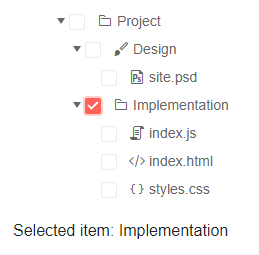
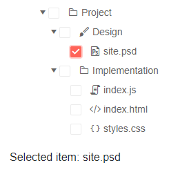

# Check a Single Node in TreeView

The TreeView lets the user check a single node at a time based on the value of its `CheckBoxMode` parameter.

This article is separated in the following sections:

* [Basics](#basics)
* [Examples](#examples)
	* [Checking a single node using one-way data binding](#checking-a-single-node-using-one-way-data-binding)
	* [Checking a single node using two-way data binding](#checking-a-single-node-using-two-way-data-binding)


## Basics

To let the user check only a **single** node in the TreeView, set the `CheckBoxMode` parameter to `Telerik.Blazor.Components.TreeViewCheckBoxMode.Single`.


## Examples

This section contains the following examples:

* [One-way binding](#checking-a-single-node-using-one-way-data-binding)
* [Two-way binding](#checking-a-single-node-using-two-way-data-binding)


### Checking a single node using one-way data binding

You can use one-way binding to provide an initial checked node, and respond to the `CheckedItemsChanged` to update the view-model when user checks a node.

````RAZOR
@* Check a single node by using one-way data binding and provide initially checked node. *@

<TelerikTreeView Data="@FlatData"
                 @bind-ExpandedItems="@ExpandedItems"
                 CheckBoxMode="@TreeViewCheckBoxMode.Single"
                 CheckedItems="@checkedItems"
                 CheckedItemsChanged="@((IEnumerable<object> items) => CheckedItemsChangedHandler(items) )">
    <TreeViewBindings >
        <TreeViewBinding IdField="Id" ParentIdField="ParentIdValue" TextField="Text" HasChildrenField="HasChildren" IconField="Icon" />
    </TreeViewBindings>
</TelerikTreeView>

<div>
    Selected item: 
    <span>
        @if (checkedItems.Any())
        {
            @((checkedItems.FirstOrDefault() as TreeItem).Text)
        }
    </span>
</div>

@code {
    private void CheckedItemsChangedHandler(IEnumerable<object> items)
    {
        checkedItems = items;
    }

    public IEnumerable<object> checkedItems { get; set; } = new List<object>();

    public class TreeItem
    {
        public int Id { get; set; }
        public string Text { get; set; }
        public int? ParentIdValue { get; set; }
        public bool HasChildren { get; set; }
        public ISvgIcon Icon { get; set; }
    }

    public IEnumerable<TreeItem> FlatData { get; set; }
    public IEnumerable<object> ExpandedItems { get; set; } = new List<TreeItem>();

    protected override void OnInitialized()
    {
        LoadFlatData();

        ExpandedItems = FlatData.Where(x => x.HasChildren == true).ToList();

        var precheckedItem = FlatData.Where(x => x.Id == 3); // provide initial checked item when the page is loaded

        checkedItems = new List<object>(precheckedItem);
    }

    private void LoadFlatData()
    {
        List<TreeItem> items = new List<TreeItem>();

        items.Add(new TreeItem()
        {
            Id = 1,
            Text = "Project",
            ParentIdValue = null,
            HasChildren = true,
            Icon = SvgIcon.Folder
        });

        items.Add(new TreeItem()
        {
            Id = 2,
            Text = "Design",
            ParentIdValue = 1,
            HasChildren = true,
            Icon = SvgIcon.Brush
        });
        items.Add(new TreeItem()
        {
            Id = 3,
            Text = "Implementation",
            ParentIdValue = 1,
            HasChildren = true,
            Icon = SvgIcon.Folder
        });

        items.Add(new TreeItem()
        {
            Id = 4,
            Text = "site.psd",
            ParentIdValue = 2,
            HasChildren = false,
            Icon = SvgIcon.FilePsd
        });
        items.Add(new TreeItem()
        {
            Id = 5,
            Text = "index.js",
            ParentIdValue = 3,
            HasChildren = false,
            Icon = SvgIcon.Js
        });
        items.Add(new TreeItem()
        {
            Id = 6,
            Text = "index.html",
            ParentIdValue = 3,
            HasChildren = false,
            Icon = SvgIcon.Html5
        });
        items.Add(new TreeItem()
        {
            Id = 7,
            Text = "styles.css",
            ParentIdValue = 3,
            HasChildren = false,
            Icon = SvgIcon.Css
        });

        FlatData = items;
    }
}
````

>caption The result of the code snippet above



### Checking a single node using two-way data binding

You can use two-way binding to get the node the user has checked. This can be useful if the node model already contains all the information you need to use. It also reduces the amount of code you need to write.

````RAZOR
@* Check a single node using the @bind-CheckedItems syntax for two-way data binding. *@

<TelerikTreeView Data="@FlatData"
                 @bind-ExpandedItems="@ExpandedItems"
                 CheckBoxMode="@TreeViewCheckBoxMode.Single"
                 @bind-CheckedItems="@checkedItems">
    <TreeViewBindings >
        <TreeViewBinding IdField="Id" ParentIdField="ParentIdValue" TextField="Text" HasChildrenField="HasChildren" IconField="Icon" />
    </TreeViewBindings>
</TelerikTreeView>

<div>
    Selected item: 
    <span>
        @if (checkedItems.Any())
        {
            @((checkedItems.FirstOrDefault() as TreeItem).Text)
        }
    </span>
</div>

@code {
    public IEnumerable<object> checkedItems { get; set; } = new List<object>();

    public class TreeItem
    {
        public int Id { get; set; }
        public string Text { get; set; }
        public int? ParentIdValue { get; set; }
        public bool HasChildren { get; set; }
        public ISvgIcon Icon { get; set; }
    }

    public IEnumerable<TreeItem> FlatData { get; set; }
    public IEnumerable<object> ExpandedItems { get; set; } = new List<TreeItem>();

    protected override void OnInitialized()
    {
        LoadFlatData();
        ExpandedItems = FlatData.Where(x => x.HasChildren == true).ToList();
    }

    private void LoadFlatData()
    {
        List<TreeItem> items = new List<TreeItem>();

        items.Add(new TreeItem()
        {
            Id = 1,
            Text = "Project",
            ParentIdValue = null,
            HasChildren = true,
            Icon = SvgIcon.Folder
        });

        items.Add(new TreeItem()
        {
            Id = 2,
            Text = "Design",
            ParentIdValue = 1,
            HasChildren = true,
            Icon = SvgIcon.Brush
        });
        items.Add(new TreeItem()
        {
            Id = 3,
            Text = "Implementation",
            ParentIdValue = 1,
            HasChildren = true,
            Icon = SvgIcon.Folder
        });

        items.Add(new TreeItem()
        {
            Id = 4,
            Text = "site.psd",
            ParentIdValue = 2,
            HasChildren = false,
            Icon = SvgIcon.FilePsd
        });
        items.Add(new TreeItem()
        {
            Id = 5,
            Text = "index.js",
            ParentIdValue = 3,
            HasChildren = false,
            Icon = SvgIcon.Js
        });
        items.Add(new TreeItem()
        {
            Id = 6,
            Text = "index.html",
            ParentIdValue = 3,
            HasChildren = false,
            Icon = SvgIcon.Html5
        });
        items.Add(new TreeItem()
        {
            Id = 7,
            Text = "styles.css",
            ParentIdValue = 3,
            HasChildren = false,
            Icon = SvgIcon.Css
        });

        FlatData = items;
    }
}
````

>caption The result of the code snippet above




## See Also

  * [Selection Overview](slug:treeview-checkboxes-overview)
  * [Multiple Selection](slug:treeview-checkboxes-multiple)
