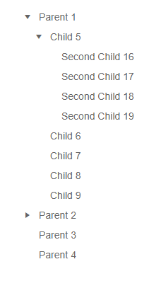

# Treeview Data Binding Basics

This article explains the different ways to provide data to a TreeView component, the properties related to data binding and their results.

First, review:

* The available (bindable) [features of a treeview item](#treeview-item-features).
* How to match fields in the model with the treeview item [data bindings](#data-bindings).

There are three modes of providing data to a treeview, and they all use the items' features. Once you are familiar with the current article, choose the data binding more you wish to use:

* [Flat data]() - a single collection of items with defined parent-child relationships.
* [Hierarchical data]() - separate collections of items and their child items.
* [Load on demand]() or lazy loading - providing children to a node when it expands through an event.

## Treeview Item Features

The treeview items provide the following features that you control through the corresponding fields in their data binding:

* `Id` - a unique identifier for the item. Required for binding to flat data.
* `ParentId` - identifies the parent to whom the item belongs. Required only when binding to flat data. All items with the same `ParentId` will be rendered at the same level. For a root level item, this must be `null`.
* `Expanded` - whether the item is expanded when it renders, or the user has to expand it manually.
* `HasChildren` - whether the item has children. Determines whether an expand arrow is rendered next to the item. Required for binding to flat data and for load-on-demand. With hierarchical data, the treeview will render the icon based on the existence of child items, but `HasChildren` will take precedence.
* `Items` - the collection of child items that will be rendered under the current item. Required only when binding to hierarchical data.
* `Text` - the text that will be shown on the item.
* `Icon` / `IconClass` / `ImageUrl` - the [Telerik icon](), a class for a custom font icon, or the URL to a raster image that will be rendered in the item. They have the listed order of precedence in case more than one is present in the data (that is, an `Icon` will have the highest importance).

## Data Bindings

The properties of a treeview item match directly to a field of the model the treeview is bound to. You provide that relationship by providing the name of the field from which the corresponding information is present. To do this, under the `TelerikTreeViewBindings` tag, use the `TelerikTreeViewBinding` tag properties.

Each `TelerikTreeViewBinding` tag exposes the following properties that refer to item properties:

* IdField => Id
* ParentIdField => ParentId
* TextField => Text
* IconClassField => IconClass
* IconField => Icon
* ImageUrlField => ImageUrl
* ExpandedField => Expanded
* HasChildrenField => HasChildren
* ItemsField => Items
* Level - this is used for defining [different bindings for different levels](#multiple-level-bindings). If no level is set, the bindings are taken as default for any level that does not have explicit settings. You should have one `TelerikTreeViewBinding` without a level.

>tip There are default values for the field names. If your model names match the defaults, you don't have to define them in the bindings settings.

>caption Default field names for treeview item bindings. If you use these, you don't have to specify them in the `TelerikTreeViewBinding` tag explicitly.

````CSHTML
public class TreeItem
{
	public int Id { get; set; }
	public string Text { get; set; }
	public int? ParentId { get; set; }
	public bool HasChildren { get; set; }
	public string Icon { get; set; }
	public bool Expanded { get; set; }
}
````

The following **Example** shows how to define simple binding to match item fields to a model so a tree renders the provided flat data source.

>caption Sample binding on a flat data source. Showcases how to set the properties to match the model. With this model, the only field name you must explicitly specify is `ParentIdField`, the others match the defaults.

@[template](/_contentTemplates/treeview/basic-example.md#basic-example)

>caption The result from the snippet above


### Multiple Level Bindings

You can define different binding settings for the different levels of nodes in a treeview. With this, the children of a node can consume a different field than their parent, and this may make your application more flexible. If you use [hierarchical data binding](), the children can even use a different model from their parent.

This also allows you to define a different [`ItemTemplate`]() for different levels.

To define multiple bindings, add multiple `TelerikTreeViewBinding` tags and define their `Level`.

If a certain level does not have an explicit data bindings tag, it will use the default one that has no level.

>caption How to use per-level data binding settings to change model fields

````CSHTML
@using Telerik.Blazor.Components.TreeView

 The third level will use the main data bindings settings that do not have a level specified 

<TelerikTreeView Data="@FlatData">
	<TelerikTreeViewBindings>
		<TelerikTreeViewBinding ParentIdField="Parent" ExpandedField="IsExpanded"></TelerikTreeViewBinding>
		<TelerikTreeViewBinding Level="1" TextField="SecondText" ParentIdField="Parent" ExpandedField="IsExpanded"></TelerikTreeViewBinding>
	</TelerikTreeViewBindings>
</TelerikTreeView>

@code {
	public IEnumerable<TreeItem> FlatData { get; set; }

	public class TreeItem
	{
		public int Id { get; set; }
		public string Text { get; set; }
		public string SecondText { get; set; }
		public int? Parent { get; set; }
		public bool HasChildren { get; set; }
		public bool IsExpanded { get; set; }
	}

	protected override void OnInit()
	{
		LoadFlat();
	}

	private void LoadFlat()
	{
		List<TreeItem> items = new List<TreeItem>();

		for (int i = 1; i <= 4; i++)
		{
			items.Add(new TreeItem()
			{
				Id = i,
				Text = "Parent " + i,
				Parent = null,
				HasChildren = i < 3,
				IsExpanded = i == 1
			});
		}

		for (int i = 5; i < 15; i++)
		{
			items.Add(new TreeItem()
			{
				Id = i,
				SecondText = "Child " + i, //this is the field used at level 1 - it is a different field than at levels 0 and 2
				Parent = i < 10 ? 1 : 2,
				HasChildren = i == 5,
				IsExpanded = i == 5
			});
		}

		for (int i = 16; i < 20; i++)
		{
			items.Add(new TreeItem()
			{
				Id = i,
				Text = "Second Child " + i,
				Parent = 5
			});
		}

		FlatData = items;
	}
}
````

>caption The result from the snippet above




## See Also

  * [Binding to Flat Data]()
  * [Binding to Hierarchical Data]()
  * [Load on Demand]()
  * [Live Demo: TreeView Flat Data](https://demos.telerik.com/blazor-ui/treeview/flat-data)
  * [Live Demo: TreeView Hierarchical Data](https://demos.telerik.com/blazor-ui/treeview/hierarchical-data)
  * [Live Demo: TreeView Per-Level Data Bindings](https://demos.telerik.com/blazor-ui/treeview/bindings)
  * [Live Demo: TreeView Load on Demand](https://demos.telerik.com/blazor-ui/treeview/lazy-loading)

