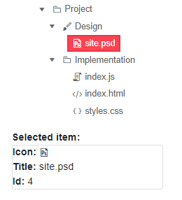

# TreeView Events

This article explains the events available in the Telerik TreeView for Blazor:

* [OnExpand](#onexpand)
* [OnItemClick](#onitemclick)
* [OnItemDoubleClick](#onitemdoubleclick)
* [OnItemContextMenu](#onitemcontextmenu)
* [SelectedItemsChanged](#selecteditemschanged)
* [CheckedItemsChanged](#checkeditemschanged)

## OnExpand

The `OnExpand` event fires when the user expands or collapses a node (either with the mouse, or with the keyboard). You can use it to know that the user performed that action, and/or to implement [load on demand]().

@[template](/_contentTemplates/common/general-info.md#rerender-after-event)

>caption Handle the expand and collapse event to get the user's action

````CSHTML
@Logger

<TelerikTreeView Data="@FlatData" OnExpand="@ExpandCollapseHandler">
</TelerikTreeView>

@code {
    MarkupString Logger { get; set;}

    //event handler

    async Task ExpandCollapseHandler(TreeViewExpandEventArgs args)
    {
        TreeItem node = args.Item as TreeItem; // Use your actual model(s) for the cast

        string action = args.Expanded ? "expanded" : "collapsed";

        string lastAction = $"{node.Text} is now {action}, on {DateTime.Now}<br />";
        Logger = new MarkupString(Logger + lastAction);
    }

    // sample data
    public IEnumerable<TreeItem> FlatData { get; set; }

    public class TreeItem //most fields use the default names and will bind automatically in this example
    {
        public int Id { get; set; }
        public string Text { get; set; }
        public int? ParentId { get; set; } //this is a non-default field name
        public bool HasChildren { get; set; }
        public bool Expanded { get; set; } //this is a non-default field name
    }

    protected override void OnInitialized()
    {
        FlatData = LoadFlat();
    }

    private List<TreeItem> LoadFlat()
    {
        List<TreeItem> items = new List<TreeItem>();

        items.Add(new TreeItem()
        {
            Id = 1,
            Text = "Parent 1",
            ParentId = null, // indicates a root (zero-level) item
            HasChildren = true, // informs the treeview there are children so it renders the expand option
            Expanded = true // an item can be expanded by default
        });

        items.Add(new TreeItem()
        {
            Id = 2,
            Text = "Parent 2",
            ParentId = null, //  indicates a root item
            HasChildren = true,
            Expanded = false
        });

        items.Add(new TreeItem()
        {
            Id = 3,
            Text = "Parent 3",
            ParentId = null, // indicates a root item
            HasChildren = false, //there will be no children in this item
            Expanded = true // will not have an effect if there are no children
        });

        items.Add(new TreeItem()
        {
            Id = 4,
            Text = "Child 1 of Parent 1",
            ParentId = 1, // the parent will be the first item
            HasChildren = false,
            Expanded = false
        });

        items.Add(new TreeItem()
        {
            Id = 5,
            Text = "Child 2 of Parent 1",
            ParentId = 1, // the parent will be the first item
            HasChildren = true,
            Expanded = true
        });

        items.Add(new TreeItem()
        {
            Id = 6,
            Text = "Child 1 of Child 2",
            ParentId = 5, // the parent will be the first child of the first root item
            HasChildren = false,
            Expanded = false
        });

        items.Add(new TreeItem()
        {
            Id = 7,
            Text = "Child 1 of Parent 2",
            ParentId = 2, // the parent will be the second root item
            HasChildren = false,
            Expanded = false
        });

        return items;
    }
}
````

@[template](/_contentTemplates/common/general-info.md#event-callback-can-be-async)

## OnItemClick

The `OnItemClick` event fires when the user clicks (or presses `Enter`) on an node (item) of the TreeView. You can use this event to react on user clicking on a node and load data on demand for another component, for example.

@[template](/_contentTemplates/common/event-arguments.md#rowclick-args)

@[template](/_contentTemplates/common/general-info.md#rerender-after-event)

>caption Handle OnItemClick to load data on demand for another component based on user click

````CSHTML
@* Load data on demand based on user click action *@

<TelerikTreeView Data="@FlatData" OnItemClick="@OnItemClickHandler"></TelerikTreeView>

@if (ChosenItem != null)
{
    <div>People working on the <strong>@ChosenItem.Text </strong> area of the project:</div>
    <TelerikGrid Data="@GridData" Width="500px">
        <GridColumns>
            <GridColumn Field="@nameof(GridDataModel.Id)" Title="Id"></GridColumn>
            <GridColumn Field="@nameof(GridDataModel.Name)" Title="Employee Name"></GridColumn>
        </GridColumns>
    </TelerikGrid>
}


@code {
    TreeItem ChosenItem { get; set; }
    public List<GridDataModel> Data { get; set; }
    public List<GridDataModel> GridData { get; set; }
    public List<TreeItem> FlatData { get; set; }

    async Task OnItemClickHandler(TreeViewItemClickEventArgs args)
    {
        var item = args.Item as TreeItem;
        ChosenItem = item;

        //perform actual database operations here
        GridData = await LoadGridDataOnDemand(ChosenItem.Id);

        @[template](/_contentTemplates/common/event-arguments.md#rowclick-args-treeview-example)
    }

    #region Data Generation
    private async Task<List<GridDataModel>> LoadGridDataOnDemand(int id)
    {
        Random rand = new Random();
        Data = Enumerable.Range(1, 20).Select(x => new GridDataModel()
        {
            Id = rand.Next(1, 5000),
            Name = $"Name {rand.Next(1, 5000)}",
            WorkingOn = x % 8
        }).ToList();

        return Data.Where(x => x.WorkingOn == id).ToList();
    }

    protected override void OnInitialized()
    {
        LoadFlatData();
    }

    private void LoadFlatData()
    {
        List<TreeItem> items = new List<TreeItem>();

        items.Add(new TreeItem()
        {
            Id = 1,
            Text = "Project",
            ParentId = null,
            HasChildren = true,
            Icon = "folder",
            Expanded = true
        });

        items.Add(new TreeItem()
        {
            Id = 2,
            Text = "Design",
            ParentId = 1,
            HasChildren = true,
            Icon = "brush",
            Expanded = true
        });
        items.Add(new TreeItem()
        {
            Id = 3,
            Text = "Implementation",
            ParentId = 1,
            HasChildren = true,
            Icon = "folder",
            Expanded = true
        });

        items.Add(new TreeItem()
        {
            Id = 4,
            Text = "site.psd",
            ParentId = 2,
            HasChildren = false,
            Icon = "psd",
            Expanded = true
        });
        items.Add(new TreeItem()
        {
            Id = 5,
            Text = "index.js",
            ParentId = 3,
            HasChildren = false,
            Icon = "js"
        });
        items.Add(new TreeItem()
        {
            Id = 6,
            Text = "index.html",
            ParentId = 3,
            HasChildren = false,
            Icon = "html"
        });
        items.Add(new TreeItem()
        {
            Id = 7,
            Text = "styles.css",
            ParentId = 3,
            HasChildren = false,
            Icon = "css"
        });

        FlatData = items;
    }
    #endregion

    #region Data Models
    public class GridDataModel
    {
        public int Id { get; set; }
        public string Name { get; set; }
        public int WorkingOn { get; set; }
    }

    public class TreeItem
    {
        public int Id { get; set; }
        public string Text { get; set; }
        public int? ParentId { get; set; }
        public bool HasChildren { get; set; }
        public string Icon { get; set; }
        public bool Expanded { get; set; }
    }
    #endregion
}
````

## OnItemDoubleClick

The `OnItemDoubleClick` event fires as a response to the user double clicking on a TreeView node.

The event handler receives a `TreeViewItemDoubleClickEventArgs` object which provides the model of the clicked node in the `Item` field that you can cast to your model type.

@[template](/_contentTemplates/common/event-arguments.md#rowclick-args)

@[template](/_contentTemplates/common/general-info.md#rerender-after-event)

>caption Use the OnItemDoubleClick event to receive information for the clicked node

````CSHTML
@* Use the OnItemDoubleClick event to receive information for the node the user clicked on *@

<TelerikTreeView Data="@FlatData"
                 OnItemDoubleClick="@OnItemDoubleClickHandler">

</TelerikTreeView>

@if (!String.IsNullOrEmpty(logger))
{
    <div>
        @logger
    </div>
}

@code {
    string logger = String.Empty;

    TreeItem ChosenItem { get; set; }

    public List<TreeItem> FlatData { get; set; }

    async Task OnItemDoubleClickHandler(TreeViewItemDoubleClickEventArgs args)
    {
        var item = args.Item as TreeItem;

        ChosenItem = item;

        logger = $"Double clicked on {item.Text}";
        
        @[template](/_contentTemplates/common/event-arguments.md#rowclick-args-treeview-example)

    }

    #region Data Generation

    protected override void OnInitialized()
    {
        LoadFlatData();
    }

    private void LoadFlatData()
    {
        List<TreeItem> items = new List<TreeItem>();

        items.Add(new TreeItem()
        {
            Id = 1,
            Text = "Project",
            ParentId = null,
            HasChildren = true,
            Icon = "folder",
            Expanded = true
        });

        items.Add(new TreeItem()
        {
            Id = 2,
            Text = "Design",
            ParentId = 1,
            HasChildren = true,
            Icon = "brush",
            Expanded = true
        });
        items.Add(new TreeItem()
        {
            Id = 3,
            Text = "Implementation",
            ParentId = 1,
            HasChildren = true,
            Icon = "folder",
            Expanded = true
        });

        items.Add(new TreeItem()
        {
            Id = 4,
            Text = "site.psd",
            ParentId = 2,
            HasChildren = false,
            Icon = "psd",
            Expanded = true
        });
        items.Add(new TreeItem()
        {
            Id = 5,
            Text = "index.js",
            ParentId = 3,
            HasChildren = false,
            Icon = "js"
        });
        items.Add(new TreeItem()
        {
            Id = 6,
            Text = "index.html",
            ParentId = 3,
            HasChildren = false,
            Icon = "html"
        });
        items.Add(new TreeItem()
        {
            Id = 7,
            Text = "styles.css",
            ParentId = 3,
            HasChildren = false,
            Icon = "css"
        });

        FlatData = items;
    }
    #endregion

    #region Data Model

    public class TreeItem
    {
        public int Id { get; set; }
        public string Text { get; set; }
        public int? ParentId { get; set; }
        public bool HasChildren { get; set; }
        public string Icon { get; set; }
        public bool Expanded { get; set; }
    }
    #endregion
}
````

### OnItemContextMenu

The `OnItemContextMenu` event fires as a response to the user right clicking on a TreeView node, the context menu keyboard button or long-touch for mobile devices. 

The event handler receives a `TreeViewItemContextMenuEventArgs` object which provides the model of the clicked row in the `Item` field that you can cast to your model type.

@[template](/_contentTemplates/common/event-arguments.md#rowclick-args)

The `OnItemContextMenu` is used to [integrate the Context menu](#context-menu-for-a-treeview-node) to the TreeView node.

@[template](/_contentTemplates/common/general-info.md#rerender-after-event)

>caption Use the OnItemContextMenu event and get the node model

````CSHTML
@* Get the node information from a context menu action (right click/long tap) *@

<TelerikTreeView Data="@FlatData"
                 OnItemContextMenu="OnItemContextMenuHandler">

</TelerikTreeView>

@if (!String.IsNullOrEmpty(logger))
{
    <div>
        @logger
    </div>
}

@code {
    string logger = String.Empty;

    public List<TreeItem> FlatData { get; set; }

    void OnItemContextMenuHandler(TreeViewItemContextMenuEventArgs args)
    {
        var item = args.Item as TreeItem;

        logger = $"OnItemContextMenu event fired from right clicking on {item.Text}";

        @[template](/_contentTemplates/common/event-arguments.md#rowclick-args-treeview-example)
    }

    #region Data Generation

    protected override void OnInitialized()
    {
        LoadFlatData();
    }

    private void LoadFlatData()
    {
        List<TreeItem> items = new List<TreeItem>();

        items.Add(new TreeItem()
        {
            Id = 1,
            Text = "Project",
            ParentId = null,
            HasChildren = true,
            Icon = "folder",
            Expanded = true
        });

        items.Add(new TreeItem()
        {
            Id = 2,
            Text = "Design",
            ParentId = 1,
            HasChildren = true,
            Icon = "brush",
            Expanded = true
        });
        items.Add(new TreeItem()
        {
            Id = 3,
            Text = "Implementation",
            ParentId = 1,
            HasChildren = true,
            Icon = "folder",
            Expanded = true
        });

        items.Add(new TreeItem()
        {
            Id = 4,
            Text = "site.psd",
            ParentId = 2,
            HasChildren = false,
            Icon = "psd",
            Expanded = true
        });
        items.Add(new TreeItem()
        {
            Id = 5,
            Text = "index.js",
            ParentId = 3,
            HasChildren = false,
            Icon = "js"
        });
        items.Add(new TreeItem()
        {
            Id = 6,
            Text = "index.html",
            ParentId = 3,
            HasChildren = false,
            Icon = "html"
        });
        items.Add(new TreeItem()
        {
            Id = 7,
            Text = "styles.css",
            ParentId = 3,
            HasChildren = false,
            Icon = "css"
        });

        FlatData = items;
    }
    #endregion

    #region Data Model

    public class TreeItem
    {
        public int Id { get; set; }
        public string Text { get; set; }
        public int? ParentId { get; set; }
        public bool HasChildren { get; set; }
        public string Icon { get; set; }
        public bool Expanded { get; set; }
    }
    #endregion
}
````

## SelectedItemsChanged

The `SelectedItemsChanged` event fires when the [selection]() is enabled and the user clicks on a new item.

>caption Handle the SelectedItemsChanged events

````CSHTML
<TelerikTreeView Data="@Data"
                 SelectionMode="@TreeViewSelectionMode.Single"
                 SelectedItems="@SelectedItems"
                 SelectedItemsChanged="@((IEnumerable<object> item) => SelectedItemsHandler(item))">
</TelerikTreeView>

@if (SelectedItems.Any())
{
    TreeItem selectedItem = SelectedItems.FirstOrDefault() as TreeItem;
    <div>
        <strong>Selected item:</strong>
        <div class="card" style="width: 15rem">
            <span><strong>Icon:</strong> <TelerikIcon Icon="@selectedItem.Icon" /></span>
            <span><strong>Title:</strong> @selectedItem.Text</span>
            <span><strong>Id:</strong> @selectedItem.Id </span>
        </div>
    </div>
}

@code {
    void SelectedItemsHandler(IEnumerable<object> item)
    {
        SelectedItems = item;
    }

    public IEnumerable<object> SelectedItems { get; set; } = new List<object>();

    public IEnumerable<TreeItem> Data { get; set; }

    protected override void OnInitialized()
    {
        LoadData();
    }

    private void LoadData()
    {
        List<TreeItem> items = new List<TreeItem>();
        items.Add(new TreeItem()
        {
            Id = 1,
            Text = "Project",
            ParentId = null,
            HasChildren = true,
            Icon = "folder",
            Expanded = true
        });
        items.Add(new TreeItem()
        {
            Id = 2,
            Text = "Design",
            ParentId = 1,
            HasChildren = true,
            Icon = "brush",
            Expanded = true
        });
        items.Add(new TreeItem()
        {
            Id = 3,
            Text = "Implementation",
            ParentId = 1,
            HasChildren = true,
            Icon = "folder",
            Expanded = true
        });

        items.Add(new TreeItem()
        {
            Id = 4,
            Text = "site.psd",
            ParentId = 2,
            HasChildren = false,
            Icon = "psd",
            Expanded = true
        });

        items.Add(new TreeItem()
        {
            Id = 5,
            Text = "index.js",
            ParentId = 3,
            HasChildren = false,
            Icon = "js"
        });
        items.Add(new TreeItem()
        {
            Id = 6,
            Text = "index.html",
            ParentId = 3,
            HasChildren = false,
            Icon = "html"
        });

        items.Add(new TreeItem()
        {
            Id = 7,
            Text = "styles.css",
            ParentId = 3,
            HasChildren = false,
            Icon = "css"
        });

        Data = items;
    }

    public class TreeItem
    {
        public int Id { get; set; }
        public string Text { get; set; }
        public int? ParentId { get; set; }
        public bool HasChildren { get; set; }
        public string Icon { get; set; }
        public bool Expanded { get; set; }
    }
}
````
>caption The result of the code snippet above



## CheckedItemsChanged

The `CheckedItemsChanged` event fires every time the user uses a [checkbox]() to select a new item.

````CSHTML
@* Use the CheckedItemsChanged event to respond to the user action of clicking on a checkbox and update the view-model *@

<TelerikTreeView Data="@FlatData" 
                 CheckBoxMode="@TreeViewCheckBoxMode.Single" 
                 CheckedItems="@checkedItems"
                 CheckedItemsChanged="@((IEnumerable<object> items) => CheckedItemsChangedHandler(items) )">
    <TreeViewBindings >
        <TreeViewBinding IdField="Id" ParentIdField="ParentIdValue" ExpandedField="Expanded" TextField="Text" HasChildrenField="HasChildren" IconField="Icon" />
    </TreeViewBindings>
</TelerikTreeView>

<div>
    Selected item: 
    <span>
        @if (checkedItems.Any())
        {
            @((checkedItems.FirstOrDefault() as TreeItem).Text)
        }
    </span>
</div>

@code {
    private void CheckedItemsChangedHandler(IEnumerable<object> items)
    {
        checkedItems = items;
    }

    public IEnumerable<object> checkedItems { get; set; } = new List<object>();

    public class TreeItem
    {
        public int Id { get; set; }
        public string Text { get; set; }
        public int? ParentIdValue { get; set; }
        public bool HasChildren { get; set; }
        public string Icon { get; set; }
        public bool Expanded { get; set; }
    }

    public IEnumerable<TreeItem> FlatData { get; set; }

    protected override void OnInitialized()
    {
        LoadFlatData();

        var precheckedItem = FlatData.Where(x => x.Id == 3); // provide initial checked item when the page is loaded

        checkedItems = new List<object>(precheckedItem);
    }

    private void LoadFlatData()
    {
        List<TreeItem> items = new List<TreeItem>();

        items.Add(new TreeItem()
        {
            Id = 1,
            Text = "Project",
            ParentIdValue = null,
            HasChildren = true,
            Icon = "folder",
            Expanded = true
        });

        items.Add(new TreeItem()
        {
            Id = 2,
            Text = "Design",
            ParentIdValue = 1,
            HasChildren = true,
            Icon = "brush",
            Expanded = true
        });
        items.Add(new TreeItem()
        {
            Id = 3,
            Text = "Implementation",
            ParentIdValue = 1,
            HasChildren = true,
            Icon = "folder",
            Expanded = true
        });

        items.Add(new TreeItem()
        {
            Id = 4,
            Text = "site.psd",
            ParentIdValue = 2,
            HasChildren = false,
            Icon = "psd",
            Expanded = true
        });
        items.Add(new TreeItem()
        {
            Id = 5,
            Text = "index.js",
            ParentIdValue = 3,
            HasChildren = false,
            Icon = "js"
        });
        items.Add(new TreeItem()
        {
            Id = 6,
            Text = "index.html",
            ParentIdValue = 3,
            HasChildren = false,
            Icon = "html"
        });
        items.Add(new TreeItem()
        {
            Id = 7,
            Text = "styles.css",
            ParentIdValue = 3,
            HasChildren = false,
            Icon = "css"
        });

        FlatData = items;
    }
}
````

>caption The result of the code snippet above


## See Also

  * [TreeView Overview]()
  * [TreeView Selection]()
  * [TreeView CheckBoxes]()
