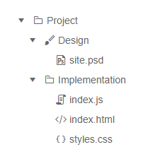

# Treeview Overview

The <a href="https://www.telerik.com/blazor-ui/treeview" target="_blank">Blazor Treeview component</a> displays data (flat or hierarchical) in a traditional tree-like structure. In addition to built-in navigation capabilities, you can navigate through the items and their children, define [templates]() for the individual nodes, render text and icons/images, and respond to events.

#### To use a Telerik TreeView for Blazor:

1. add the `TelerikTreeView` tag
1. provide a collection of models to its `Data` property (read more in the [Data Binding article]())
1. match the fields in the models with the binding schema for the nodes

>caption Basic treeview with flat data binding and built-in icons 

@[template](/_contentTemplates/treeview/basic-example.md#basic-example)

>caption The result from the snippet above



>caption Component namespace and reference

````CSHTML
@using Telerik.Blazor.Components

<TelerikTreeView @ref="theTreeView">
</TelerikTreeView>

@code {
    Telerik.Blazor.Components.TelerikTreeView theTreeView;
}
````


## Navigate Views

A treeview is often used to list pages, views or sections in an application so the user can navigate through them. To do that with a treeview, you have two options:

* Use the built-in `UrlField` in the [data bindings](#data-bindings) to populate the URLs in the anchors the treeview will generate for you.
* use a [Template]() to generate the desired links (e.g., `NavLink` components) with your own code to enable fine-tuning.

>caption Navigation with treeview through the UrlField

````CSHTML
Built-in navigation between views

<TelerikTreeView Data="@TreeData">
	<TreeViewBindings>
		<TreeViewBinding UrlField="Page" ParentIdField="ParentIdValue">
		</TreeViewBinding>
	</TreeViewBindings>
</TelerikTreeView>

@code {
	public class TreeItem
	{
		public int Id { get; set; }
		public string Text { get; set; }
		public int? ParentIdValue { get; set; }
		public bool HasChildren { get; set; }
		public string Page { get; set; }
		public bool Expanded { get; set; }
	}

	public IEnumerable<TreeItem> TreeData { get; set; }

	protected override void OnInitialized()
	{
		LoadTreeData();
	}

	private void LoadTreeData()
	{
		List<TreeItem> items = new List<TreeItem>();

		items.Add(new TreeItem()
		{
			Id = 1,
			Text = "Project",
			ParentIdValue = null,
			HasChildren = true,
			Page = "one", //the URL to navigate to
			Expanded = true
		});

		items.Add(new TreeItem()
		{
			Id = 2,
			Text = "Design",
			ParentIdValue = 1,
			HasChildren = false,
			Page = "two", //the URL to navigate to
			Expanded = true
		});
		items.Add(new TreeItem()
		{
			Id = 3,
			Text = "Implementation",
			ParentIdValue = 1,
			HasChildren = false,
			Page = "three", //the URL to navigate to
			Expanded = true
		});

		TreeData = items;
	}
}
````

## See Also

  * [Data Binding a TreeView]()
  * [Live Demo: TreeView](https://demos.telerik.com/blazor-ui/treeview/index)
  * [API Reference](https://docs.telerik.com/blazor-ui/api/Telerik.Blazor.Components.TelerikTreeView)

