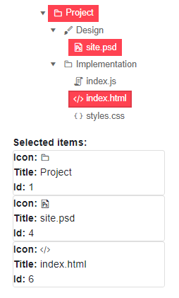
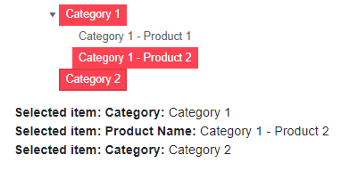

# Multiple Selection in TreeView

The TreeView lets the user select multiple nodes.

In this article:

* [Basics](#basics)
* [Examples](#examples)
	* [Multiple selection using one-way data binding](#multiple-selection-using-one-way-data-binding)
	* [Multiple selection using two-way data binding](#multiple-selection-using-two-way-data-binding)
	* [Handle multiple selection from different data models](#handle-multiple-selection-from-different-data-models)


## Basics

To use **multiple** node selection, set the `SelectionMode` parameter to `Telerik.Blazor.TreeViewSelectionMode.Multiple`.

To select a range of nodes hold the `Shift` key and click on two nodes. All the items in-between will be selected. If there is a focused node, range selection starts from that node.

To select multiple nodes that are not next to each other hold the `Ctrl` key and click on the desired items.

To deselect a node hold the `Ctrl` key and click on it.

## Examples

This section contains the following examples:

* [One-way binding](#multiple-selection-using-one-way-data-binding)
* [Two-way binding](#multiple-selection-using-two-way-data-binding)
* [Different data models](#handle-multiple-selection-from-different-data-models)

### Multiple selection using one-way data binding

You can use one-way binding to provide an initial node selection, and respond to the `SelectedItemsChanged` to update the view-model when user selection occurs. If you don't update the model, selection is effectively canceled. If you want to load async data on demand based on the chosen node, use the [`OnItemClick`](slug://treeview-events#onitemclick) event.


````RAZOR
@* Handle multiple node selection with one-way data binding *@

<TelerikTreeView Data="@Data"
                 @bind-ExpandedItems="@ExpandedItems"
                 SelectionMode="@TreeViewSelectionMode.Multiple"
                 SelectedItems="@SelectedItems"
                 SelectedItemsChanged="((IEnumerable<object> items) => SelectedItemsChangedHandler(items))">
</TelerikTreeView>

@if (SelectedItems.Any())
{
    <div>
        <strong>Selected items:</strong>
    </div>

    foreach (var item in SelectedItems)
    {
        <div class="card" style="width: 15rem">
            <span><strong>Icon:</strong> <TelerikSvgIcon Icon="@((item as TreeItem).Icon)" /></span>
            <span><strong>Title:</strong> @((item as TreeItem).Text)</span>
            <span><strong>Id:</strong> @((item as TreeItem).Id) </span>
        </div>
    }
}

@code {
    public IEnumerable<object> SelectedItems { get; set; } = new List<object>();

    public IEnumerable<TreeItem> Data { get; set; }

    public IEnumerable<object> ExpandedItems { get; set; } = new List<TreeItem>();

    void SelectedItemsChangedHandler(IEnumerable<object> items)
    {
        SelectedItems = items;
    }

    protected override void OnInitialized()
    {
        LoadData();
        ExpandedItems = Data.Where(x => x.HasChildren == true).ToList();
    }

    private void LoadData()
    {
        List<TreeItem> items = new List<TreeItem>();
        items.Add(new TreeItem()
        {
            Id = 1,
            Text = "Project",
            ParentId = null,
            HasChildren = true,
            Icon = SvgIcon.Folder
        });
        items.Add(new TreeItem()
        {
            Id = 2,
            Text = "Design",
            ParentId = 1,
            HasChildren = true,
            Icon = SvgIcon.Brush
        });
        items.Add(new TreeItem()
        {
            Id = 3,
            Text = "Implementation",
            ParentId = 1,
            HasChildren = true,
            Icon = SvgIcon.Folder
        });

        items.Add(new TreeItem()
        {
            Id = 4,
            Text = "site.psd",
            ParentId = 2,
            HasChildren = false,
            Icon = SvgIcon.FilePsd
        });

        items.Add(new TreeItem()
        {
            Id = 5,
            Text = "index.js",
            ParentId = 3,
            HasChildren = false,
            Icon = SvgIcon.Js
        });
        items.Add(new TreeItem()
        {
            Id = 6,
            Text = "index.html",
            ParentId = 3,
            HasChildren = false,
            Icon = SvgIcon.Html5
        });

        items.Add(new TreeItem()
        {
            Id = 7,
            Text = "styles.css",
            ParentId = 3,
            HasChildren = false,
            Icon = SvgIcon.Css
        });

        Data = items;
    }

    public class TreeItem
    {
        public int Id { get; set; }
        public string Text { get; set; }
        public int? ParentId { get; set; }
        public bool HasChildren { get; set; }
        public ISvgIcon Icon { get; set; }
    }
}
````

>caption The result of the code snippet above




### Multiple selection using two-way data binding

You can use two-way binding to get the node the user has selected. This can be useful if the node model already contains all the information you need to show based on the selection.

````RAZOR
@* Handle multiple node selection with two-way data binding *@

<TelerikTreeView Data="@Data"
                 @bind-ExpandedItems="@ExpandedItems"
                 SelectionMode="@TreeViewSelectionMode.Multiple"
                 @bind-SelectedItems="@SelectedItems">
</TelerikTreeView>

@if (SelectedItems.Any())
{
    <div>
        <strong>Selected items:</strong>
    </div>

    foreach (var item in SelectedItems)
    {
        <div class="card" style="width: 15rem">
            <span><strong>Icon:</strong> <TelerikSvgIcon Icon="@((item as TreeItem).Icon)" /></span>
            <span><strong>Title:</strong> @((item as TreeItem).Text)</span>
            <span><strong>Id:</strong> @((item as TreeItem).Id) </span>
        </div>
    }
}

@code {
    public IEnumerable<object> SelectedItems { get; set; } = new List<object>();

    public IEnumerable<TreeItem> Data { get; set; }

    public IEnumerable<object> ExpandedItems { get; set; } = new List<TreeItem>();

    protected override void OnInitialized()
    {
        LoadData();
        ExpandedItems = Data.Where(x => x.HasChildren == true).ToList();
    }

    private void LoadData()
    {
        List<TreeItem> items = new List<TreeItem>();
        items.Add(new TreeItem()
        {
            Id = 1,
            Text = "Project",
            ParentId = null,
            HasChildren = true,
            Icon = SvgIcon.Folder
        });
        items.Add(new TreeItem()
        {
            Id = 2,
            Text = "Design",
            ParentId = 1,
            HasChildren = true,
            Icon = SvgIcon.Brush
        });
        items.Add(new TreeItem()
        {
            Id = 3,
            Text = "Implementation",
            ParentId = 1,
            HasChildren = true,
            Icon = SvgIcon.Folder
        });

        items.Add(new TreeItem()
        {
            Id = 4,
            Text = "site.psd",
            ParentId = 2,
            HasChildren = false,
            Icon = SvgIcon.FilePsd
        });

        items.Add(new TreeItem()
        {
            Id = 5,
            Text = "index.js",
            ParentId = 3,
            HasChildren = false,
            Icon = SvgIcon.Js
        });
        items.Add(new TreeItem()
        {
            Id = 6,
            Text = "index.html",
            ParentId = 3,
            HasChildren = false,
            Icon = SvgIcon.Html5
        });

        items.Add(new TreeItem()
        {
            Id = 7,
            Text = "styles.css",
            ParentId = 3,
            HasChildren = false,
            Icon = SvgIcon.Css
        });

        Data = items;
    }

    public class TreeItem
    {
        public int Id { get; set; }
        public string Text { get; set; }
        public int? ParentId { get; set; }
        public bool HasChildren { get; set; }
        public ISvgIcon Icon { get; set; }
    }
}
````

>caption The result of the code snippet above


### Handle multiple selection from different data models

You can bind the treeview to different models at each level, and the selection accommodates that. You need to make sure that you cast the node to the correct type.

````RAZOR
@* Handle multiple selection of items from different data models *@

<TelerikTreeView Data="@HierarchicalData"
                 @bind-ExpandedItems="@ExpandedItems"
                 SelectionMode="@TreeViewSelectionMode.Multiple"
                 SelectedItems="@SelectedItems"
                 SelectedItemsChanged="@((IEnumerable<object> items) => SelectedItemsHandler(items))">
    <TreeViewBindings>
        <TreeViewBinding TextField="Category" ItemsField="Products" />
        <TreeViewBinding Level="1" TextField="ProductName" />
    </TreeViewBindings>
</TelerikTreeView>

@if (SelectedItems.Any())
{
    foreach (var item in SelectedItems)
    {
        if (item is ProductCategoryItem)
        {
            <div>
                <strong>Selected item:</strong>
                <span><strong>Category:</strong> @((item as ProductCategoryItem).Category)</span>
            </div>
        }
        else
        {
            <div>
                <strong>Selected item:</strong>
                <span><strong>Product Name:</strong> @((item as ProductItem).ProductName)</span>
            </div>
        }
    }
}

@code {
    public IEnumerable<ProductCategoryItem> HierarchicalData { get; set; }
    public IEnumerable<object> SelectedItems { get; set; } = new List<object>();
    public IEnumerable<object> ExpandedItems { get; set; } = new List<object>();

    void SelectedItemsHandler(IEnumerable<object> items)
    {
        SelectedItems = items;
    }

    public class ProductCategoryItem
    {
        public string Category { get; set; }
        public List<ProductItem> Products { get; set; }
    }

    public class ProductItem
    {
        public string ProductName { get; set; }
    }


    protected override void OnInitialized()
    {
        LoadHierarchical();
        ExpandedItems = HierarchicalData.Where(x => x.Products != null && x.Products.Any()).ToList();
    }

    private void LoadHierarchical()
    {
        List<ProductCategoryItem> roots = new List<ProductCategoryItem>();

        List<ProductItem> firstCategoryProducts = new List<ProductItem>()
        {
            new ProductItem { ProductName= "Category 1 - Product 1" },
            new ProductItem { ProductName= "Category 1 - Product 2" }
        };

        roots.Add(new ProductCategoryItem
        {
            Category = "Category 1",
            Products = firstCategoryProducts // this is how child items are provided

        });

        roots.Add(new ProductCategoryItem
        {
            Category = "Category 2" // we will set no other properties and it will not have children, nor will it be expanded
        });

        HierarchicalData = roots;
    }
}
````

>caption The result of the code snippet above




## See Also

  * [Selection Overview](slug://treeview-selection-overview)
  * [Single Selection](slug://treeview-selection-single)
