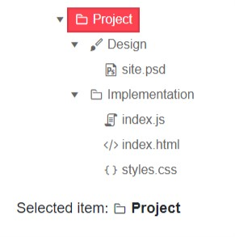

# TreeView Selection

The TreeView lets the user select a node. You can also preselect an item.

In this article you can see:

* [Selection Basics](#selection-basics)
 * [Example - Enable node selection](#example---enable-node-selection)


## Selection Basics

You can configure the node selection behavior by setting the `SelectionMode` parameter to a member of the `TreeViewSelectionMode` enum:
* `None` - disable the node selection. This is the default setting.
* [`Single`]()
* [`Multiple`]()

You get or set the selected items through the `SelectedItems` parameter. It is an `IEnumerable<object>` collection. It allows two-way binding (`@bind-SelectedItems`) and one-way binding + [`SelectedItemsChanged`](#selecteditemschanged) event.

### Example - Enable node selection

````CSHTML
@* Observe how the node selection works *@

<TelerikTreeView Data="@Data"
                 SelectionMode="@TreeViewSelectionMode.Single"
                 @bind-SelectedItems="@SelectedItems">
</TelerikTreeView>

@if (SelectedItems.Any())
{
    TreeItem selectedItem = SelectedItems.FirstOrDefault() as TreeItem;
    <div>
        Selected item: <strong> <TelerikIcon Icon="@selectedItem.Icon" /> @selectedItem.Text</strong>
    </div>
}

@code {
    public class TreeItem
    {
        public int Id { get; set; }
        public string Text { get; set; }
        public int? ParentId { get; set; }
        public bool HasChildren { get; set; }
        public string Icon { get; set; }
        public bool Expanded { get; set; }
    }

    public IEnumerable<object> SelectedItems { get; set; } = new List<object>();

    public IEnumerable<TreeItem> Data { get; set; }

    protected override void OnInitialized()
    {
        LoadData();
    }

    private void LoadData()
    {
        List<TreeItem> items = new List<TreeItem>();
        items.Add(new TreeItem()
        {
            Id = 1,
            Text = "Project",
            ParentId = null,
            HasChildren = true,
            Icon = "folder",
            Expanded = true
        });
        items.Add(new TreeItem()
        {
            Id = 2,
            Text = "Design",
            ParentId = 1,
            HasChildren = true,
            Icon = "brush",
            Expanded = true
        });
        items.Add(new TreeItem()
        {
            Id = 3,
            Text = "Implementation",
            ParentId = 1,
            HasChildren = true,
            Icon = "folder",
            Expanded = true
        });

        items.Add(new TreeItem()
        {
            Id = 4,
            Text = "site.psd",
            ParentId = 2,
            HasChildren = false,
            Icon = "psd",
            Expanded = true
        });

        items.Add(new TreeItem()
        {
            Id = 5,
            Text = "index.js",
            ParentId = 3,
            HasChildren = false,
            Icon = "js"
        });
        items.Add(new TreeItem()
        {
            Id = 6,
            Text = "index.html",
            ParentId = 3,
            HasChildren = false,
            Icon = "html"
        });

        items.Add(new TreeItem()
        {
            Id = 7,
            Text = "styles.css",
            ParentId = 3,
            HasChildren = false,
            Icon = "css"
        });

        Data = items;
    }
}

````
>caption The result of the code snippet above


