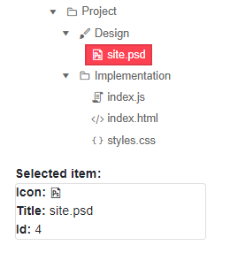

# Single Selection in TreeView

The TreeView lets the user to select a single node at a time.

In this article:
* [Basics](#basics)
* [Examples](#examples)


## Basics

To use **single** node selection, set the `SelectionMode` parameter to `Telerik.Blazor.TreeViewSelectionMode.Single`.

To deselect the node hold the `Ctrl` key and click on it.

## Examples

>caption Handle selection of a single node using one-way data binding

````CSHTML
@* Handle single node selection with one-way data binding *@

<TelerikTreeView Data="@Data"
                 SelectionMode="@TreeViewSelectionMode.Single"
                 SelectedItems="@SelectedItems"
                 SelectedItemsChanged="@((IEnumerable<object> item) => SelectedItemsHandler(item))">
</TelerikTreeView>

@if (SelectedItems.Any())
{
    TreeItem selectedItem = SelectedItems.FirstOrDefault() as TreeItem;
    <div>
        <strong>Selected item:</strong>
        <div class="card" style="width: 15rem">
            <span><strong>Icon:</strong> <TelerikIcon Icon="@selectedItem.Icon" /></span>
            <span><strong>Title:</strong> @selectedItem.Text</span>
            <span><strong>Id:</strong> @selectedItem.Id </span>
        </div>
    </div>
}

@code {
    void SelectedItemsHandler(IEnumerable<object> item)
    {
        SelectedItems = item;
    }

    public IEnumerable<object> SelectedItems { get; set; } = new List<object>();

    public IEnumerable<TreeItem> Data { get; set; }

    protected override void OnInitialized()
    {
        LoadData();
    }

    private void LoadData()
    {
        List<TreeItem> items = new List<TreeItem>();
        items.Add(new TreeItem()
        {
            Id = 1,
            Text = "Project",
            ParentId = null,
            HasChildren = true,
            Icon = "folder",
            Expanded = true
        });
        items.Add(new TreeItem()
        {
            Id = 2,
            Text = "Design",
            ParentId = 1,
            HasChildren = true,
            Icon = "brush",
            Expanded = true
        });
        items.Add(new TreeItem()
        {
            Id = 3,
            Text = "Implementation",
            ParentId = 1,
            HasChildren = true,
            Icon = "folder",
            Expanded = true
        });

        items.Add(new TreeItem()
        {
            Id = 4,
            Text = "site.psd",
            ParentId = 2,
            HasChildren = false,
            Icon = "psd",
            Expanded = true
        });

        items.Add(new TreeItem()
        {
            Id = 5,
            Text = "index.js",
            ParentId = 3,
            HasChildren = false,
            Icon = "js"
        });
        items.Add(new TreeItem()
        {
            Id = 6,
            Text = "index.html",
            ParentId = 3,
            HasChildren = false,
            Icon = "html"
        });

        items.Add(new TreeItem()
        {
            Id = 7,
            Text = "styles.css",
            ParentId = 3,
            HasChildren = false,
            Icon = "css"
        });

        Data = items;
    }

    public class TreeItem
    {
        public int Id { get; set; }
        public string Text { get; set; }
        public int? ParentId { get; set; }
        public bool HasChildren { get; set; }
        public string Icon { get; set; }
        public bool Expanded { get; set; }
    }
}
````
>caption The result of the code snippet above



>caption Handle selection of a single node using two-way data binding

````CSHTML
@* Handle single node selection with two-way data binding *@

<TelerikTreeView Data="@Data"
                 SelectionMode="@TreeViewSelectionMode.Single"
                 @bind-SelectedItems="@SelectedItems">
</TelerikTreeView>

@if (SelectedItems.Any())
{
    TreeItem selectedItem = SelectedItems.FirstOrDefault() as TreeItem;
    <div>
        <strong>Selected item:</strong>
        <div class="card" style="width: 15rem">
            <span><strong>Icon:</strong> <TelerikIcon Icon="@selectedItem.Icon" /></span>
            <span><strong>Title:</strong> @selectedItem.Text</span>
            <span><strong>Id:</strong> @selectedItem.Id </span>
        </div>
    </div>
}

@code {
    public IEnumerable<object> SelectedItems { get; set; } = new List<object>();

    public IEnumerable<TreeItem> Data { get; set; }

    protected override void OnInitialized()
    {
        LoadData();
    }

    private void LoadData()
    {
        List<TreeItem> items = new List<TreeItem>();
        items.Add(new TreeItem()
        {
            Id = 1,
            Text = "Project",
            ParentId = null,
            HasChildren = true,
            Icon = "folder",
            Expanded = true
        });
        items.Add(new TreeItem()
        {
            Id = 2,
            Text = "Design",
            ParentId = 1,
            HasChildren = true,
            Icon = "brush",
            Expanded = true
        });
        items.Add(new TreeItem()
        {
            Id = 3,
            Text = "Implementation",
            ParentId = 1,
            HasChildren = true,
            Icon = "folder",
            Expanded = true
        });

        items.Add(new TreeItem()
        {
            Id = 4,
            Text = "site.psd",
            ParentId = 2,
            HasChildren = false,
            Icon = "psd",
            Expanded = true
        });

        items.Add(new TreeItem()
        {
            Id = 5,
            Text = "index.js",
            ParentId = 3,
            HasChildren = false,
            Icon = "js"
        });
        items.Add(new TreeItem()
        {
            Id = 6,
            Text = "index.html",
            ParentId = 3,
            HasChildren = false,
            Icon = "html"
        });

        items.Add(new TreeItem()
        {
            Id = 7,
            Text = "styles.css",
            ParentId = 3,
            HasChildren = false,
            Icon = "css"
        });

        Data = items;
    }

    public class TreeItem
    {
        public int Id { get; set; }
        public string Text { get; set; }
        public int? ParentId { get; set; }
        public bool HasChildren { get; set; }
        public string Icon { get; set; }
        public bool Expanded { get; set; }
    }
}
````

>caption The result of the code snippet above


## See Also

  * [Selection Overview]()
  * [Multiple Selection]()
