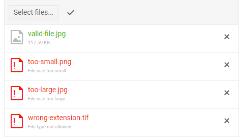

# Upload Overview

The <a href="https://www.telerik.com/blazor-ui/upload" target="_blank">Blazor Upload component</a> lets the users upload files to a server handler asynchronously. They can select one or multiple files, and you can control whether the upload starts immediately or upon a button click, and also let users delete their uploaded files. The component offers [client-side validation]() for the selected files' extensions and size.

#### To use a Telerik Upload for Blazor

1. Add the `TelerikUpload` tag and set its `SaveUrl` and `RemoveUrl` (RemoveUrl is optional) to controller methods that will handle the files.

    **CSHTML**

        @inject NavigationManager NavigationManager
        
        <TelerikUpload SaveUrl="@SaveUrl" RemoveUrl="@RemoveUrl"
                       SaveField="file" RemoveField="fileToRemove"
                       AllowedExtensions="@( new List<string>() { ".jpg", ".png", ".jpeg" } )"
                       MaxFileSize="2048000" MinFileSize="1024">
        </TelerikUpload>
        
        @code {
            // One way to define relative paths is to put the desired URL here.
            // This can be a full URL such as https://mydomain/myendpoint/save
            public string SaveUrl => ToAbsoluteUrl("api/upload/save");
            public string RemoveUrl => ToAbsoluteUrl("api/upload/remove");
        
            public string ToAbsoluteUrl(string url)
            {
                return $"{NavigationManager.BaseUri}{url}";
            }
        }

1. Create a suitable controller (endpoint) that can receive files from a POST request. **Note the different ways to set `physicalPath` for server and client Blazor apps.** For example:

    **C#**
    
        using Microsoft.AspNetCore.Mvc;
        using System.IO;
        using Microsoft.AspNetCore.Http;
        using Microsoft.AspNetCore.Hosting;
        using System.Net.Http.Headers;
        using System.Threading.Tasks;
        
        namespace MyBlazorApp.Controllers
        {
            [Route("api/[controller]/[action]")]
            public class UploadController : Controller
            {
                public IWebHostEnvironment HostingEnvironment { get; set; }
        
                public UploadController(IWebHostEnvironment hostingEnvironment)
                {
                    HostingEnvironment = hostingEnvironment;
                }
        
                [HttpPost]
                public async Task<IActionResult> Save(IFormFile file) // must match SaveField which defaults to "files"
                {
                    if (file != null)
                    {
                        try
                        {
                            var fileContent = ContentDispositionHeaderValue.Parse(file.ContentDisposition);
        
                            // Some browsers send file names with full path.
                            // We are only interested in the file name.
                            var fileName = Path.GetFileName(fileContent.FileName.ToString().Trim('"'));
                            var physicalPath = Path.Combine(HostingEnvironment.WebRootPath, fileName);
        
                            // Implement security mechanisms here - prevent path traversals,
                            // check for allowed extensions, types, size, content, viruses, etc.
                            // This sample always saves the file to the root and is not sufficient for a real application.
        
                            using (var fileStream = new FileStream(physicalPath, FileMode.Create))
                            {
                                await file.CopyToAsync(fileStream);
                            }
                        }
                        catch
                        {
                            // Implement error handling here, this example merely indicates an upload failure.
                            Response.StatusCode = 500;
                            await Response.WriteAsync("some error message"); // custom error message
                        }
                    }
        
                    // Return an empty string message in this case
                    return new EmptyResult();
                }
        
        
                [HttpPost]
                public ActionResult Remove(string fileToRemove) // must match RemoveField which defaults to "files"
                {
                    if (fileToRemove != null)
                    {
                        try
                        {
                            var fileName = Path.GetFileName(fileToRemove);
                            // server Blazor app
                            var physicalPath = Path.Combine(HostingEnvironment.WebRootPath, fileName);
                            // client Blazor app
                            //var physicalPath = Path.Combine(HostingEnvironment.ContentRootPath, fileName);
        
                            if (System.IO.File.Exists(physicalPath))
                            {
                                // Implement security mechanisms here - prevent path traversals,
                                // check for allowed extensions, types, permissions, etc.
                                // this sample always deletes the file from the root and is not sufficient for a real application.
        
                                System.IO.File.Delete(physicalPath);
                            }
                        }
                        catch
                        {
                            // Implement error handling here, this example merely indicates an upload failure.
                            Response.StatusCode = 500;
                            Response.WriteAsync("some error message"); // custom error message
                        }
                    }
        
                    // Return an empty string message in this case
                    return new EmptyResult();
                }
            }
        }


>caption The result from the code snippet above after selecting some valid and some invalid files



>note The sample controller above takes only one field with the given name. If you already have existing controllers that handle files, it is possible that they accept `IEnumerable<IFormFile>` and `string[]` respectively. This will work with the Telerik Upload too - it simply allows for more fields with that name to be present in the request, while the Telerik component will add only one file (field).

>caption Component namespace and reference

````CSHTML
<TelerikUpload @ref="@UploadRef" />

@code{
    Telerik.Blazor.Components.TelerikUpload UploadRef { get; set; }
}
````

>caption The Upload provides the following key features:

* `AutoUpload` - Specifies whether the upload of a file should start immediately upon its selection, or the user must click the "Upload" button. Defaults to `true`.

* `Enabled` - Whether the component is enabled for the end user.

* `Multiple` - Enables the selection of multiple files. If set to `false` (defaults to `true`), only one file can be selected at a time.

* `RemoveField` - Sets the `FormData` key which contains the file names submitted to the `RemoveUrl` endpoint when the user clicks the individual [x] button on the chosen files. Defaults to `files`.

* `RemoveUrl`- Sets the URL of the endpoint for the remove request. The `FormData` request key is named after the `RemoveField` parameter. It contains the list of file names which should be removed from the server. The handler must accept POST requests which contain one or more fields with the same name as the `RemoveField`. The handler is hit once for each file.

* `SaveField` - Sets the `FormData` key which contains the files submitted to the `SaveUrl` endpoint. Defaults to `files`.

* `SaveUrl`- The URL of the handler (endpoint, controller) that will receive the uploaded files. The handler must accept POST requests which contain one or more fields with the same name as the `SaveField`. The handler is hit once for each file.

* `WithCredentials` - Controls whether to send credentials (cookies, headers) for cross-site requests (see the [XMLHttpRequest.withCredentials property](https://developer.mozilla.org/en-US/docs/Web/API/XMLHttpRequest/withCredentials)). You can also add extra information to the request (such as authentication tokens and other metadata) through the `OnUpload` and `OnRemove` [events]().

* `Class` - the CSS class that will be rendered on the main wrapping element of the Upload component

* [Validation]()


## Notes

The Telerik Upload component facilitates sending a file to an endpoint. There are a few considerations to keep in mind with regards to handling the files on the server:

@[template](/_contentTemplates/upload/notes.md#server-security-note)

### File Size

The `MaxFileSize` parameter of the component is used for [client-side validation](), and the server needs a separate configuration. At this stage, the files are uploaded in one piece and so the server may block large requests - server settings such as the IIS `MaxRequestLength` will always be taken into account by the endpoint. You can find some examples of configuring this in the following StackOverflow thread: [IIS7 - The request filtering module is configured to deny a request that exceeds the request content length](https://stackoverflow.com/questions/10871881/iis7-the-request-filtering-module-is-configured-to-deny-a-request-that-exceeds).

### Application Logic

Authentication, authorization and routing of the requests is up to the application logic. The Telerik Upload component makes an XHR request from the browser to the designated endpoint and further application logic is up to the server. You can use the [OnUpload and OnRemove events]() to add headers and data to the request so you can handle the requests accordingly on the server.

### Cross-Origin Requests

Cross-origin requests depend on the application and endpoint setup. The `WidthCredentials` parameter sets the corresponding parameter of the XHR request. Handling the cookies, headers and other parameters of the Blazor app and [CORS](https://www.w3.org/TR/cors/) endpoint are to be implemented by the respective applications (for example, including the `Access-Control-Allow-Origin` header with an appropriate value and the `Access-Control-Allow-Credentials` header with a `true` value). You can read more on the subject in the following article: [https://www.html5rocks.com/en/tutorials/cors/](https://www.html5rocks.com/en/tutorials/cors/). You can also find one example setup from a customer of ours in [this thread](https://www.telerik.com/forums/upload-component-reports-'file-failed-to-upload'#-6QPJn3obkm3D1kR1ysukA) which shows one way to setup the CORS requests, headers and responses on the receiving server.


## See Also

  * [Events]()
  * [Validation]()
  * [Live Demo: Upload](https://demos.telerik.com/blazor-ui/upload/overview)

