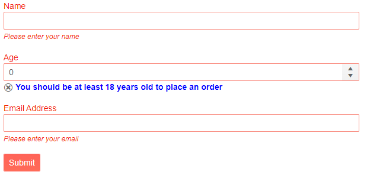
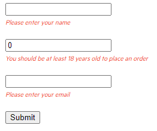
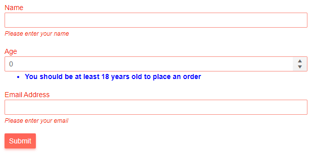
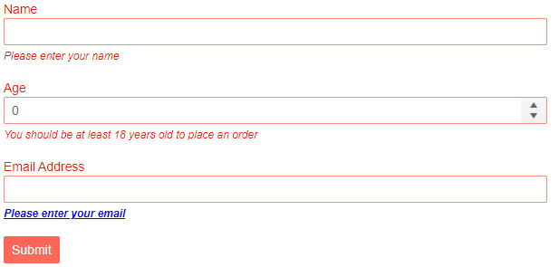

# Telerik Validation Message for Blazor

The Telerik Validation Message for Blazor adds customization options on top of the standard <a href="https://docs.microsoft.com/en-us/dotnet/api/system.web.mvc.html.validationextensions.validationmessage?view=aspnet-mvc-5.2" target="_blank">ValidationMessage</a> provided by the framework such as a [Template](#template) or cascading CSS rules from the custom CSS class in the [Class](#class) parameter.

This article is separated in the following sections:

* [Basics](#basics)
* [Template](#template)
* [Class](#class)

## Basics

To enable Telerik Validation Messages for a field in the form you should provide a lambda expression in the `For` parameter that notifies the component for which property of the model the validation messages should render, just like with the standard `ValidationMessage` component.

>caption Enable Telerik Validation Message in a Form

````CSHTML
@* Use the TelerikValidationMessage component to render validation messages and disable the built-in validation messages from the Telerik Form*@

@using System.ComponentModel.DataAnnotations

<TelerikForm Model="@customer" Width="600px" ValidationMessageType="@FormValidationMessageType.None">
    <FormValidation>
        <DataAnnotationsValidator />
    </FormValidation>

    <FormItems>
        <FormItem Field="@nameof(Customer.CustomerName)" LabelText="Name" />
        <TelerikValidationMessage For="@(() => customer.CustomerName)" />

        <FormItem Field="@nameof(Customer.CustomerAge)" LabelText="Age" />
        <TelerikValidationMessage For="@(() => customer.CustomerAge)" />

        <FormItem Field="@nameof(Customer.EmailAddress)" LabelText="Email Address" />
        <TelerikValidationMessage For="@(() => customer.EmailAddress)" />
    </FormItems>
</TelerikForm>

@code {
    private Customer customer = new Customer();

    public class Customer
    {
        [Required(ErrorMessage = "Please enter your name")]
        [MaxLength(40, ErrorMessage = "The name must be up to 40 characters long")]
        public string CustomerName { get; set; }

        [Required(ErrorMessage = "Please enter your age")]
        [Range(18, 120, ErrorMessage = "You should be at least 18 years old to place an order")]
        public int CustomerAge { get; set; }

        [Required(ErrorMessage = "Please enter your email")]
        [EmailAddress(ErrorMessage = "Enter a valid email address")]
        public string EmailAddress { get; set; }
    }
}
````

>caption The result from the code snippet above



>caption Enable Telerik Validation Message in an EditForm

````CSHTML
@* Enable the Telerik Validation Message in the standard EditForm *@

@using System.ComponentModel.DataAnnotations

<EditForm Model="@customer" width="600px">
    <DataAnnotationsValidator />

    <InputText @bind-Value="@customer.CustomerName"></InputText>
    <TelerikValidationMessage For="@(() => customer.CustomerName)" />
    <br />
    <InputNumber @bind-Value="@customer.CustomerAge"></InputNumber>
    <TelerikValidationMessage For="@(() => customer.CustomerAge)" />
    <br />
    <InputText @bind-Value="@customer.EmailAddress"></InputText>
    <TelerikValidationMessage For="@(() => customer.EmailAddress)" />
    <br />
    <input type="submit" value="Submit" />
</EditForm>

@code {
    private Customer customer = new Customer();

    public class Customer
    {
        [Required(ErrorMessage = "Please enter your name")]
        [MaxLength(40, ErrorMessage = "The name must be up to 40 characters long")]
        public string CustomerName { get; set; }

        [Required(ErrorMessage = "Please enter your age")]
        [Range(18, 120, ErrorMessage = "You should be at least 18 years old to place an order")]
        public int CustomerAge { get; set; }

        [Required(ErrorMessage = "Please enter your email")]
        [EmailAddress(ErrorMessage = "Enter a valid email address")]
        public string EmailAddress { get; set; }
    }
}

````

>caption The result from the code snippet above




## Template

Allows you to control the rendering of the validation messages. The `context` represents an `IEnumerable<string>` collection of all messages for the property.

````CSHTML
@* Use the Template to customize the rendering of the validation message *@

<style>
    .custom-validation-message {
        color: blue;
        font-weight: bold;
    }
</style>

@using System.ComponentModel.DataAnnotations

<TelerikForm Model="@customer" Width="600px" ValidationMessageType="@FormValidationMessageType.None">
    <FormValidation>
        <DataAnnotationsValidator />
    </FormValidation>

    <FormItems>
        <FormItem Field="@nameof(Customer.CustomerName)" LabelText="Name" />
        <TelerikValidationMessage For="@(() => customer.CustomerName)" />

        <FormItem Field="@nameof(Customer.CustomerAge)" LabelText="Age" />
        <TelerikValidationMessage For="@(() => customer.CustomerAge)">
            <Template>
                @{
                    IEnumerable<string> validationMessages = context;

                    @foreach (string message in validationMessages)
                    {
                        <div>
                            <TelerikIcon Icon="x-outline"></TelerikIcon>
                            <span class="custom-validation-message">@message</span>
                        </div>
                    }
                }
            </Template>
        </TelerikValidationMessage>

        <FormItem Field="@nameof(Customer.EmailAddress)" LabelText="Email Address" />
        <TelerikValidationMessage For="@(() => customer.EmailAddress)" />
    </FormItems>
</TelerikForm>

@code {
    private Customer customer = new Customer();

    public class Customer
    {
        [Required(ErrorMessage = "Please enter your name")]
        [MaxLength(40, ErrorMessage = "The name must be up to 40 characters long")]
        public string CustomerName { get; set; }

        [Required(ErrorMessage = "Please enter your age")]
        [Range(18, 120, ErrorMessage = "You should be at least 18 years old to place an order")]
        public int CustomerAge { get; set; }

        [Required(ErrorMessage = "Please enter your email")]
        [EmailAddress(ErrorMessage = "Enter a valid email address")]
        public string EmailAddress { get; set; }
    }
}
````
>caption The result from the code snippet above



## Class

You can use the `Class` parameter to add a custom CSS class to the `k-form-error` span, that wraps the validation message.

This example adds a custom class and styling to the third message - for the Email Address.

````CSHTML
@* Use the Class parameter to change the font of the validation message *@

<style>
    .my-email-message {
        color: blue;
        font-weight: bold;
        text-decoration: underline;
    }
</style>

@using System.ComponentModel.DataAnnotations

<TelerikForm Model="@customer" Width="600px" ValidationMessageType="@FormValidationMessageType.None">
    <FormValidation>
        <DataAnnotationsValidator />
    </FormValidation>

    <FormItems>
        <FormItem Field="@nameof(Customer.CustomerName)" LabelText="Name" />
        <TelerikValidationMessage For="@(() => customer.CustomerName)" />

        <FormItem Field="@nameof(Customer.CustomerAge)" LabelText="Age" />
        <TelerikValidationMessage For="@(() => customer.CustomerAge)" />

        <FormItem Field="@nameof(Customer.EmailAddress)" LabelText="Email Address" />
        <TelerikValidationMessage For="@(() => customer.EmailAddress)" Class="my-email-message" />
    </FormItems>
</TelerikForm>

@code {
    private Customer customer = new Customer();

    public class Customer
    {
        [Required(ErrorMessage = "Please enter your name")]
        [MaxLength(40, ErrorMessage = "The name must be up to 40 characters long")]
        public string CustomerName { get; set; }

        [Required(ErrorMessage = "Please enter your age")]
        [Range(18, 120, ErrorMessage = "You should be at least 18 years old to place an order")]
        public int CustomerAge { get; set; }

        [Required(ErrorMessage = "Please enter your email")]
        [EmailAddress(ErrorMessage = "Enter a valid email address")]
        public string EmailAddress { get; set; }
    }
}
````

>caption The result from the code snippet above



## See Also

* [Live Demo: Validation](https://demos.telerik.com/blazor-ui/validation/overview)
* [TelerikValidationSummary]()
* [TelerikValidationTooltip]()
* [Form Component]()

