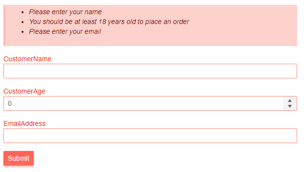
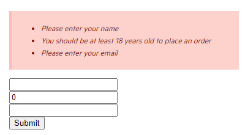
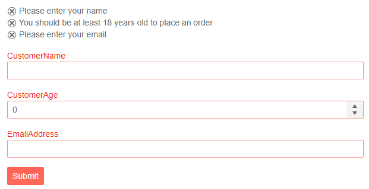
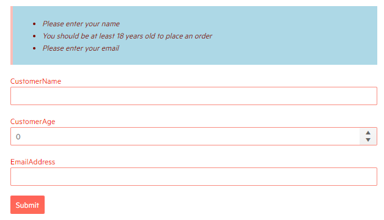

# Telerik Validation Summary for Blazor

The Telerik Validation Summary for Blazor adds customization options on top of the standard <a href="https://docs.microsoft.com/en-us/dotnet/api/system.web.ui.webcontrols.validationsummary?view=netframework-4.8" target="_blank">ValidationSummary</a> provided by the framework such as a [Template](#template) or cascading CSS rules from the custom CSS class in the [Class](#class) parameter.

This article is separated in the following sections:

* [Basics](#basics)
* [Template](#template)
* [Class](#class)

## Basics

To enable Telerik Validation Summary in the form you should add the `<TelerikValidationSummary>` to the validation configuration part. You can also add it directly to the standard `EditForm` component instead of the built-in `<ValidationSummary>` component.

>caption Enable Telerik Validation Summary in a Telerik Form

````CSHTML
@* Enable the Telerik Validation Summary in the Telerik Form *@

@using System.ComponentModel.DataAnnotations

<TelerikForm Model="@customer" Width="600px" ValidationMessageType="@FormValidationMessageType.None">
    <FormValidation>
        <DataAnnotationsValidator />
        <TelerikValidationSummary />
    </FormValidation>
</TelerikForm>

@code {
    private Customer customer = new Customer();

    public class Customer
    {
        [Required(ErrorMessage = "Please enter your name")]
        [MaxLength(40, ErrorMessage = "The name must be up to 40 characters long")]
        public string CustomerName { get; set; }

        [Required(ErrorMessage = "Please enter your age")]
        [Range(18, 120, ErrorMessage = "You should be at least 18 years old to place an order")]
        public int CustomerAge { get; set; }

        [Required(ErrorMessage = "Please enter your email")]
        [EmailAddress(ErrorMessage = "Enter a valid email address")]
        public string EmailAddress { get; set; }
    }
}
````

>caption The result from the code snippet above



>caption Enable Telerik Validation Summary in an EditForm

````CSHTML
@* Enable the Telerik Validation Summary in the standard EditForm *@

@using System.ComponentModel.DataAnnotations

<EditForm Model="@customer" width="600px">
    <DataAnnotationsValidator />
    <TelerikValidationSummary />
    <InputText @bind-Value="@customer.CustomerName"></InputText>
    <br />
    <InputNumber @bind-Value="@customer.CustomerAge"></InputNumber>
    <br />
    <InputText @bind-Value="@customer.EmailAddress"></InputText>
    <br />
    <input type="submit" value="Submit" />
</EditForm>

@code {
    private Customer customer = new Customer();

    public class Customer
    {
        [Required(ErrorMessage = "Please enter your name")]
        [MaxLength(40, ErrorMessage = "The name must be up to 40 characters long")]
        public string CustomerName { get; set; }

        [Required(ErrorMessage = "Please enter your age")]
        [Range(18, 120, ErrorMessage = "You should be at least 18 years old to place an order")]
        public int CustomerAge { get; set; }

        [Required(ErrorMessage = "Please enter your email")]
        [EmailAddress(ErrorMessage = "Enter a valid email address")]
        public string EmailAddress { get; set; }
    }
}
````

>caption The result from the code snippet above




## Template

Allows you to control the rendering of the validation summary. The `context` represents an `IEnumerable<string>` collection of all error messages for the form.

````CSHTML
@* Use the Template to customize the rendering of the validation summary *@

@using System.ComponentModel.DataAnnotations

<TelerikForm Model="@customer" Width="600px" ValidationMessageType="@FormValidationMessageType.None">
    <FormValidation>
        <DataAnnotationsValidator />
        <TelerikValidationSummary>
            <Template>
                @{ 
                    IEnumerable<string> validationSummaryContext = context;

                    @foreach (var message in validationSummaryContext)
                    {
                        <div>
                            <TelerikIcon Icon="x-outline" />
                            <span>@message</span>
                        </div>
                    }
                }
            </Template>
        </TelerikValidationSummary>
    </FormValidation>
</TelerikForm>

@code {
    private Customer customer = new Customer();

    public class Customer
    {
        [Required(ErrorMessage = "Please enter your name")]
        [MaxLength(40, ErrorMessage = "The name must be up to 40 characters long")]
        public string CustomerName { get; set; }

        [Required(ErrorMessage = "Please enter your age")]
        [Range(18, 120, ErrorMessage = "You should be at least 18 years old to place an order")]
        public int CustomerAge { get; set; }

        [Required(ErrorMessage = "Please enter your email")]
        [EmailAddress(ErrorMessage = "Enter a valid email address")]
        public string EmailAddress { get; set; }
    }
}
````

>caption The result from the code snippet above



## Class

You can use the `Class` parameter to add a custom CSS class to the `k-validation-summary` div, that wraps the validation summary.

````CSHTML
@* Use the Class parameter to change the background color of the validation summary *@

<style>
    .validation-summary-class {
        background-color: lightblue;
    }
</style>

@using System.ComponentModel.DataAnnotations

<TelerikForm Model="@customer" Width="600px" ValidationMessageType="@FormValidationMessageType.None">
    <FormValidation>
        <DataAnnotationsValidator />
        <TelerikValidationSummary Class="validation-summary-class" />
    </FormValidation>
</TelerikForm>

@code {
    private Customer customer = new Customer();

    public class Customer
    {
        [Required(ErrorMessage = "Please enter your name")]
        [MaxLength(40, ErrorMessage = "The name must be up to 40 characters long")]
        public string CustomerName { get; set; }

        [Required(ErrorMessage = "Please enter your age")]
        [Range(18, 120, ErrorMessage = "You should be at least 18 years old to place an order")]
        public int CustomerAge { get; set; }

        [Required(ErrorMessage = "Please enter your email")]
        [EmailAddress(ErrorMessage = "Enter a valid email address")]
        public string EmailAddress { get; set; }
    }
}
````

>caption The result from the code snippet above



## See Also

* [Live Demo: Validation](https://demos.telerik.com/blazor-ui/validation/overview)
* [TelerikValidationMessage]()
* [TelerikValidationTooltip]()
* [Form Component]()

