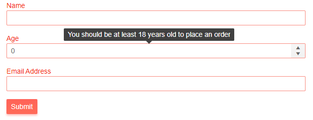

# Telerik Validation Tooltip for Blazor

The <a href = "https://www.telerik.com/blazor-ui/validationtooltip" target="_blank">Telerik Validation Tooltip for Blazor</a> can render the validation errors as tooltips pointing to the problematic input when you hover it. It acts like the ValidationMessage, but is a popup and not an inline element, so it takes up less space.

This article is separated in the following sections:

* [Basics](#basics)
* [Position](#position)
* [Template](#template)
* [Class](#class)

## Basics

To enable Telerik Validation Tooltip for a field in the form you should:

1. Provide a lambda expression in the `For` parameter that notifies the component for which property of the model the validation messages should render, just like the standard `ValidationMessage`.
1. Populate the `TargetSelector` with a CSS selector that controls which element(s) the Tooltip will associate itself with.

>caption Enable Telerik Validation Tooltip in a Telerik Form

>tip The Telerik Form can provide tooltips out-of-the-box with a single setting - see the [Form Validation - Validation Message Type](#validation-message-type) section. The example below shows more advanced customizations.

````CSHTML
@* Use the TelerikValidationTooltip component to render validation messages and disable the built-in validation messages from the Telerik Form*@

@using System.ComponentModel.DataAnnotations

<TelerikForm Model="@customer" Width="600px" ValidationMessageType="@FormValidationMessageType.None">
    <FormValidation>
        <DataAnnotationsValidator />
    </FormValidation>

    <FormItems>
        <FormItem Field="@nameof(Customer.CustomerName)" Id="customer-name-field" LabelText="Name" />
        <TelerikValidationTooltip For="@(() => customer.CustomerName)" TargetSelector="#customer-name-field" />

        <FormItem Field="@nameof(Customer.CustomerAge)" Id="customer-age-field" LabelText="Age" />
        <TelerikValidationTooltip For="@(() => customer.CustomerAge)" TargetSelector="#customer-age-field" />

        <FormItem Field="@nameof(Customer.EmailAddress)" Id="customer-email-field" LabelText="Email Address" />
        <TelerikValidationTooltip For="@(() => customer.EmailAddress)" TargetSelector="#customer-email-field" />
    </FormItems>
</TelerikForm>

@code {
    private Customer customer = new Customer();

    public class Customer
    {
        [Required(ErrorMessage = "Please enter your name")]
        [MaxLength(40, ErrorMessage = "The name must be up to 40 characters long")]
        public string CustomerName { get; set; }

        [Required(ErrorMessage = "Please enter your age")]
        [Range(18, 120, ErrorMessage = "You should be at least 18 years old to place an order")]
        public int CustomerAge { get; set; }

        [Required(ErrorMessage = "Please enter your email")]
        [EmailAddress(ErrorMessage = "Enter a valid email address")]
        public string EmailAddress { get; set; }
    }
}
````

>caption The result from the code snippet above




>caption Enable Telerik Validation Tooltip in an EditForm

````CSHTML
@using System.ComponentModel.DataAnnotations

<EditForm Model="@customer" width="600px">
    <DataAnnotationsValidator />

    <InputText @bind-Value="@customer.CustomerName" id="name"></InputText>
    <TelerikValidationTooltip For="@(() => customer.CustomerName)" TargetSelector="#name" />
    <br />
    <InputNumber @bind-Value="@customer.CustomerAge" id="age"></InputNumber>
    <TelerikValidationTooltip For="@(() => customer.CustomerAge)" TargetSelector="#age" />
    <br />
    <InputText @bind-Value="@customer.EmailAddress" id="email"></InputText>
    <TelerikValidationTooltip For="@(() => customer.EmailAddress)" TargetSelector="#email" />
    <br />
    <input type="submit" value="Submit" />
</EditForm>

@code {
    private Customer customer = new Customer();

    public class Customer
    {
        [Required(ErrorMessage = "Please enter your name")]
        [MaxLength(40, ErrorMessage = "The name must be up to 40 characters long")]
        public string CustomerName { get; set; }

        [Required(ErrorMessage = "Please enter your age")]
        [Range(18, 120, ErrorMessage = "You should be at least 18 years old to place an order")]
        public int CustomerAge { get; set; }

        [Required(ErrorMessage = "Please enter your email")]
        [EmailAddress(ErrorMessage = "Enter a valid email address")]
        public string EmailAddress { get; set; }
    }
}
````

>caption The result from the code snippet above


## Position

You can control the position of the validation tooltip through the `Position` parameter. It takes a member of the `TooltipPosition` enum:

* `Top` - by default the validation tooltip will render on top of the editor
* `Bottom`
* `Right`
* `Left`

````CSHTML
@* Change the rendering position of the validation tooltip *@ 

@using System.ComponentModel.DataAnnotations

<TelerikForm Model="@customer" Width="600px" ValidationMessageType="@FormValidationMessageType.None">
    <FormValidation>
        <DataAnnotationsValidator />
    </FormValidation>

    <FormItems>
        <FormItem Field="@nameof(Customer.CustomerName)" Id="customer-name-field" LabelText="Name" />
        <TelerikValidationTooltip For="@(() => customer.CustomerName)" TargetSelector="#customer-name-field" Position="@TooltipPosition.Left" />

        <FormItem Field="@nameof(Customer.CustomerAge)" Id="customer-age-field" LabelText="Age"  />
        <TelerikValidationTooltip For="@(() => customer.CustomerAge)" TargetSelector="#customer-age-field" Position="@TooltipPosition.Bottom" />

        <FormItem Field="@nameof(Customer.EmailAddress)" Id="customer-email-field" LabelText="Email Address" />
        <TelerikValidationTooltip For="@(() => customer.EmailAddress)" TargetSelector="#customer-email-field" Position="@TooltipPosition.Right" />
    </FormItems>
</TelerikForm>

@code {
    private Customer customer = new Customer();

    public class Customer
    {
        [Required(ErrorMessage = "Please enter your name")]
        [MaxLength(40, ErrorMessage = "The name must be up to 40 characters long")]
        public string CustomerName { get; set; }

        [Required(ErrorMessage = "Please enter your age")]
        [Range(18, 120, ErrorMessage = "You should be at least 18 years old to place an order")]
        public int CustomerAge { get; set; }

        [Required(ErrorMessage = "Please enter your email")]
        [EmailAddress(ErrorMessage = "Enter a valid email address")]
        public string EmailAddress { get; set; }
    }
}
````

>caption The result from the code snippet above


## Template

Allows you to control the rendering of the validation tooltip. The `context` represents an `IEnumerable<string>` collection of all messages for the property.

````CSHTML
@* Use the Template to customize the rendering of the validation tooltip *@

<TelerikForm Model="@customer" Width="600px" ValidationMessageType="@FormValidationMessageType.None">
    <FormValidation>
        <DataAnnotationsValidator />
    </FormValidation>

    <FormItems>
        <FormItem Field="@nameof(Customer.CustomerName)" Id="customer-name-field" LabelText="Name" />
        <TelerikValidationTooltip For="@(() => customer.CustomerName)" TargetSelector="#customer-name-field">
            <Template>
                @{ 
                    IEnumerable<string> validationContext = context;

                    @foreach (var message in validationContext)
                    {
                        <div>
                            <TelerikIcon Icon="x-outline"></TelerikIcon>
                            <span>@message</span>
                        </div>
                    }
                }
            </Template>
        </TelerikValidationTooltip>

        <FormItem Field="@nameof(Customer.CustomerAge)" Id="customer-age-field" LabelText="Age" />
        <TelerikValidationTooltip For="@(() => customer.CustomerAge)" TargetSelector="#customer-age-field" />

        <FormItem Field="@nameof(Customer.EmailAddress)" Id="customer-email-field" LabelText="Email Address" />
        <TelerikValidationTooltip For="@(() => customer.EmailAddress)" TargetSelector="#customer-email-field" />
    </FormItems>
</TelerikForm>

@code {
    private Customer customer = new Customer();

    public class Customer
    {
        [Required(ErrorMessage = "Please enter your name")]
        [MaxLength(40, ErrorMessage = "The name must be up to 40 characters long")]
        public string CustomerName { get; set; }

        [Required(ErrorMessage = "Please enter your age")]
        [Range(18, 120, ErrorMessage = "You should be at least 18 years old to place an order")]
        public int CustomerAge { get; set; }

        [Required(ErrorMessage = "Please enter your email")]
        [EmailAddress(ErrorMessage = "Enter a valid email address")]
        public string EmailAddress { get; set; }
    }
}
````

>caption The result from the code snippet above


## Class

You can use the `Class` parameter to add a custom CSS class to the validation tooltip.

````CSHTML
@* Use the Class parameter to underline the font of the validation message *@

<style>
    .my-custom-tooltip-class {
        text-decoration: underline;
    }
</style>

@using System.ComponentModel.DataAnnotations

<TelerikForm Model="@customer" Width="600px" ValidationMessageType="@FormValidationMessageType.None">
    <FormValidation>
        <DataAnnotationsValidator />
    </FormValidation>

    <FormItems>
        <FormItem Field="@nameof(Customer.CustomerName)" Id="customer-name-field" LabelText="Name" />
        <TelerikValidationTooltip For="@(() => customer.CustomerName)" TargetSelector="#customer-name-field" />

        <FormItem Field="@nameof(Customer.CustomerAge)" Id="customer-age-field" LabelText="Age"  />
        <TelerikValidationTooltip For="@(() => customer.CustomerAge)" TargetSelector="#customer-age-field" Class="my-custom-tooltip-class" />

        <FormItem Field="@nameof(Customer.EmailAddress)" Id="customer-email-field" LabelText="Email Address" />
        <TelerikValidationTooltip For="@(() => customer.EmailAddress)" TargetSelector="#customer-email-field" />
    </FormItems>
</TelerikForm>

@code {
    private Customer customer = new Customer();

    public class Customer
    {
        [Required(ErrorMessage = "Please enter your name")]
        [MaxLength(40, ErrorMessage = "The name must be up to 40 characters long")]
        public string CustomerName { get; set; }

        [Required(ErrorMessage = "Please enter your age")]
        [Range(18, 120, ErrorMessage = "You should be at least 18 years old to place an order")]
        public int CustomerAge { get; set; }

        [Required(ErrorMessage = "Please enter your email")]
        [EmailAddress(ErrorMessage = "Enter a valid email address")]
        public string EmailAddress { get; set; }
    }
}
````

>caption The result from the code snippet above


## See Also

* [Live Demo: Validation](https://demos.telerik.com/blazor-ui/validation/overview)
* [TelerikValidationSummary]()
* [TelerikValidationTooltip]()
* [Form Component]()

